# 如何在尼日利亚创办一家摩托车骑行共享公司

> 原文：<https://medium.datadriveninvestor.com/how-to-start-a-motorcycle-ridesharing-company-in-nigeria-9ed73286f705?source=collection_archive---------0----------------------->

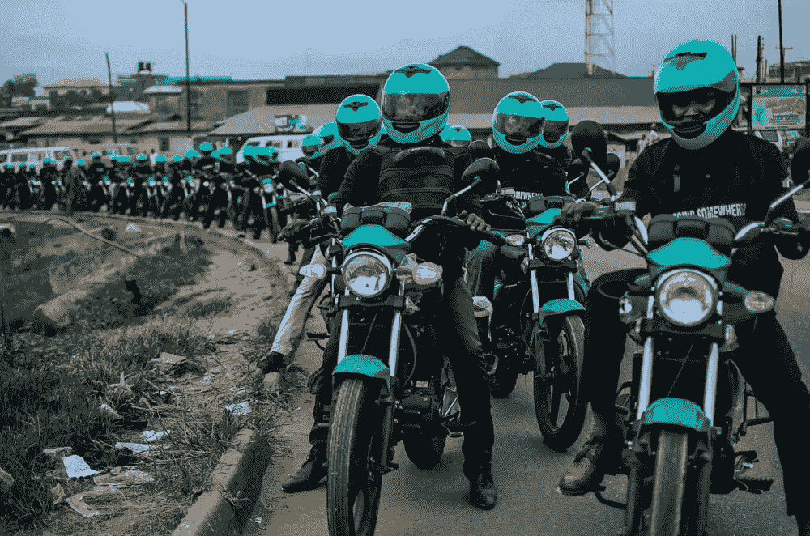

这是我做过的最出格的事情之一的故事。这是我如何开始 Gokada 的故事。

那是 2017 年夏天，紧随 Pathos 的数百万美元首轮融资之后。我参与创立并投资的这家公司现在价值近 1 亿美元。我一直认为筹集资金是一项遥远的成就，需要更多的经验来获得。但现在我 30 岁了——拥有一家成立三年的公司的股票，其价值超过了我过去 13 年创业所创造的全部收入。太不真实了。

 [## 波动迫使数据驱动的投资者冷静

### 自然界中很少有东西是直线行进的，尤其是经济。当投资者和消费者希望平静时…

www.datadriveninvestor.com](https://www.datadriveninvestor.com/2019/03/25/volatility-compels-calm-amid-the-storm/) 

此时，我已经决定留在纽约，而不是全职加入 Pathao 这是出售我在该公司部分股份的好时机。经过几次二手交易后，我坐拥大量现金。在这种情况下，我可能会做任何一个理性的人都会做的事情——在低风险共同基金中投资一部分，购买一些房地产，然后获得一个兰博基尼！还没有。我对这些都不感兴趣。“我能再做一次吗？”，一直在我脑海里回荡。但是在哪里？我去了很多人进行深入商业分析时求助的网站——维基百科。

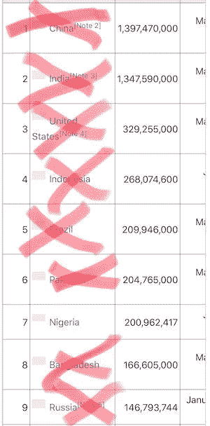

我需要的是一个交通繁忙、人口众多、摩托车出租车供应充足、竞争很少的国家。

首先我去看人口图表。印度、中国、印度尼西亚等..竞争太激烈了。这些州没有意义。巴西，有潜力，但没有足够的摩托车出租车。尼日利亚是下一个，激起了我的兴趣。我开始在谷歌上搜索“尼日利亚交通”和“尼日利亚摩托车出租车”等关键词，并阅读了一个又一个标题，内容是交通造成的数百万小时损失以及目前 800 万辆“奥卡达斯”(当地摩托车出租车的名称)的危险。

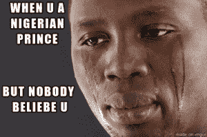

唯一的竞争涉及运输，而不是主要集中在包裹递送。这很有潜力，但我对这个国家一无所知。我对尼日利亚的唯一了解是被废黜的王子们许诺财富的电子邮件。我必须亲眼看看。2017 年秋天，我拿到了签证，收拾好行李，准备第一次去。

走进机场时，我肯定已经支付了价值 50 美元的额外费用，但我已经着陆了。漫步在拉各斯的街道上，我看到一群看似不守规矩的“奥卡达斯”出现在小街上，顾客们向他们走来，讨价还价。他们无处不在。我有我的市场。

我回到纽约时，对这个新的尼日利亚企业肯定没有把握。当我告诉人们这个想法时，怀疑论者比比皆是，我就是其中之一。然后有一个决定性的夜晚，坚定了我的决心。我当时正在主持一个社交活动，当我把这个想法告诉一个朋友时，一个喝醉了的前同事走过来对我说:

> “你凭什么认为你能在尼日利亚做到这一点？你甚至不能留在孟加拉，而你在孟加拉有朋友和家人。”

“我们会让数字自己说话的，”我一边走开一边回答。证据就在布丁里。我要向所有人证明，最重要的是，向自己证明我能做到。

我需要一个名字。名字对我来说总是很容易。*冈田..冈田..冈田..戈卡达*..好吧，那很简单。现在我需要一个团队。我真的要去尼日利亚，一个我基本上一个人都不认识，独自开店的国家吗？我没有时间像在孟加拉国那样在尼日利亚生活一段时间，也没有时间去寻找朋友。我不得不使用我的在线网络。所以我在 LinkedIn 上发了这个忠实的帖子:

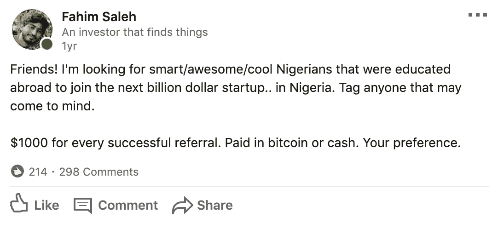

起初，没有多少回应。到处评论。我朋友的一些标签。但是后来一些事情开始发生了。这篇文章人气飙升，但原因却出乎你的意料。我要求团队成员在国外接受教育，这是投资者想要的，也是我认为这个人应该具备的更为世俗的观点。尼日利亚人不喜欢这样。

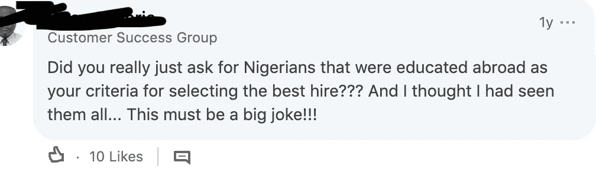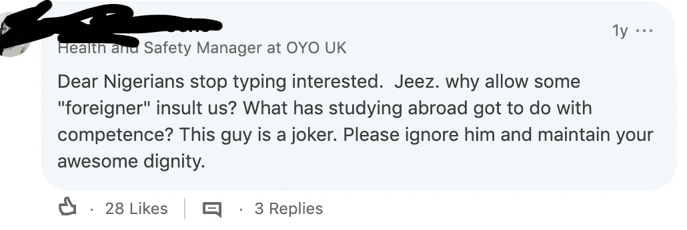

我一直在考虑撤下这个帖子，直到我意识到这个糟糕的公关有一个副作用——曝光。虽然我收到了很多仇恨，但我也接触到了更多愿意接受我的信息的人。

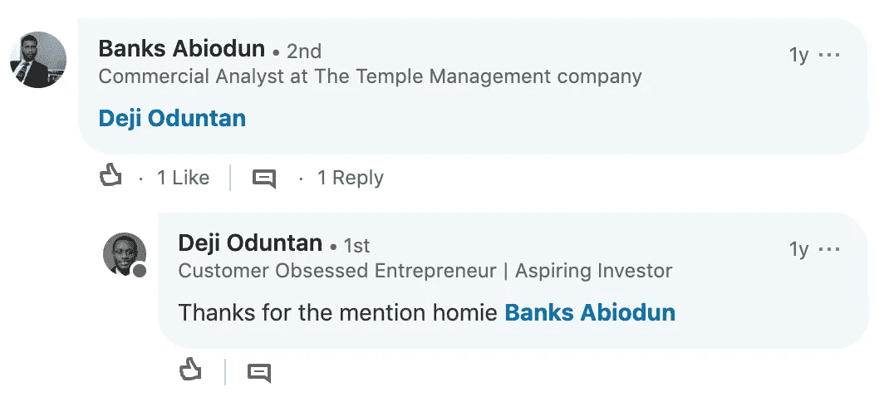

这是我偶然发现德姬的地方。在 Skype 上采访了德姬和一家名为 Delivery Bros 的公司的其他几个人后，我决定再次去尼日利亚看看这些人的真实情况。

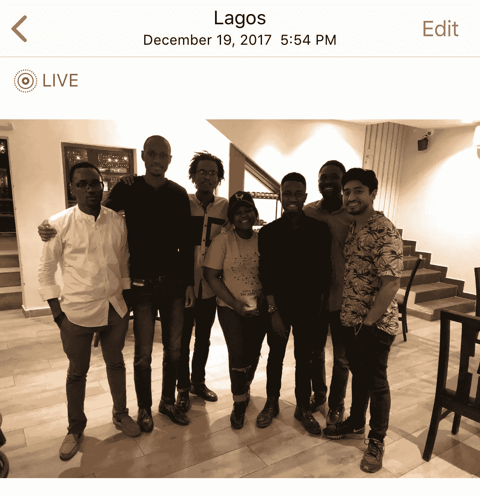

The starting Gokada team

他们对我的出现感到惊讶。在一些聊天和晚餐后，我们决定让团队继续前进。首发的 Gokada 团队就这样诞生了。

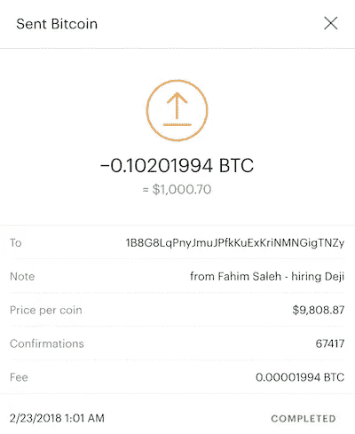

ca$h monies

德姬的朋友得到了报酬！我是一个守信用的人。

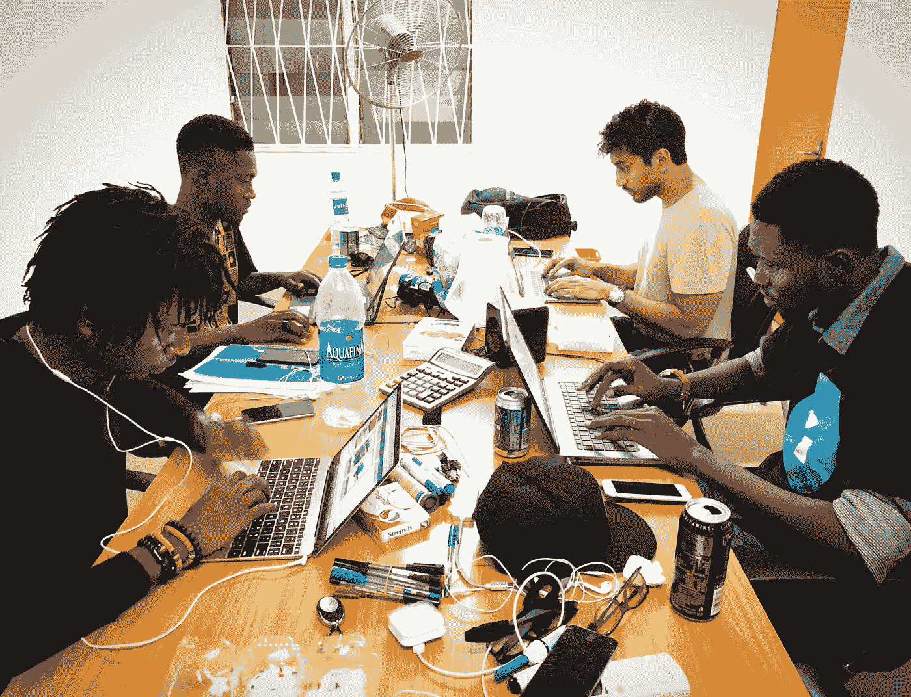

Our first day of work

我们从一间只有一个房间的旧办公室开始做起。德姬当时仍在 Jumia 工作，所以他还有一个月的时间才能全职加入我们。

我们开始招募驾驶员，并举行了第一次驾驶员考试。

Clearly this guy studied

到 2018 年 1 月，我们拥有了我们生活和工作的第一个正式校园，被称为“G 校园”。

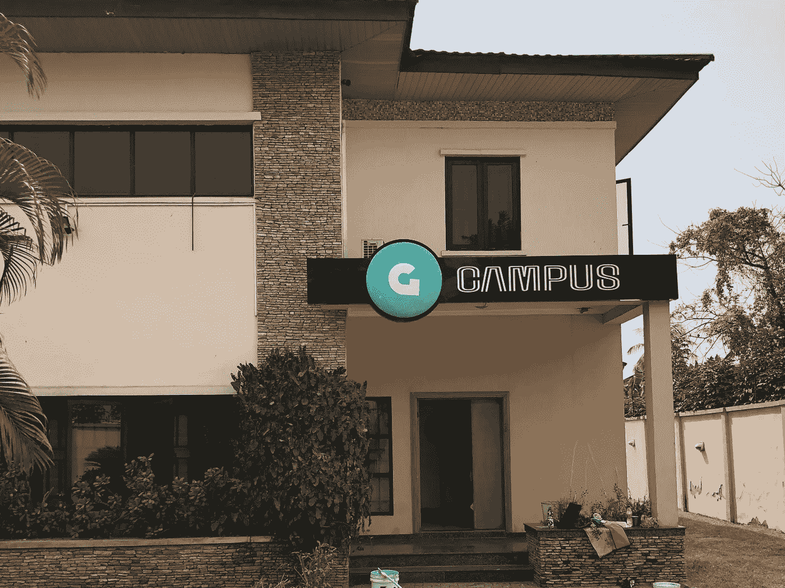

First real office in Ikeja GRA

从那里，我们雇佣了更多的人，更多的人搬进来。我们有 ups。我们有过挫折。另一个帖子的细节。但是今天，我很高兴地宣布，我们已经筹集了由 Rise Capital 牵头的[530 万美元的首轮融资。](https://techcrunch.com/2019/05/24/nigerias-gokada-raises-5-3m-round-for-its-motorcycle-ride-hail-biz/)

Me becoming a Gokada rider

也..

