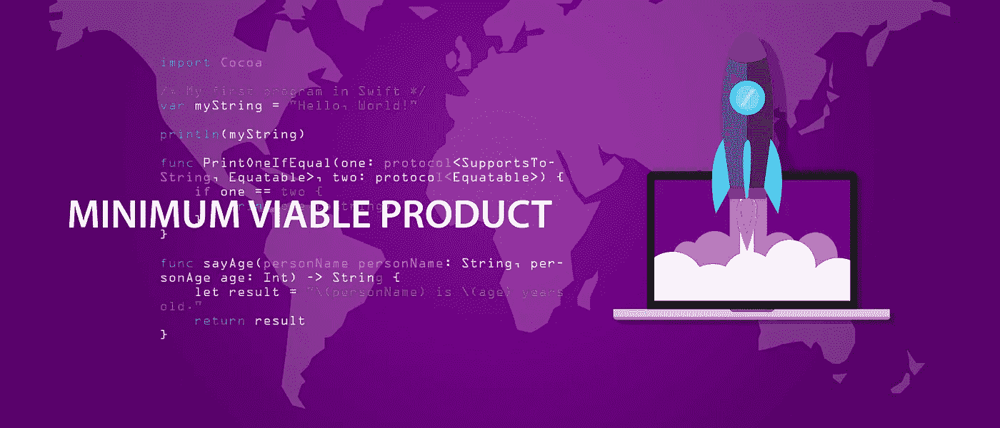

# 如何开始一个项目

> 原文：<https://medium.datadriveninvestor.com/how-to-start-a-project-e17aeb8437bf?source=collection_archive---------46----------------------->

对许多公司来说，启动一个新项目很难，因为这会让他们措手不及。即使你的开发团队已经准备好了，也有很多其他的因素在起作用，比如紧张的时间表和很少的准备时间。没有必要的时间准备，随着最后期限的临近，你可能会跳过一个步骤，这可能是一个严重的错误，因为你可能会回来困扰你。

为了在您的道路上帮助您，我们创建了一些项目开发步骤，这些步骤应该作为您应该如何对开发过程建模的一般指南。

# 如何启动一个项目

最广泛接受的项目设计系统被称为软件开发生命周期(SDLC ),它是一个规划、创建、测试和部署信息系统的过程。主要阶段包括初步分析、需求定义、系统设计、开发、集成和测试、验收、安装、部署、维护、评估和处置。

这些阶段的主要步骤和活动是:

*   **一份技术规范文件**——这份文件将不仅定义项目的所有要求。技术规格文档将作为产品开发的蓝图，并详细说明开发阶段使用的所有程序、工作流程和方法。由于这是开发过程的一个重要方面，我们将在后面花一些时间来讨论如何编写技术规范。
*   **MVP 设计**——在这个阶段，你需要考虑你的产品需要满足哪些最低要求才能被认为是有效的。在 MVP 开发过程中，你必须在早期阶段尽可能频繁、尽可能便宜地测试产品，这将防止问题滚雪球。
*   **应用程序原型制作**——不要把原型制作当成草图，而是作为一种测试和磨练你的想法的手段，以吸引潜在投资者的兴趣。当创建一个可点击的原型时，大多数[软件开发公司](https://skywell.software/)通常会建立 SMART 目标(具体的、可测量的、可实现的、现实的、基于时间的)。这可能需要大量的研究，即使你已经有了一个具体的想法。
*   **启动项目** —在启动之前，确保设定明确的目标和基准。这将涉及大量的市场调查，以确定谁是你的目标受众。此外，请记住，产品发布后，你的工作并没有结束。您必须准备好发布新的更新，以防初始版本出现问题，并且您应该准备好处理客户关于您产品的任何问题。

# 如何撰写技术说明书

正如承诺的那样，我们将继续撰写技术规范。在项目的设计阶段，您应该从两个有利的角度来看待您的产品:开发的角度和客户的角度。根据总体产品指南，技术规格文件必须包含与双方相关的信息。客户可能更关心系统功能，而开发人员可能更关心技术规范。对客户来说，最重要的是确保技术规格符合他们的目标和愿望。

无论你做什么，确保文档易于阅读，这意味着使用简单的语言和简明扼要的句子。如果你使用技术术语、缩写和首字母缩略词，确保你从一开始就清楚地定义了所有的术语，以避免混淆。

开始一个项目是令人兴奋的时刻，但你也应该明智地使用你的时间。始终进行尽职调查，尽早并经常测试您的产品。无论何时推出新产品，可能发生的最糟糕的事情就是从一开始就搞砸发布。这可能是一个很难恢复的错误。因此，从一开始就遵循必要的协议来避免这种错误。

*最初发表于*[*sky well . software*](https://skywell.software/blog/how-to-start-a-project/)*。*