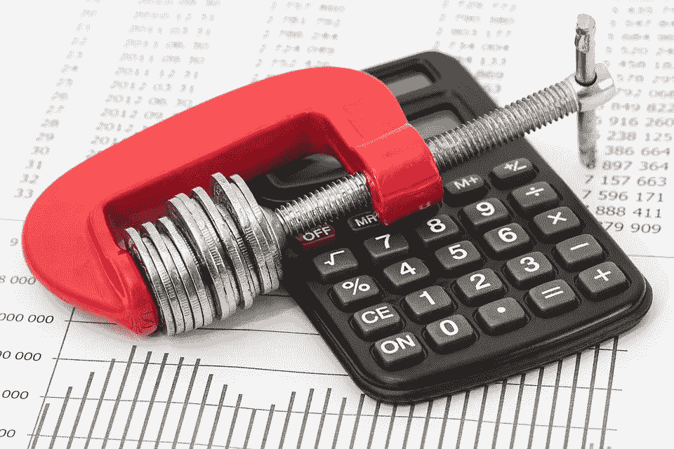
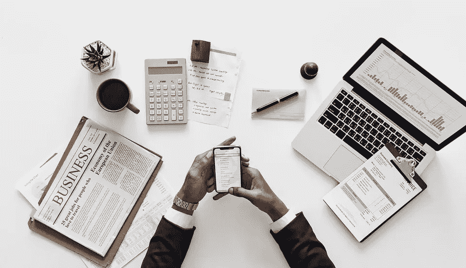
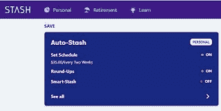
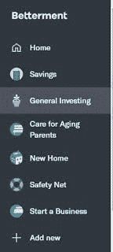
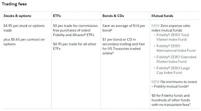
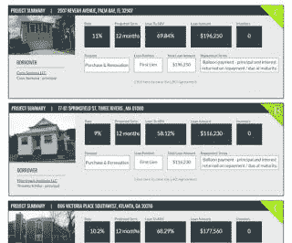

# 当你破产或收入低时，如何开始投资？

> 原文：<https://medium.datadriveninvestor.com/how-to-start-investing-when-you-are-broke-or-have-low-income-56ad32899bd8?source=collection_archive---------3----------------------->

K

每个人都有不同的处理个人财务的方法。有些人很幸运，父母教会了他们一些基本的理财原则。
其他人必须自己找出答案，甚至可能在找到适合自己的方法时会有一点挣扎。
不管怎样，有两件事你需要知道:

 [## 外汇投资如何帮助偿还债务|数据驱动的投资者

### 外汇是对外汇市场的投资，不同国家的货币在外汇市场上进行兑换

www.datadriveninvestor.com](https://www.datadriveninvestor.com/2019/02/13/how-forex-investment-helps-to-repay-your-debts/) 

1.你已经是一个成年人，处理你的财务必须成为你的优先事项的一部分。为你阅读这篇文章干杯。

2.记住，这需要时间，但是值得。

那么，当你破产、负债或收入很低时，如何开始投资呢？
说起来简单，其实并不容易。

最重要的是树立里程碑，开始。如果你为了“当我有更多的钱时”而推动目标，你将一事无成，此外，你将失去时间和复利的好处。

## 1.了解基本知识。

最基本的一步是了解你的财务状况。
你有债务吗？你知道有多少吗？你的还款中有多少是本金，多少是利息？你贷款的利率是多少？
你每个月的基本开销是多少？你每月实际花费多少？你有存款吗？你的存款利率是多少？你有应急基金吗？
贵公司提供 401K 吗？你对你的 401K 有贡献吗？多少钱？你有火柴吗？

一旦你有了这些问题的答案，至少你对自己的财务生活有了一个很好的了解。

## 2.进入财务状态。

一旦你知道自己的立场，你就可以评估自己离理想的财务生活有多近，从而获得更好的方向感。

如果你发现自己的财务状况很糟糕，不要惊慌，行动起来，拍拍自己的背，至少要承诺开始。减少消极的自我对话。

如果你的情况比你预期的要好，那么恭喜你，现在是时候更努力地提高了。
不管怎样，保持身材意味着制定一个计划。

Image by StartUpPhotos — Pixabay

你每个月都有预算吗？

这是第一个也是最基本的事情，特别是对于许多靠薪水生活的人(我曾经属于这个群体)，或者那些从信用卡借钱来支付开支直到下一次薪水的人(我也曾经属于这个群体)。

做一个预算，跟踪你的开销，会告诉你你的钱到底去了哪里。你可能认为你不是在无意义地购物，或者至少不是很多，但是追踪你的开销和预算会揭示真相。

你有应急基金吗？如果是，转到下一点。如果没有，继续读下去。

拥有应急基金是(在有预算之后)你财务生活中最重要的事情。

有一个应急基金意味着当意外发生时你不会负债，相信我，这是会发生的。此外，知道你努力工作，并且能够建立一个让你感到自豪的应急基金，这会给你一个信心的提升。例如，知道如果你失业了，至少你会有几个月的时间去找另一份工作。
那是和平。那是一种奇妙的感觉。

通常建议 3 到 6 个月的支出作为应急基金。
我从第一手资料中了解到这很有挑战性；当我一年挣 2 万英镑的时候，这似乎是遥不可及的。如果你有一个计划并坚持下去，这不是不可能的。

你可以开始为你的目标设定里程碑。一个很好的里程碑是戴夫拉姆齐婴儿第一步。1000 应急基金。这会增强你的信心，在达到第一个 1000 分后，你只需要继续保持下去。你的应急基金迟早会有 3、4 或 6 个月的开销。

Image by stevepb — Pixabay

你有债务吗？如果没有，跳到下一点。

债务有很多种，其中一些会毁了你的未来，而另一些会让你积累财富。

坏账:消费者债务或任何高利息债务是你能持有的最糟糕的债务。如果你有一个高利息的债务，试着在一个能给你提供更好更低利率的机构为你的余额再融资。对于信用卡来说尤其如此。有许多提供转让 12 个月零利息的余额。这是最好的方法。

学生贷款:可悲的是，这是一种非常典型的债务。对许多人来说几乎不可避免。首先要检查的是你支付的利率。如果你的学生债务有单独的贷款，尝试通过向不同的机构再融资来合并贷款。尤其是如果你打算得到一个更好的利率。争取 5%以下的费率。

汽车贷款:来不及告诉你汽车是一种贬值的资产。去过那里，做过那个。没关系。试着增加比你应该支付的更多的钱，以达到你的本金并更快地摆脱债务。尽量让你的车保持良好的状态，并认真评估在将来需要换车的时候用现金买一辆。
有时拥有一辆难看的车并不好，但大多数时候它对你的财务生活有好处，完全值得。

其他贷款:制定一个更快偿还贷款的计划。在你的贷款中投入额外的资金真的很有帮助。再融资到一个较低的利率是一个选择。

个人理财有时就像健身，如果你正在健身，你只需要保持一致性，坚持下去，检查可能会让你偏离目标的小错误。

## 3.微观投资:我们很幸运生活在一个你甚至可以投资你的零花钱的时代。

许多人认为，他们必须等到有了几千美元才能投资，*【应急基金】(尽管有充分的理由)，***【afte】***r 房子的首付，之后，之后，之后。*

*与此同时，你正在失去时间和随时间而来的复利收益，你也正在失去你能创造的最重要和最有价值的东西:**你正在失去养成习惯和边走边学的机会。***

*然后，大多数人(如果他们足够幸运地达到这一点，没有意外情况延误他们的计划)，在他们得到应急基金，首付后，他们只是去找一个财务顾问(你必须选择很好的，因为他们中的许多人只是销售人员)，完全脱离他们的钱，期望高回报，也支付高费用。*

*当你早点开始(或者至少开始)的时候，你可以学习、成长和养成习惯。习惯会让你在将来更好地处理金钱，当你有一份更好的工作，当你获得更多的收入，而且很有可能你会。*

**

*Image by rawpixel — Pixabay*

*免责声明:应急基金之所以重要，首先是有原因的。如果你想长期投资，你不会真的想在不到一年的时间里收回投资。你的投资没有流动性，它们不是你的应急基金。如果意外发生，而你没有建立应急基金，你将不得不在雨天撤出投资，如果市场在那个时候下跌，你将不得不吃些亏。(去过，做过那个。)*

*然而，在小额投资的同时建立你的应急基金是可能的。
更专注于建立你的应急基金，但要养成小额投资和学习的习惯。假设你一个月可以存 500 美元。如果你选择存 460 美元作为应急基金，40 美元用于小额投资，你已经在创造一些东西了。*

*你是:
-将计划付诸实施
-学习专注于实现里程碑
-锻炼你的意志力
-实际建立你的应急基金和小额投资。*

*微投的方法有很多。*

*有些平台甚至允许你小额投资你的零花钱。你可以从便士开始，所以没有借口。*

*一些平台(最低 0-500 美元):*

***1。你可以通过四舍五入来小额投资你的零花钱。如果你没有应急基金，从每一次购买中拿走几分或一美元不会削弱你存钱和建立应急基金的能力，所以开始做是有好处的。***

***2。Stash:** 你可以用 5 美元开始小额投资，他们会每月收取你 1 美元的平台使用费。这是值得的。当我一年挣 4 万英镑的时候，我能够在几个月内积累 1 万英镑，甚至没有注意到。
大多数平台都有自动存款选项。因此，你可以每周、每两周或每月向你的迷你投资组合中添加 10 美元、40 美元或你想要的金额。
在 stash 你可以购买 ETF，ETF 基本上是一种持有特定资产的投资基金。
例如，一只科技 ETF 持有 fb、微软等科技公司的股票。
当你购买一只 ETF 时，你是在购买该 ETF 持有的公司的股票。这比购买单一股票更能分散风险，因为单一股票的风险会增加。*

**

***3。Robinhood:** 买单只股票和指数有用。如果你愿意学习、阅读、参与，我只是推荐一下；这是你在处理或做任何财务决策时应该做的。它也有交易期权的可能性。不收费。*

***4。这些平台基本上是机器人顾问，在问了你一些基本的问题，比如你的风险水平和你什么时候需要钱之后，它们会把你的钱投资到股票上。***

*Betterment 在一般投资中有一个选项，将 90%投资于债券，10%投资于股票(它曾经是一个聪明的储蓄者)，投资于债券的收益通常免交地方税。或者你可以使用他们新的储蓄账户选项来存应急基金，该选项提供 2.69%的利率。*

*Wealthfront 也有储蓄选项，他们目前(2019 年 7 月)提供 2.57%的利率。*

*这两个平台令人惊叹，因为它们在视觉上为你提供了你财务生活的全貌，外加一些预测。*

*在改善中，你可以设定目标，把钱分成不同的类别；例如，为新企业提供资金、照顾年迈的父母、应急基金等。这是一个保持你的财务目标清晰、有条理和整洁的惊人方法。*

**

***5。Fundrise:** 是一个房地产众筹的平台。你可以从 500 美元开始。在过去几年里，它提供了 8%到 12%的回报率。我对这个平台和结果很满意。
这不是流动资金。你放入 Fundrise 的钱在未来 5 年内不会被使用或取走，如果你在 5 年前取出你的钱，他们实际上会对提前支取进行罚款。*

***6。你的 401K:** 考虑给你的 401K 增加额外的钱。你 401K，IRA，Roth 里的钱是有税收优惠的钱。如果你正考虑为退休投资，这是你应该去的地方。*

*最大化你的 401K 是一个很好的目标。考虑将你的贡献增加到 8%到 15%之间。那会让你更好地利用复利和时间。*

*7 .**。Wealthsimple:** 如果你的账户少于 100k，没有最低限额和 0.5%的管理费。*

***9。富达:**除了退休投资组合之外，你可以考虑在共同基金和指数基金中增加一个投资组合。*

*目前，富达提供一些零费用率和零最低投资的共同基金。*

*重要提示:阅读招股说明书，它将帮助您做出更好的投资决策。*

*这些是来自富达网站的费用。*

**

***10。在这个平台上，你可以通过贷款投资房地产。它提供从 A 到 G 的不同程度或类别的投资，A 风险较低，G 风险较高。你的钱的利息在贷款到期时支付，通常是 6 到 12 个月。利率在 7%到 12%之间。根据他们的网站，最低投资额是 10 美元。***

**

*投资—下一步(超过 500 个最小值)*

*如果你已经准备好了，并且财务状况良好，有更多的方法让你的钱发挥作用。*

*即使你不是初学者，Fidelity、Vanguard、Betterment 都是继续合作的好地方，但也有一些平台提供不同的投资工具。*

***1。同行借贷:**有 Lending club 这样的平台，你可以把钱投资到贷款票据上。根据你所在的州，你可能需要成为合格投资者。最低投资 2000。*

***2。干部:**合格投资者的商业地产投资选择。最低 50K 单笔交易或承诺 10 笔交易的 10K。*

***3。大师作品:**这是一个投资艺术的平台。你会拥有一件杰作的一小部分，它应该会随着时间的推移而升值。*

# ***投资和知识。***

*我最喜欢小额投资的一点是，你可以边走边学，并养成创造财富的基本习惯。
用詹姆斯明确的话说，“小步快跑，成效显著”。从小额投资跳到投资的体验是不同的，因为你将变得更有见识，希望也更谨慎。*

*投资的第一条规则是:“不要投资你输不起的钱”。几乎任何人都可以承受 5、10 或 20 美元的损失，如果碰巧你输了，你会学到东西，而且你会一直学下去。你将熟悉相关条款、不同的投资工具，甚至税收。当那一刻到来时，你有 5K、15K 或 50K 可以投资，你会有更多的知识，你会有正确分析机会所需的习惯。你会有信心和风险管理技能。*

# ***关键要点***

*1.没钱投资，就从微投开始。*

*2.努力养成习惯。设置自动存款进行小额投资，使用平均成本技术。*

*3.阅读你的投资信息并学习。阅读招股说明书。*

*4.当从小额投资转向大额投资时，运用你的风险管理技巧。*

*不要投资你输不起的钱。不要在没有被正确告知和自己做研究的情况下投资。*

*5.不要盲目相信财务顾问，他们中的许多人是推销员，许多人很棒。做你自己的研究，当雇佣一个财务顾问时，像你为一个非常重要的公司(你自己)雇佣一个人一样去思考。*

*6.通常，长期投资会带来最好的结果。日内交易听起来可能很有吸引力(曾经有过，做过)，但是长期投资对我们大多数人来说是最好的成本收益结果。*

*7.更新你的投资组合。你不必每天都看，但要保持消息灵通。随着年龄的增长和生活的变化，也要更新你的投资组合。*

*祝你努力成功！*

**原载于 2019 年 7 月 28 日*[*【https://www.thedailyhabit.net】*](https://www.thedailyhabit.net/2019/07/everyone-has-adifferent-approach-to.html)*。**