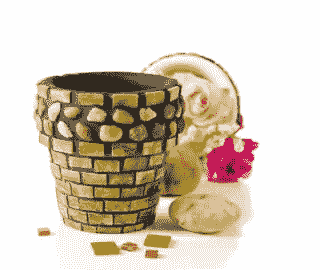

# 如何从舒适的家中开始销售工艺品

> 原文：<https://medium.datadriveninvestor.com/how-to-start-selling-crafts-from-the-comfort-of-your-home-8eeabb8d0cdd?source=collection_archive---------11----------------------->

好吧，我已经在这里谈论了这么多不同的网上赚钱方式。

但是我没有错过一些真正重要的东西吗？

当然是靠卖你独特的手工制品赚钱。

市场上可以买到的商品是每个人都在网上卖的东西。你需要的是不同的东西，有创造力和创新性的东西。

一些体现自己独特个性的手工工艺品怎么样？

为什么不坐在家里自己创业呢？

我实话实说。说到制作手工制品，我一点也没有创造力。我有时会织点东西，但仅此而已。

然而，为了写下这篇文章，我进行了一些彻底的研究，以获得正确的想法。我也考虑过卖我的针织品，但是我发现这非常乏味而且费时。如果你和我不一样，喜欢你的钩针编织，那就想尽一切办法把它们卖掉。

 [## 成功的生活数据驱动型投资者的 25 种自我提升方式

### “我活得越久，学到的就越多。学的越多，体会的越多，知道的越少。”―米切尔·莱格兰德时间到…

www.datadriveninvestor.com](https://www.datadriveninvestor.com/2019/03/12/25-self-improvement-ways-for-a-successful-life/) 

难怪工艺品在市场上很受欢迎。他们以自己的方式独一无二，人们想要不同的东西来改变或者只是看起来或感觉不同。工艺品可能是由个人或一小群人一起无中生有创造出来的。

如果你能思考和创造一些东西，为什么不把它卖掉赚点钱呢？这里有一个循序渐进的指南，帮助你在家里开始自己的手工艺品生意。

**第一步:探索自我**

如果你还没有想过做工艺品来卖，现在正是开始思考的时候。

从探索你内心的创造力开始。想想自己擅长什么。每个人的想法可能不同。

有些人可能认为他们擅长绘画、素描或制陶。其他人可能擅长编织、缝合、钩针编织或刺绣，还有一些人擅长用手工面团或橡皮泥制作东西。

你可以用没用过的纸做花，或者用纸型技术创造不同的生物和卡通人物。选择可能是无穷无尽的。

如果你想不出任何一个，但对任何一个都感兴趣，那就用你最好的朋友——谷歌、YouTube 或 Pinterest 来获得免费教程。如果你下定决心，让自己沉迷于一些课程，向专业人士学习提高手艺的秘诀，这可能是个好主意。你需要做的就是大量的练习，让自己在这方面变得“完美”。

一些畅销的流行手工制品包括手工编织毛衣、婴儿毯、针织或钩编婴儿套装、珠宝、蜡烛、肥皂、个性化礼品篮、百花香等等。

**第二步:发现消费市场**

在众多的选择中，你可能已经列出了一些你想为自己做的事情——一些你觉得自己能做或者擅长做的事情。给自己一个鼓励。这是一个台阶。

接下来，你需要做一些研究，为你的产品开拓市场。弄清楚你是否真的能够销售你的产品。如果是，找出以下问题的答案:

什么样的人会买我的产品？

我将如何销售它们？

我能以什么样的价格出售它们？

你真的能从中获利吗？

这一切努力值得吗？

你可能会发现手工绘画的售价相当高，但只有富人才能买得起。

也很有可能，在你作为一名艺术家获得一定的知名度之前，你可能无法很好地销售它们。

然而，如果你决定自己制作不同香味的蜡烛或肥皂，市场上对它们的需求将会一直存在。大多数人都买得起。即使他们不是为自己，他们也一定会为他们的朋友或伴侣制作可爱的礼物。

想出这么受欢迎的项目，但与众不同。例如，你可以介绍其他人不卖的所有水果香味，或者不常见的蜡烛或肥皂的形状。

如果你和别人做同样的事情，你就不容易占领那个市场。

第三步:做好准备

现在你知道你想做什么，了解你的产品的市场，你还有另一项重要的工作要做。你必须卷起袖子准备好。

在你开始制作你的产品之前，再想一想，直到你说服自己。问自己几个问题。

其中一些可能是:

*   我能在不影响日常生活和家庭的情况下抽出时间来做这件事吗？
*   我需要投资多少钱来开始自己的生意？
*   我会满足公众需求吗？
*   我能生产出人们绝对喜欢的高质量产品吗？
*   我的产品会吸引消费者吗？
*   利润会值得我投入的努力吗？
*   我应该生产多少？

例如，如果你想到编织套头衫、兜帽和围巾，你知道这样做会让你满意，你甚至可以卖个好价钱。

但是，你需要大量的时间和注意力来完成它。还有，你知道这种东西在冬季需求量很大。

做好准备——在下一个冬天到来之前，慢慢做好备货。在此期间，向其他人宣传你的产品。

在你将产品投放市场销售之前，做好充分的准备。

**第四步:创造多样性和独特性**

尝试生产各种不同类型的产品。例如，如果你想做蜡烛，把它们做成不同的形状、大小、颜色和香味。

这将帮助你吸引更多的顾客，因为不是每个人都有同样的选择。如果你有另一个朋友或你认识的人制作肥皂和美容产品，你可以制作一套礼品，比如说，包括一块肥皂、一支蜡烛和一瓶沐浴露，它们都有类似的东西。可能是颜色、包装或香味。混搭打造出让人无法抗拒的独特组合。你可以把它包装得有吸引力，以吸引更多的客户。

如果你以有竞争力的价格出售一些特别的东西，人们没有理由不从你这里购买。尝试不同的组合，根据情人节、母亲节、圣诞节等场合想出新点子。一两年多的销售会让你清楚地知道人们喜欢什么，不喜欢什么。

**第五步:打造所有人都喜欢的个性化礼物**

无论你卖的是什么，打开选择，让你的产品对你的买家来说是独一无二的。即使你出售的是一种针织毛绒玩具，你也可以为顾客量身定制。你可以在上面加上客户的名字，或者刻在杯子、手镯、吊坠等产品上。如果他们要求的话，你甚至可以把它们印在他们的 t 恤上或者绣在他们的毯子上。

我们都喜欢自己独有的东西，不是吗？

作为卖家，你可以随时向他们收取额外的服务费，并从定制商品中赚取可观的利润。

**第五步:提高你的生产力**

如果到目前为止你已经被说服出售你的自制物品，只要稍微想一想制作你的产品需要多少时间。

如果这很耗时，你可能无法满足大量需求，除非你有帮手和机器来帮你，提高产量。

看什么适合你，你的商品需求是什么。相应地工作。如果你正在生产一些受欢迎的东西，把一些任务委派给其他人或者雇佣更多有创造力的人来帮助你提高产量可能是个好主意。

**第六步:找到合适的时机卖出**

找出你的产品什么时候卖得最好。你不想在冬天卖空调，也不想在夏天卖暖气。

一些产品如自制肥皂和美容产品将全年销售，但礼品如个性化篮子或惊喜蛋将分别在圣诞节和复活节销售。同样，钩针和针织产品在冬季也会卖得很好。

意识到什么时候开始制造产品，以便在合适的时间销售。根据场合生产和销售你的工艺品。

你肯定不想在复活节卖手工装饰的圣诞花环和圣诞主题卡片。

**第七步:做广告并销售**

你有很棒的产品要卖。

你已经准备好销售它们了，但是你如何让人们理解呢？

你的买家怎么知道你有这么可爱的手工制品出售？

研究如何销售你的产品。

它可以在你自己的网站上，或者像易贝、亚马逊这样的网站上，或者像 Etsy 这样的专门的工艺品网站上。

如果你有额外的空间，你也可以在家里制作你的工作室，让你的朋友和亲戚知道，并把这个消息传得更远。

在附近散发传单宣传你的产品。在上面留下你的联系电话，这样感兴趣的人可以联系到你。

另一个选择是请你所在地区的工艺品商店继续展示你的产品。当然，你得把一定比例利润分给店主。

还有，想想它的成本，确定一个合适的售价。努力使你的成本价尽可能低，销售价格尽可能高，以最大化你的利润。

许多工艺品，如纸型工艺品和贺卡，可以用你通常会扔进垃圾箱的东西廉价制作，但这些卖得很好，只是因为它们太独特了。

记住，如果你的产品太贵，你就不会吸引很多顾客。

既然他们能在别处找到更便宜的替代品，为什么还要从你这里购买呢？

你需要提供有竞争力的价格。让他们对你的买家来说是合理的和负担得起的。

如果市场上有类似的产品出售，找出它的价格，并尝试以更便宜的价格介绍你的产品(前提是你有能力这样做)。

如果你收取高于平均水平的销售价格，准备好所有合适的理由。

**结论:**

以上只是让你开始的一些提示。

销售和营销你的手工艺品也是一门艺术。如果你认为你有合适的技能来做这件事，试一试也无妨。

这非常令人满意，并帮助你以最佳方式利用你的额外时间。

此外，如果你的产品有销路，你可以从中获得应得的收入。

手工制品肯定会比商业制品卖得多。

在你开始之前做你的研究。

祝你好运！

*最初发表于*[T5【ghostwritersworld.blogspot.com】](https://ghostwritersworld.blogspot.com/2013/07/selling-crafts-from-home.html)*。*