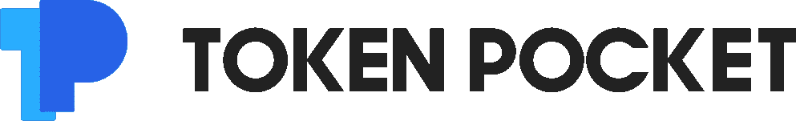
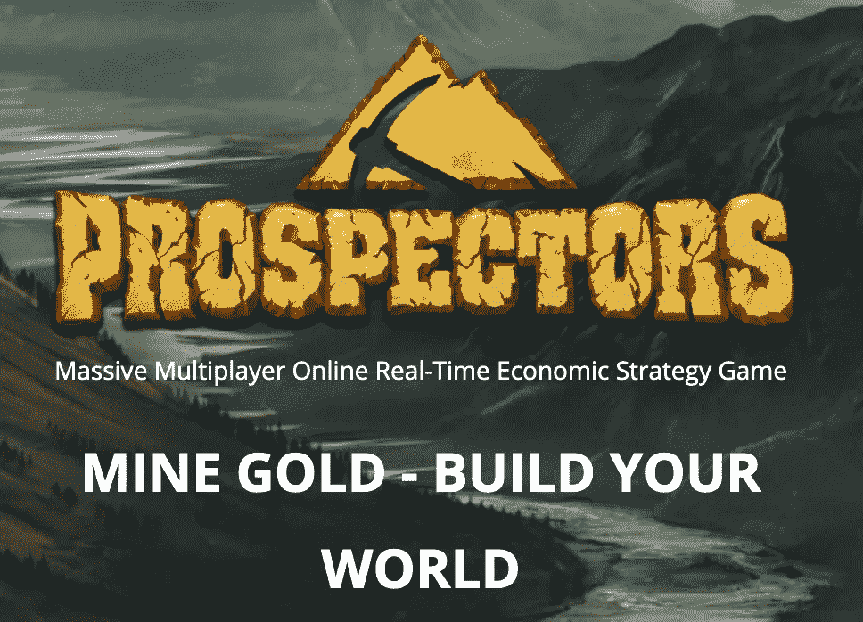
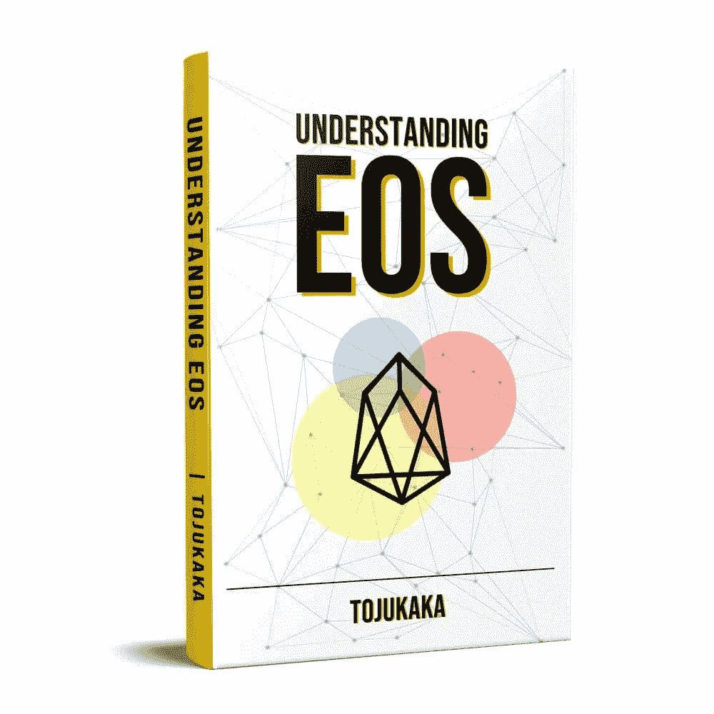
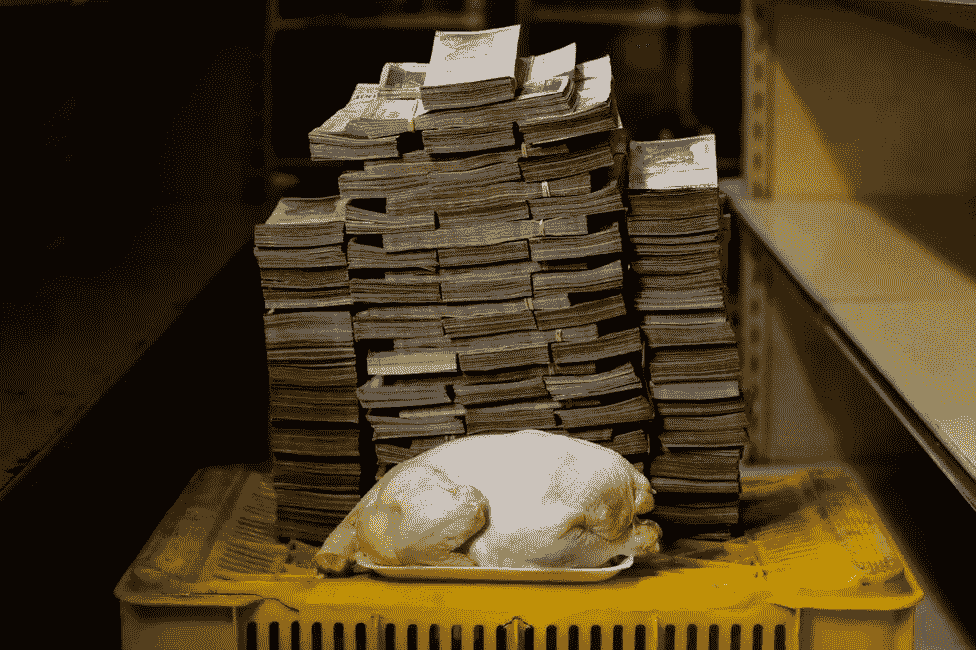

# 如何开始您的加密之旅

> 原文：<https://medium.datadriveninvestor.com/how-to-start-your-crypto-journey-640e4a65b318?source=collection_archive---------1----------------------->

[Image by Christian Bueltemann from Pixabay](https://pixabay.com/photos/athletics-run-sport-stadium-2123665/#)

Coinmarketcap 上有超过 2300 种加密货币，这还不是现存的所有加密货币。新手入门时问的一些问题包括；“我该买哪枚硬币？”“我该如何开始？”有这么多选择。我通常鼓励人们从 EOS 开始，因为它简单易用。EOS 是一种加密货币，也是一个构建应用的平台。

不久前，有人告诉我，他想投资加密货币，我应该建议他购买加密货币。他声称这辈子他所有的钱只有 3 美元(约合 1000 奈拉)。我想了一会儿。在这个熊市中，3 美元的投资对任何人来说都没什么用。如果你只有 3 美元，那么把它投资到 crypto 并希望它去月球(获得天文数字的增长)可能不是最好的决定。如果你运气好，你会失去一切并学到宝贵的人生经验，如果你运气不好，你会失去一切却什么也学不到。所以我建议他投资他的教育。你能做的最大投资就是投资你的金融教育。

> "对知识的投资回报最大。"——本杰明·富兰克林。

我建议他拿着那 3 美元，买我的书《 [**【理解 EOS】**](https://empowermeeos.org/understanding-eos.php)》(以可笑的 70%折扣)。我告诉他，如果他买了这本书，我将致力于指导他，并教他我是如何从一个破产的、没有才华的、账户余额为负的家伙开始从加密货币赚了数百万(奈拉)并在加密货币领域拥有发言权的。猜猜他做了什么？他告诉我他会“*回复我*”。他再也没有回来。

但我没有告诉他的是，我经营着一个组织，希望帮助边缘化的年轻人了解区块链和数字货币，我们正在寻找赞助我们的 [EmpowermeEOS](https://empowermeeos.org/) 计划的人，我们希望向像他这样的人提供免费电话和互联网订阅。我也没有告诉他，通过在像比特币基地这样的网站上观看简单的在线视频，他可以赚 10 美元甚至更多。我想，但我意识到不重视教育的人不会重视教育，即使你给它附加了补贴或奖励。

我敢肯定，他会去找一个人，告诉他如果他把那 3 美元投资到他们的密码项目中，他可以赚 3000 美元。在加密货币领域，你会发现许多类似的骗局。那些东西不管用。如果任何项目告诉你，你可以在短时间内让你的钱翻倍，没有风险，什么都不做，那就逃离它。不要投资你的钱在加密庞氏骗局，特别是如果你是投资界的新手。有些人可以忍受风险，但大多数时候，它会让你变得更穷、更痛苦，你会浪费时间。我并不是说不可能从加密货币中获得令人难以置信的利润。我目睹了高达 10，000%的利润，但不是通过投资庞氏骗局。

> 避免骗局！有许多秘密骗局等着欺骗贪婪的人。任何项目，告诉你买一枚硬币，你会得到每月/每周/每天超过 30%的巨大回报，这很可能是一个骗局！！

通过赚取加密货币，不需要投资一分钱就可以成为加密富翁。通过投资少量的钱，用它进行交易，或者只是被动地看着它成长，你就有可能成为密码富翁。也有可能把 3 美元投入一枚硬币，然后它在短时间内就变成了 3000 美元。是啊！你可能会走运，但这种情况很少见，你不应该寄希望于此。还有更优秀的方法。

# 从令牌袋开始

如果你是加密货币的新手，需要一个钱包，可以从 TokenPocket 开始。

TokenPocket 可能是开始加密货币之旅的最佳地点。如今加密货币的一个问题是，大多数应用程序都不是用户友好的。TokenPocket 简单易用。它有一个伟大的用户界面和 UX。

当我第一次发现这个钱包的时候，我印象非常深刻。印象如此深刻，以至于我联系了 telegram 上的团队，以了解他们正在构建的更多信息。回应我的人是他们的 CTO(首席技术官)。我喜欢他回应我的方式。TP 的人花了很多精力给他们的用户一个很棒的用户体验。我了解到这位 CTO 在百度云计算工作了 4 年，开发存储相关产品。百度是中国版的谷歌。这告诉你这个团队是稳固的，有能力的。

如果你访问 TokenPocket [Twitter 账户](https://twitter.com/TokenPocket_TP)，你会注意到他们做了很多赠品来吸引他们的社区。对于那些在学习项目的同时对积累代币感兴趣的人来说，这是一个机会。有些人甚至通过参与加密赠品和奖金来做生意。

> TokenPocket 是所有加密货币的最佳移动和桌面钱包，是您可以访问大多数区块链应用程序的地方，是 dApps 和所有加密内容的一站式商店！([点击发微博](https://ctt.ac/ne1h0))

# **获得免费账号**

现在您有了加密钱包，您需要一个加密帐户。注意，钱包和账户是有区别的。钱包是一款帮助您与帐户互动的应用程序。您的加密货币帐户是您的用户名或公共地址/密钥和您的私钥。所以你可以有许多加密货币账户，并将其导入到一个像 TokenPocket 这样的简单钱包中。开立加密帐户就像开立电子邮件帐户一样简单，而且大多数情况下钱包和帐户都在一起。

因为 EOS 的特别和令人敬畏的特性，EOS 帐号现在不是免费的。它们的价格从 1 美元到 10 美元甚至更多，这取决于你从哪里/如何得到它们。我认同许多年轻人无法购买 EOS 账户，因为谷歌 PlayStore 不接受他们的 ATM。因此，我为你们这些了不起的人争取到了 100 个免费的 EOS 账户。如果你需要一个免费的 EOS 账户(和其他赠品)，[点击](https://clicktotweet.com/ne1h0)这个[链接](https://clicktotweet.com/ne1h0)。它会自动生成一条推文。发微博吧。当你发完微博后，在 twitter 上跟我说一声，我会在你的收件箱里放一个促销代码，你可以用它来获得一个免费的 EOS 账户。

只需很少的费用，你就可以从 [Google PlayStore](https://play.google.com/store/apps/details?id=vip.mytokenpocket) 或 AppStore 获得一个 EOS 账户/钱包，你也可以为你的电脑获得一个 d [esktop 钱包/账户](https://www.tokenpocket.pro/)，你可以用任何方式支付，包括 [PayPal](https://medium.com/@tokenpocket.gm/create-the-eos-iost-bos-account-through-paypal-on-tokenpocket-1513e34dd5e5) 。

# **赚取一些加密货币**

我们正处于采用加密货币的边缘，人们通过学习加密货币和完成简单的任务获得报酬。如果你不熟悉加密货币，这可能听起来很奇怪，但如果你一直潜伏在加密领域，你应该已经知道人们做简单的事情就可以获得报酬。所有形式的价值最终都会表现为代币。一切都会被令牌化。

以下是一些你可以通过简单的在线任务赚取加密货币的方法。这些要求你有一个 EOS 帐户。

## **学习获得报酬；比特币基地和令牌袋**

观看关于加密货币的教育视频，你可以从[比特币基地](https://www.coinbase.com/earn/eos)获得超过 130 美元。唯一的问题是，在你获得资金之前，他们会把你放在一个永久的等待名单上。我知道很少有人能够通过这种方式赚钱，但我知道的大多数人仍在等待。

你可以通过阅读这篇题为“ [**关于 TokenPocket**](https://medium.com/@tojukaka/five-things-you-probably-didnt-know-about-tokenpocket-77a72232ee9e) 你可能不知道的 5 件事”的帖子，并在 Twitter 上分享它，来赚取一些 TokenPocket 令牌。

## **帮助 AI 完成简单任务获得报酬**

在 [effect.ai](https://effect.ai/) 中，你可以通过完成音频转录、内容审核等在线任务获得 EFX 代币。通过完成这些任务，你也在训练一种人工智能算法。

## **做好事获得报酬**

[因果报应](https://www.karmaapp.io/)旨在奖励行善的人因果报应。你可以通过他们的应用程序发布积极的内容来赚取因果报应。

## **通过玩游戏赚取加密货币。Prospectors.io 就是一个很好的例子。**

[Prospectors](https://prospectors.io/) 是一款实时、多层的经济策略游戏，玩家可以在游戏中挖掘黄金(PGL 代币),这些黄金可以在现实生活中使用。游戏的情节模仿了典型的淘金热。

# **加入本地密码社区**

> “和那些能激励和鼓励你积极改变生活的人在一起。建立一个团队，你们可以一起工作，互相支持，创造更好的生活。”
> ― **阿维纳·塞莱斯特**

如果你是一个密码新手，成为一个密码社区的一员是非常重要的，在这里你可以学习和与其他密码爱好者交流。您需要一个本地支持小组，在那里您可以讨论和谈论最新的加密趋势，并了解更新和机会。加密货币行业仍然年轻，就像一个孩子一样，正在快速增长。成为社区的一员并参与讨论有助于你跟上最新的趋势。

如果你没有一个本地的密码社区，那是一个等待你去解决的问题。创建一个。提出讨论。担任领导职务。好处是巨大的。

# **看一本关于密码的书**

我在这篇文章的开头谈到了获得关于加密货币的教育和知识。为了强调，我再次强调它。你对加密技术和市场的知识和理解将会产生巨大的影响，让你脱颖而出。您对加密了解得越多，您就越能发现价值链上的机会。

我给你推荐的一本书是“ [**了解 EOS**](https://empowermeeos.org/understanding-eos.php)**”**。这可能是你会读到的关于区块链和加密货币的最好的书。

[**点击此处预购该书。**](https://empowermeeos.org/understanding-eos.php)

[Understanding EOS](https://empowermeeos.org/understanding-eos.php)

> "如果你想在生活中有所成就，你必须读大量的书。"—罗尔德·达尔

# **获取更多知识**

注册加密货币课程和关于该主题的更多知识。我在 crypto 上唯一的投资是在 Nexxus 大学上的一门 100 美元的课程。它得到了回报。了解加密货币会让你在未来几年拥有优势。无论你的兴趣是什么，你都必须以这样或那样的方式与金钱打交道，因此密码教育非常重要。加密货币就是钱！大家都会用。这不仅仅是为了密码爱好者。随着新的创新进入市场，区块链和加密货币教育为人们开辟了新的业务和就业机会。

如果你是你的开发者，对编码感兴趣，看看下面的 EOS 开发者课程。太牛逼了！

# 得到一份加密工作

对于有才华的人来说，加密货币领域有很多机会。如果你有数字技能，我敢打赌，如果你为区块链公司或项目工作，你会赚得更多。这不是一个随机的猜测；根据 Hired.com 的调查，区块链工程师的平均工资明显高于其他职位的软件工程师的平均工资。对区块链开发商的需求增长了 517%,研究证明，这一需求在未来几年还将继续增长。公司和雇主不在乎你的大学学位/证书。他们只关心你的表演能力。

# 投资加密

投资 crypto 是 2019 年你能做的最聪明的事情之一。负利率，许多国家的恶性通货膨胀，贸易战，等等，表明我们正在走向一场重大的金融危机。由于糟糕的货币政策，委内瑞拉、津巴布韦、苏丹、阿根廷、正面临经济危机。以委内瑞拉为例，你需要一手推车的现金来购买纸巾，因为过量印刷钞票导致的恶性通货膨胀导致货币贬值。你想投资加密技术，因为它能让你对冲奈拉、美元或任何其他政府支持的货币。

The [Venezuelan bolivar](https://www.bbc.com/news/world-latin-america-45246409) has become near-worthless, following a severe economic downturn. To show the extent to which hyperinflation has gripped the country, Reuters photographer Carlos Garcia Rawlins created images of everyday food and household items alongside the amount of money it costs to buy them. A 2.4kg chicken has been costing 14,600,000 bolivars (equivalent to $2.22, or £1.74) in the capital, Caracas.

投资加密是件好事。但是不要因为大家都在投资或者炒作多了就去投资。你需要先投资自己。投资你的知识。你需要知道发生了什么，因为投资加密是有风险的。投资前先学习。投资有风险。承担适当的风险。投资一笔你可以放弃的金额，随着你变得越来越自信，越来越了解密码，你可以逐渐增加你的投资组合。

# 底线

简而言之，这是 10 个实用的步骤，你可以开始你的加密之旅。

1.  首先投资你的教育。
2.  避免骗局。
3.  从 TokenPocket 开始。
4.  创建加密帐户并将其导入令牌袋应用程序。
5.  赚取一些加密货币:通过学习(比特币基地)，做简单的任务来帮助人工智能(effect.ai)，做好事和玩像 Prospectors.io，e.t.c 这样的游戏来获得报酬
6.  加入当地的加密社区。
7.  读一本关于密码的书。
8.  获取更多知识:注册加密货币/区块链课程。
9.  找一份加密工作。
10.  投资。

# 结论

既然你已经掌握了所有这些知识，是时候采取行动了。这场秘密竞赛不是短跑，而是马拉松。所以当你开始你的秘密之旅时，不要蹲下。站起来！

记住这是一场战争。我们正处于一场金融革命之中。这不仅仅是一场金钱的革命。区块链和加密货币将改变我们感知和转移价值以及相互互动的方式。这会改变一切。这十年将会有大规模的财富转移。你必须做出选择。你可以让别人为你做决定，让生活发生在你身上，或者你可以自学，在决定你的未来中发挥积极作用，并参加这场革命。