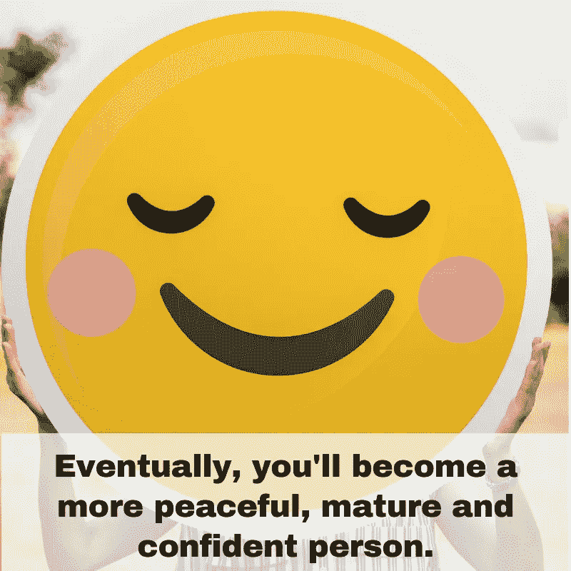

# 你是一个快乐的人，还是你的话一直在毒害你的谈话？

> 原文：<https://medium.datadriveninvestor.com/how-to-stop-complaining-dont-let-your-words-build-your-personality-e5b0b9f9c78f?source=collection_archive---------28----------------------->

如何停止消极的想法和抱怨

事实证明，我们这些经常抱怨的人很多时候脑子里都有消极的想法。这些消极的想法迫使我们经常大声说出来。但是这只会招致更多的消极。幸运的是，生活不一定是那样的！

那我们怎么会变成这样呢？抱怨的感觉并不好…是吗？

> 这里有一个类似的例子:你曾经有一周或更长时间吃得非常健康吗？你还记得你回去吃垃圾食品时的感觉吗？一开始你觉得很可怕，但是随着你不断吃垃圾食品，你又开始喜欢上它了。最终，你甚至开始渴望它。

消极的想法和抱怨很容易上瘾，但是它们可以从你的生活中去除。你可以做两件事来成功消除抱怨:

控制你的消极想法。
对你生活中不喜欢的事情负全责。

消极的想法很难消除。你需要勤奋并对自己有耐心。

这个过程会帮助你停止消极的想法和抱怨:

**1。决心改变**

在心里下定决心，你要消除生活中的消极想法。要认识到他们除了让你(和其他人)变得更好之外，什么也做不了！)心疼。

 [## 幸福的算法？-数据驱动型投资者

### 从一开始，我们就认为技术正在使我们的生活变得更好、更快、更容易和更实用。社交媒体…

www.datadriveninvestor.com](https://www.datadriveninvestor.com/2019/03/08/an-algorithm-for-happiness/) 

**2。当他们出现时认出他们，不要感情用事。**

尽快注意到你有消极的想法。在你走得更远之前停下来。如果你不停下来，你可能会开始想“我怎么了？为什么我总是这么做？”只要注意到你有消极的想法。

**3。寻找解决方案**

始终关注解决方案。如果你在想，“院子看起来很糟糕”，那就集思广益，想出一些解决方案，让你的地方看起来更好。

事实是你一次只能考虑一件事。如果你专注于解决方案，你就无法思考问题。一旦问题解决了，就没什么好消极的了。

当然，这说起来容易做起来难，但是 30 天有意识的努力足以灌输一种新的精神习惯。当你完成了 30 天，争取 31 天！不知不觉中，你的整个生活会变得更加积极。

# **承担责任**

为生活中的挑战承担责任可能看起来没有吸引力。 ***毕竟，谁愿意相信糟糕的事情是自己的错呢？*** 但是如果你相信是你创造了挑战，那么你就可以消除它。如果你责怪别人，你只是卡住了。

> **承担责任是一件非常强大的事情。这真是自由的极致。通过责任，你可以改变生活中的任何事情。**
> 
> 一般来说，你的幸福不依赖于其他人或环境。

我们都有选择。你是想因为创造了一个充满痛苦和挑战的生活而得到同情，还是想因为创造了一个精彩的生活而受到表扬？

摆脱抱怨和消极的想法需要一些努力。大多数习惯过一段时间就会上瘾。但是通过选择控制你的消极想法，你可以专注于解决问题。因此，你的生活将在许多方面得到改善。

> ***你对自己负责，你是一个快乐相处的人吗，还是你的话一直在毒害你的对话？***

你可以做出改变，做出努力，一步一步地采取行动，停止抱怨，不要被你的情绪所驱使。最终，你会成为一个更加平和、成熟和自信的人。