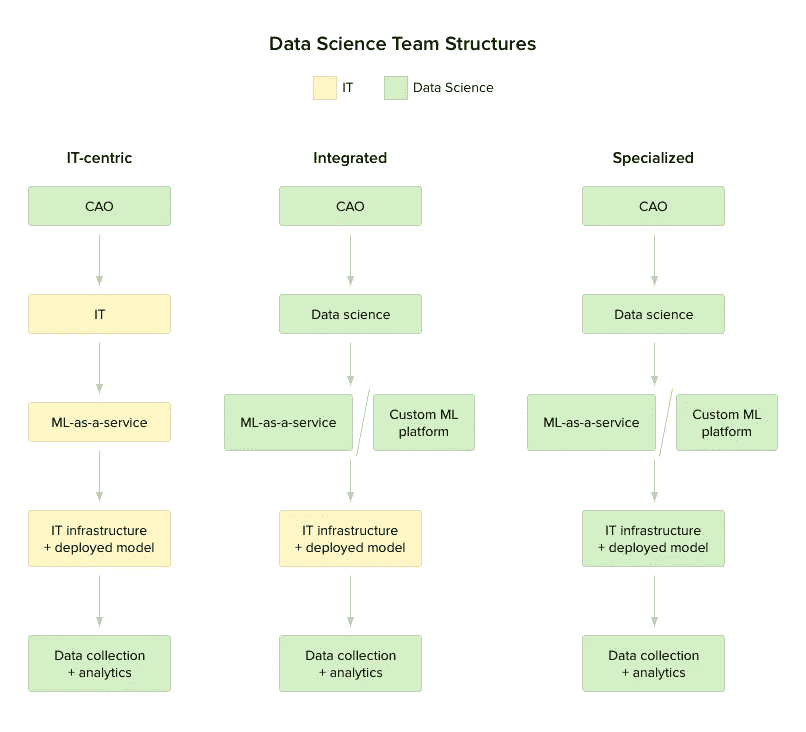
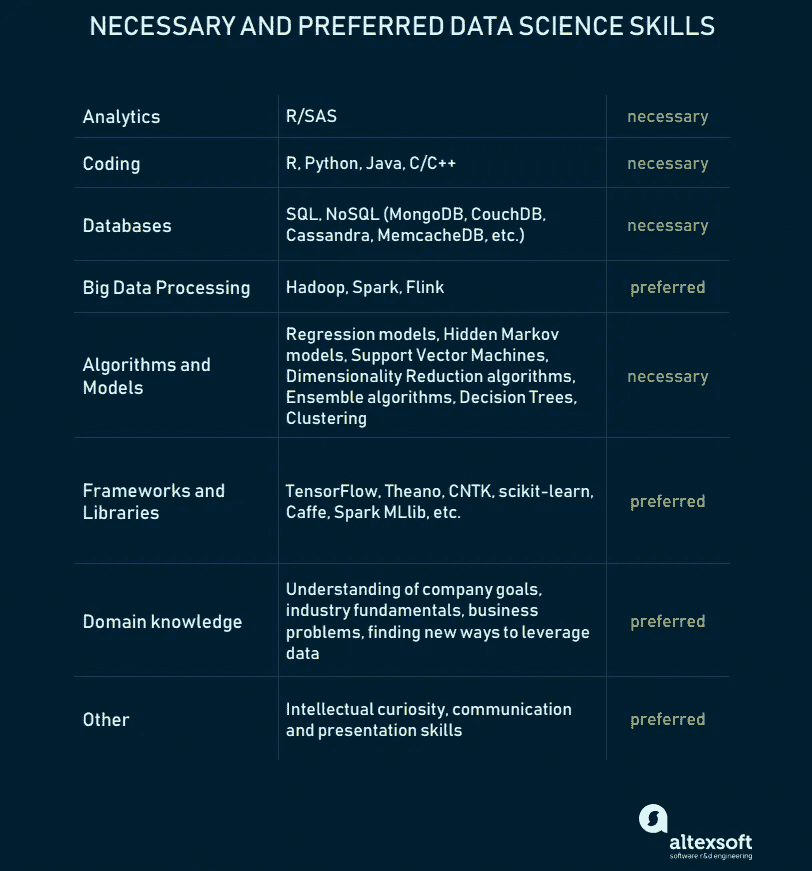
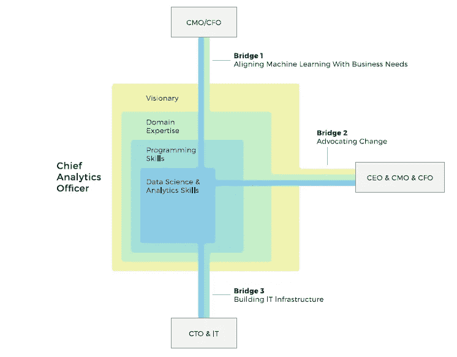
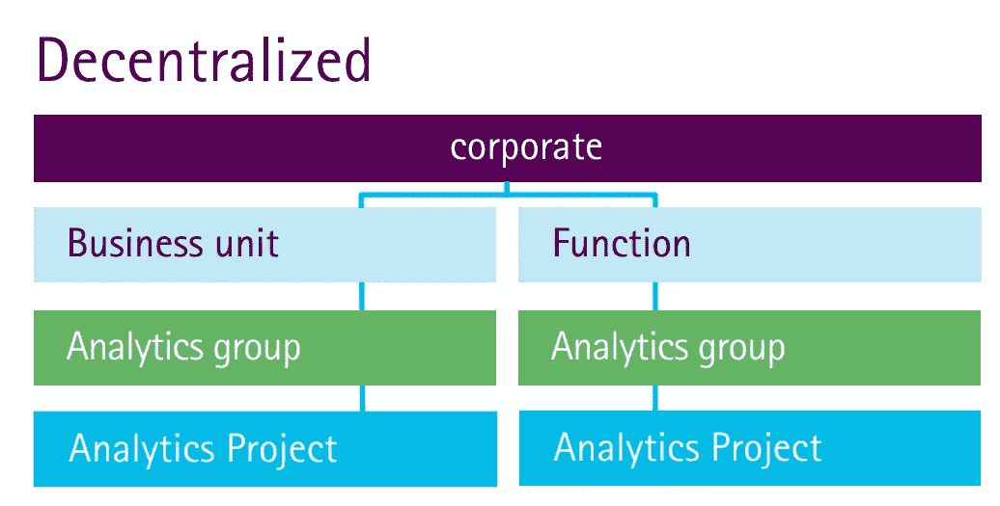
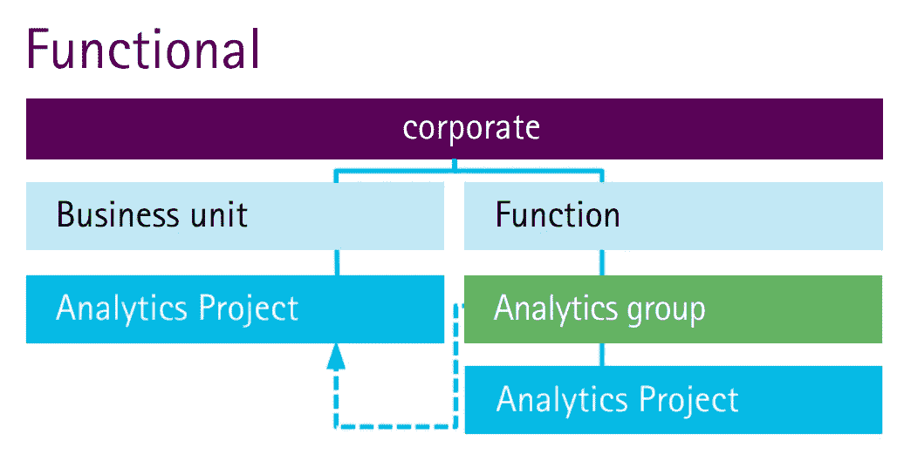
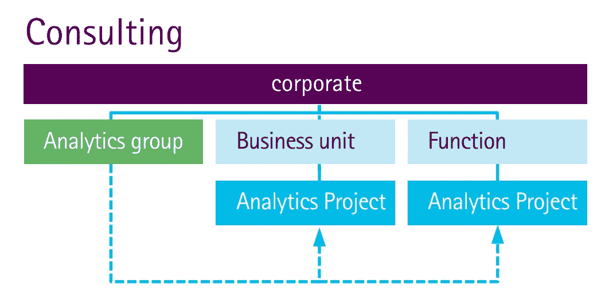
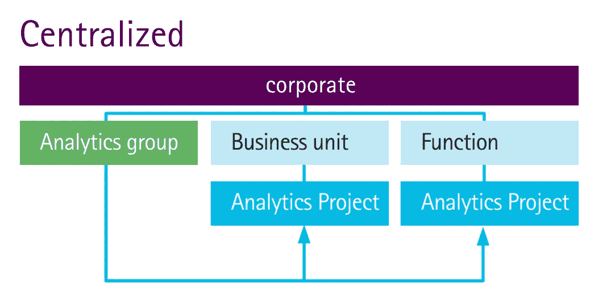
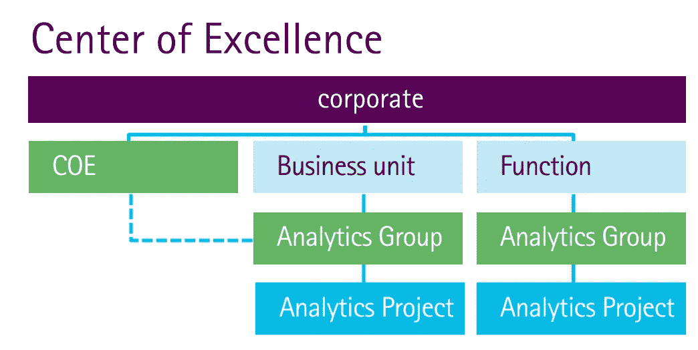
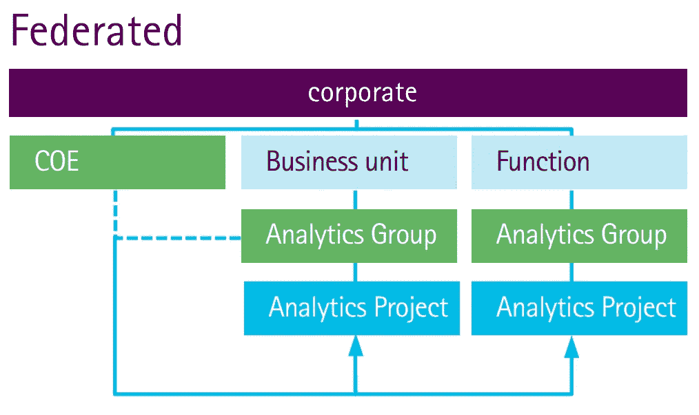

# 如何组建数据科学团队:要考虑的关键模型和角色

> 原文：<https://medium.datadriveninvestor.com/how-to-structure-a-data-science-team-key-models-and-roles-to-consider-6f00e4e32a21?source=collection_archive---------8----------------------->

如果你一直遵循数据科学和预测分析专家的意见，你可能会遇到坚定的建议，开始机器学习。正如詹姆斯·霍德森在《哈佛商业评论》中建议的那样，最明智的举措是去摘“低垂的果实”,然后在更繁重的业务中扩展专业知识。

就在最近，我们谈到了[机器学习即服务(MLaaS)平台](https://www.altexsoft.com/blog/datascience/comparing-machine-learning-as-a-service-amazon-microsoft-azure-google-cloud-ai-ibm-watson/?utm_source=MediumCom&utm_medium=referral)。从当前趋势中得出的主要结论很简单。随着机器学习逐渐成为一种商品，它对中小企业来说变得更加触手可及。领先的供应商——谷歌、亚马逊、微软和 IBM——提供 API 和平台来运行基本的 ML 操作，而无需私有基础设施和深厚的数据科学专业知识。在早期阶段，采取这种精益和节俭的方法将是最明智的举措。随着分析能力的扩展，可以重塑团队结构，以提高运营速度并扩展分析库。

如何实现这种增量方法？这次我们讨论数据科学团队结构及其复杂性。

# 数据科学团队结构

从事数据科学和预测分析需要清楚地了解如何引入、维护和进一步扩展团队结构。我们建议考虑三种基本的团队结构，以匹配机器学习采用的不同阶段。

## 以信息技术为中心的结构

有时，雇用数据科学家不是一个选项，你必须利用内部已经有的人才。主要的分析和领导角色是“业务翻译”，通常被称为首席分析官(CAO)或首席数据官(CDO)。后一个术语逐渐变得多余，因为大多数数据处理都被改造为预测分析。这个人应该有能力领导这个计划。我们将更详细地看看下面的位置。

所有其他的工作——数据准备、培训模型、创建用户界面以及企业 IT 基础设施中的模型部署——都可以在很大程度上由 IT 部门管理(如果您的组织实际上有一个功能齐全的内部 IT 部门的话)。这种方法相当有限，但可以通过使用 MLaaS 解决方案来实现。像 Azure Machine Learning 或 Amazon Machine Learning 这样的环境已经配备了可接近的用户界面来清理数据集、训练模型、评估模型和部署。

例如，Azure Machine Learning 为其用户提供详细的文档，以降低入门门槛。这允许快速训练和早期部署模型，即使没有专家数据科学家在船上。

另一方面，MLaaS 解决方案在机器学习方法和成本方面存在局限性。从数据清理到模型评估，所有操作都有各自的价格。考虑到训练一个有效模型的迭代次数无法提前估计，使用 MLaaS 平台会带来一些预算不确定性。

以 IT 为中心的结构的优点:

*   利用现有 IT 资源进行新投资
*   计算基础设施由外部服务提供和维护
*   内部专家可以接受培训，以进一步实现预测分析的潜力
*   由于所有操作都在 IT 部门内部进行，因此减少了跨孤岛管理
*   缩短需要一个或几个模型的相对简单的机器学习任务的上市时间

以 IT 为中心的结构的缺点:

*   这些服务提供的有限的机器学习方法和数据清理程序
*   应该为模型训练、测试和预测付费。这带来了每次预测的最终成本的不确定性，因为所需的迭代次数无法提前估计

## 集成结构

借助集成结构，数据科学团队专注于数据集准备和模型培训，而 IT 专家则负责支持已部署模型的接口和基础架构。将机器学习专业知识与 IT 资源相结合是持续和可扩展的机器学习操作的最可行的选择。

与以 IT 为中心的方法不同，集成方法要求团队中有一名经验丰富的数据科学家，并事先进行精心的招聘工作。这确保了在可用技术方面更好的操作灵活性。除了端到端但有限的服务，你还可以利用更深入的[机器学习工具和库](https://www.altexsoft.com/blog/datascience/choosing-an-open-source-machine-learning-framework-tensorflow-theano-torch-scikit-learn-caffe/?utm_source=MediumCom&utm_medium=referral)——像[张量流](https://www.tensorflow.org/)或[Theano](http://deeplearning.net/software/theano/)——这些工具和库是为具有数据科学背景的研究人员和专家设计的。通过这种工作分配，您可以解决高度具体的业务问题，并在“即服务”和定制的 ML 解决方案之间进行选择。

集成结构的优点:

*   利用现有的 IT 资源和投资
*   数据科学家专注于创新
*   充分利用“即服务”和定制 ML 应用程序的潜力
*   从一两个数据科学家开始，然后培训更多本土专家
*   使用可产生更好或更广泛预测的自定义模型组合(集合模型)

集成结构的缺点:

*   在使用定制 ML 的情况下，需要计算基础设施
*   跨孤岛管理需要相当大的努力
*   在数据科学人才获取方面的重大投资
*   数据科学人才参与和保留的挑战

## 专业数据科学系

为了减少管理工作并建立一个包罗万象的机器学习框架，您可以在一个独立的数据科学部门内运行整个机器学习工作流程。这种方法需要最高的成本。所有的操作，从数据清理、模型训练到构建前端接口，都是由专门的数据科学团队来实现的。这不一定意味着所有团队成员都应该具有数据科学背景，但他们应该获得技术基础架构和服务管理技能。

专门的结构模型有助于解决复杂的数据科学任务，包括研究、针对决策制定的各个方面定制的多个 ML 模型的使用或多个 ML 支持的服务。在大型组织的情况下，专门的数据科学团队可以补充不同的业务部门，并在其分析兴趣的特定领域内运营。

大多数成功的人工智能驱动的公司都有专门的数据科学团队。显然，由于是为特定任务定制和连接的，它们都非常不同。Airbnb 数据科学的团队结构是最有趣的团队结构之一。你可以观看 Airbnb 的数据科学家 Martin Daniel 的精彩演讲，以更深入地了解该公司如何建立其文化，或者阅读前 ds 负责人的博客文章，简而言之，以下是他们应用的主要原则:

**实验**。使用已建立的学习-计划-测试-测量过程，找到将数据放入新项目的方法。

使数据民主化。将您的数据科学团队扩展到整个公司甚至客户。

**测量冲击**。评估 DS 团队在您的决策过程中发挥的作用，并给予他们信任。

专业数据科学部门的优势:

*   集中式数据科学管理和增强的问题解决能力
*   实现“即服务”和定制 ML 应用程序的全部潜力
*   解决需要深入研究的复杂预测问题，或者建立分段的模型工厂(跨不同的部门和业务单位自动运行)
*   建立一个功能全面的数据科学平台来促进创新
*   更大的可扩展性潜力

专业数据科学部门的缺点:

*   构建和维护复杂的计算基础设施
*   在数据科学人才获取方面投入巨资
*   数据科学人才参与和保留的挑战

*Enterprise IT involvement changes depending on the team structure you choose*

不管你选择什么样的结构来建立数据科学团队，拥有合适的人才是至关重要的。你应该寻找哪些人？

**数据科学团队角色**

我们来谈谈数据科学家的技能。不幸的是，*数据科学家*这个术语在最近几年扩大了，变得太模糊了。在数据科学出现在商业聚光灯下之后，关于数据科学家的技能组合还没有形成共识。数据科学家和 KDNuggets 的副主编 Matthew Mayo，[认为](http://www.kdnuggets.com/2016/05/10-must-have-skills-data-scientist.html):*当我听到数据科学家***这个术语时，我往往会想到独角兽，以及它所包含的一切，然后记住它们并不存在，实际上数据科学家在组织中扮演着许多不同的角色，具有不同的业务、技术、人际交往、沟通和领域技能水平。*”*

*这是真的。很难找到独角兽，但有可能从数据科学领域具有利基专长的人那里培育出独角兽。我们 AltexSoft 在招聘[机器学习专家](https://www.altexsoft.com/machine-learning/?utm_source=MediumCom&utm_medium=referral)时会考虑这些数据科学技能:*

**

**Skillset of a data scientist**

*正如您将在下面看到的，在数据科学生态系统中有许多角色，并且网络上提供了许多分类。我们将与你分享由 Stitch Fix 的 Michael Hochster 提供的[。迈克尔定义了两类数据科学家:A 型和 b 型。](https://www.quora.com/What-is-data-science/answer/Michael-Hochster)*

***A 型代表分析**。这个人是一个统计学家，他不需要很强的编程知识就能理解数据。A 型数据科学家执行数据清理、预测、建模、可视化等工作。*

***B 型代表建筑。这些人在生产中使用数据。他们是优秀的软件工程师，有一些统计背景，构建推荐系统、个性化用例等。***

*很少有一个专家属于一个类别。但是理解这两个数据科学功能可以帮助您理解我们进一步描述的角色。*

*请记住，即使拥有这种假设技能的专业人士通常也有他们的核心优势，在团队中分配角色时应该考虑这些优势。在大多数情况下，获得人才需要根据他们的背景进行进一步的培训。*

*但是人和他们的角色是两回事。例如，如果您的团队模型是集成模型，那么一个人可能会组合多个角色。所以，让我们忽略你可能有多少真正的专家，并概述他们自己的角色。显然，跨角色的许多技能组合可能会交叉。*

***首席分析官/首席数据官。**在我们关于机器学习的[白皮书](https://www.altexsoft.com/whitepapers/machine-learning-bridging-between-business-and-data-science/?utm_source=MediumCom&utm_medium=referral)中，我们广泛讨论了这个关键的领导角色。曹是一名“业务翻译”，他在数据科学和领域专业知识之间架起了一座桥梁，既有远见，又是技术领导者。你可以通过看下面的图像得到一个更好的想法。*

*首选技能:*数据科学和分析、编程技能、领域专业知识、领导力和远见卓识**

**

**Role of a Chief Analytics Officer**

***数据分析师。**数据分析师角色意味着适当的数据收集和解释活动。分析师确保收集的数据是相关的和详尽的，同时还要解释分析结果。一些公司，如 IBM 或惠普，也要求数据分析师具备可视化技能，通过图形将疏远的数字转化为切实的见解。*

*首选技能: *R，Python，JavaScript，C/C++，SQL**

***商业分析师。**一个业务分析师基本实现一个 CAO 的功能，但是在操作层面。这意味着将业务预期转化为数据分析。如果您的核心数据科学家缺乏领域专业知识，那么业务分析师可以弥合这一鸿沟。*

*首选技能:*数据可视化、商业智能、SQL**

***数据科学家**(不是数据科学*独角兽* ) **。**数据科学家是做什么的？假设你不是在猎取独角兽，数据科学家是使用机器学习和数据挖掘技术解决业务任务的人。如果这太模糊，可以通过进一步的模型训练和评估将角色缩小到数据准备和清理。*

*首选技能: *R，SAS，Python，Matlab，SQL，noSQL，Hive，Pig，Hadoop，Spark**

*为了避免混淆，并使对数据科学家的搜索不那么势不可挡，他们的工作通常分为两个角色:机器学习工程师和数据记者。*

*一个**机器学习工程师**通过确定使用哪个模型以及每个模型应该使用什么数据来结合软件工程和建模技能。概率和统计也是他们的强项。训练、监控和维护模型的一切都是 ML 工程师的工作。*

*首选技能: *R，Python，Scala，Julia，Java**

*数据记者通过将数据放在恰当的环境中，帮助理解数据输出。他们还负责阐明业务问题，并将分析结果转化为引人注目的故事。虽然要求他们有编码和统计经验，但是他们应该能够向涉众提出想法，并代表数据团队与那些不熟悉统计的人打交道。*

*首选技能: *SQL，Python，R，Scala，Carto，D3，QGIS，Tableau**

***数据架构师。**这个角色对于处理大量数据(你猜对了，大数据)至关重要。但是，如果您不仅仅依赖 MLaaS 云平台，这个角色对于存储数据、定义数据库架构、集中数据以及确保不同来源之间的完整性至关重要。对于大型分布式系统和大数据集，架构师还负责性能。*

*首选技能: *SQL，noSQL，XML，Hive，Pig，Hadoop，Spark**

***数据工程师。**工程师实现、测试和维护数据架构师设计的基础设施组件。实际上，工程师的角色和建筑师的角色可以结合在一个人身上。技能组合非常接近。*

*首选技能: *SQL、noSQL、Hive、Pig、Matlab、SAS、Python、Java、Ruby、C++、Perl**

***应用/数据可视化工程师。**基本上，这个角色只对专门的数据科学模型是必要的。在其他情况下，软件工程师来自 IT 部门，在最终用户面对的应用程序中交付数据科学成果。很有可能来自前端单元的应用程序工程师或其他开发人员将监督最终用户数据可视化。*

*首选技能:*编程、JavaScript(用于可视化)、SQL、noSQL**

# *团队组装和扩展*

*数据科学人才获取的最初挑战，除了专家整体稀缺之外，就是高薪酬预期。根据 2017 年 [O'Reilly 数据科学薪酬调查](https://www.oreilly.com/data/free/2017-data-science-salary-survey.csp)，年基本工资中位数为 9 万美元，而在美国，这一数字达到 11.2 万美元(比去年增长 6.5%)。这些数字会因地理位置、特定技术技能、组织规模、性别、行业和教育程度的不同而有显著差异。如果你决定[雇用熟练的分析专家](https://www.altexsoft.com/blog/business/how-to-choose-data-science-and-ai-consulting-company/?utm_source=MediumCom&utm_medium=referral)，进一步的挑战还包括参与和保留。*

*求知欲与高需求相结合，挑战着组织让数据科学家参与创造性和探索性项目。由于这些原因，*以 IT 为中心的团队结构*——利用现有资源——在机器学习采用的初始阶段是一个有前途的替代方案。因此，工程师可以通过界面友好的 ML 即服务解决方案获得一些分析技能。*

*解决人才稀缺和预算限制的另一种方法是开发易于接近的机器学习平台，欢迎 IT 领域的新人，并实现进一步的扩展。即使没有经验丰富的数据科学家，一些组织也可以通过与教育机构建立关系来绕过这一障碍。在美国，大约有十几个强调数据科学的博士项目和许多为期 12 个月左右的训练营。*

# *如何将数据科学团队融入您的公司*

*之前，我们介绍了三种结构类型，其中两种假设 DS 团队是通过将您现有的工程成果与数据科学相结合而创建的。第三种专门化的方法需要一些更复杂的东西，比如创建一个需要组织、控制、监视和管理的全新部门。这种巨大的组织转变表明，一个新的团队应该有既定的角色和职责——所有这些都与其他项目和设施相关。那么，如何整合你公司的数据科学家呢？*

*根据埃森哲的分类，组建数据科学团队有六种选择:*

***1。分散式**。这是最不协调的选项，其中分析工作在整个组织中零星使用，资源在每个小组的职能部门内分配。当数据科学专业知识有机地出现在公司中时，这种情况经常发生，这通常会导致孤岛式竞争、缺乏分析标准化以及分散式报告。*

**

**Decentralized implementation.
Image source: here and further Accenture**

***2。功能性**。在这里，大多数分析专家在一个与分析最相关的部门工作:通常是营销或供应链。这种选择也很少或根本不需要协调，并且专业知识不能在企业范围内战略性地使用。*

**

**Functional implementation**

***3。咨询**。在这种结构中，分析人员作为一个小组一起工作，但他们在组织中的角色是咨询，这意味着不同的部门可以“雇用”他们完成特定的任务。当然，这意味着几乎没有资源分配——要么有专家，要么没有。*

**

**Consulting implementation**

***4。集中式**。这种结构最终允许您在战略任务中使用分析，即一个数据科学团队在各种项目中为整个组织服务。它不仅为 DS 团队提供长期资金和更好的资源管理，还鼓励职业发展。这里唯一的陷阱是将分析功能转化为支持功能的危险。*

**

**Centralized implementation**

***5。卓越中心**。如果您选择此选项，您仍将保持单个公司中心的集中方法，但数据科学家将被分配到组织中的不同部门。这是最平衡的结构——分析活动高度协调，但专家不会从业务部门中撤出。*

**

**Center of Excellence implementation**

***6。联合**。当整个公司对分析人才的需求很高时，这种模式很有意义。在这里，您雇佣了一个 SWAT 团队，这是一个从一个中心点工作并解决复杂的跨职能任务的分析小组。其余的数据科学家分布在卓越中心模型中。*

**

**Federated implementation**

*请记住，您的模型可能会根据您的业务需求而变化和发展:虽然今天您可能满足于数据科学家居住在他们的职能部门，但明天卓越中心可能会成为一种必然。*

# *关于创建高性能数据科学团队的更多建议*

***花更少的时间为每个职位招聘人员**，专注于了解一个数据专家可以扮演什么角色。对于创业公司和更小的组织来说，责任不必严格明确。*

***促进跨职能合作**。设计师、营销人员、[产品经理](https://www.altexsoft.com/blog/business/product-management-main-stages-and-product-manager-role/?utm_source=MediumCom&utm_medium=referral)和工程师都需要与 DS 团队紧密合作。*

***练习嵌入**。正如我们上面提到的，招募和留住数据科学人才需要一些额外的活动。其中之一是*嵌入*——将数据科学家安排到以业务为中心的部门工作，让他们集中报告，更好地合作，并帮助他们感觉自己是大局的一部分。*

***雇佣团队前建立团队环境**。这意味着你的产品经理应该意识到数据和软件产品之间的差异，有足够的期望，并解决可交付成果和期限的差异。项目经理需要有足够的技术知识来理解这些特性。或者，你可以开始寻找可以立即履行这一职责的数据科学家。*

# *需要注意的重要事情*

*如果你问 AltexSoft 的数据科学专家，各行业的 AI/ML 现状如何，他们可能会指出两个主要问题:1。企业高管仍然需要确信 ML 投资的合理投资回报率是存在的。2.如果他们确信并理解价值主张和市场需求，他们可能缺乏技术技能和资源来实现产品。*

*这些障碍主要是由于组织中的数字文化。高效的数据流程挑战 C 级高管接受横向决策。能够访问分析的一线经理有更多的运营自由来[做出数据驱动的决策](https://www.altexsoft.com/blog/business/transform-decision-making-with-a-data-driven-culture/)，而高层管理人员监督战略。这减少了管理工作，并最终减轻了“直觉决策”的风险。基本上，文化转变决定了建立数据驱动型企业的最终成功。正如[麦肯锡所说](http://www.mckinsey.com/business-functions/digital-mckinsey/our-insights/digital-transformation-the-three-steps-to-success)，建立一种文化可能是最难的部分，而其余的是可以管理的。*

**原载于 AltexSoft Tech 博客**[***如何构建数据科学团队:要考虑的关键模型和角色***](https://www.altexsoft.com/blog/datascience/how-to-structure-data-science-team-key-models-and-roles/?utm_source=MediumCom&utm_medium=referral)**