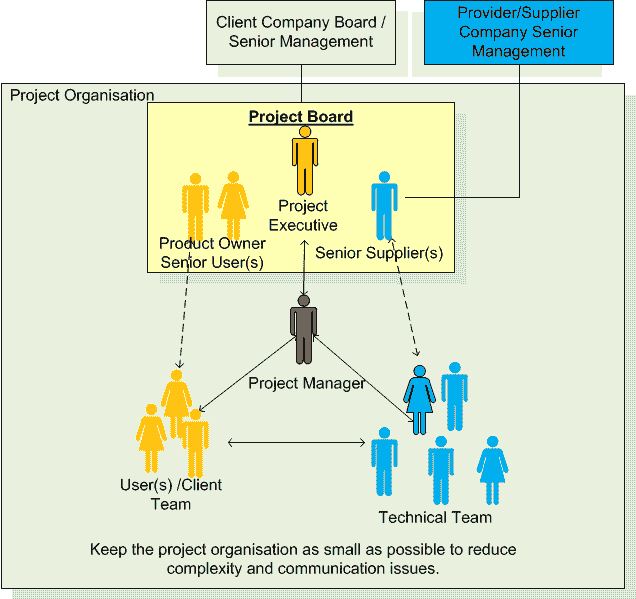
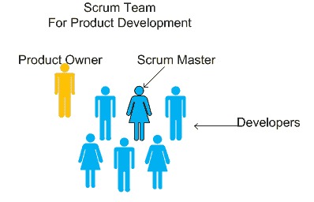

# 如何为您的项目成功构建角色和职责

> 原文：<https://medium.datadriveninvestor.com/how-to-structure-roles-and-responsibilities-for-your-project-success-3ab952db3510?source=collection_archive---------3----------------------->

© Maarten van den Heuvel

任何项目的成功都需要每个团队成员负起责任。与任何公司一样，个人需要扮演他们有资格扮演的角色。我非常相信使用定义明确的角色和职责，因为这有助于涵盖项目成功所需进行的所有活动。

当你没有明确的角色和职责时会发生什么？任何时候缺乏明确性，人们都会浪费精力去处理无关紧要的事情。他们为不重要的事情争吵，无法专注于重要的工作，错失机会。正因为如此，一些工作被遗漏了，因为没有人对此负责。没有明确定义的角色会导致工作重复、交付延迟，甚至项目失败。

 [## 想知道领导是谁？请他决定。数据驱动的投资者

### 一个有效的领导者能为组织提供的最有价值的东西之一是决策能力…

www.datadriveninvestor.com](https://www.datadriveninvestor.com/2019/01/25/want-to-know-who-the-leader-is-ask-him-to-decide/) 

相反，格式良好的角色描述有几个有用的功能。他们帮助人们准确地理解在特定的角色中对他们的期望，并给他们明确的目标感。员工知道哪些角色(人)会做他们所依赖的工作。良好的角色描述增加了团队或组织的灵活性，因为一个人可以担任多个角色，或者一个角色可以分配给多个人员，这取决于每个单独项目的复杂性和规模。

# **让你的生活变得简单，给每个人分配合适的角色**

定义角色和职责，并为每个角色分配合适的人员，然后他们的精力就可以用于完成需要完成的工作。

## **基于 PRINCE2 方法的项目组织中可能涉及的角色示例**

## **Scrum 组织的例子**

重要的是，不同的利益集团在项目组织中得到适当的代表。在项目组织中拥有合适的人员是有效项目管理和以经济有效的方式交付项目产出的必要条件。

# **项目板**

项目委员会由项目主管、产品负责人/高级用户和高级供应商组成，作为一个群体和个人，他们必须具备以下特征:

*   权威
*   可靠性
*   委派的能力
*   有效性

项目委员会必须积极参与项目并给予指导；这是在[指导项目](http://www.donlowe.org/project-management/seven-core-processes/directing-a-project-and-the-project-board-responsibilities/)的核心流程中构建的。

## **项目执行角色**

项目主管代表商业利益，并对商业成功负有最终责任。您可以为一个人分配多个角色。例如，在适当的情况下，一个人可以同时担任项目执行官和产品所有者的角色。

当项目是一个计划的一部分时，项目经理也可能是计划委员会的一部分。在较小的项目中，项目主管(或高级责任所有者(SRO))也可以扮演项目主管的角色。

## **产品负责人/高级用户角色**

产品负责人应该来自将使用项目最终产品的业务/组织部门。在理想的情况下，产品负责人将在项目组织需要的时候出现。在现实世界中，产品负责人往往还有其他职责，在这种情况下，一个合适的副手能够代表产品负责人就很重要了。

在项目设置中，产品负责人也将是一个合适的业务变革经理(BCM)或业务变革团队的成员。在项目背景下，产品负责人有责任在项目开始时和项目期间识别和定义收益，然后跟踪项目后成果的实现和收益的实现。

## **高级供应商角色**

代表供应商组织的利益，确保供应商为项目提供合适的资源。

## **项目经理角色**

项目经理代表项目委员会负责项目的日常管理。项目经理必须确保项目具有可行的业务案例，并且项目的输出将交付业务(产品所有者)所需的功能。

项目经理必须促进生产团队的工作，帮助消除限制并确保沟通顺畅。一旦与生产团队就工作包达成一致，让生产团队制定出他们如何在商定的公差范围内交付。必要时，随时准备帮助团队成员。

## **业务分析师角色**

在较小的项目中，业务分析师的角色可以主要由项目经理来承担。将一个人分配到业务分析师的角色变得越来越普遍。业务分析师向项目经理报告，并负责确保项目交付业务价值。

## **技术团队领导角色(Scrum Master)**

技术团队领导对生产团队中的所有团队成员负责，这将包括在需要时与生产团队一起工作的用户。对于那些喜欢使用 scrum 的人来说，我把技术团队领导等同于 scrum 大师。

## **用户角色**

没有最终用户参与的项目并不少见，尤其是在软件行业。经验表明，让最终用户参与新产品的开发有明显的优势，他们将在商业环境中工作。

*最初发表于*[*【http://www.donlowe.org】*](http://www.donlowe.org/effective-project-management/how-to-structure-your-project-organisation-for-success/)*。*

> ***需要一个可靠的软件伙伴？*** [***触点为字节***](https://forbytes.com/contact/)

# 阅读更多信息:

 [## 项目成功的完美软件需求:教程

### 每个首席执行官或负责软件项目的人都需要一个强大的开发团队，他们可以信任这个团队来交付…

medium.com](https://medium.com/datadriveninvestor/the-perfect-software-requirements-to-succeed-in-your-project-tutorial-276e36cac0f8)  [## 确定产品分解结构的两个步骤

### 你是否曾经开始一个项目，对未来充满热情，并确信你有最好的产品或想法…

medium.com](https://medium.com/@donlowe/two-steps-to-nail-a-product-breakdown-structure-22dda3b3575e)  [## 如何使用项目组合管理来控制软件开发

### 在许多情况下，处理软件开发的企业会面临管理问题。的…

medium.com](https://medium.com/@donlowe/how-to-use-portfolio-management-to-control-software-development-91b8efe90775)