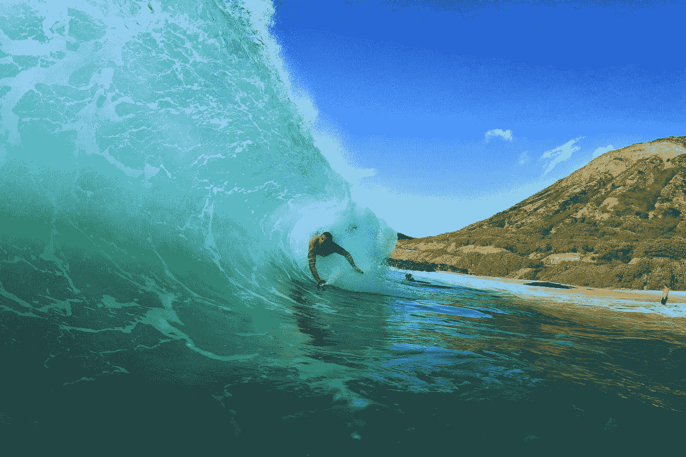

# 如何成功

> 原文：<https://medium.datadriveninvestor.com/how-to-succeed-7d73c59cdeb?source=collection_archive---------10----------------------->

## 成功。成功。成功。我怎样才能获得成功？成功的谜题不是寻找成功。

Photo by [Drew Farwell](https://unsplash.com/@outdoor_junkiez?utm_source=medium&utm_medium=referral) on [Unsplash](https://unsplash.com?utm_source=medium&utm_medium=referral)

除了我前面的轮子，我什么也看不见。水喷在我的脸上，打在我的眼睛上，我在离家 1000 英里的海上漂浮。这是我第一次真正为自己的生命感到害怕。

如果我放开小船，我就会掉进黑暗的海洋里，再也找不到了。如果我滑入海浪中，海浪冲击着我，像建筑物一样大，没有人会找到我。这是一个没有月亮的夜晚。肾上腺素清洗我的想法了一会儿，白色的泡沫和呼啸的风从我身边冲过。如果我放开方向盘，我会怎么样？我会死吗？有人会记得我吗？我妈妈会知道我被鲨鱼撕成碎片吗？

 [## 数据驱动的投资者

### 事实上，在各行各业，数据的大规模激增正在改变我们感知世界的方式。而且只有…

go.datadriveninvestor.com](http://go.datadriveninvestor.com/youtube) 

在经历了几分钟彻底的恐惧后，我深呼吸了几下。

一— *呼吸，神圣的狗屎，好吧。我给自己惹了什么麻烦？*

二— *呼吸，你以前感受过恐惧。你知道该怎么做。*

深呼吸，你能做到。你能做到的。你能行的。

我停下来，看着黑色的天空。突然，恐惧变成了兴奋。为动力干杯。恐惧改变了方向，感觉像是一种挑战。为了生存。为了生存。为了成功。我记得我选了这个。我选择航行 500 英里穿越加勒比海。我选择去面对我的恐惧，去探索，去做一些我从未做过的事情。

我选择去航海，因为我想成长。

# 你是如何成功的？

你面对你最大的恐惧——每天做最好的自己。

你知道从生理上来说，恐惧和兴奋的感觉是完全一样的吗？

你的身体真的分辨不出来。

是的，当你真的很兴奋，或者准备在死亡的门口窒息时，你的心率会加快，手心会出汗，你的战斗或逃跑反应会出现，一切都是一样的。

你知道可以练习如何应对战斗或逃跑反应吗？

> 毫无疑问，恐惧根植于我们的 DNA。

我们的工作是练习迎接挑战，而不是屈服于怀疑。

你会带着兴奋、微笑和团队精神去迎接挑战吗？你会用准备、勇气和毅力战胜这场斗争，还是会让恐惧获胜？

自我怀疑会打败你吗？你会和鲨鱼一起游泳吗？

如果你能每天回答这些问题，你将学会如何成功。

# 成功。成功。成功。

我们为什么要探索？为什么我们要面对恐惧？我们为什么会成为某种东西？为什么有些人更聪明，更快，或者更好看？有些生意更成功？一些人更酷，更聪明，或者赢得更多？

为什么有些人过着他们梦想的生活，而有些人却畏缩不前？

让我告诉你我的生活——我什么也不是。我害怕变成我想要的样子。我是一个被告知永远不会变坏的孩子。有人告诉我，我永远不可能成为一名 NBA 球员。甲级大学运动员。全美运动员。

没有人相信我会成功。

但是我从小就从我父亲那里学到了一些东西。你写你自己的故事。你选择每天尽你最大的努力做出你的杰作。你每天都尽最大努力，你会很特别。

这就是成功。