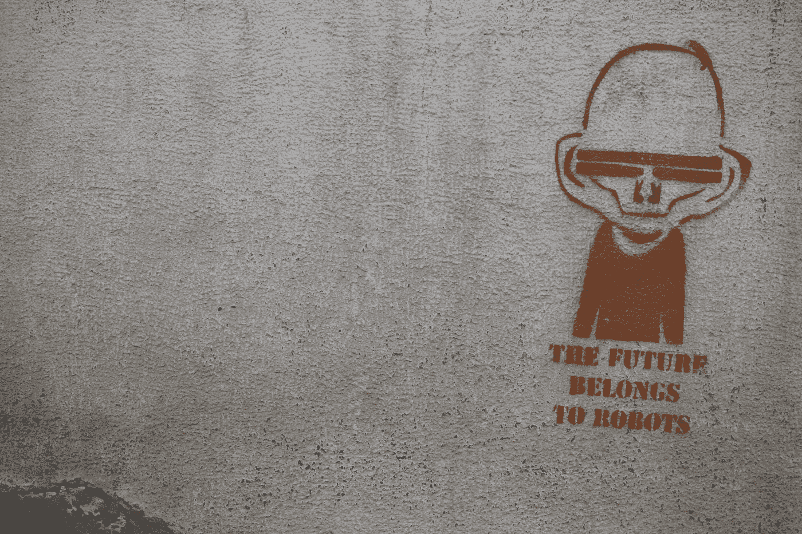

# 如何在未来生存…

> 原文：<https://medium.datadriveninvestor.com/how-to-survive-the-future-d4efc753c853?source=collection_archive---------34----------------------->

Photo by [Marija Zaric](https://unsplash.com/@simplicity?utm_source=medium&utm_medium=referral) on [Unsplash](https://unsplash.com?utm_source=medium&utm_medium=referral)

如果上学对许多人来说是一种昂贵的时间浪费，那么我们需要什么技能来为 21 世纪及以后做好准备呢？答案是:我们不知道——不准确。这完全取决于未来会发生什么。60 年代、70 年代和 80 年代的科幻小说会被证明是真的吗？我们都将勇敢地去前人没有去过的地方吗？还是对抗天网控制的机器人为生存而战？

我是看着《星球大战》、《星际迷航》、《太空 1999》、布莱克的《7》和《巴克·罗杰斯》长大的，看着艾萨克·阿西莫夫、菲利普·K·迪克和罗伯特·海因莱茵的科幻小说长大的，我梦想着去参观令人惊叹的新世界，以及未来的科技。现在我 48 岁了，未来(至少对我来说)已经到来。没有运输机，没有光剑，没有受机器人三定律控制的机器人，没有穿越太空的隧道，也没有星舰部队(至少现在没有)。

但是，尽管这一切都没有发生，世界已经发生了巨大的变化。我们现在有可以装进口袋的电脑，一些人自己进行生物黑客攻击，我们有可以自动驾驶的汽车，送货无人机是一种真正的可能性，我可以通过要求语音激活设备为我找到大量信息，这些信息比任何一系列百科全书都多。我成长的世界已经过去了。

但是尽管发生了所有这些变化，我所接受的教育与我的父母或我的祖父母所接受的教育相比并没有太大的变化——根本没有变化。

我们被教读、写、做算术，学习地理、历史、物理、化学、生物、古代和现代外语、设计和技术、艺术和设计、音乐、体育(包括游泳)计算、公民身份、性和关系教育。

这么多的信息，这么多要学的东西，这么多的东西在意图上这么有价值。目标是:

> “体现严谨性和高标准，并在学校教授的内容中创造一致性，确保所有儿童都学到关键学科的基本知识，超越核心内容，让教师有更大的自由来利用他们的专业精神和专业知识，帮助所有儿童实现他们的潜力。”
> 
> 国家课程(英国)

但问题是，我们学习知识，我们的大脑充满了我们在未来可能会或可能不会使用的信息，这都是“以防万一……”当我们需要的大多数知识是“及时……”我们需要学习的不是事实和统计数据，而是在任何可能的未来世界中生存的技能(我不是说为世界末日做准备，你应该已经有自己的僵尸末日计划了)。

那么我们需要什么样的关键技能呢？学校里应该教什么是经得起未来考验的！知道亨利八世有六个妻子有助于我们处理自己的关系问题吗？(斩首不是一个选项的人！)了解《罗密欧与朱丽叶》中劳伦斯修士的性格缺陷是否能让我们对身边的人产生共鸣？(向你的人民提供毒品，这样他们就可以避免结婚，这可能是非法的)。

我已经获得的帮助我度过人生的许多技能是我从学校开始发现的，通过反复试验，通过犯(昂贵的)错误，通过支付额外的辅导和阅读书籍。对你们中的许多人来说，这可能是一样的。让我们面对现实吧，作为一个成年人是很难的。

这需要很多思考，但这里是我列出的每个人都需要在学校学习的关键技能的清单。我确信还有更多的因素可以包括在内，但这些技能的关键是，它们使我们能够生存足够长的时间，以获取我们在我们选择的领域取得成功所需的信息。

1.  如何阅读——我们一生中获得的许多知识都是阅读书面文字的结果。书籍、博客、包装背面的说明、方向、警告和一大堆其他东西。没有这种技能，我们就无法做到最好。
2.  如何写作——我不是指能够完成一部为你赢得普利策奖的杰作，而是简单地通过能够构造一个句子，将你的意思准确地传达给接受它的人。书面表达的运用可以带你走得很远(比如看看一个好的文案赚多少钱)。
3.  如何在公共场合演讲——站在别人面前传达一个想法、一条信息或一个愿景是很可怕的——然而在我们生活中的某个时刻，我们所有人都必须在别人面前展示自己，好好表现才能抓住机会。
4.  如何理解偏见和研究答案——如果我们不再需要因为使用谷歌或维基百科而让我们的大脑充满信息，我们需要知道如何过滤信息，如何真正地研究答案。以确保我们不会成为假新闻和胡说八道的牺牲品。
5.  基础算术——我们真的需要学习如何解复杂的二次方程吗？不，但是我们确实需要能够在脑子里或者用铅笔计算东西，特别是当你的手机没电的时候。我也鼓励在这方面使用简单的代数——它非常适合解决问题，并且只使用了四种基本运算。让我们面对现实吧，学习如何使用电子表格会让我们出于某种目的从事更复杂的数学。
6.  资金管理——我们做的大部分数学都是基于资金的，然而我们并没有真正学到资金管理的一些关键要素。从来没有人教我如何合理预算，如何判断债务风险，以及这样做是否合适。如何获得抵押贷款并知道它是否适合我，以及如何填写我的纳税申报表！如果你有多余的钱，你知道如何投资，如何让它为你工作，如何确保你了解投资的风险和回报吗？
7.  体育——我指的不仅仅是学习玩游戏，而是如何照顾自己的身体以确保健康，养成锻炼和饮食的好习惯。对我来说，这应该是每天的事——孩子们朝着他们自己的健康目标努力。这些习惯帮助我们度过一生，并减轻健康服务的负担(投资这里是对未来的投资)。
8.  发现你的目标并设定目标——没有人知道他们想成为什么样的人，真的没有，问题的一部分是狭隘地关注学术成就，但我们都有梦想，如果我们学会为实现这些梦想设定目标，那么就学会设定目标的技巧。如果梦想改变了也没关系，你现在知道如何到达那里。(只是不要把自己局限在聪明的目标上)。
9.  时间管理——如何集中和利用你的时间去完成你想完成的事情。时间比金钱更有价值——一旦失去，就再也找不回来了。
10.  情商——如何同情和理解自己和他人——让我们面对它吧，我们都必须与他人打交道，为了有效地做到这一点，我们需要理解情绪，并以积极的方式利用它们。我们也需要学习如何处理他人的情绪。情商帮助你应对孤独，学会寻求帮助，学会真诚道歉，以及生活中其他许多必要的社交技能。
11.  社交技能——包括基本礼仪、领导力、宽容、接受反馈、理解后果、授权、有效地说“不”和其他软社交技能——它们是支持你情商所必需的。
12.  创造力——每个人都需要探索想法的机会，不管这些想法在别人看来有多奇怪——知识在变化——我们表达自己的方式在变化——音乐、艺术、舞蹈、雕塑、设计、工程和发明——对我们情商的反应和解决问题的方法都可以通过创造性思维来增强。
13.  科学方法——科学是理解世界是如何运转的，我们都需要一些基础知识——但是理解公平的测试并创造自己的测试可能是以后生活中解决一些基本问题的关键。
14.  解决问题——我已经提到过了——在数学和科学中。找到你所面临问题的解决方案是取得成功的关键。
15.  心态——尽管你可能会认为这符合情商，但培养一种成长心态是关键，也值得拥有(在我看来)一些。
16.  说第二语言——无论是俄语、法语、西班牙语、汉语、乌尔都语、阿拉伯语还是其他任何语言——世界上大多数国家都说两种语言，现在是时候让英语国家丢掉一些傲慢，接受说第二语言的好处了。

我确信在互联网上有一个关键技能的列表，你可以用它来决定我们需要学习什么——我可以继续下去。但是在 21 世纪及以后，教育的目标应该是为孩子们将来的生活做准备。他们应该获得基础重点学科的基础关键信息，但他们应该选择如何使用他们所学的技能来进一步发展他们的知识。他们应该受到激励，为生活而继续学习，而不是被无聊和胁迫去学习与他们将要生活的世界无关的东西。

目前包括在英国国家课程中的所有科目都是值得努力的，都可以作为那些有兴趣进一步发展技能的人的机会来教授。不应该强制学习细胞结构、二次方程、中世纪历史或岩石如何形成。他们应该可以被那些渴望走这些道路的人所学习。

我的意图不是制定法律(虽然我可能经常使用“应该”和“不应该”)，而是展开一场辩论。这不是一场“专家”的辩论(他们都希望教授他们的学科——这是他们的热情所在)，而是一场我们其他人的辩论。未来生存必备的技能有哪些？学校需要做什么来停止浪费时间和投资？