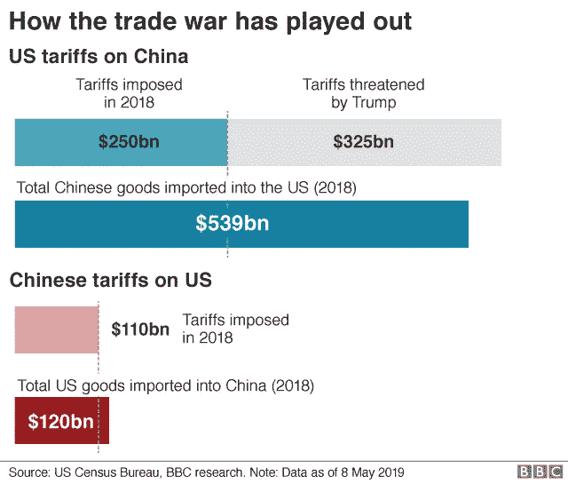
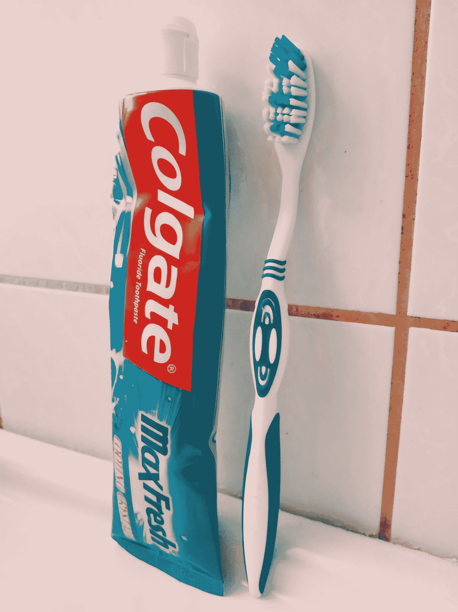

# 如何在现在的市场中生存

> 原文：<https://medium.datadriveninvestor.com/how-to-survive-the-markets-right-now-9d9a65148b57?source=collection_archive---------20----------------------->

## 抓紧了，市场越来越颠簸了

## 熊不会杀你的

我们认为，唐纳德·特朗普已经宣布对美国从中国进口的每一件商品征收关税(也许他漏掉了一些)。

这里有一张方便的图表，可以帮助你晚上保持清醒:

没错。五月在 T2，事情变得越来越可怕。

 [## 算法交易的机器学习|数据驱动的投资者

### 当你的一个朋友在脸书上传你的新海滩照，平台建议给你的脸加上标签，这是…

www.datadriveninvestor.com](https://www.datadriveninvestor.com/2019/01/30/machine-learning-for-stock-market-investing/) 

不管怎样，现在，人们开始紧张了。市场开始类似于熊市的开端，似乎没有人想玩太多。

如果你甚至有一点害怕，思考以下的想法可能是值得的。

## 不要惊慌

我以前报道过[需要冷静](https://medium.com/datadriveninvestor/think-like-a-billionaire-investor-think-value-and-dont-panic-7f000a8a0489)。不过现在，这可能比以往任何时候都更重要。无论你的投资规模有多大，都不要恐慌，因为熊市正在回归。

即使市场下跌，它也不会偏离由来已久的涨跌规律太远。明智的投资者在接下来的几周内不会流汗。你也不应该。

## 探索多样化

如果你必须在艰难时期投资，那就以分散投资为目标。当然，这完全取决于你在乐观时期的投资策略。但是如果你还没有很多，考虑建立一个更加多样化的投资组合。

## 看好钱

如果你一直在花你的积蓄，现在是时候把它们都拿回来了。说真的，从长计议，只花你能承受的损失。

熊市可能意味着亏损。如果它来了，就做好失去的准备。如果你投入的钱是为了保障你的未来，那你就大错特错了。

## 打击价值股

回到[巴菲特再次](https://medium.com/datadriveninvestor/two-steps-to-warren-buffetts-level-of-productivity-b76e30ff5233)，重要的是要考虑那些将会带来价值的公司的价值股。

当熊市来袭时，每家公司都会遭殃。应该被高度估值的非常好的股票将会遭受打击。这意味着你将能够以一个好的价格购买通常会花费更多的股票。

这种特殊的方法确实需要你仔细观察市场。观察价值棒何时以低于你预期的价格运行意味着关注图表和新闻。当价值股价格下跌时，抓住一些便宜货。

## 考虑防御

当世界走向地狱时，买牙膏。

如果情况开始恶化，就买“防御性”的股票。这些股票与人们永远需要的产品挂钩，即使僵尸末日发生了。

所以买高露洁吧。每个人都需要牙膏。

**如果你需要得到一叠熊市交易策略，并且你想为它支付‘熊’的最小值，** [**买这本书**](https://amzn.to/2MUGFjX) **。它的成本不到 3 美元，并告诉你所有你需要知道的(包括如何购买牙膏股票生存)。**

你需要知道我是会员，但正如我常说的，我推荐的东西是我自己使用/阅读的东西。