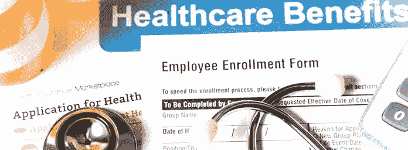

# 如何利用开放式注册来获取益处

> 原文：<https://medium.datadriveninvestor.com/how-to-take-advantage-of-open-enrollment-for-benefits-4712e45e2b8b?source=collection_archive---------69----------------------->

更新于 2018 年 10 月 24 日

大多数人没有最大化他们的员工福利，仅仅是因为他们缺乏医疗保健和 401k 知识来根据个人需求调整他们的福利。每年的开放注册标志着一个伟大的时刻教育自己，重新评估您的福利需求，并利用储蓄机会。

许多美国人每年都错过了受益的机会。事实上，[金融引擎](https://financialengines.com/education-center/employer_match_results/)报道称，美国人每年以无人认领的 [401k](https://www.seniorfinanceadvisor.com/investments/401k) 火柴的形式在桌子上留下大约 240 亿美元。

将开放注册视为您重新审视福利的时机，以确保您充分利用这些福利。你也要确保你的福利选择仍然是正确的选择。毕竟，节省下来的钱是你口袋里的额外的钱，可以用来投资、还债或度假。

以下是您需要回答的主要问题，以便利用开放式注册来最大化您的受益机会。

# 1.你的福利计划有什么变化？

许多人在工作期间把“钱放在桌子上”，因为他们没有阅读或完全理解它们的好处。例如，许多公司通过一系列激励措施，如完成在线问卷或进行常规健康筛查，让你每年节省医疗保险费。你可以通过简单地向同事学习或阅读你的福利包的细则来了解有哪些机会，从而降低保费。

一些公司甚至提供打折票、博物馆或公园门票或其他省钱的机会。查看您的注册手册，以确保您完全了解额外津贴和福利的变化。

# 2.自从您上次公开参加福利计划以来，您的生活有什么变化吗？

如果您自上次开放福利登记以来经历了重大人生事件，您应该查看福利套餐，以确保您选择的福利能够为您的家庭带来最大的节省。无论是结婚、离婚、新生婴儿还是死亡，你都希望确保你选择的计划对你家庭的个人健康和财务需求有意义。

即使没有发生重大变化，如果你预计会有变化，或者因为健康原因需要额外的保险，尽你所能参加有助于你省钱的福利。例如，如果你正在考虑扩大你的家庭，了解生育成本、不孕治疗和短期残疾保险是很重要的。如果你预计在某一年里会比平时花费更多，HSA 提供了在儿童保育和医疗保健上省钱的方法。

考虑开放注册是一个很好的时机来审查您的所有福利，以确保它们最适合您和您的家人。也考虑配偶的福利计划，这样你们可以比较保险范围，一起做决定。

# 3.您现有的计划或提供者是否有变化？

公司有时会四处寻找福利提供者，当这种情况发生时，他们会更换提供者，你的福利也会随之改变。即使提供者是相同的，现有计划的改变也并不罕见，如果你不审查医疗计划的改变，你可以很容易地支付数百到数千美元的不必要费用。

在开放注册期间审查您的福利时，保险范围、免赔额和从属费用都是需要牢记的重要变化。例如，甚至医疗程序的覆盖范围也可以改变；因此，您有责任核实您是否享受了特定的医疗保险，并了解您的免赔额和财务责任。

审查您的计划以确保您的福利待遇满足您当前的需求是非常重要的。如果你的生活最近发生了变化，比如即将退休，你可能要考虑更多的保险选择。随着年龄的增长，向雇员退休账户，如 [401k](https://www.seniorfinanceadvisor.com/investments/401k) 和[个人退休账户](https://www.seniorfinanceadvisor.com/investments/traditional-roth-IRA-accounts)多交些钱也是一个不错的计划。许多人使用开放式登记来检查他们的所有福利，并应用最大缴费变化。

看看你公司的保险费率，看看你自己是否能得到更便宜的保险。此外，将开放注册视为审查您的受益人的好时机，以确保列出了正确的人。

# 福利开放注册是审查您财务状况的时机

请记住，您的员工福利是我们薪酬的一部分。储蓄和福利是密不可分的，所以请花时间仔细阅读您的投保信息，对您选择的福利计划充满信心。

当你回顾你的收益时，看看你的总体财务计划和为未来储蓄的机会。在福利上省钱创造了投资机会。一位专业的财务顾问可以帮助你开发一个适合你独特情况的 T2 财务投资组合。

【www.seniorfinanceadvisor.com】最初发表于**。**