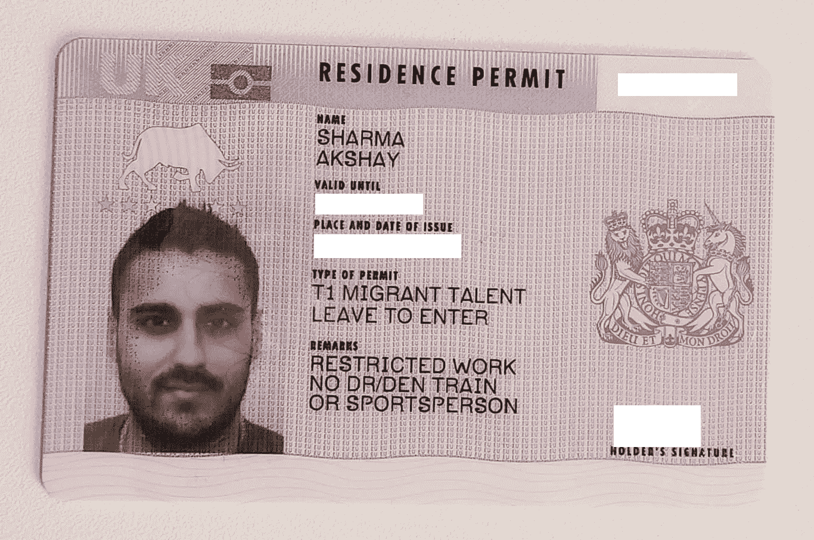
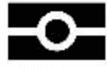
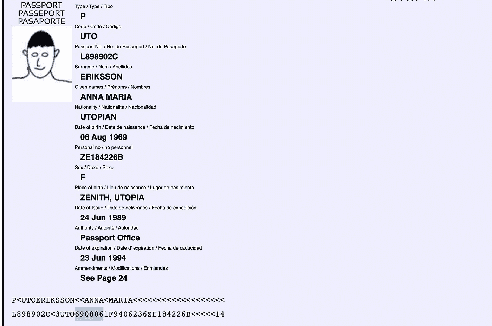
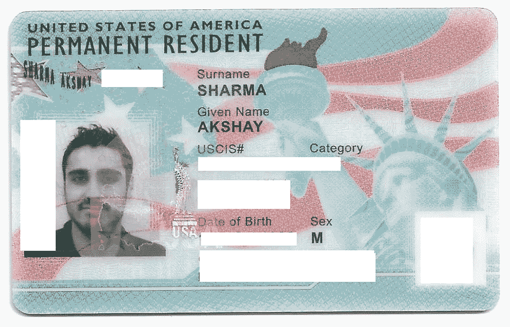
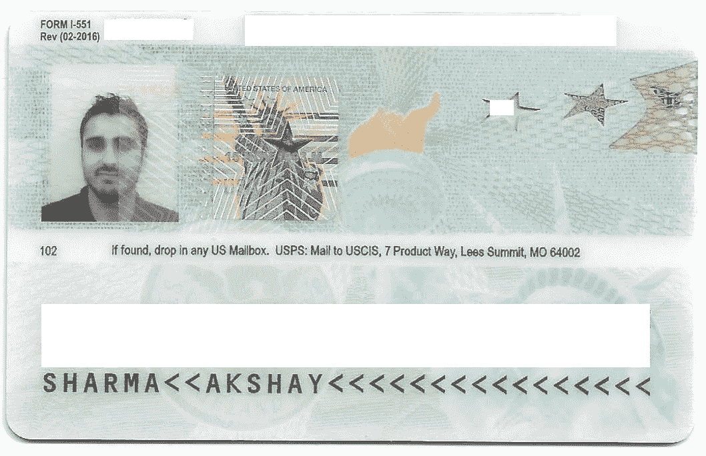
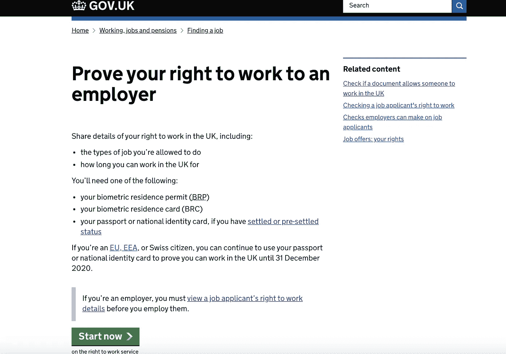
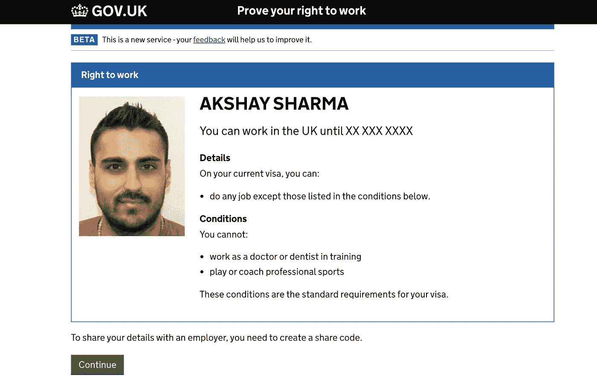
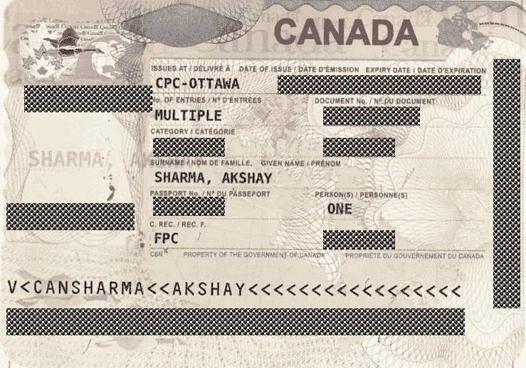
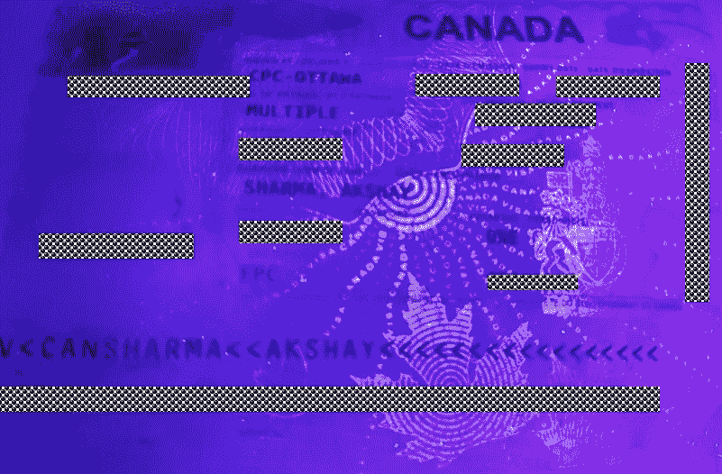
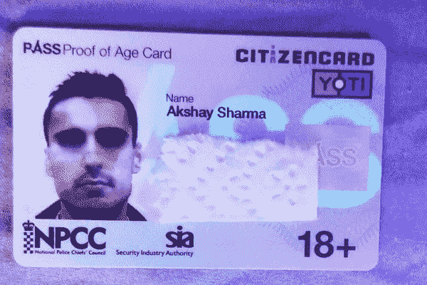

# 如何轻松辨别护照真假？

> 原文：<https://medium.datadriveninvestor.com/how-to-tell-a-real-passport-or-an-id-from-a-fake-easily-edc635ea091e?source=collection_archive---------0----------------------->

## 仅仅使用智能手机，您如何验证护照或生物识别许可证等身份文件是否合法？

A Biometric Residence Permit (BRP) as issued by Home Office, UK

现在是旅游旺季，你可能想知道当你在旅行的不同阶段把护照或身份证交给当局时，幕后发生了什么:出境检查、登机、护照检查、海关……我现在已经很习惯在机场和火车站被人侧写了——这感觉和一个陌生人问你“几点了”没什么区别—哦，生活在这个世界上的乐趣。奇怪的是，这似乎也几乎每次都会发生，不仅是一个国家的边境代理，还有当地的交通警察，甚至航空公司的工作人员——是的，我给汉莎航空公司写过信。只要我有有效证件，航空公司的工作人员就没有权利问最隐私的问题。

我注意到这些“安全专家”在寻找什么——特别是在我的文档中，并想到与我的技术观众分享一些关于辨别真伪的有用提示和技术。不，我不是说这就是为什么侧写会发生，但是为了方便起见，至少我可以分享一些关于这个主题的有用知识，而不是拿一些可能很难说服某些人的问题开玩笑。

 [## 人们对隐私的不理解是什么？数据驱动的投资者

### 你知道那种感觉。无论是访问应用程序、订阅还是你最喜欢的运动鞋。你按下…

www.datadriveninvestor.com](https://www.datadriveninvestor.com/2019/04/11/privacy-and-convenience/) 

# 关于绝对的警告

就像安全领域的任何事情一样——无论是在物理还是数字环境中，人们可能能够判断出什么东西*明显丢失或不安全，但人们几乎永远不能排除什么东西是完全安全的，或者在这种环境下，是合法的。没有绝对。然而，在文件的情况下，有一条细线:有太多的不一致——包括每个司法管辖区(国家、州、地方)每隔几年发布的不断变化的“设计模板”，以至于很难无可辩驳地得出一个复杂的赝品确实是赝品的结论，即使对于专家来说也是如此。毕竟，也许该文件是在一个国家的旧设计规范下发布的？或者文件属于特殊类别(外交文件与普通文件)。你可以看到这会变得多么乏味。*

底线是，总是寻找伪造的硬核迹象，可以无可辩驳地证明无疑。某人名字中的一个简单拼写错误，某人照片上的一个橡皮图章的部分印记(在不属于它的地方)或者一个模糊的 [MRZ](https://en.wikipedia.org/wiki/Machine-readable_passport) 可能仅仅是发行机构的笔误或机械错误，而不是故意伪造。即使是生物特征文件，当你使用基于 NFC 的应用程序阅读时，你的智能手机上的“数字签名”也可能显示为“无效”或由“未识别的实体”发布。通常情况下，发生这种情况可能有一个简单的解释，例如您的设备没有安装发行国的(公钥)证书(下面将详细介绍)。

除非您能够从权威(在线)数据库或密码验证文档是合法的，例如从基于 PKI 的芯片，否则您必须做出最佳判断。

# 保障

Biometric or e-passport symbol (also used on biometric permits and ID cards)

首先，护照可能是最容易或最难验证的东西，这取决于它们是否是**生物识别**。如果护照或任何文件有此处显示的通用生物特征符号，请留意这些标志。

## 计量生物学

如果你有生物识别护照，使用基于 NFC 的智能手机应用程序是最简单、最有效的解决方案。我为此使用的应用程序是 [ReadID Demo](https://readid.com/demo) ，但也有全系列的应用程序，通常不需要任何费用。像这样的应用程序通常要求你将智能手机的摄像头放在生物页面上，扫描 MRZ 区，使用 OCR 提取信息，验证校验位是否完整，并使用这些信息(如你的出生日期)通过 NFC 进一步读取生物芯片。提取的信息用于解密包含在芯片中的信息。从那里，你可以很容易地检查从芯片上提取的照片和其他数据是否与实际文件上的相匹配。

就“数字签名”而言，也就是能够确认文件是否确实是由合法的政府机构发布的，我得到了不同的结果。如果你熟悉 SSL 证书的工作方式，你会知道这意味着你需要在你的设备上安装合适的 T2 认证中心，然后才能识别和信任由该认证中心签署的任何数字证书。您的设备上可能已经有了来自最常见的 ca 的证书: *VeriSign、Symantec、Comodo、Let's Encrypt、*等等。如果发行该芯片的政府机构依赖于其中一个机构的 PKI，则您的设备可以权威地验证数字签名。

然而，大多数政府自然更愿意充当自己的认证机构。他们不信任第三方认证机构，而是信任自己，这是有充分理由的。私钥或证书的泄露可能意味着整个发布基础结构的泄露:使用这些密钥发布的任何内容的真实性和完整性，无论合法与否，现在都将受到质疑。毕竟，获得私钥的恶意参与者可以很好地“签署”假护照。

国际民用航空组织(ICAO)目前维护关于获得每个国家的公钥证书的信息。

 [## 电子护照基础知识

### 目前有 100 多个国家和非国家实体(如联合国)签发电子护照，并且有超过…

www.icao.int](https://www.icao.int/Security/FAL/PKD/Pages/ePassportBasics.aspx#targetText=The%20ICAO%20PKD%20is%20a,Lists%20to%20the%20ICAO%20PKD.) 

## 非生物特征

假设你没有生物识别护照，使用一个可以对其进行基本检查的应用程序扫描护照的 MRZ 区，例如校验位验证([顺便说一下，这可能是普通的伪造](https://www.gs1.org/services/how-calculate-check-digit-manually)，但 MRZ 的草率伪造企图可能会在这里被抓住，[设计图案验证使用 IDVT](https://www.youtube.com/watch?v=hZ7UInMx4FA) 解决方案或手动检查安全特征，如全息图和那些在紫外光下可见的特征，都是很好的替代方案。一些 IDVTs，如[马体](https://getmati.com)，也进行国际刑警组织的搜索，以检测护照号码是否曾被报失/被盗。

必须指出的是，这些数据点是合法和非法的体面指标，但绝不是一个万无一失的方法。毕竟，护照就是这样一种文件，目前还没有公开的在线数据库。

当然也有例外:如果一个国家允许在 MRZ 区使用除“M”或“F”以外的性别代码，比如“X ”,那该怎么办？这很可能会在旧的 MRZ 扫描系统中引起错误，但并不一定意味着该文件是伪造的。一个基本的 MRZ 检查可以做到的是。注意 MRZ 中的“1”在持有者的出生日期之后，性别(“F”)之前。这个校验位(“1”)是使用公开可用的算法根据持有者的出生日期(在这种情况下)计算出来的，并用作错误检查机制。一个懒惰的伪造者只是简单地将另一个持有人的出生日期和基本信息替换为他们的，而没有注意重新计算这个校验位，这将很容易使伪造的护照在读取器上发出危险信号。但是当然，如果伪造者花时间重新计算正确的校验和，那么包含错误信息的 MRZ 线将被毫无问题地读取。

[An example passport bio page imitation featuring the MRZ](http://www.highprogrammer.com/alan/numbers/mrp.html)

✅ **数字***如果使用一个*[*idvt*](https://www.gov.uk/government/publications/identity-document-validation-technology/identification-document-validation-technology)*，解决方案也将对文档的扫描件起作用。*

# 生物识别许可证和身份证

生物识别许可证或身份证通常可以充当“旅行证件”——或者以其自身的身份，或者当与有效护照一起提交给当局时。因此，大多数此类文件，包括美国绿卡(也称为 I-551 表格:永久居民或外国人登记卡)和英国或 EU-签发的生物识别居留许可证(BRP)的背面也印有 MRZ 区。

## 如何验证美国绿卡是否合法？

IDVT 扫描应用程序将卡的视觉特征与官方设计模板进行比较，并进行基本的 MRZ 检查，可以在这里使用，以获得关于文件真实性的良好想法。

除了[美国政府的电子验证系统](https://www.e-verify.gov/)只用于善意雇主的雇佣授权验证，我不知道有一个全面的数据库可以验证绿卡的合法性。E-Verify 当然可以验证工作授权(从而间接验证绿卡)，但该系统的合法使用仅限于雇主。

我还注意到我自己的绿卡有 MRZ 区和全息图，但对紫外线的反应没有什么不同，而且没有 NFC 可读芯片。然而，它确实是 [RFID 增强型](https://epic.org/privacy/green_cards/the_green_card.html)。

Front of a U.S. Green Card (I-551)

Backside of a U.S. Green Card (I-551)

## 如何验证英国生物识别居留许可？

令人欣慰的是，英国政府有一个数字解决方案，可以让个人向雇主或第三方证明他们在英国工作的权利，因此也能够证明文件本身是合法的:

[GOV.UK Right to Work verification service](https://www.gov.uk/prove-right-to-work) screenshot as of Sep-07–2019

用户只需访问[这个链接](https://www.gov.uk/prove-right-to-work)并输入他们居留许可中的关键细节，就会呈现出一份关于用户在英国工作授权状态的漂亮确认，以及刻在他们许可上的细节和照片。然后，您可以与雇主或第三方共享该页面的真实副本，他们也可以在同一网站上验证信息。

链接:[https://www.gov.uk/prove-right-to-work](https://www.gov.uk/prove-right-to-work)

A result obtained from GOV.UK’s service: Prove your right to work to an employer

如果您是一个使用[雇主-服务](https://www.gov.uk/view-right-to-work)对应方的组织，请确保在访问用户信息之前获得用户的同意。

✅ **数字***此解决方案也适用于文档的数字副本。*

# 驾驶执照

驾照验证可能非常主观。有这么多类型:临时，学习者，完全，商业，摩托车等。可以有许多颁发机构(地方、省、州、国家……)。通常没有 MRZ 或机器可读的字符。一些发行机构可以发行基于芯片的许可证，而另一些发行机构可以具有在线数据库，以至少部分地验证许可证上的一些信息，而另一些发行机构在很大程度上保持断开连接，并且使其系统对公众不可见。

在美国,《真实身份法案》似乎很快就会改变这一状况。至少，截至目前， [E-Verify 声称他们能够通过 DHS 数据库](https://www.e-verify.gov/employers/verification-process/drivers-license-verification)验证驾驶执照。然而，对于普通用户来说，该服务是不可访问的。根据每个州的法律，在被请求文件的用户事先同意的情况下，可以直接从驾照/机动车辆机构请求驾驶记录。

您最好使用 IDVTs 扫描物理许可证本身，如果可能的话，扫描许可证的数字副本是最后的手段。如前所述，有了实体卡，检查质量、紫外线下的安全特征和全息图比用数字图像要容易得多。

## 如何在线验证英国驾照？

GOV.UK 的在线[驾照信息共享和验证服务](https://www.gov.uk/view-driving-licence)类似于“向雇主证明你的工作权利”服务，可以很容易地让你确认驾照上的细节是否正确，即使它没有显示持有者的照片。同样，在访问许可证持有者的信息之前，必须获得他们的同意。

【https://www.gov.uk/view-driving-licence
[https://www.gov.uk/check-driving-information](https://www.gov.uk/check-driving-information)

✅ **数字***此解决方案也适用于文档的数字副本。*

# 签证和护照上的插图

我们到达了最棘手的地方。通常情况下，签证简介通常印在旅行者的护照上，只有当局才能“阅读”。但有时，一个人可能不得不向雇主出示这些证件(例如，代替邮寄延误的“工作许可证”卡)。

A sample visa vignette stamped in-passport for certain visa types and passport holders

这是在紫外光下观察时的效果:

Canadian visa vignette viewed under ultraviolet (UV) light. Notice the maple leaf, Canadian Coat of Arms, and other distinctive features previously invisible.

除了基本的 MRZ 或“设计模板”检查之外，你对这些插图的唯一选择可能是用护照上的信息来证实它们，检查全息图或紫外线特征。请记住，并非所有类型的插画都具有全部或任何安全特征，包括全息图、水印或紫外线敏感区域。通常情况下，在法律允许的情况下，在接受此类“临时”文件时，要求提供其他形式的身份证明是一个好方法。

# 官方指南

以下是一些由不同国家的政府编制的官方指南，介绍验证身份和文件的最佳做法。

 [## 审查身份证件指南

### GOV.UK 使用 cookies 来简化网站。指导如何检测身份证件中的基本伪造…

www.gov.uk](https://www.gov.uk/government/publications/recognising-fraudulent-identity-documents)  [## 个人的身份证明和验证

### 如果您需要帮助来决定您或您的服务将如何检查某人的身份，您应该阅读此指南。你可以…

www.gov.uk](https://www.gov.uk/government/publications/identity-proofing-and-verification-of-an-individual/identity-proofing-and-verification-of-an-individual)  [## 驾照验证

### 超过 80%的员工出示驾照或州颁发的身份证作为身份证明…

www.e-verify.gov](https://www.e-verify.gov/employers/verification-process/drivers-license-verification) 

> E-Verify 能够通过将雇主输入的 I-9 表格中的数据与美国国土安全部提供的记录进行匹配，来验证驾照和身份证信息的有效性

 [## 检查单据编号的有效性

### 检查文件编号是确认文件有效或无效的额外工具。一个决定…

www.consilium.europa.eu](https://www.consilium.europa.eu/prado/en/check-document-numbers.html)  [## 基本的护照检查

### GOV.UK 使用 cookies 来简化网站。检查护照身份时使用的指南。这个…

www.gov.uk](https://www.gov.uk/government/publications/basic-passport-checks) 

## 🇪🇺欧盟国家

查看丢失和被盗文件清单的资源:
[https://www . consi lium . Europa . eu/Prado/en/check-document-numbers/check-document-numbers . pdf](https://www.consilium.europa.eu/prado/en/check-document-numbers/check-document-numbers.pdf)

 [## 驾驶执照的认可和有效性

### 如果你的驾驶执照是由一个欧盟国家颁发的，它在整个欧盟都是被认可的。所以如果你搬到另一个欧盟…

欧罗巴](https://europa.eu/youreurope/citizens/vehicles/driving-licence/driving-licence-recognition-validity/index_en.htm) 

*伊丁快乐！🕵️*

[CitizenCard](https://CitizenCard.com) issued pursuant to [PASS scheme](https://www.pass-scheme.org.uk/).

2019.[阿克谢“斧头”夏尔马](http://axsharma.com)。保留所有权利。