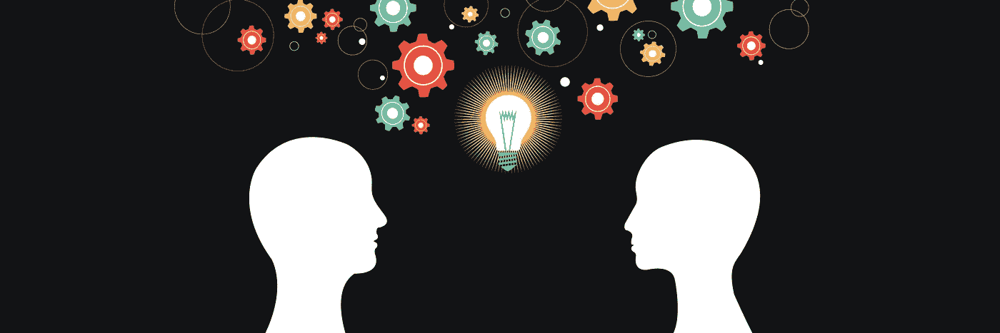
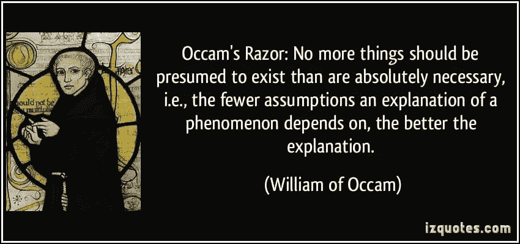
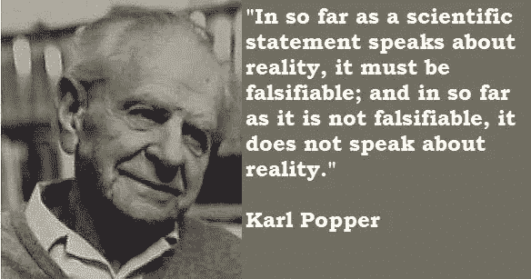

# 如何务实思考？

> 原文：<https://medium.datadriveninvestor.com/how-to-think-pragmatically-4b3691d38f36?source=collection_archive---------10----------------------->

**在判断索赔的“真值”时**

“Thinking: the talking of the soul to itself”- Plato

> *如果有人走过来对你说宇宙是上周四创造的，那该怎么办？*
> 
> *现在你可能会说“这不可能。我们有上周四之前的记忆。”*
> 
> *“哈哈，你的记忆也是编造出来让你相信的。”他说。*
> 
> *“好吧，那么，上周四之前所有指出文明和生活方式存在的古代建筑和考古证据呢？”你大胆地说。*
> 
> *“哈哈，cmon，我们这里说的是一个全能的创造者。他可以轻而易举地拿出他想用来愚弄我们的所有证据。”他带着霸道的微笑说。*

你无话可说了。你怎么可能说什么？任何你可以用来作为证据来反驳这个假设的东西，都是造物主聪明的输入，用来愚弄你，让你相信宇宙是在 138 亿年前创造的。

此时，你可能会对谈话的结果感到非常沮丧。

当我第一次遇到这个著名的被称为 ***“上周四主义”的假设时，我的确是这样***

> 我有一种直觉，这个假设有一些令人深感不安的地方，但我当时无法恰当地表达出来。

我也曾面临过类似的索赔，就像上面的那个，它让我产生了同样的不安感，即明知有问题，却无法确定问题出在哪里。

> “如果灌木丛中有仙女，当你寻找她们时，她们会瞬间消失，不留任何存在的痕迹，那会怎么样？”
> 
> “如果登月是一个骗局，世界上所有的政府都在欺骗我们，让我们相信它确实发生了，而它并没有发生，那该怎么办？”
> 
> “如果你的身体中有一个非物质的部分控制着你的物质部分呢？”

当我仔细研究了上述观点和我认为正确的观点后，我意识到一个假设有一定的“真值”——假设看起来有多接近现实——这就产生了一个观念的等级。

有些想法肯定比其他想法更**强大、可证明、可用和可靠**,而有些想法虽然在逻辑上并非不可能，但显然毫无用处。对我来说，这是一个好的开始。我找到了解决这个问题的方法，这可能会引导我找到解决办法。

> 对我来说，现在唯一的问题是弄清楚如何确定任何给定主张的“真值”。

我就是这样接触到两个人的作品的——奥卡姆的 ***威廉和卡尔·波普尔***——他们以这样一种方式引导我的思维，深刻地改变了我思考事物的方式。

> 奥卡姆剃刀 *现在被称为源于他的名言* - ***“需要最少假设的解释最有可能是正确的。”***

如果我举个例子就更清楚了。假设你正在和你的女朋友通电话，结果你们打了起来。电话突然中断了。鉴于没有提供额外的信息，有这么多可能发生的事情会导致您出现这种情况。

1.  *你女朋友生气了，把手机切了。*
2.  她在搬到另一个地方时失去了信号，这切断了电话。
3.  *发出信号的塔断了，离开这里时没有信号，结果电话被切断*

如此等等。有很多可能发生的情况。那你怎么决定？你用了“奥卡姆剃刀”要求最少假设的解释是第一种。第二种解释、第三种解释以及所有其他可能的解释都将假设嵌入到假设中，导致假设的多样性。假设她失去了信号，假设她在移动，假设她打算做一些事情，假设她有一些重要的事情，而不是和她的男朋友说出来。面对多种可能的解释，**奥卡姆剃刀**用无数的假设刮掉了这些解释，留给你的是最有可能的解释。你可以从数学的角度来考虑这个问题，假设事情发生的概率会降低，因为每个事件的概率会随着更大事件的发生而增加，从而导致更小的否定。使用“**奥卡姆剃刀**”,我们可以排除大多数阴谋论，因为它们认为登月是一个骗局，地球是平的，51 区的外星人需要你假设很多事情。

> **证伪原则**由卡尔·波普尔提出，用他自己的话说 ***就科学真理关于现实而言，它们必须是可证伪的；只要它不是可证伪的，它就不谈论现实。***

这是一个真正强大的禁令，它划清了科学和伪科学的界限，并声称真理价值高于真理价值低于真理价值。

让我们举个例子来真正理解波普尔说这话的意思。

请考虑这样一种说法，即灌木丛下有精灵，当我们寻找它们时，它们会瞬间消失，因此不会留下它们存在的痕迹。从索赔设计的性质来看，它在定义上是“不合理的”。你找不到任何方法来证明或反驳它。因此，与其他可证伪的说法相比，这种说法避而远之，例如“在灌木丛下有数以百万计的微生物，你可以在显微镜下观察到”，因为第二种说法在某种意义上是与现实相联系的，它是可证伪的。

对我来说，这两个心理模型，正如许多人所说的，帮助我为任何给定的主张指定一个特定的“真值”,从而使我能够建立一个思想层次。

> 有些想法比其他想法更值得思考，因为它们更贴近现实。我们的生命是短暂的，因此我们不能浪费时间去思考你可能得到的所有可能的要求。这是我**务实的思维方式**。

现在让我们回到那个问我们“如果宇宙是上周四创造的会怎么样？”

> 是否可证伪？**不！**
> 
> 是不是需要你假设很多事情？**是的！**从造物主想创造我们的假设开始，到他/她的所有努力，都是为了让我们找到所有的证据。我会说，相当方便。
> 
> 那么是否值得思考呢？— **号**