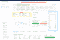
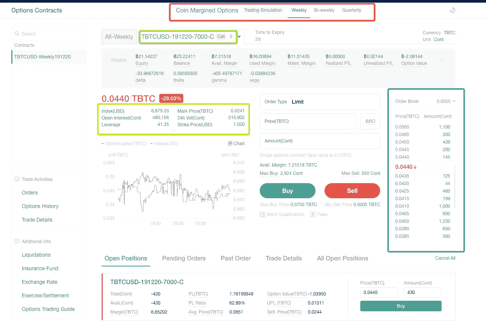
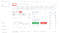
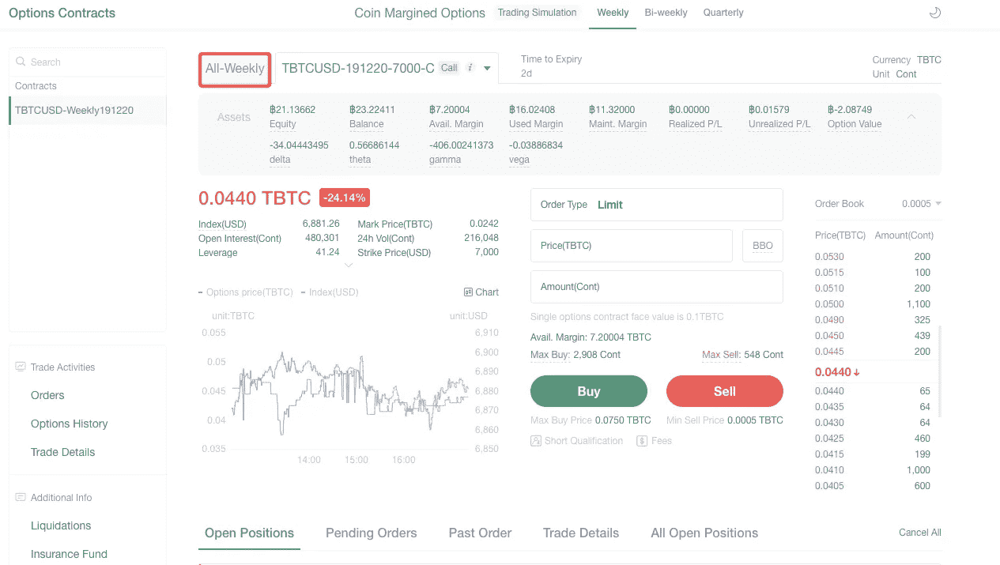
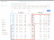
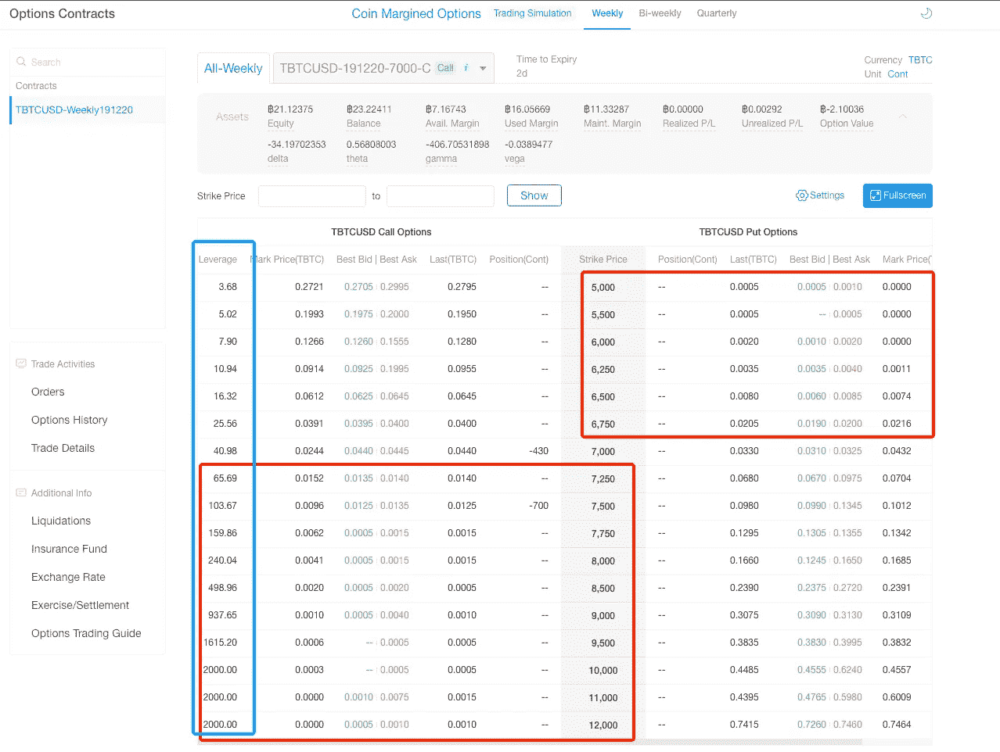

# 如何交易期权:BTC 市场的真实案例

> 原文：<https://medium.datadriveninvestor.com/how-to-trade-options-a-real-life-case-of-btc-market-29f8c9316209?source=collection_archive---------10----------------------->

**我们以 2019 年 12 月 17 日 BTC 市场为例:**

让我们说，我们相信 BTC 市场已经持续了几个月的熊市趋势将会继续。交易者可能会把做空作为他们的主要交易策略，而不是做多。尽管 BTC 短期/中期偏向仍然向下，但仍然没有证据显示 11 月份的修正将在此时重复，6400 点似乎是目前的良好支撑。

# 如何用 ATM (at-the-money)期权进行交易？

由于我们预计 BTC 短期/中期下跌趋势，这里有一个简单的策略，我们可以在 OKEx 期权交易模拟中执行:

1.出售自动柜员机认购期权。17 日的行情依然疲软，反弹不及预期，行权日卖出期权，赚取回报。

2.或者，我们可以购买自动取款机看跌期权。当今天的市场仍然看跌，并预计进一步下跌时，期权内在价值的增加将弥补时间价值的减少。这个选项的价格会相应增加。这样，无论是直接高价卖出，还是等到行权日，都可以从中获利。

# 什么是自动柜员机选项？

平价(ATM)意味着期权的执行价格与标的资产的价格相同或非常接近，无论看涨或看跌。

以下是 OKEx 期权交易模拟页面，显示了 ATM 期权的信息，包括:

红框:期权的行权日，即合约到期日。截图上显示的演习日期是本周五上午 08:00(UTC)

绿框:选项的名称。第一部分指期权的基础产品，“TBTCUSD”指交易模拟中使用的虚拟 BTC。在直播市场会是 BTCUSD，意思是比特币。在第二部分中，“191213”指的是行权日——2019 年 12 月 13 日。它与红框中提供的信息相同。在第三部分，“7000”是指执行价格，用于与基础价格进行比较，并计算收益率和强制平仓价格。在第四部分中，“C”(看涨)表示看涨期权。如果是 P(看跌)，则表示看跌期权。

蓝盒子:订单簿。与期货类似，红色部分显示卖价，绿色部分显示买价。右边是选项的数量。

黄框:选项的度量。第一行显示了最关键的部分:现货指数和马克价格。该指数直接影响期权的买卖价格。当计算到期日的回报时，您需要比较指数和执行价格，以便计算您的回报和强制平仓后 BTC 现货的市场价格。在这里，我们应该把重点放在标记价格上。由平台的系统算法计算的标记价格是一个相对公平的期权价格，实时变化。

# 为什么要把重点放在马克价格上？

我们发现，在交易模拟市场中，市场价格和标记价格之间存在相当大的价差，这意味着当一项资产的价值为 5 美元时，当它获得炒作时，市场价格可能会上升到 15 美元。这个时候，最好的交易方式就是按照市场价格卖出资产，而不是买入。

让我们从 BTC 市场的历史中再举一个例子。

回到 12 月 15 日，我们看到成交量和动量指标都不强，市场短期会震荡。我们认为，除非比特币价格突破 7300 点，否则交易者不应做多比特币。

# 如何交易 OTM 期权？

如果市场疲软，波动很大，你可以选择以下简单的交易策略:

1.出售 OTM 看涨期权。如果市场没有太大的振荡(没有剧烈的价格运动)，在行权日卖出期权，收到钱。

2.卖出一份 OTM 看跌期权。如果价格没有预期下降那么多，时间价值正在被快速消耗，期权价格会更低。是以较低的价格买入资产挽回损失，还是等到到期日，期权的价值变为零，就可以从中获利。

3.这里有一个稍微高级一点的策略:结合策略 1 和策略 2。这样，你可能在没有太大风险的情况下，获得双倍的回报。

# OTM 期权是什么？

对于 OTM(价外)看涨期权，这意味着当基础价格低于执行价格。对于 OTM 看跌期权，这意味着基础价格高于执行价格。简单来说，OTM 期权是指价格不够高或不够低以满足执行价格的情况。

同上，在 OKEx 期权交易模拟页面，显示的是近期 ATM 期权的信息。要查找 OTM 选项，请单击“全周”，它将显示一周的所有选项:

当时 BTC 的价格是 7050 左右。根据定义，OTM 看涨期权是那些执行价格高于 7000 的期权，OTM 看跌期权是那些执行价格低于 7000 的期权(因为执行价格为 7000 的期权最接近 7050，所以这里被认为是 ATM 期权)，就是上图中用红色圈出的两部分。

那么，你应该选择哪个 OTM 选项呢？提示如下:考虑期权的杠杆作用。首先，点击右上角的“列表设置”，然后勾选“杠杆”复选框，点击确认。您可以在页面上看到每个选项的杠杆作用，如上图中的蓝色圆圈所示。

请明确，期权不同于期货和永续掉期。期权交易不涉及杠杆，用户不能选择杠杆水平。只是系统根据成本计算给出的一个大概值。

如果你仔细观察，你会发现对于看涨期权，执行价格越高，杠杆越高——最后几个杠杆例外，它们停留在 2000 倍，因为它们的价格很低。

杠杆允许你考虑除执行价格之外的其他因素。你也可以参考合约的杠杆水平来考虑所涉及的风险以及你应该在期权交易中投入多少资金。

最后，请记住，杠杆率与涉及的风险成正比——杠杆率越高，行权的概率越低。虽然你的投入较小，但损失所有投资资金的风险也相应较高。

*免责声明:本材料不应作为投资决策的依据，也不应被理解为从事投资交易的建议。交易数字资产涉及巨大的风险，并可能导致您投资资本的损失。你应该确保你完全了解所涉及的风险，考虑你的经验水平、投资目标，并在必要时寻求独立的财务建议。*