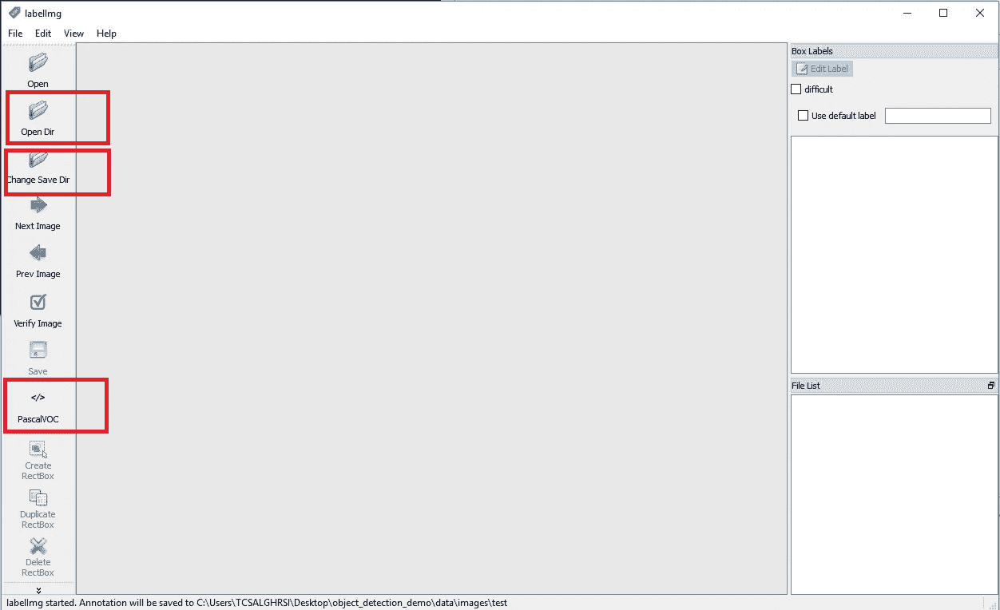
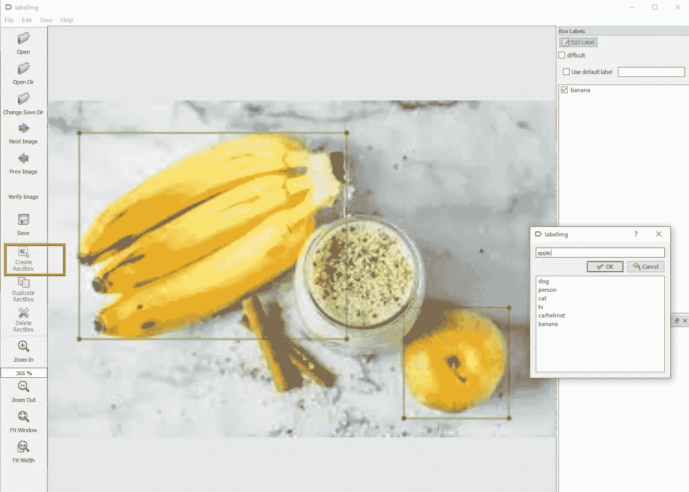
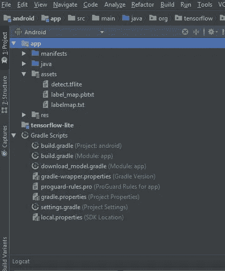
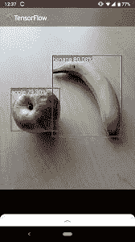

# 如何用 Tensorflow 对象检测 API 训练自己的自定义模型，并用 TF Lite 部署到 Android 中

> 原文：<https://medium.datadriveninvestor.com/how-to-train-your-own-custom-model-with-tensorflow-object-detection-api-and-deploy-it-into-android-aeacab7fa76f?source=collection_archive---------0----------------------->

在这篇文章中，我将解释使用 Google Colab 的 GPU 和 Tensorflow 的对象检测 API，用自己的数据集训练自己的模型的步骤。训练好模型后，您将学习如何使用 Tensorflow Lite converter 来获得 Lite 模型，然后让模型在简单的 Android 应用程序上运行。

> **是的，让我们开始吧！！**


# 第一:获取模型

在做任何事情之前，确保你的本地机器上安装了 python 3.5+我用 [Anaconda](https://www.anaconda.com/distribution/) 安装了它。

[](https://www.datadriveninvestor.com/2019/01/23/deep-learning-explained-in-7-steps/) [## 深度学习用 7 个步骤解释-更新|数据驱动的投资者

### 在深度学习的帮助下，自动驾驶汽车、Alexa、医学成像-小工具正在我们周围变得超级智能…

www.datadriveninvestor.com](https://www.datadriveninvestor.com/2019/01/23/deep-learning-explained-in-7-steps/) 

拿到你的蟒蛇后。我可以说我们走吧！！:d .将这个 [repo](https://github.com/Tony607/object_detection_demo) 派生并克隆到您的本地机器上，然后安装所需的库:

```
pip3 install -r requirements.txt
```

# **第二:准备自己的数据集**

为了获得一些高质量的图片，我使用了谷歌的 [Open Images 数据集](https://storage.googleapis.com/openimages/web/index.html)，从该数据集下载一个特定的类，您可以按照这个 [Github repo](https://github.com/harshilpatel312/open-images-downloader) 中的说明进行操作，在将 repo 克隆到您的本地机器后，不要忘记更改 download.py 文件，就像您在 Windows 上工作时的片段一样，否则您将无法下载图像:

将以下行从:

```
urllib.request.urlretrieve(url, os.path.join(OUTPUT_DIR, url.split(“/”)[-1]))
```

收件人:

```
urllib.request.urlretrieve(url.replace("\\", "/"), os.path.join(OUTPUT_DIR, url.split("\\")[-1]))
```

现在，我们有两个选择，第一个是用我们已经下载的该类的所有已注释图像来训练模型，第二个是选择图像并使用 LablelImg 手动生成它们的 xml 文件，因为我有一个非常具体的案例。不管怎样，要使用 LabelImg，你可以从[这里](http://tzutalin.github.io/labelImg/)下载。

下载后，只需进入文件夹，双击标签命名的文件，你会得到该工具的用户界面工作。

为了不淹没模型，我们需要在注释之前调整图像的大小。为此，你可以运行下面的代码片段，但是首先保存你的照片，最好是用`jpg`扩展名保存到`./data/raw`目录。

```
import os
import glob
import cv2

if __name__ == "__main__":
    import argparse

    parser = argparse.ArgumentParser(
        description="Resize raw images to uniformed target size."
    )
    parser.add_argument(
        "--raw-dir",
        help="Directory path to raw images.",
        default="./data/raw",
        type=str,
    )
    parser.add_argument(
        "--save-dir",
        help="Directory path to save resized images.",
        default="./data/images",
        type=str,
    )
    parser.add_argument(
        "--ext", help="Raw image files extension to resize.", default="jpg", type=str
    )
    parser.add_argument(
        "--target-size",
        help="Target size to resize as a tuple of 2 integers.",
        default="(800, 600)",
        type=str,
    )
    args = parser.parse_args()

    raw_dir = args.raw_dir
    save_dir = args.save_dir
    ext = args.ext
    target_size = eval(args.target_size)
    msg = "--target-size must be a tuple of 2 integers"
    assert isinstance(target_size, tuple) and len(target_size) == 2, msg
    fnames = glob.glob(os.path.join(raw_dir, "*.{}".format(ext)))
    os.makedirs(save_dir, exist_ok=True)
    print(
        "{} files to resize from directory `{}` to target size:{}".format(
            len(fnames), raw_dir, target_size
        )
    )
    for i, fname in enumerate(fnames):
        print(".", end="", flush=True)
        img = cv2.imread(fname)
        img_small = cv2.resize(img, target_size)
        new_fname = "{}.{}".format(str(i), ext)
        small_fname = os.path.join(save_dir, new_fname)
        cv2.imwrite(small_fname, img_small)
    print(
        "\nDone resizing {} files.\nSaved to directory: `{}`".format(
            len(fnames), save_dir
        )
    )
```

使用以下代码行，在本地计算机上使用 cmd 或 anaconda 提示符运行上面的文件:

```
python resize_images.py --raw-dir ./data/raw --save-dir ./data/images --ext jpg --target-size "(800, 600)"
```

调整后的图像将位于`./data/images/`

接下来，我们将这些文件分成两个目录，`./data/images/train`和`./data/images/test`。该模型将只使用“ **train** 目录中的图像进行训练，“ **test** 目录中的图像作为评估模型性能的附加数据。我对 500 张图片使用了 20%-80%的百分比，这意味着 400 张用于训练，100 张用于测试。

好吧！现在，让我们开始注释调整后的图像。打开 LabelImg 工具，并确保您选择 PascalVOC 格式。打开图像目录，将保存目录更改为 training 或 test。



LabelImg Tool

现在，抓取其中一个图像，并使用 Create RedBox 符号为您希望模型检测的对象创建一个边界框，并在写入名称后保存它。您可以绑定多个对象。



Labeling your own images

你现在可以在`./data/images/train`和`./data/images/test`目录中看到生成的`xml`文件。

# 第三:用 Colab 上的数据运行模型

现在，您已经对所有数据进行了注释，您已经准备好将所有文件推送到分叉的 Github repo，这样做之后，在 Google Colaboratory 中打开这个[笔记本](https://colab.research.google.com/github/Tony607/object_detection_demo/blob/master/tensorflow_object_detection_training_colab.ipynb)，并将 repo url 更改为分叉的 repo。

你可以在这里找到笔记本[的详细说明。为了获得更好的结果，您可以将训练步骤数更改为 200000，将评估步骤数更改为 400。理想情况下，你需要让损失函数接近零，所以算出来。](https://www.dlology.com/blog/how-to-train-an-object-detection-model-easy-for-free/)

在运行单元之前，确保您将笔记本的运行时间更改为 Python 3 和 GPU，您可以通过单击笔记本左上角工具栏中的运行时间来完成此操作。然后，逐一运行所有细胞并检查结果。

# 第四:用 TFLite 获取模型的精简版

> 事情越来越令人兴奋了，对吧？

让我们在笔记本上添加几个单元格:

*首先您需要将 SSD_Model 导出到 tflite*

```
!python /content/models/research/object_detection/export_tflite_ssd_graph.py — pipeline_config_path {pipeline_fname} — trained_checkpoint_prefix “/content/models/research/training/model.ckpt-1000” — output_directory “/content/object_detection_demo/” — add_postprocessing_op True — max_detections 10
```

接下来，我们将使用 TensorFlow Lite，通过使用 TensorFlow Lite 优化转换器[to](https://github.com/tensorflow/tensorflow/tree/master/tensorflow/lite/toco)来获得优化的模型。这将通过以下命令将生成的冻结图形(tflite_graph.pb)转换为 TensorFlow Lite flatbuffer 格式(detect.tflite)。对于量化模型，从 tensorflow/目录运行以下命令:

```
!toco \
 — graph_def_file=”/content/object_detection_demo/tflite_graph.pb” \
 — output_file=”/content/object_detection_demo/detect.tflite” \
 — input_shapes=1,300,300,3 \
 — input_arrays=normalized_input_image_tensor \
 — output_arrays=’TFLite_Detection_PostProcess’,’TFLite_Detection_PostProcess:1',’TFLite_Detection_PostProcess:2',’TFLite_Detection_PostProcess:3' \
 — inference_type=FLOAT \
 — allow_custom_ops
```

该命令在将每个相机图像帧的大小调整为 300x300 像素后，获取输入张量 normalized_input_image_tensor。量化模型的输出被命名为“TFLite_Detection_PostProcess”、“TFLite_Detection_PostProcess:1”、“TFLite_Detection_PostProcess:2”和“TFLite_Detection_PostProcess:3”，并表示四个数组:detection _ boxes、detection_classes、detection_scores 和 num_detections。该命令中使用的其他标志的文档为[，此处为](https://github.com/tensorflow/tensorflow/blob/master/tensorflow/lite/g3doc/convert/cmdline_reference.md)。如果运行成功，您现在应该会在您选择的目录中看到第三个名为 detect.tflite 的文件。该文件包含图形和所有模型参数，可以通过 Android 设备上的 TensorFlow Lite 解释器运行。

# 第五:让我们在 Android 上运行我们的模型

> 呀呀呀！你就快到了，坚持住，:D

我假设你已经安装了 Android Studio，如果没有，你可以安装它。

克隆 [tflite repo](https://github.com/tensorflow/models) 要获得 Android tflite 项目，请打开您的 android studio 并单击打开现有项目，然后从出现的打开文件或项目窗口中，从您克隆 TensorFlow Lite 示例 GitHub repo 的位置导航并选择 tensor flow-Lite/examples/object _ detection/Android 目录。单击确定。

现在，将 detect.tflite 和 labelmap.txt 文件复制到项目中的 assets 包下



labelmap.txt 文件应该如下所示:

```
???
banana
apple
```

因为我选择了 float 类型的推理，所以实数数组在输出文件中将是 float 类型的。如果它们在输入文件中被量化，那么它们会被去量化。所以我需要在 DetectorActivity.java 检查代码片段中将 TF _ OD _ API _ IS _ QUANTIZED 变量的值设置为 false:

你还需要编辑 TFLiteObjectDetectionAPIModel.java 的文件[到:](https://gist.github.com/shahdghorsi/82c83fe99536f7c7fcec6ad267a7e29a#file-tfliteobjectdetectionapimodel-java)

```
-      recognitions.add(
-          new Recognition(
-              "" + i,
-              labels.get((int) outputClasses[0][i] + labelOffset),
-              outputScores[0][i],
-              detection));
+        final int classLabel = (int) outputClasses[0][i] + labelOffset;
+        if (inRange(classLabel, labels.size(), 0) && inRange(outputScores[0][i], 1, 0)) {
+            recognitions.add(
+                    new Recognition(
+                            "" + i,
+                            labels.get(classLabel),
+                            outputScores[0][i],
+                            detection));
+        }
    }
    Trace.endSection(); // "recognizeImage"
    return recognitions;
  }
+  private boolean inRange(float number, float max, float min) {
+    return number < max && number >= min;
+  }
+
```

最后但并非最不重要的是，获得您的构建。gradle 并注释以下行

```
//apply from:’download_model.gradle’
```

同步 gradle，插入手机 usb，运行应用程序，瞧:



This is how the app will look like

# 结论

我使用了许多资源来获得这些结果，我已经添加了主要资源的链接，但是如果你在任何一个步骤中出现了错误，你可以去谷歌一下。

或者查看类似 neptune.ai 的[如何使用 TensorFlow 物体检测](https://neptune.ai/blog/how-to-train-your-own-object-detector-using-tensorflow-object-detection-api)训练自己的物体检测器的相关文章