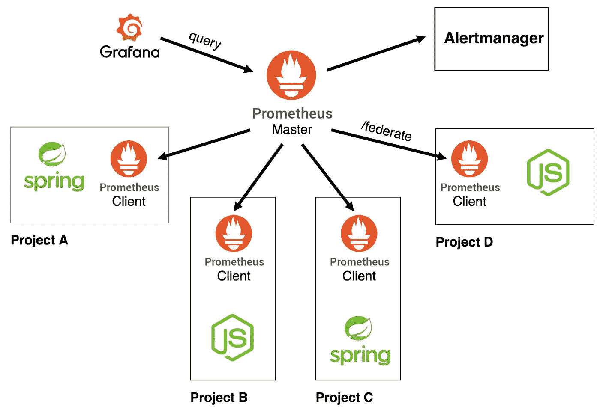
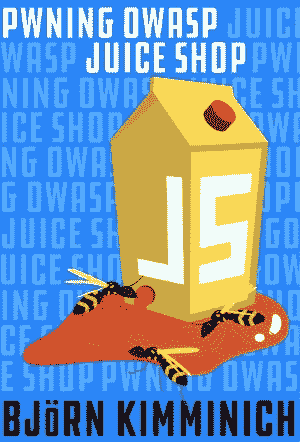

# 如何将软件工程师转型为开发者

> 原文：<https://medium.datadriveninvestor.com/how-to-transform-software-engineers-into-devops-235e7aeb3b58?source=collection_archive---------4----------------------->

There’s never enough space for stickers on a computer

作为一家跨国保险公司的首席开发人员，我的职责之一是通过提供 CICD (Jenkins)、监控(Prometheus)、对 AWS 服务的访问、稳定的平台(RedHat OpenShift)来帮助开发人员构建更好的应用程序……**同样显而易见的是，教授所有这些技术/工具对于增强他们的能力是必要的**。

因此，问题是:**我怎样才能帮助他们接受 DevOps 思维模式，并最终处理开发和运营活动？**

 [## 数据科学和软件工程哪个更有前途？-数据驱动型投资者

### 大约一个月前，当我坐在咖啡馆里为一个客户开发网站时，我发现了这个女人…

www.datadriveninvestor.com](https://www.datadriveninvestor.com/2019/01/23/which-is-more-promising-data-science-or-software-engineering/) 

当然，下面的内容可能不适用于所有的情况和用例，但是我认为它足够通用，可以给出大的图片和遵循的一般方向。

# 1 —詹金斯管道公司和 CICD 自治公司

不是所有的软件工程师都知道 Jenkins、Groovy、Jenkinsfile 和 CICD 阶段。**有时候，他们是开发人员:专注于他们的代码，专注于如何将业务需求变成技术现实，其他一切都只是噪音。作为开发人员，这是我们的工作，提供这种 CICD，并向他们展示它是如何工作的，他们可以如何管理它。**

为了给开发人员提供在 autonomy 中发展的能力，我一直在使用种子作业([作业 DSL](https://github.com/jenkinsci/job-dsl-plugin#background) )，它基于配置文件创建管道作业:这种设置提供了一种解决方案，其中**软件工程师可以慢慢地获得自主权和知识**，如果他们愿意，可以拥有他们的 Jenkins 管道。

*   默认情况下，**项目将使用詹金斯管道**的“标准”设置。它将运行质量检查、安全检查、构建和部署应用程序，并提供 Docker 映像从开发环境到生产环境的升级。这是一种为所有项目提供 CICD 的方法，即使软件工程师不具备管理相关 Jenkins 文件所需的技能(或时间)。
*   当项目团队感觉更舒服时，**他们可以通过提供他们自己的 Jenkins 管道和改变作业 DSL 中的配置来“接管”标准集**。这样他们就可以慢慢学习如何在自己的 CI 中整合更多的阶段，学习 Groovy，熟悉 Jenkins，了解持续发布的流程。

*好处:软件工程师正在慢慢管理他们的 CICD 过程，并获得 Jenkins / Groovy 知识。他们慢慢被授权，变得更加熟悉 DevOps 工具和概念(自动化)。*

# 2 —普罗米修斯和自主监控

监控是 DevOps 思维模式的重要组成部分。这就是为什么让开发人员能够:

*   理解检测/监控应用程序的基本概念
*   能够监控他们自己的应用程序
*   创建专为其应用设计的警报

此外，DevOps 还应该能够访问平台指标和警报，以衡量稳定性，并在发生任何情况时触发适当的操作。

为了提供这样的功能，我选择在每个 OpenShift 项目中部署一个 Prometheus 实例，并通过拉“/federate”端点部署一个主 Prometheus 来收集所有指标。

Prometheus architecture

这种情况允许**软件工程师和开发人员从应用和平台**的监控/警报中受益，同时提供一个测试 Prometheus 查询和警报规则的地方。

*好处:软件工程师意识到他们的应用程序正在运行的生态系统。他们可以开始监控他们的应用程序(请求持续时间、特定端点的请求量等)和运行该应用程序的平台(运行的 pods 数量、内存、CPU 等)。*

# 3 —培训和问答环节

知识只有在能够传递给他人的时候才是有价值的，这就是为什么培训课程如此重要。最大限度地保留信息的有效格式如下所示:

*   20-30 分钟的演示
*   20-30 分钟的实践或指导练习

通过这种方式，软件工程师(或者其他想参加培训的人)可以学习技术的基础知识，并立即开始实践。以下是软件工程师应该考虑学习的一些主要的 2018-19 主题:

*   **Docker**([https://medium . com/free-code-camp/a-beginner-friendly-introduction-to-containers-VMs-and-Docker-79 a9 E3 e 119 b](https://medium.com/free-code-camp/a-beginner-friendly-introduction-to-containers-vms-and-docker-79a9e3e119b))
*   **Kubernetes**([https://medium . com/free-code-camp/learn-Kubernetes-in-under-3-hours-a-detailed-guide-to-orchestration-containers-114 ff 420 e882](https://medium.com/free-code-camp/learn-kubernetes-in-under-3-hours-a-detailed-guide-to-orchestrating-containers-114ff420e882))/**open shift**([https://learn.openshift.com/](https://learn.openshift.com/))
*   **詹金斯**([https://jenkins.io/](https://jenkins.io/))
*   **普罗米修斯**([https://prometheus.io/](https://prometheus.io/))

除了这些培训课程，**每周组织一次面向所有人的“公共问答”,这是获得更多具体用例的一种极好的方式。在这里，我组织了“AWS & OpenShift Q & A”会议，针对任何人(技术或非技术)关于 AWS、OpenShift 或任何相关的特定问题。这是传播知识和创造好奇心的一种很好的“非正式”方式。**

*好处:软件工程师有机会学习新技术、语言和工具。他们还有一个专门的时间段，可以提问并深入讨论具体的使用案例。*

# 4 —直到生产前对其应用程序的所有权

DevOps 思维模式最著名的一个方面是**移除开发者和运营之间的隐喻“墙”。**一种方法是为开发人员提供特权和访问生产环境的权限。

然而，这在大公司中可能很难，因为所谓的“职责分离”阻止开发人员管理他们自己的应用程序生产和预生产环境，这极大地限制了他们的所有权。

要解决这种情况，可以采取多种措施:

*   使用 Jenkins 作为部署工具，并通过**向开发人员提供访问权限，以触发映像升级到预生产。**
*   **在创建生产/预生产环境时，与开发人员**一起进行影子工作(如“对等项目”)
*   **将两个软件工程师配对，让他们成为彼此应用程序的所有者**:这样，“职责分离”就不会受到影响，开发人员仍然可以在“生产”模式下工作。

*好处:软件工程师开始学习如何从开发到生产运行和操作一个应用程序，带来宝贵的“ops”知识。*

# 5 —组织安全活动(捕捉旗帜)

几年来，新的趋势是“DevSecOps”:从开始到结束，将安全性集成到应用程序开发过程中。在大公司中，目标是提高对与应用程序(XSS、SQL 注入等)和平台(管理机密等)相关的安全问题的认识。

第一件事是在 CICD 流程中**集成安全工具****(OWASP 依赖检查、Jfrog XRAY、CheckMarx、…)。幸运的是，这些工具带有非常简单的插件或 API 来与 Jenkins 和其他 CICD 平台集成。**

此外，一种非常有趣且互动的传播安全知识的方式是组织**夺旗(CTF)活动**。CTF 是一项安全竞赛，参赛者必须在易受攻击的应用程序中找到安全缺陷才能获得分数。

Juice shop

我们运行的第一个 CTF 使用了奇妙的 OWASP Juice-shop 应用程序:这是一个多合一的易受攻击的应用程序，您可以轻松地将其部署为一个容器。更多信息可以在他们的 GitHub 页面上找到:[https://github.com/bkimminich/juice-shop](https://github.com/bkimminich/juice-shop)

这次活动是**学习安全最佳实践**，了解黑客常用的攻击媒介以发现应用程序中的安全漏洞，并提高对安全问题的认识的好方法。

*好处:软件工程师看到 CICD 管道中的安全报告，开始以安全第一的心态思考。他们还能够看到 web 应用程序中常见的安全陷阱和最常用的攻击媒介。*

开发人员理解 DevOps 的心态转变并不容易。有一个**组织来促进和帮助软件工程师**练习相关技能和常用工具的使用是非常重要的。当然，**工具是不够的**:心态、流程、人员也是成功实施数字化转型的基础。

我希望这篇文章在某种程度上帮助你提出一些想法或活动，这些想法或活动可以推动你的开发人员/软件工程师走向 DevOps。

那么，你今天做了什么来授权软件工程师并带领他们走向 DevOps 呢？在评论中分享你的想法和创意吧！

干杯！

约翰·b .