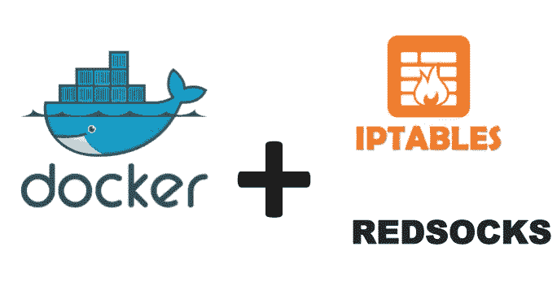
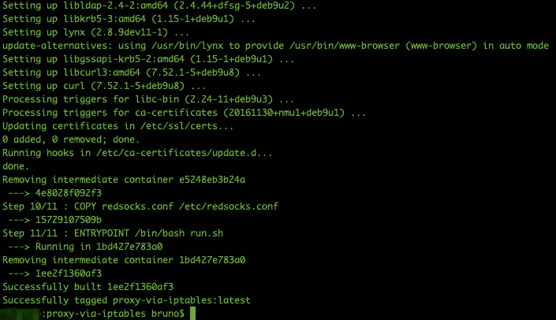
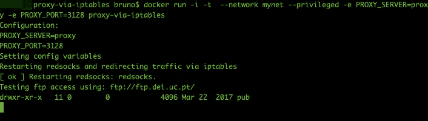
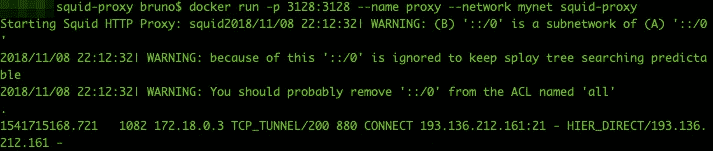
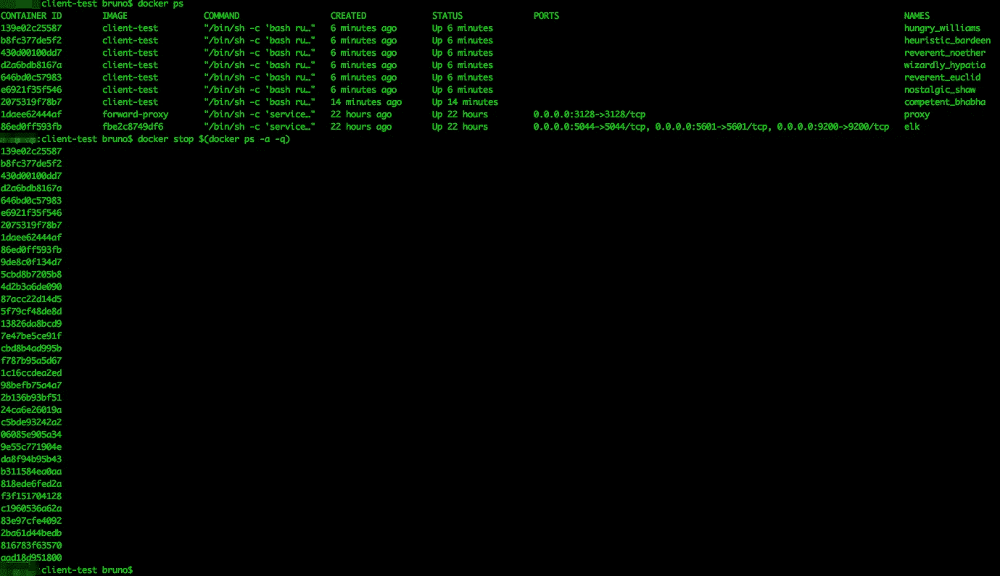
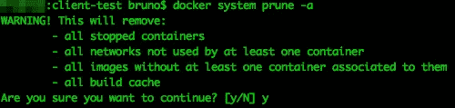

# 如何使用 Iptables 和 RedSocks 在任何应用程序(Docker)中透明地使用代理

> 原文：<https://medium.datadriveninvestor.com/how-to-transparently-use-a-proxy-with-any-application-docker-using-iptables-and-redsocks-b8301ddc4e1e?source=collection_archive---------2----------------------->

如今，使用互联网代理作为对应用程序或机器如何连接到互联网施加限制(出于安全目的)的手段非常普遍。

绝大多数应用程序或库都支持 HTTP/HTTPS/FTP 代理。在 Linux 系统中启用代理的通常方法是设置环境变量:

```
export http_proxy=http://myproxy:3128
export https_proxy=http://myproxy:3128
export ftp_proxy=http://myproxy:3128
export no_proxy=.local
```

通常启用这一功能(或者应用程序配置)就能达到目的。然而……在*的角落案例*中，这是行不通的。

# **你能给我举个例子吗？**

我最初开始探索不同的替代方案是因为框架 [Scrapy](https://scrapy.org/) (*)和它的 FTP 支持。

> Scrapy 是一个开源的协作框架，用于从网站上提取你需要的数据。

虽然 Scrapy 支持代理 HTTP 和 HTTPS 爬行，不幸的是，这并不适用于 FTP。一个有效的选择当然是扩展 scrapy 并实现那个功能，从而为项目做出贡献。我决定不走那条路，只是因为我想探索一种与应用程序无关的选项，并以通用的方式解决问题。

# 我们如何用一种通用的方法来克服这个问题？

设置环境变量适用于大多数应用程序，但总有一些应用程序根本不支持，或者存在一些极端情况(如 Scrapy & FTP 代理)。

我的方法是使用 IPTables 和 RedSocks 的组合，通过代理透明地转发 FTP 流量(例如目的地端口 21)。



# 准备

如果你决定不使用 docker，你可以跳过这些准备工作。

1.  [下载&安装 Docker](https://www.docker.com/get-started)
2.  创建一个 docker 网络，以实现容器之间的通信:`docker network create --driver bridge mynet`

# 代理人

启动并运行一个支持 HTTP、HTTPS 和 FTP 的代理。如果您还没有，请随意使用我在关于使用 Stratch 的 Elastic (ELK)堆栈启用集中式应用程序日志记录的文章[中使用的](/p/eba501230b3d?source=your_stories_page---------------------------) [Squid 代理](https://github.com/brunoamaroalmeida/awesome-quickstart-containers)。

`docker run -p 3128:3128 --name proxy --network mynet forward-proxy`

# 通过 Iptables 和 Redsocks 使用代理

我们首先创建一个名为 *proxy-via-iptables* 的 Docker 容器。

容器将迫使给定的应用程序(例如 curl)通过本地 redsocks 服务(将转发到代理)将输出流量重定向到给定的端口。

该文件夹将包含三个文件: **Dockerfile、redsocks.conf** 和 **run.sh**

**Dockerfile**

```
FROM debian:latest
LABEL maintainer="Bruno Amaro Almeida | brunoamaro.com"# Set the working directory to /app
WORKDIR /app
# Copy the current directory contents into the container at /app
ADD . /appENV PROXY_SERVER=localhost
ENV PROXY_PORT=3128RUN apt-get update
RUN apt-get upgrade -qy
RUN apt-get install iptables redsocks curl lynx -qy
COPY redsocks.conf /etc/redsocks.confENTRYPOINT /bin/bash run.sh
```

**redsocks.conf**

```
base {
 log_debug = off;
 log_info = on;
 log = "file:/var/log/redsocks.log";
 daemon = on;
 user = redsocks;
 group = redsocks;
 redirector = iptables;
}
redsocks {
 local_ip = 127.0.0.1;
 local_port = 12345;
 ip = vPROXY-SERVER;
 port = vPROXY-PORT;
 type = http-connect;
}
```

**run.sh**

```
#!/bin/bash
echo "Configuration:"
echo "PROXY_SERVER=$PROXY_SERVER"
echo "PROXY_PORT=$PROXY_PORT"echo "Setting config variables"
sed -i "s/vPROXY-SERVER/$PROXY_SERVER/g" /etc/redsocks.conf
sed -i "s/vPROXY-PORT/$PROXY_PORT/g" /etc/redsocks.confecho "Restarting redsocks and redirecting traffic via iptables"
/etc/init.d/redsocks restart
iptables -t nat -A OUTPUT  -p tcp --dport 21 -j REDIRECT --to-port 12345# Run app
echo "Testing ftp access using: ftp://speedtest.tele2.net"
curl ftp://speedtest.tele2.netwhile true; do sleep 1000; done
```

有了这三个文件，使用命令:`docker build -t proxy-via-iptables .`构建容器



如果容器构建成功，使用以下命令在 mynet 网络中运行它:

`docker run -i -t --network mynet --privileged -e PROXY_SERVER=proxy -e PROXY_PORT=3128 proxy-via-iptables`

> 为什么**码头工人**特权者**旗帜**旗帜**？默认情况下，docker 容器运行时对主机的特权很少。该标志将通过授予对主机上所有设备的访问权限来扩展这些权限。在我们的例子中，需要将 **iptables** 与 Docker 一起使用。有关详细信息，请查看 Docker 文档中的[运行时特权和 Linux 功能](https://docs.docker.com/engine/reference/run/#runtime-privilege-and-linux-capabilities)。**



正如您所看到的，在启动时，容器通过使用 curl 访问 ftp 目的地进行快速测试(并且没有配置 curl 使用代理)。

在我们的 squid 代理容器上，我们可以验证访问日志中的请求:



就是这样！您只是在 curl 不知道的情况下将 curl 请求转发给了代理。

# 为什么是红袜子？

Redsocks 是一个透明的代理重定向器。它支持将任何 TCP 数据包重定向到 SOCKS 或 HTTP 代理。

如果你熟悉 iptables，你可能会奇怪为什么我不能用它做所有的事情。这是我的第一种方法，然而，这种方法的最大缺点是我们不能将其用于 HTTPS 或 FTP，因为它不能透明地处理代理连接/ SSL。

Redsocks 旨在克服这一限制，并透明地处理到代理的重定向。此外，在 Tor 用户中，将流量重定向到 Tor 网络非常流行(同样的原理也适用)。

# 为什么选择 IPtables？

IPtables 是 Linux 的瑞士军刀，简而言之，它允许你创建定义如何处理流量(数据包)的规则。它也常用于创建您自己的 Linux 防火墙规则。

在我们的特殊例子中，我们使用 iptables 创建一个规则，将所有传出的 FTP 流量(目标端口 21)重定向到本地 RedSocks(端口 12345)。

# 清除

记得通过停止所有正在运行的容器来清洁您的机器:`docker stop $(docker ps -a -q)`



此外，您可以使用命令`docker system prune -a`删除所有容器、图像和用户创建的网络



我希望这篇文章对你有用！请分享您的反馈和想法。

上面的容器也可以在我的 Github 上找到:[https://Github . com/brunoamaroalmeida/awesome-quick start-containers](https://github.com/brunoamaroalmeida/awesome-quickstart-containers)

伸出手，关注[推特](https://twitter.com/bruno_amaro)和 [Instagram](https://www.instagram.com/brunoamaroalmeida/)

布鲁诺