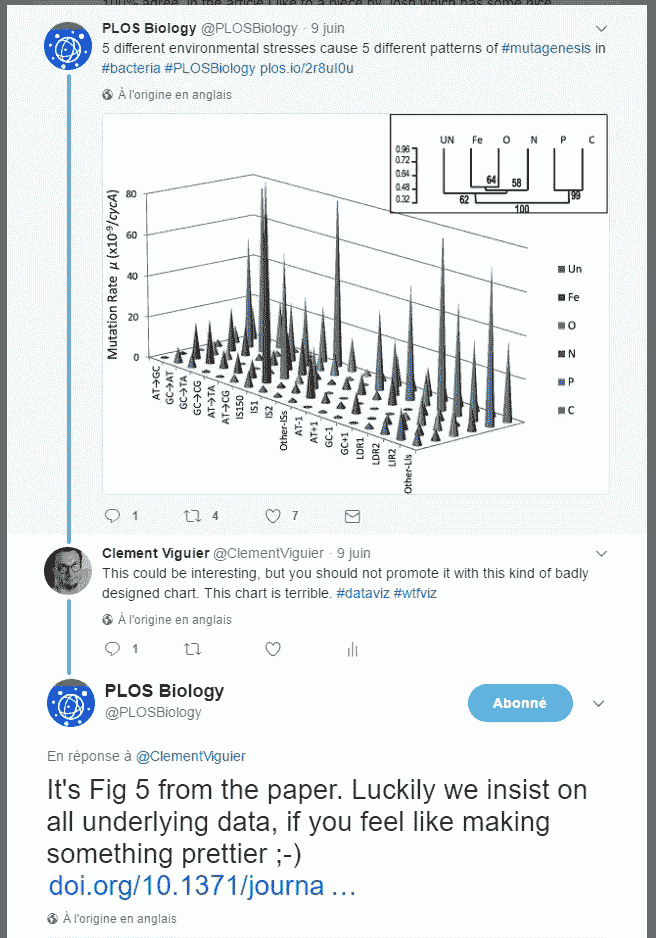
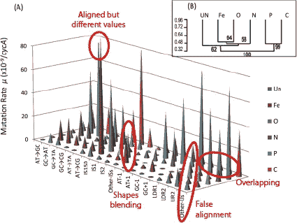
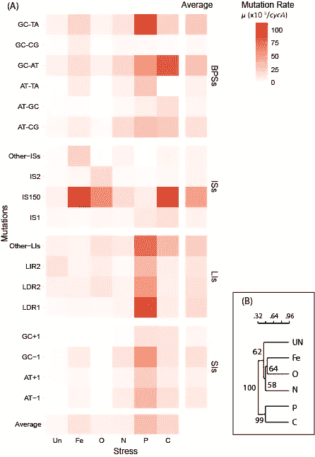
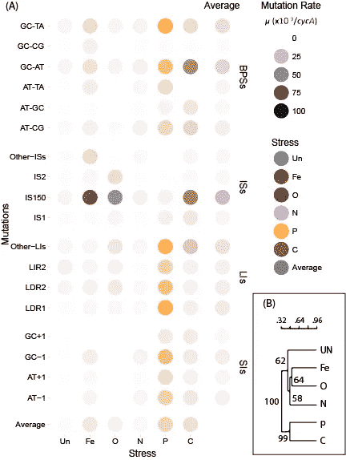
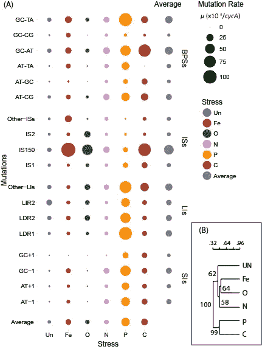
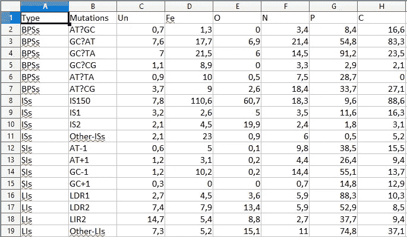
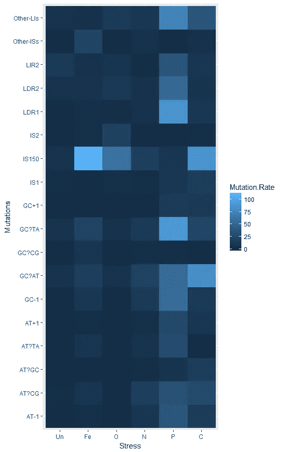
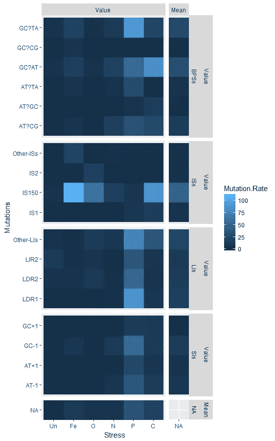

# 如何将 Twitter 评论转化为数据可视化设计机会

> 原文：<https://medium.datadriveninvestor.com/how-to-turn-a-twitter-comment-into-a-data-visualisation-design-opportunity-7447402f0c2f?source=collection_archive---------0----------------------->

## 科学的重新设计——马哈尔詹和费伦奇的大肠杆菌压力突变景观

这是我希望成为一个系列的第一篇文章。在这个系列中，我将尝试为科学数字提供替代设计，并解释设计和生产过程。



[Tweets](https://twitter.com/ClementViguier/status/873122843319386112) leading to the redesign exercise.

在本文中，我们将讨论 Ram P. Maharjan 和 Thomas Ferenci 的 3D 图表。整件事始于推特上的一条“不太好”[评论](https://twitter.com/ClementViguier/status/873122843319386112)，这条评论是我在看到一篇关于营养压力下*大肠杆菌*的突变景观[的科学文章后，写给](http://journals.plos.org/plosbiology/article?id=10.1371/journal.pbio.2001477) [PLOS Biology](http://journals.plos.org/plosbiology/) 杂志的。编辑 [Roland Roberts](https://twitter.com/RoliRoberts) 有一个非常好的回应，并要求我做得更好，并链接到所需的数据。

在我努力发展数据可视化技能的时期，这个小小的推动非常受欢迎。

所以我努力了！

# 为什么要重新设计？来推销这个信息

当解决方案已经产生时，我有什么理由花时间重新设计一个图形？不，糟糕的调色板、混乱的排列或幼稚的字体(这里不是说这种情况)通常不是重新设计的主要理由。最重要的是:**你想用这个人物**传达的信息。(但是，是的，前面提到的方面确实服务于信息，并且您应该在那些设计选择上投入一些精力)。

> (科学)数字意味着比文字更有效地向读者传递信息。

## 这里的信息是什么？

*景观*(在原图说明和文章标题中)这个词的使用并不是无辜的，他们想要表现复杂的空间特征(在这个 2D 应力-突变空间中)。他们想向我们展示不同的压力会对特定类型的突变产生特定的影响。你怎么表现出来？你必须显示每种类型突变的每种压力诱导的突变率，并允许这些值之间的比较。3D 图表可以做到这一点，但不是很好。

***编辑:*** *我可能曲解了他们想用这个数字传达的信息，对数据的解读给予了太多的重视。如果你想强调突变率之间的数量级差异，那么使用长度(比较绝对值的最佳维度)而不是颜色或 2D 大小的图表类型是有意义的，但我仍然不相信这个图表。我会试着找到一个更强调数量差异的替代方案。*

## 有哪些损害信息的设计问题？

三维图表有很多固有的问题。即使人类擅长评估 3D 空间特征，在 2D 表面上表示 3D 空间也总是具有挑战性。但这是另一个帖子的故事，我将尝试专注于更具体的方面。

通过在这里使用 3D 图表，他们想要显示景观的不均匀性，但是如果这是可观察到的，那么就很难超越这种总体感觉，实际上**读取**空间*特征。值得注意的一件有趣的事情是由磷酸盐胁迫引起的高突变率(P 或蓝柱)和插入序列 150 (IS 150)类型的相对高的突变率，它们在磷酸盐胁迫下不会导致这种类型的高突变率。这是很难看到的，因为如果 P 应力的大的影响是明显的(高的蓝色峰)，插入序列 150 的高速率是难以检测的。由于透视和峰并置造成的不对齐使该区域繁忙，图案不明显。这将在热图中显示得更清楚。*

这是一个不起作用的例子，并且是这种类型的图表所特有的。但是总的来说，许多非常小的细节使阅读变得困难，并隐藏了可能有趣的模式。以下是一些可以改进图表的东西，即使它停留在这种三维峰值图表的形式:



Details that harm the figure readability.

1.  尝试将**行名与**行对齐，以便于阅读；
2.  不要使用强烈的灯光效果(3D 表格上的高光和阴影),这会将颜色混合在一起，损害可读性；
3.  尽量在文档中保持一致，以避免读者混淆(磷酸盐从其他图中的橙色变为蓝色，碳从棕色变为橙色)；
4.  如果你对行使用标签，你也可以对列使用标签(但是你可以保留你的颜色编码)；
5.  **避免透视**产生错误的对齐或隐藏图形的整个部分(通常对于任何 3D 图表都很困难)。

这只是一些建议，但如果你只应该记住一件事，那就是:

> *不要制作三维图表，除非你确信这是最佳选择*

(如果是的话，去看心理医生😜)

# 如何对 2D 空间中的三维空间进行编码？

好吧，如果我们不能做一个三维图表，有什么替代方案可以在 2D 图表中编码三维？



*   **颜色。**由于颜色渐变，热图对变量的值进行了编码。这种颜色渐变可以是单向的，也可以是双向的，对于低值、高值以及最终的中间值，你应该非常小心地选择颜色。

优点:良好的视觉感知和比较，简单的编码，显示模式的有效方式。

缺点:绝对值读数很难(即使有标尺)，不要强调数量上的差异。



*   **透明度/饱和度。** Alpha 贴图或网格或表格用不同的透明度对变量进行编码(也适用于亮度饱和度)。它们与热图非常相似，但在形式和颜色上更具多样性。

优点:更吸引人，更自由的设计(颜色和形状)，不模糊的编码(更多的颜色=更高的价值)，不强调数量上的差异。

缺点:其他设计选择(犯错误的机会)，读取绝对值很困难，不同的颜色可能会影响相对感知。



*   **大小。**气泡图按大小对数值进行编码。众所周知，我们不太擅长阅读区域，但在有组织的布局中，这要容易得多，而且我们可以使用这种编码(特别是因为我们可能最感兴趣的是行内或列内的比较)。

优点:自解释编码，设计自由。

缺点:多值比较。

还有其他可能的选择，但这些是最明显的，并且完全实现了目标。如果你有建议，请在下面的评论中留下。

好的，我很高兴给你我的意见，告诉你一个人应该如何做他的数字，但是你怎么做上面提到的这些图表呢？这就是我下面要解释的，我们会用 r 来做。

# 用 R 怎么做这些图表？

r 是一个不可思议的统计和数据可视化工具，由于你可以在网上找到大量的工具箱和教程(而且是免费的!),对于简单的任务来说尤其容易。).

*技术提示:R 依赖于一个巨大的社区，这个社区生产包含围绕一个主题(即木工)放在一起的功能(工具)的包(工具箱)。这个包被称为库，我在下面的代码中使用了多个库。我通常倾向于把它们都放在文档的开头，但是这里我试着把它们和函数放在一起，这样你就可以把函数和包联系起来。*

*我建议你安装*[*RStudio*](http://www.rstudio.com/products/rstudio/download/)*，专用于 R 的开发环境，让 R 编码更简单。一旦我们安装并打开了 Rstudio，我们就可以开始了。*

## 1)导入并重塑数据

我对[原始数据集](https://t.co/j3FmT4Nnq0)做了一些更改，以便在 R 中有一个干净的导入，我可以将表发送给那些想要它的人，但它看起来像这样。(如果您想在 R 或其他编程语言中使用数据，避免合并单元格是一个好建议)。



Table of mutation rates per stress and mutation type.

```
# Loading the needed packages
library(readxl)#Toolbox to read xls files
library(reshape2) #Toolbox for easy transformations of the data.frame# Loading the data from the modify tablemutations <- ead_excel(“pathtofile/mutation_rates.xls”)# Melt the data with the package reshape to have a row for each stress-mutation couplemutations_m <- melt(mutations, id.vars = c(“Unit”, “Type”, “Mutations”), variable.name = “Stress”, value.name = “Mutation.Rate”)
```

数据现在被加载，并以更适合绘图的方式成形。

为了避免让代码淹没你，我将一步一步地给出热图的详细代码，你可以在这篇文章的最后找到其他图表的代码。



Proto heatmap before any formating

## 2)制作原型

一旦数据准备好了，我们就可以制作一个快速原型，看看不同变量的映射是否正确。

r 有多个创建图表的包，基本的制图工具，包 lattice，或者是最流行和最灵活的一个，由 Hadley Wickam 基于图形语法开发的 ggplot2。我是这个包的超级粉丝，这就是它在我们的例子中的工作方式:

```
library(ggplot2)
#Plotting the prototypeheatmap <- ggplot(data = mutations_m, aes(x = Stress, y = Mutations)) + geom_raster(aes(fill = Mutation.Rate)heatmap
```

现在我们有了原型热图。

## 3)增强和调整

这个数字需要润色才能发表，但在此之前，我们可以看到给这个图表带来更多信息的机会。现在在这个重新设计上很明显，磷酸盐胁迫有很强的诱变效应，而且突变 IS150 对胁迫更敏感。但是很难比较例如 2 种突变类型，因为每一行都有多个值。一个想法是将每次应激和每次突变的突变率的平均值相加。这就是我们对下面几行所做的。

```
library(dplyr) #Allows easy fancy modifications of the data.frame
#First we calculate the mean for each mutation type:means.per.mutation <- mutations_m %>% group_by(Mutations) %>% summarize(Unit = unique(Unit),
 Type = unique(Type),
 Stress = NA,
 Mutation.Rate = mean(Mutation.Rate),
 Mut.Means = “Mean”,
 Stress.Means = “Value”)#Then the mean for stresses:
means.per.stress <- mutations_m %>% group_by(Stress) %>% summarize(Unit = unique(Unit),
 Type = NA,
 Mutations = NA,
 Mutation.Rate = mean(Mutation.Rate),
 Mut.Means = “Value”,
 Stress.Means = “Mean”)#We then add default values to the original melted data.frame to avoid NAs when plottingmutations_m2 <- mutations_m
mutations_m2$Mut.Means <- “Value”
mutations_m2$Stress.Means <- “Value”#Finally we merge the data.frames and force the new variables to be factors for an easy faceting later:mutations_m2 <- rbind(mutations_m2, as.data.frame(means.per.mutation), data.frame(means.per.stress))mutations_m2$Mut.Means <- factor(mutations_m2$Mut.Means, levels = c(“Value”, “Mean”))
mutations_m2$Stress.Means <- factor(mutations_m2$Stress.Means, levels = c(“Value”, “Mean”))
```



Heatmap after faceting and adding averages

这一步也是额外格式化的时机。在数据集中，我们注意到包含突变类型的列*类型*，为什么不将突变按类型分组以增加清晰度呢？让我们借助 facet_grid 函数来实现这一点:

```
#And plotting with facets for more visibility of the different groups:heatmap_ext<- ggplot(mutations_m2, aes(x = Stress, y = Mutations)) + geom_raster(aes(fill = Mutation.Rate))+
facet_grid(Stress.Means+Type~Mut.Means, scales = “free”, space = “free”)
heatmap_ext
```

现在我们终于有了包含所有功能的最终设计。

## 4)抛光

唯一要做的事情是润色图表。手动更改所有的图形参数可能有点乏味，但幸运的是有 ggthemes 包来帮助我们。在这里，我们将去的主题是相当清醒的迎合。我们将更改热图的配色方案。

```
library(ggthemes)heatmap_ext + scale_fill_continuous(low = “white”, high = “firebrick”) + theme_pander()
```

经过 Illustrator 的额外抛光步骤，我们移除了无用的标签，并添加了原始图的第二个面板，这样，我们就有了最终的设计！


Final heatmap after theme change, color scale change and adjustments and corrections in Illustrator

希望你喜欢这个设计和教程。下面你可以找到其他两个设计的代码。如果你对我可以在这些数字上做的修改，对文章的更正，或者其他要重新设计的数字有任何建议，请在评论中告诉我。

> 最后，传达你的信息是一个品味和效率的问题。

# 关于该方法的最后说明

这是一个快速而有趣的项目，在这个项目中，我有机会为一个已公布的图形创造三种可供选择的设计。这要归功于《公共科学图书馆生物学》及其编辑的开放科学愿景(特别是第一时间回复了我的评论并链接了数据的花小蕾·罗伯兹)，它允许并鼓励科学的分享和交流。**花小蕾·罗伯茨也发表了一篇很棒的** [**博文**](http://blogs.plos.org/biologue/2017/07/05/an-unexpected-perk-of-our-data-policy/) 讲述这个小故事来凸显《华尔街日报》数据政策的重要性，我鼓励你[看看](http://blogs.plos.org/biologue/2017/07/05/an-unexpected-perk-of-our-data-policy/)。非常感谢花小蕾，你的挑战性评论给了我小小的推动。

我希望我将有机会制作更多这样的重新设计，并继续这个系列。还是那句话，**如果你有什么建议，请在下面的评论里或者在 Twitter 上告诉我**([@ ClementViguier](https://twitter.com/ClementViguier))。

回头见。注意你的身材！

克莱门特

*PS:请在下面找到另外两个重新设计的代码:*

```
#First create a palette that matches the original colourspalette_1 <- c(“royalblue”, “firebrick”, “forestgreen”, “orchid”, “darkorange”, “sienna”, “grey50”)#Then create the alpha plotalpha_plot <- ggplot(mutations_m2, aes(x= Stress, y = Mutations)) + geom_point(aes(colour = Stress, alpha = Mutation.Rate), size = 8) + scale_alpha_continuous(range = c(0,1))+ facet_grid(Stress.Means+Type ~Mut.Means, scales = “free”, space = “free”) + scale_colour_manual(values = palette_1 , na.value = “grey50” ) + theme_pander()
alpha_plot#And finally the size plotsize_plot <- ggplot(mutations_m2, aes(x= Stress, y = Mutations)) + geom_point(aes(colour = Stress, size = Mutation.Rate))+
 scale_size_continuous(range = c(0,10)) +
 facet_grid(Stress.Means+Type ~Mut.Means, scales = “free”, space = “free”) + scale_colour_manual(values = palette_1 , na.value = “grey50” ) + theme_pander()
size_plot
```