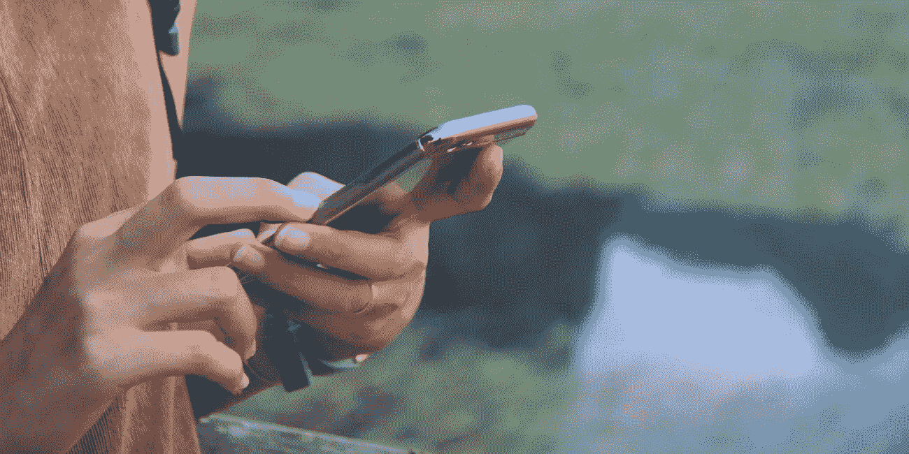

# 如何关闭 iPhone 上的政府提醒

> 原文：<https://medium.datadriveninvestor.com/how-to-turn-off-government-alerts-on-your-iphone-a508674cc74e?source=collection_archive---------24----------------------->

## 公共警报系统内置在每个手机中，作为紧急大众传播的预防工具。

*最初发表于*[*【millennialmoderator.com】*](http://millennialmoderator.com/how-to-turn-off-government-alerts-on-your-iphone)*。*

如果你有智能手机，那么你可能会收到本月早些时候发送的总统短信。警报引起了很多抱怨，其中一些是没有价值的**，例如警报是在没有警告的情况下[发出的。](https://www.vox.com/policy-and-politics/2018/10/3/17931894/emergency-alert-test-presidential-text)**

**不管公众的反应如何，警报系统肯定是大规模紧急通信的一个有价值的工具。真的没有理由去篡改这个特性。然而，出于知识的原因，事实上有一种方法可以禁用这些警报。iPhones 因吹嘘这些隐藏的功能而臭名昭著，这些功能不会引起公众的注意。**

****

# **关闭警报**

**要关闭提醒，请进入你的 iphone**设置**(不幸的是，不确定它在 Android 的什么位置)，然后选择“**通知**”。您可以在设置顶部或从 *spotlight* 搜索中搜索。滚动到页面的最底部，你会看到“**政府提醒**”部分。您可以在这里打开/关闭黄色和政府警报。**

**当你在这里时，你也应该考虑关闭你很少使用的应用程序的通知。它实际上可以帮助保护你的电池寿命，你也可以在 2018 年 12 月之前把你的手机带到苹果商店来解决这个问题。**

****

# **放弃**

**这种方法将**而不是**阻止总统警报。不过回想起来，你真的应该考虑**而不是**关闭这些警报，因为它们只打算广播最重要的紧急信息。**

**有想法或者评论？在[推特](https://twitter.com/alekseyweyman)上和我分享！**

**标记为:[技术电话](http://millennialmoderator.com/how-to-turn-off-government-alerts-on-your-iphone#)**

***最初发表于*[*【millennialmoderator.com】*](http://millennialmoderator.com/how-to-turn-off-government-alerts-on-your-iphone)*。***