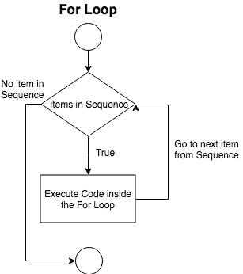
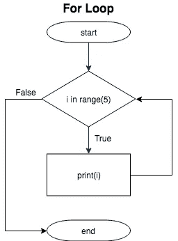
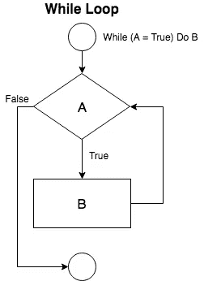
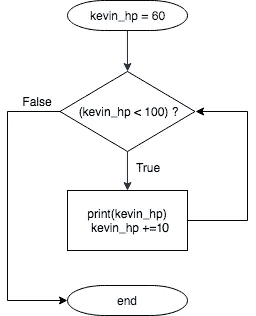

# 如何直观理解 For 和 While 循环？

> 原文：<https://medium.datadriveninvestor.com/how-to-understand-for-and-while-loop-visually-c11052479df5?source=collection_archive---------6----------------------->

如果你是 Python 或编码的新手，我想有时候循环的概念是相当令人沮丧的。有什么方法可以让你用直观的方式理解概念？是的，我们可以利用[流程图](https://en.wikipedia.org/wiki/Flowchart)，它是算法的图示。


Image credit: “spiral concrete staircase” by [Tine Ivanič](https://unsplash.com/@tine999?utm_source=medium&utm_medium=referral) on [Unsplash](https://unsplash.com?utm_source=medium&utm_medium=referral)

# **用于循环**

直觉上，你可以把自己当成厨师，篮子里有 5 个苹果。你的工作是一个接一个地削 0，1，2，3，4 号苹果。只要篮子里有一个苹果，你就会执行你的任务。



*Each process of repeating an action over a sequence of items is called iteration.

在 Python 中，For 循环用于迭代*任何序列的项目。基本上，它遵循以下步骤:

1.  **对序列中的项进行编译检查**
    如果序列中有项(True)，则执行 for 循环内的代码。如果序列中没有项目(假)，那么它将从循环中退出。
2.  **执行代码**
    执行完代码后，编译器将遍历到下一项。
3.  **返回并按顺序检查项目** 再次按顺序检查新项目。只要序列中有项目，就会执行 for 循环内部的代码。

# Python 中的 For 循环示例



```
for i in range(5):
    print(i)0
1
2
3
4
```

**第一步:**
`range(5)`生成 5 个值，分别是 0，1，2，3，4。
`i`是一个一次取一个值并先取 0 的变量。

**第二步:**
`print()`功能被执行，所以打印‘0’。

**第三步:**编译器返回循环，查看是否有条目。如果是这样，请再次执行步骤 1。

# While 循环

而回环相对来说比较直。作为一名厨师，你需要整天削苹果皮，只要给你一个停止的条件，比如一天削 500 个苹果。



只要条件为真，Python 中的 While 循环就会执行代码。

在决策形状 A 中，它将是一个条件。只要条件保持为真，就会执行块 B 中的代码。

# Python 中的 While 循环示例



```
kevin_hp = 60While kevin_hp < 100:
    print(kevin_hp)
    kevin_hp += 10 60
70
80
90
```

**第一步:** `kevin_hp`设置为 60。然后它通过 While 循环。

**第二步:**
只要`kevin_hp`小于 100，`kevin_hp`就会被打印。
然后`kevin_hp`增加 10。再次运行步骤 2，直到`kevin_hp`等于或大于 100。