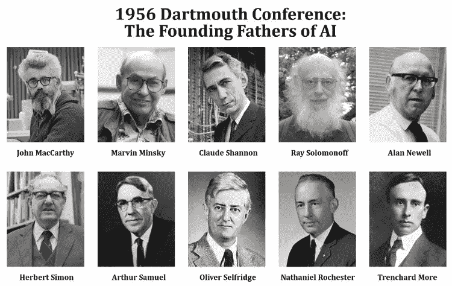

# 如何理解什么是&什么不是人工智能？

> 原文：<https://medium.datadriveninvestor.com/how-to-understand-what-is-what-is-not-artificial-intelligence-ca58e71a909f?source=collection_archive---------6----------------------->

“机器经常让我感到惊讶”，被认为是人工智能(AI)和计算之父的艾伦·图灵(Alan Turing)表示，这是我们在短期内可以看到的潜力的一个迹象。

# 人工智能的诞生

人工智能的概念诞生于 1956 年，一群有远见的人对建造一台机器感兴趣，这台机器像人一样聪明，并被发现是成功的。在达特茅斯大学的一次会议上首次展示时，作为超级智能计算机的一个例子，它能够执行各种功能。

激起了如此大的热情，以至于来自好莱坞的科幻作家、创意者和编剧都在探索各种可能性，他们对机器人和人类共存的世界有着从最乐观到最担忧的愿景，然而，在 20 世纪 70 年代和 80 年代，“人工智能的冬天”席卷而来。

# 人工智能在 80 年代和 90 年代的活动

如果这是最诱人、最有前途的想法之一，那么没有人愿意投资研究或技术开发。成本非常大，但投资回报却没有任何实际结果。虽然在 80 年代，日本政府就开始投入资源，但直到互联网的到来，90 年代中期，这个词才以更大的力量回来。

但是我们所说的“人工智能”是什么意思呢？机器可以执行复杂的动作，如图像识别、处理人类语言或为产品和服务的消费提供个性化建议。

虽然计算机仍然是电子设备，它们唯一能处理的是 0 和 1，但它们的算法和过去 10 年的所有处理器，如 GPU(图形处理器)，使这类智能算法能够执行这些任务，直到 10 年前这些任务似乎是不可能的，只是被视为科幻小说的一部分。

# 人工智能的重要性

人工智能最重要的特点是它基于非常复杂的统计数学模型，这使它能够对大量复杂的数据进行抽象，并设法将它们分割到最小。这些小数据中的每一个都代表一个微任务，用于统计评估以生成预测。相反，所有这些预测的总和就是让 AI 执行这些复杂任务的原因。这对于理解和区分是非常重要的，因为有很多关于理解和推理能力的错误信息，这些能力直到现在都是人类独有的技能。当前的人工智能，正如它执行的任务一样令人惊讶，仍然是一种算法，它所能做的只是处理数据和做出统计决策。没有一台计算机有良心或推理能力；它们只是能够以极快的速度执行数百万项任务。

# 人工智能的分类

人工智能可以分为两种类型:狭义或垂直，以指定那些允许以很高的效率解决特定任务的算法。这里有自动驾驶汽车、语音助手、语言翻译机、互联网推荐引擎等。在这种类型的人工智能中，是“机器学习”的子类别，由数学方程组成，它可以识别模式，并将结果作为输入数据的一部分，以完善模型本身。

换句话说，这些算法评估结果，并利用它们调整某些变量的权重，以获得更准确的未来结果，因此有了“学习”类比。

人工智能的另一个类别是所谓的“通用”，它尚不存在，指的是机器发展出与人类良知非常相似的东西，并转化为自主决策的可能性。

# 人工智能理论

理论上，硬件处理能力的增加和当前人工智能算法的结合可以产生反射和推理能力。然而，争论是非常大的，主要原因是，正如我们到目前为止提到的，没有任何东西类似于这种智能。

事实是人工智能的冬天已经过去，我们确信图灵感受到的惊喜将继续伴随我们进入这个新的技术阶段。毫无疑问，极限是想象力。