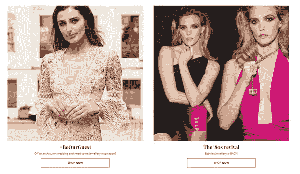
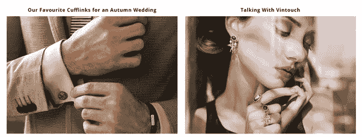
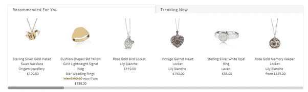
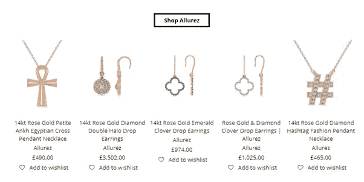

# 如何用 AI 传递品质与关怀

> 原文：<https://medium.datadriveninvestor.com/how-to-use-ai-to-convey-quality-and-care-db2f24e48223?source=collection_archive---------63----------------------->

## 了解奢侈珠宝品牌如何在线传达关怀和品质

How can you convince customers to invest in luxury jewellery when you’re online?

你对质量有眼光，对奢侈品有品味吗？你更喜欢人类的感觉，更注重质量而不是数量吗？你有兴趣支持全世界有创造力的人吗？那你和 JewelStreet 有共同点了。

JewelStreet 选择 PureClarity 作为其个性化提供商。通过依靠我们的人工智能提供现场个性化推荐，JewelStreet 能够重新专注于对他们真正重要的事情:创造美丽的视觉效果、丰富的内容和最优质的客户服务。

# 犹太人的故事

JewelStreet 是一个在线平台，拥有来自世界各地的 500 多个珠宝品牌。他们致力于给有才华的设计师一个接触新观众的家，新观众会欣赏他们的作品。JewelStreet 专注于独特的设计和世界级的客户服务，为其挑剔的客户群采购高品质的珠宝。

因为他们的产品是独一无二的，而且是手工挑选的，所以不便宜。JewelStreet 找到了一种方式来传达他们的卓越和质量，并特别致力于客户支持，以证明他们对客户的价值。

# 什么对他们有效

犹太街是关于发现和探索的。穿越他们的网站是一次迷人的、启示性的、美妙的经历。浏览他们的网页，发现引人注目的，有趣的摄影作品，突出和展示新的趋势。

JewelStreet showcases new trends

他们网站上的每一部分珠宝都有令人惊叹的例子，吸引你去发现更多。

Gold jewellery never looked more enticing

JewelStreet 的内容非常丰富，有关于伦敦时装周珠宝趋势的热门文章，了解他们的设计师，珠宝所有者在保养方面的技巧和诀窍。

这给他们的网站一种专家的感觉，仍然非常热情、友好和有吸引力。

Providing customers with a personal connection to their creators

# 在线交流质量

JewelStreet 强调每一次进入他们选择过程的关心和思考。无论你是在阅读他们的创作者之一的简介，还是在浏览他们的“激励我”部分，通过近距离、华丽的照片以及名人和模特的照片，可以明显看出，他们在珠宝选择中重视价值和卓越。

# 他们如何使用 PureClarity

JewelStreet 专注于提供内容、质量和与客户联系的时间，因此他们依赖 PureClarity 的人工智能来提供相关的热门推荐。这让他们知道，他们的客户将看到量身定制的建议，而他们专注于策展优质收藏。

Combining the personal touch with some social proof

让访问者看到个性化推荐的选项会让他们感到被重视和被关心，这符合网站的整体信息。他们还可以在“现在趋势”标签中看到其他购物者在看什么。

After reading about Allurez, visitors can sample their quality for themselve

After reading about Allurez, visitors can sample their quality for themselves

JewelStreet 在他们的网站上到处寻找沟通质量和关怀的方法，向他们的客户证明，通过给有抱负的创意者一个平台，并向他们的客户提供质量，他们的选择是值得的。

通过使用人工智能策略，让机器学习挑选出最好的作品展示给每位游客，他们可以专注于发现最好的珠宝并支持他们的客户。自从加入 PureClarity 以来，JewelStreet 的平均订单价值增加了[83%](https://www.pureclarity.com/case-studies/jewel-street/),而没有牺牲对他们真正重要的价值。

[与我们联系](https://www.pureclarity.com/)，了解 PureClarity 如何帮助 JewelStreet 为其客户提供令人难以置信的体验，同时提高转化率、平均订单价值和收入。安排一个一对一的演示，看看我们如何在你的网站上使用个性化来做同样的事情，或者[立即开始](https://www.pureclarity.com/free-trial/)14 天的免费试用。