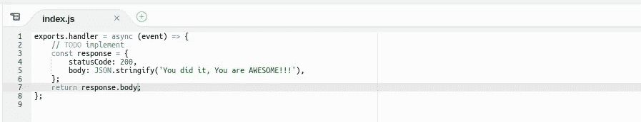
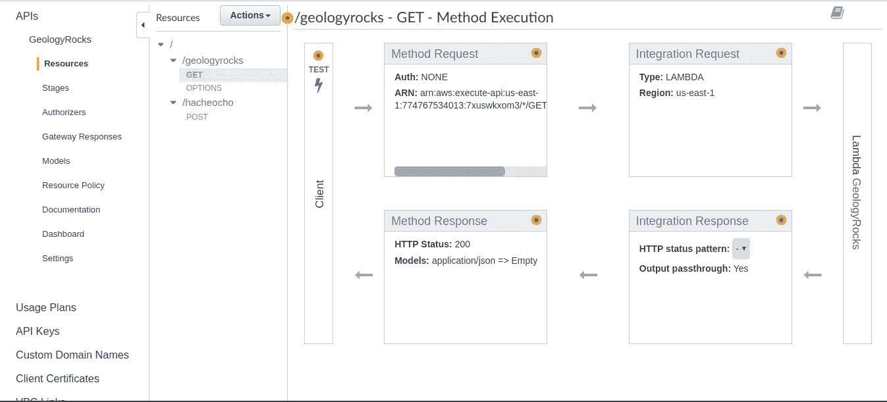
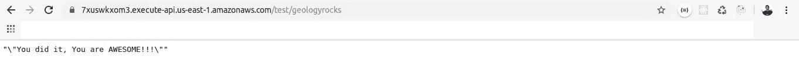
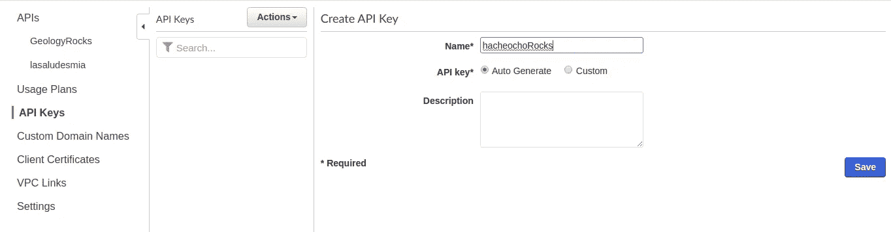
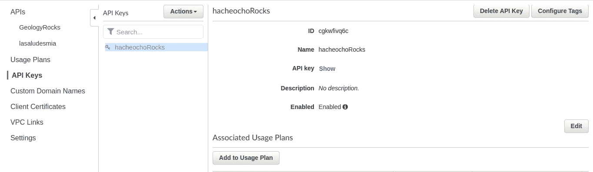
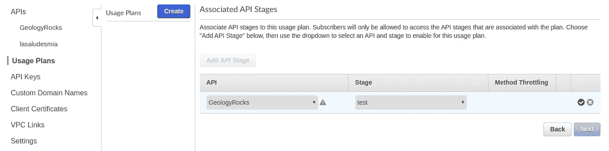
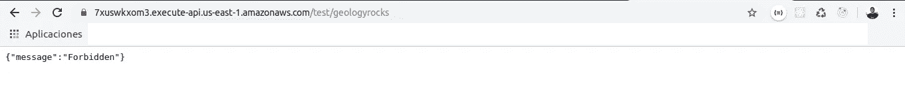
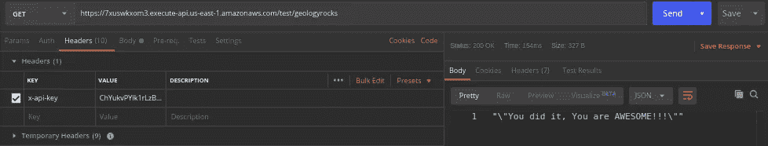

# 如何在 API 网关中使用 API-Keys 和使用计划？

> 原文：<https://medium.datadriveninvestor.com/how-to-use-api-keys-and-usage-plan-in-apigateway-b55f5f8a361b?source=collection_archive---------0----------------------->

How to use **Api-Key** and **Usage Plans** in **API Gateway**

在本教程中，我们将使用 *AWS* ( **API 网关**)提供的工具创建一个 **API 密钥**和一个**使用计划**。 **API 密钥**可以自动生成，或者您可以用. CSV 文件导入它们，它们用于让其他用户访问我们创建的 API。**使用计划**用于限制一段时间内的请求数量，也用于出于经济原因限制 API 的使用。如果你想了解更多，我推荐你点击[**这里**](https://aws.amazon.com/about-aws/whats-new/2016/08/introducing-amazon-api-gateway-usage-plans/) **。**

**Fig. 1** When you create your **Lambda** this is the default function that gives you.

做这个教程不需要广博的知识，但是我们必须具备用 **AWS Lambda** ( **图 1** )创建函数的基础知识，以便创建一个能够用消息响应我们的函数，能够使用 ***GET*** M *方法* ( **图 2**测试我们的 *API* ***资源*******

**Fig. 2** In this image you can see all the flow through which the API passes

1.  第一个测试是使用 ***获取*** *方法*，而不使用必需的 **API 键**或**使用计划**。
2.  第二个测试是配置我们的 *API* 来要求一个 **API 键**和一个**使用计划**，但是不在头中使用它。
3.  最后一个测试是使用标题中的*自动生成* **API 键**。

 [## 雅虎财经 API |数据驱动投资者的 6 种替代方案

### 长期以来，雅虎金融 API 一直是许多数据驱动型投资者的可靠工具。许多人依赖于他们的…

www.datadriveninvestor.com](https://www.datadriveninvestor.com/2019/02/25/6-alternatives-to-the-yahoo-finance-api/) 

让我们开始吧；已经有了您的 **Lambda 函数**和您的 *API* *资源*和一个 ***Get*** M *方法*，我们将在我们最喜欢的浏览器中测试它以查看响应(**图 3** )，记住每次您在 **API Gateway** 中对 API 进行更改时，有必要在

**Fig. 3** Result of calling the **Resource** /geologyrocks with the M**ethod** GET with out using **API Key** as a required.

现在我们将创建一个 **API 键**和一个**使用计划**来限制我们 API 的使用。点击窗口左侧的 **API 键**部分。之后，点击**动作**并选择**创建 API 键**，你必须给它一个*名称*到 API 键，最后点击**保存**(图 4**)。**

****

****Fig. 4****

****

****Fig. 5****

**下一个窗口(**图 5** )将显示我们已经自动生成的 **API 键**的元素，点击**显示**以查看自动生成的 **API 键**。现在，我们将为我们的 *API 资源*设置一些使用限制，点击**添加使用计划**。**

****使用计划**允许我们设置参数来限制我们的 API 的使用，这些参数是:**

1.  ****名称****
2.  ****描述****
3.  ****启用节流****
4.  ****速率** — *每秒的请求数(仅当启用节流被选中时)***
5.  ****突发**——*令牌桶容量***
6.  ****启用配额****
7.  ***在最后一个输入中，您决定每月、每周或每天允许多少个配额请求。***

**我们将创建一个**使用计划**来限制我们的 API 的使用。点击**添加使用计划**(此按钮在您创建 API 密钥后出现)，您也可以点击窗口左栏中的**使用计划**。一旦您设置了基本**使用计划**参数，您将在**图 6** 中看到该窗口。在此窗口中，您可以选择应用这些限制的 API。**

****

**Fig. 6 Selects the **API** to add it a **Usage Plan**, select the **Stage** accept and finally click on **Next.****

**我们已经有了我们的 **API 键**，我们将在 *API* *Get 方法资源*中设置它。选择*方法请求*并在选项**需要 API 密钥**中选择**真**。请记住，在测试 API 之前，必须保存它们。点击**动作**并选择**部署 API** 。**

**现在我们可以测试我们的 *API* ( **图 7** )。**

****

****Fig. 7** If you don't use your **API Key** inside the header's properties this is the message that **API Gateway** sends you.**

**现在的问题是我们如何以及在哪里应用这个 API 密钥？，答案是这个 API Key 必须在 header 的属性里面，这个属性就是 **x-api-key** 。了解了这一点，我们现在就用 *Postman* 测试这个头，看看给我们发了什么消息(**图 8** )。**

****

****Fig. 8** Select the **Headers** tab and inside the column **Key** add the header **x-api-key,** now in the column **Value** use theAPI Key value**.****

**很容易，不是吗？现在你知道了如何使用 **API 键**以及如何通过 *AWS* 使用 *API Gatewa* y 的使用计划来限制 API 的使用。**

**如果你有什么意见，可以发邮件到 ca.ortiz.pacheco@gmail.com 给我**