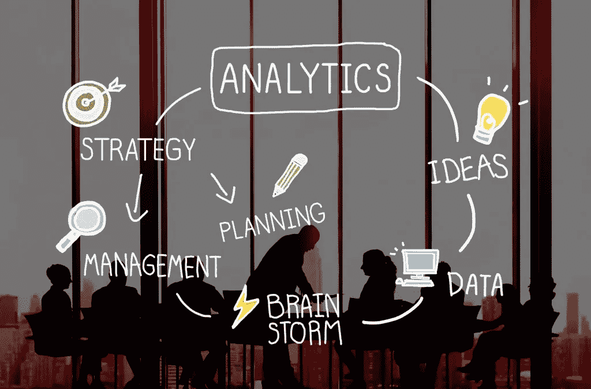

# 小公司如何利用大数据营销？

> 原文：<https://medium.datadriveninvestor.com/how-to-use-big-data-marketing-in-small-companies-3ab50ab632ac?source=collection_archive---------16----------------------->

## 在过去的十年里，小公司的数量持续增长的一个主要原因是，他们拥有互联网。在数字营销的帮助下，他们可以与市场上的大公司竞争。

因此，如果他们在数字世界使用正确的营销策略，他们可以被潜在客户注意到。然而，数字营销的成功之路并不平坦。作为一个小公司的老板/经理，你可能会遇到许多障碍和挑战。

 [## 为什么数据将改变投资管理|数据驱动的投资者

### 有人称之为“新石油”虽然它与黑金没有什么相似之处，但它的不断商品化…

www.datadriveninvestor.com](https://www.datadriveninvestor.com/2019/01/25/why-data-will-transform-investment-management/) 

一个好的营销人员和其他领域的专业人士可以帮助你想出一个承诺积极结果的数字营销策略。

# 什么是大数据营销？

顾名思义，大数据营销是一种依托大数据的营销类型。大数据是一个宽泛的术语，用来描述海量数据。它可能来自计算机、服务器和相互交互的个人。

很明显，这个术语在 20 年前还不是很流行，当时这个数据量是有限的。今天，地球上一半以上的人口经常使用互联网。当然，他们一直在提供和分享数据。因此，大数据营销就是使用大量数据来增强他们的数字营销战略。

尽管这听起来像是大公司的专有活动。事实是，由于特殊的工具和行之有效的策略，即使是小公司也可以从大数据营销中受益。

# 小公司为什么要用大数据营销？

小公司使用大数据营销的优势清单相当长。这就是为什么我们只强调其中的几个。首先，借助大数据和数据分析，你将能够创建更加个性化的营销信息和产品。

[大数据有助于您识别您的受众，并更精确地描述目标客户](https://www.solveo.co/predict-customer-behavior-with-data-analysis/)。这种类型的营销也可以帮助商业人士做出和利用更准确的产品见解。你还可以优化分销和生产策略。

# 以正确的方式在小公司中使用大数据营销

既然我们已经清除了所有关于大数据营销有用性的困境，那么是时候向您展示如何在小公司 中使用 [**。你应该做的第一件事是提出问题。他们将支持您的企业优化数字营销风险所需的答案。**](https://www.forbes.com/sites/forbestechcouncil/2017/05/26/how-your-small-business-can-make-use-of-big-data-now/#4872276f2dc6)

例如，有些小公司希望最大化网站的转化率(将访问者转化为客户)。如果你有一份名单，上面列有访问过你的网站、在网站上停留超过一分钟查看你的时事通讯或博客、和/或与他人分享你的内容的人，这肯定意味着你有一个潜在的买家。

得益于大数据，一旦潜在买家以这种方式参与到你的报价中，当你想把他们变成真正的买家时，你将能够找到哪些营销活动是最好的。

# 做出明智而准确的决策

使用谷歌分析(Google Analytics)这样的工具进行数据分析是有帮助的，但如果你使用大数据，你可以获得你需要的所有细节。例如，由于依赖算法的预测，你将能够评估你的营销活动对网站访问者的效率，并找出谁应该通过电子邮件获得特别促销，或者谁应该获得焦点小组的邀请。

大数据营销帮助商业人士了解他们的业务和目标受众的许多事情。他们通过这种方式获得的信息将有助于他们做出与真正对你的产品感兴趣的客户群相关的明智而准确的决策。

此外，你可以利用战略，可以加强你的品牌名称。此外，他们会发现一个好的营销信息，可以帮助你获得更多的销售。

作为一家小公司，你可以通过许多不同的方式来使用大数据营销。显然，这个活动有很多好处。为了访问大数据并将其用于营销目的，您有两种选择。首先，你可以创建一个 IT 部门，它将成为你公司的一部分。但是，这是一个昂贵的解决方案。

你的另一个选择是雇佣一个 [**营销代理公司，以合理的价格**](https://www.solveo.co/what-can-small-consultancy-do-for-your-business/) 提供大数据营销服务。这绝对是一个更好的选择，不仅因为你会省钱，还因为你会时不时(不是一直)需要大数据营销活动。