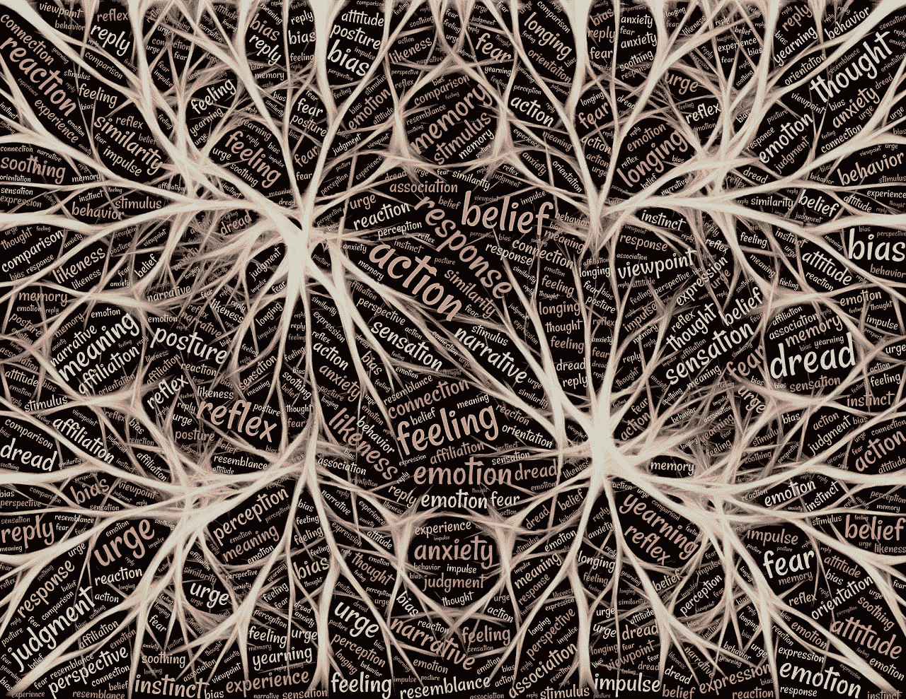
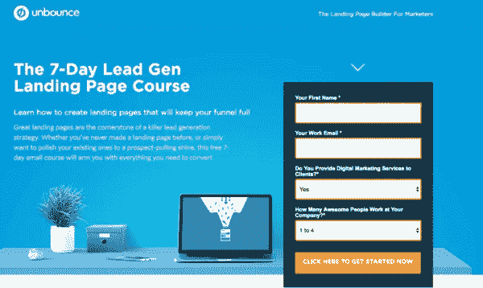
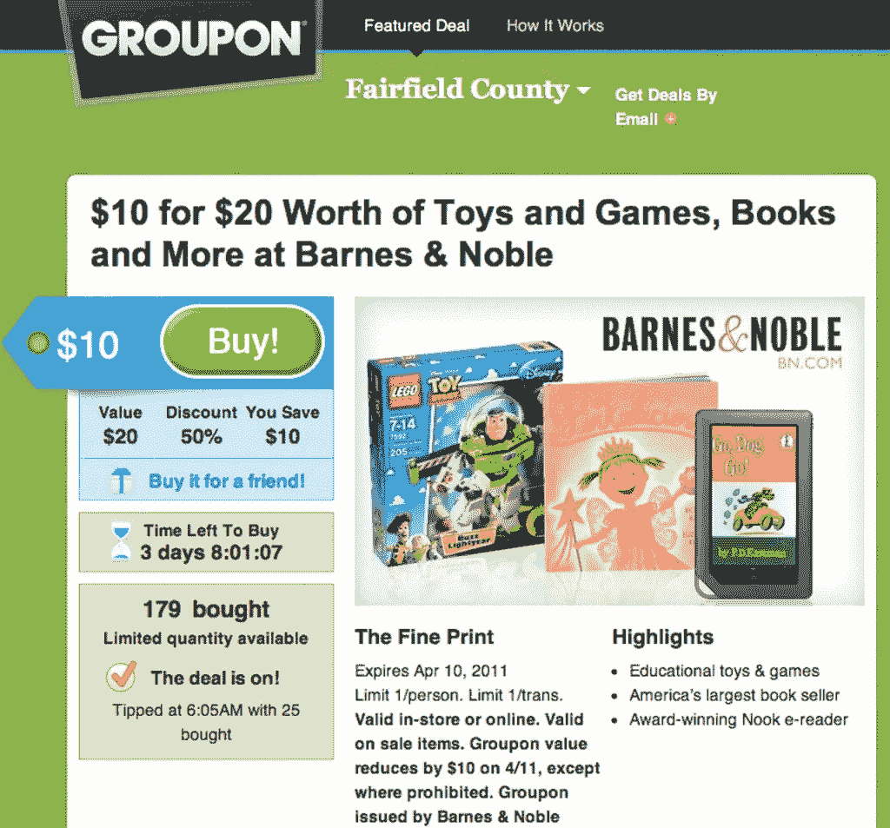
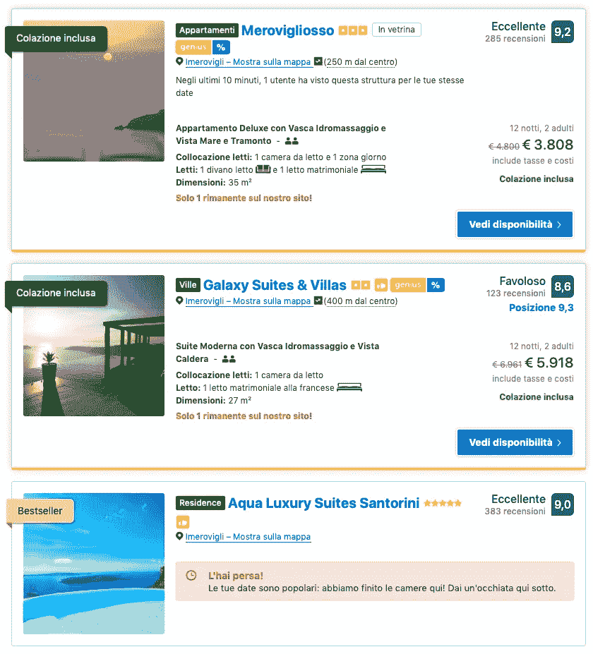
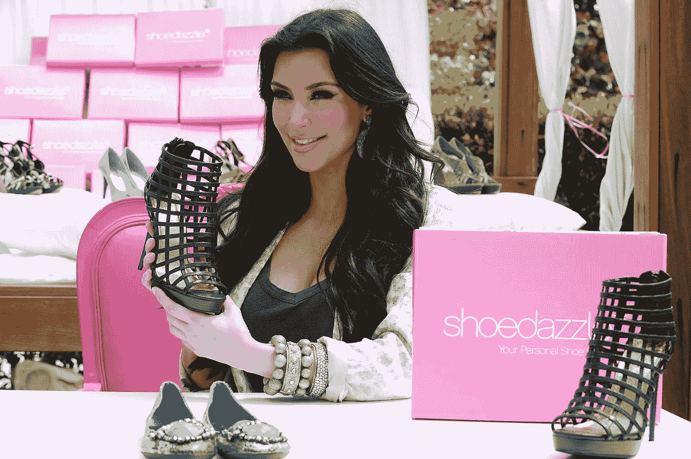
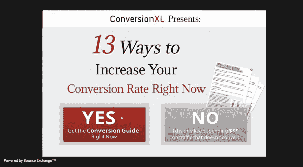

# 如何使用恰尔蒂尼的 6 项说服原则来提高销售转化率

> 原文：<https://medium.datadriveninvestor.com/how-to-use-cialdinis-6-principles-of-persuasion-to-boost-sales-conversions-6c20c7e68b15?source=collection_archive---------8----------------------->

通过这里解释的一些例子，以正确的方式运用恰尔迪尼的原则，转化更多的销售线索和销售。

Image by [John Hain](https://pixabay.com/users/johnhain-352999/?utm_source=link-attribution&utm_medium=referral&utm_campaign=image&utm_content=2301393) from [Pixabay](https://pixabay.com/?utm_source=link-attribution&utm_medium=referral&utm_campaign=image&utm_content=2301393)

# **说服的 6 项原则**

1.  相互作用
2.  稀缺
3.  权威
4.  承诺
5.  爱好
6.  共识(或社会证明)

# 1.相互作用

这是基于简单的人类心理学:我们讨厌感觉亏欠他人！当人们为我们做事时，我们觉得有义务回报他们。在接受和给予之间的差距中产生的内心紧张往往是如此强大，以至于我们愿意付出任何东西作为回报，只是为了减少这种不适。

 [## 准备在 2019 年改变世界的技术-数据驱动的投资者

### 很难想象一项技术会像去年的区块链一样受到如此多的关注，但是……

www.datadriveninvestor.com](https://www.datadriveninvestor.com/2019/01/17/the-technologies-poised-to-change-the-world-in-2019/) 

**–例如:**创建一个登录页面，在这里，作为电子邮件地址的交换，您可以与您的销售线索分享一些有趣的内容。

[Unbounce](https://unbounce.com) landing page

## 一些有趣的资源

我在 [Awwwards](https://medium.com/u/187eb2a15fc2?source=post_page-----6c20c7e68b15--------------------------------) 上发现了一篇关于[着陆页面设计背后的科学](https://www.awwwards.com/the-science-behind-landing-page-designs.html)的有趣文章，它解释了基于颜色和文本格式的不同 A/B 测试如何改变转化率。

你可以在 [Unbounce](https://medium.com/u/eda63d4fd9e4?source=post_page-----6c20c7e68b15--------------------------------) 网站查看[这个链接](https://unbounce.com/resources/)上找到一些建立转换平台的指南。

# **2。稀缺性**

1975 年，三名研究人员，沃切尔、莉·阿德沃勒，想要找出人们如何评价两个相同玻璃罐中的饼干。一个罐子里有十块饼干，而另一个罐子里只有两块。

人们最喜欢哪种饼干？

两个花瓶里的饼干是一样的，但是参与者认为几乎空了的花瓶里的饼干价值更高。

> 稀缺现象会影响他们对价值的感知

这个例子摘自我读过的《上钩》一书，作者是 [Nir Eyal](https://medium.com/u/295258f6269d?source=post_page-----6c20c7e68b15--------------------------------) ，书中解释了当今硅谷通过心理圈钩子吸引新客户的不同方法。

稀缺通过*预期后悔*起作用，我们思考未来，看到自己后悔没有做出行动的决定。当我们思考未来时，我们不仅预测事件，我们也体验相关的情绪。这种当下的情绪会驱动当下的决定。

**——例子:** *创建一个倒计时，在网站、电商或者别的什么地方，在这段时间内推广一个有趣的折扣。*

关于这种说服，你可以采用几种方法:

## 基于时间的稀缺

例如，你可以在 Groupon 和易贝的产品页面上找到。

[Groupon](https://groupon.com) introduced a strong use of scarcity

## 股票稀缺

[Booking](https://booking.com) is a great example

# 3.权威

年轻女性购物者中的权威人物，例如珍妮弗·安妮斯顿，会去看她穿的衣服或者她最新的鞋子。她对产品的认可，符合观众的感受和兴趣，可能会对销售和品牌知名度产生巨大影响。

**–例如:** *您需要在您感兴趣投资或推广产品的细分市场中，邀请一位重要人物或重要影响者，与他/她建立合作伙伴关系/赞助关系，以实现销售增长。*

Kim Kardashian endorsement on Shoedazzle — [Rolling Stones](https://www.rollingstone.com/tv/tv-lists/20-lost-kim-kardashian-pop-culture-moments-74900/)

有三个因素触发了权威原则，你可以用它来推广你的电子商务产品:

1.  **头衔** —博士、教授、博士、总裁、董事长、创始人、CEO、行业专家；
2.  **服装** —制服、西装、宗教服装；
3.  **服饰** —与特定职位/角色相匹配的配饰(如警徽、昂贵的西装、漂亮的汽车等)。).

# 4.承诺

我们人类非常需要被视为始终如一。从心理学的角度来看，这可以解释为，人们已经将这种承诺建立为与他们的自我形象相一致。

运用这一原则进行说服的一个重要因素是，这个人觉得他们做出了一个自由的选择。如果他们感到被胁迫或被迫，他们可以解释他们的选择，说他们是“被迫”做出这个决定的。当他们相信自己做出了自由的选择时，他们会觉得自己要为自己的决定负责，并试图证明自己的决定是正确的。

**–示例:** *一位使用过免费样品的顾客发现，一旦使用过该商品，他会更愿意购买。*

A modal from [CXL Institute](https://conversionxl.com/institute/) Website

在上例中，您可以看到红色的“是”按钮，其中几乎没有描述性信息来吸引客户的选择。

注册简讯后，您可以继续创建培养工作流，以吸引您的销售线索进入下一阶段。

# 5.爱好

是基于和你圈子里的人分享你喜欢的东西。

这一原则可以通过以下方式应用于转化:
一家想要提高转化率的公司只需专注于为客户创造令人印象深刻的内容，以便参与分享。

**–例如:** *一个精心制作的简单的“关于我们”页面可能是吸引客户的有趣诱饵，因为它的内容可以告诉潜在买家公司和他们之间的相似之处。*

Physical attractiveness: a female model sitting in Lamborghini

你可以在你的电子商务中运用喜欢原则的五个因素来提高转化率:

1.  外表吸引力——诚实、幽默、值得信赖
2.  **相似性** —我们喜欢在兴趣、观点、性格、背景方面与我们相似的人。优秀的销售人员通常会模仿你的口音、措辞和/或肢体语言，以获得你的信任并达成交易。
3.  **赞美** —我们喜欢接受赞美，也喜欢给予赞美的人。
4.  **联系与合作** —我们喜欢乐于助人的人。
5.  条件反射和联想——我们喜欢和我们有共同价值观的人。

# 6.共识还是社会证明

它通过我们需要被他人尊重和避免被嘲笑等社会遗憾来发挥作用。

在一个著名的实验中，所罗门·阿希给一群人看三条线，并问哪条最短。实验对象不知道的是，其他人都在一个小丑里。当他们都选择了错误的答案时，大多数受试者也选择了错误的答案，而不是面对不同。

**——例子:** *一个广告人向可能有家庭的人推销商品，展示了一个幸福的家庭。*

# 👉查看我的网站，阅读其他关于数据分析、营销自动化和机器学习的文章。