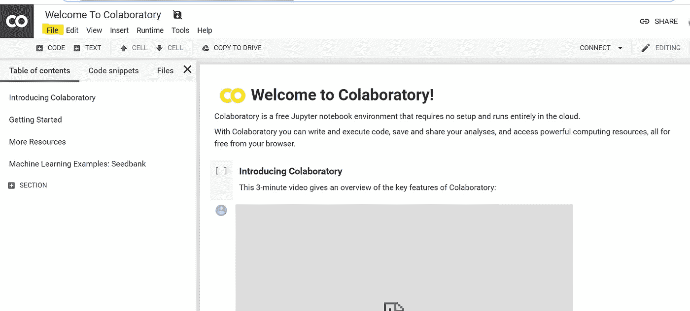
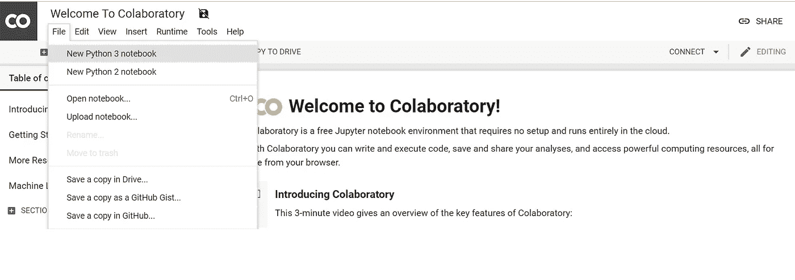
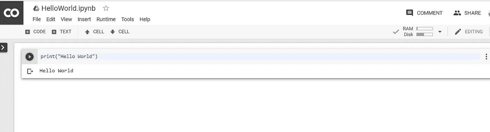

# 如何使用谷歌 Colab

> 原文：<https://medium.datadriveninvestor.com/how-to-use-google-colab-a7affa47b0f6?source=collection_archive---------10----------------------->

你好，你刚刚被告知 python，想尝试一些教程，但没有安装它。不要绝望，帮助正在路上，它的形式是 Google Colab。

Google Colab

你如何使用谷歌 Colab？

 [## 2019 年最值得学习的编码语言——数据驱动的投资者

### 在我读大学的那几年，我跳过了很多次夜游去学习 Java，希望有一天它能帮助我在…

www.datadriveninvestor.com](https://www.datadriveninvestor.com/2019/02/21/best-coding-languages-to-learn-in-2019/) 

你先去参观

 [## 谷歌联合实验室

### 编辑描述

colab.research.google.com](https://colab.research.google.com/notebooks/welcome.ipynb) 

然后点击用黄色突出显示的文件。

click on file

然后你点击**新的 PYTHON 3 笔记本**以灰色突出显示

New python 3 notebook

这将把您带到一个平台，在那里您可以练习代码，如示例所示。

hello world

是的，就这么简单