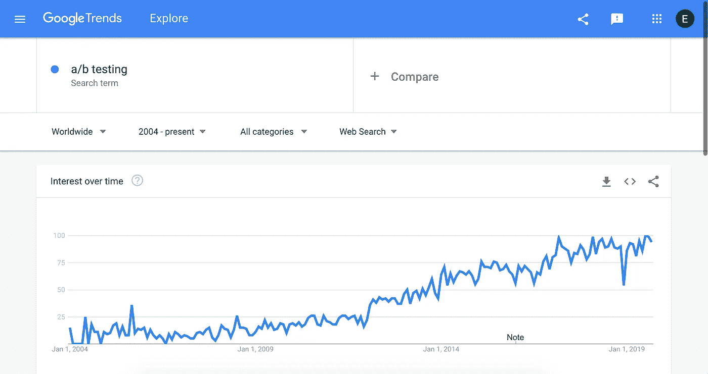
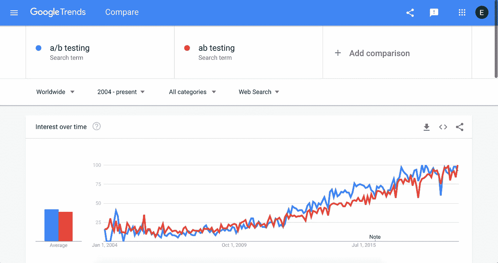
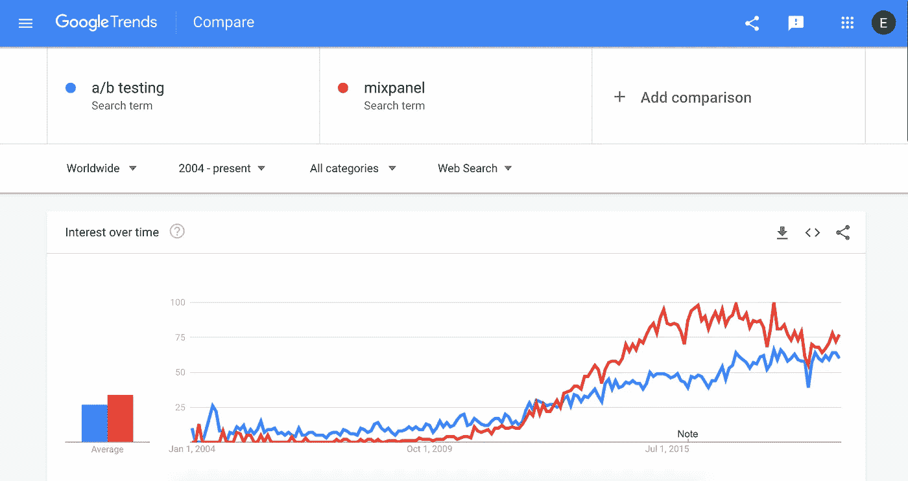
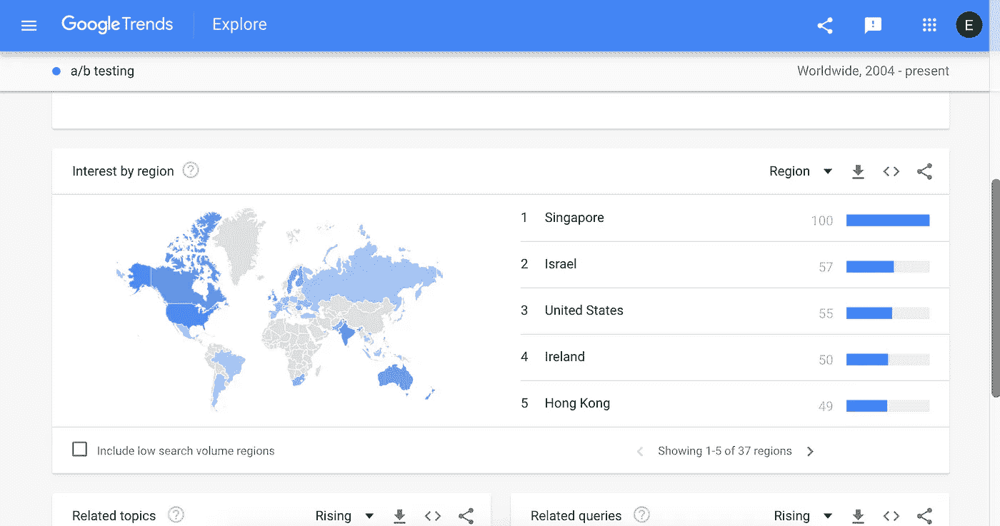
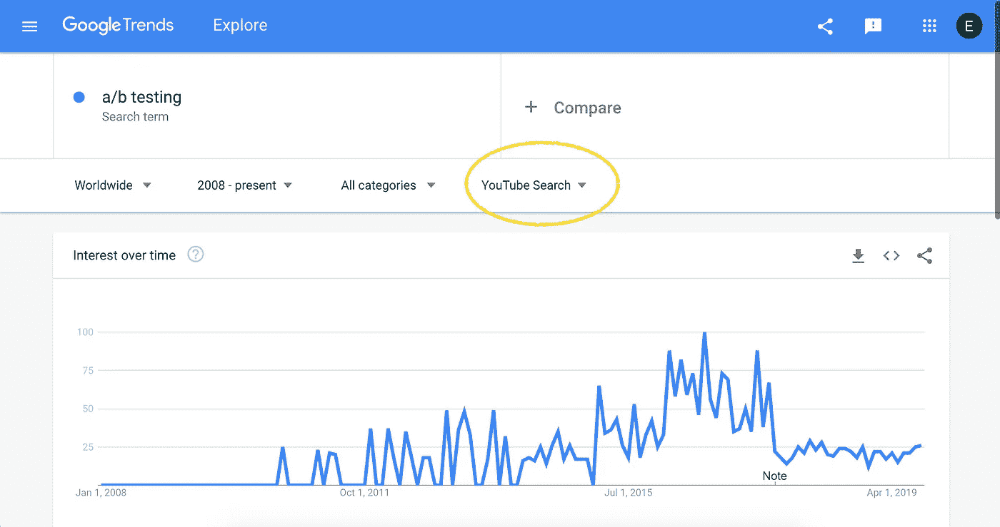

# 如何使用谷歌趋势来评估你的创业想法市场

> 原文：<https://medium.datadriveninvestor.com/how-to-use-google-trends-to-evaluate-your-startup-idea-market-4a638cbf2f60?source=collection_archive---------3----------------------->

当研究一个创业想法时， [Google Trends](https://trends.google.com/trends/?geo=US) 是分析你的市场的最有价值的资源之一。这里有 5 种方法使用这个工具来获得洞察力，这可能会改变你对你的想法的思考方式。

# 1.一段时间的趋势

趋势最简单也是最典型的用法是观察你的想法在谷歌上的搜索量是如何随时间变化的。

只需加入您的搜索团队，并将日期过滤器更改为可用的最长时间段(在撰写本文时为 2004 年)。您可以在这里看到，A/B 测试在过去 15 年中一直稳步增长！

 [## 睁大眼睛冲破多样性壁垒|数据驱动的投资者

### “科技女性”是蒂芙尼·霍兰的激情之一，最初她在 Twitter 上主持“科技女性”聊天。她也是一个…

www.datadriveninvestor.com](https://www.datadriveninvestor.com/2019/03/20/hurtle-diversity-barriers-with-eyes-wide-open/) 

此处需要注意的事项:

*   *增长还是下降*:你们市场的趋势是什么？这与其他趋势相关吗？
*   *稳定或尖刺*:从 0 到 100 上下的尖刺图表明搜索量非常低。
*   季节性:一年中的某些时间与你的搜索更相关吗？
*   *关键事件*:某些拐点，成交量发生变化

值得注意的是，所有图表都是相对的，即相对于该时间窗口内达到的最大成交量。

# 2.拼写变体

请注意检查您的搜索的不同拼写变体。人们在搜索时会改变他们的标点符号或措辞，你需要在你的分析中捕捉整个搜索流量。

# 3.量和相关性的基准

增加第二个搜索小组进行比较，可以开辟多种新的调查途径。

要尝试的事情:

*   *数量基准*:例如，如果你在 mixpanel 工作，你可能知道搜索流量的大概数量——所以把这个加进去会让你知道你的其他搜索词的数量
*   *竞争对手检查:*尝试市场上已有的产品名称，并查看其搜索趋势
*   *相关趋势*:尝试下面“相关查询”框中的短语，查找相关搜索并检查相关性

# 4.地理课

你可能有兴趣了解你的想法在世界上哪个地方最有吸引力。为此使用地图！请注意语言和本地化的考虑。

# 5.频道检查

最后，你可能会惊讶地发现，网络搜索并不是唯一与你的想法相关的谷歌渠道！不要忘记使用频道下拉菜单检查图像搜索和 YouTube 搜索。

# 摘要

你可以通过谷歌趋势做更多的事情，但是这些步骤是一个很好的开始，你很可能会发现一些你不知道的关于你的市场的东西。