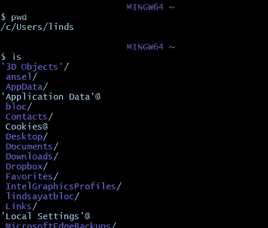
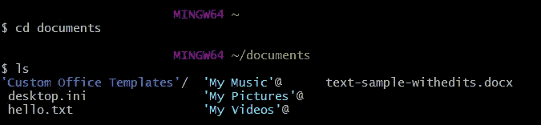
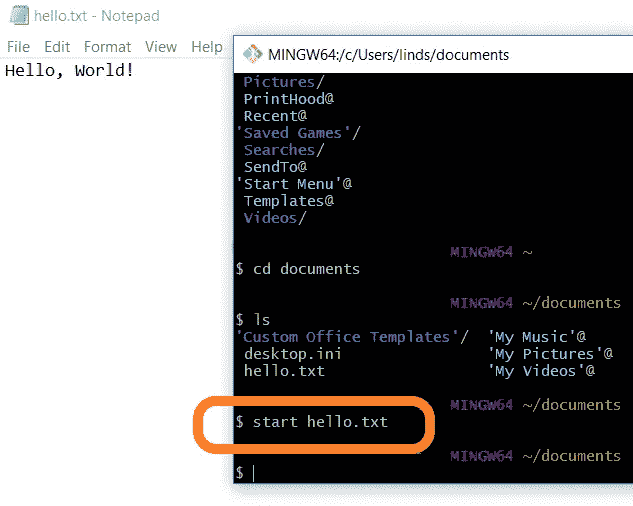

# 如何使用命令行感觉自己像个黑客

> 原文：<https://medium.datadriveninvestor.com/how-to-use-the-command-line-to-feel-like-a-hacker-e3c5e9f9eee6?source=collection_archive---------9----------------------->

像《黑客帝国》这样的电影使得看着计算机光滑、友好的外表背后的代码变得很酷。我第一次学会如何通过输入几个命令在电脑上打开一个文件时，我觉得我可以像尼奥一样控制矩阵。当心，全世界的史密斯先生！

“I know Kung Fu…”

实际上，我打了大概三个字来打开一个文件，我本可以双击它。值得吗？谁知道呢！但是我继续找借口使用命令提示符只是为了好玩。如果你有足够的兴趣想自己尝试一下，这里有一个快速的教程，教你如何使用命令提示符来导航你的计算机。你不需要知道太多就能感觉自己是个黑客！

# 访问命令提示符

如果您使用的是 Mac 电脑，访问命令行的最佳方式是打开名为“终端”的程序。Windows 计算机确实有一个本机命令提示符程序；但是，我将使用 Unix/Linux 命令，这些命令在命令提示符程序中不起作用。我目前使用并推荐安装 [Git Bash](https://medium.com/@srimoyeebhattacharyya/getting-started-with-git-bash-6dc73a4c8bc2) 来在 Windows 计算机上使用 Unix/Linux 命令。

# 使用命令导航

第一次启动时，命令提示符基本上是空的，但它会显示您当前的文件位置。如果您看到`~` 符号(下图中的圆圈)，那么您当前位于计算机的根文件夹中。键入命令`pwd`并按下键盘上的 enter 键将会提供更多的信息，列出您当前位置的文件路径。

现在我可以看到我的根文件夹位于`/c/Users/linds`。我建议你也在你的文件浏览器中找到这个文件夹，以便直观地看到哪个文件夹或“目录”是当前的焦点。

接下来我应该导航到哪里？在命令行中移动文件夹时，可以向上移动到父文件夹，也可以向下移动到嵌套文件夹。向上的命令是`cd ..`，因为`..`代表直接的父目录。下去的命令是`cd *name-of-folder*`。

由于我目前位于根`~`文件夹，所以只能往下走。但是，为了向下导航到另一个文件夹，我需要知道一个包含在我的命令中的名称。让我们通过输入`ls`来看看我的选项，这将列出我当前位置包含的所有文件夹和文件。

这是一个相当长的列表！对于下一步去哪里，我有很多选择。我的文件夹是深蓝色，后面是反斜杠`/`，我的文件是浅蓝色。我想我会去我的文档文件夹看看那里有什么。为了实现这个，我会:
1。使用`cd documents`移动到目录
2。使用`ls`列出该目录的内容

看起来有一个名为 hello.txt 的文件，我准备在这个例子中使用它。要打开这个文件，我可以使用命令`start hello.txt`。这将自动在默认程序中打开文件进行处理。txt 文件没有一个单一的鼠标点击感觉像一个黑客吗？

# 更多有趣的把戏

我们可以用命令行告诉电脑做很多事情—

**更名** : `mv *old-file-name new-file-name*`

**移动** : `mv *file-name new-file-path*`

**删除** : `rm *file-or-folder-name*`

**制作文件** : `touch *new-file-name*`

**制作文件夹** : `mkdir *new-folder-name*`

这些都是非常简单的动作，但是任何水平的计算机爱好者都可以尝试并从中获得一点乐趣。如果不是软件工程师或者从事类似行业，真的有必要知道如何使用命令行吗？一点也不。但是谁在乎呢！不管怎样都很酷。

查看这些文章，了解更多关于下一步如何使用命令提示符的想法:

 [## 十大必不可少的 Bash 文件系统命令

### 学习用于管理 Bash 或其他 shells(如 Zsh)中的文件系统的命令行工具，可以为您提供更多…

medium.com](https://medium.com/the-code-review/top-10-bash-file-system-commands-you-cant-live-without-4cd937bd7df1)  [## Linux 命令

### Linux 命令列表，每个命令都有解释和 html 手册页。

www.mediacollege.com](https://www.mediacollege.com/linux/command/linux-command.html)  [## 征服命令行

### UNIX/Mac OS 终端入门简要指南

medium.freecodecamp.org](https://medium.freecodecamp.org/conquering-the-command-line-f85f5e46c07c) 