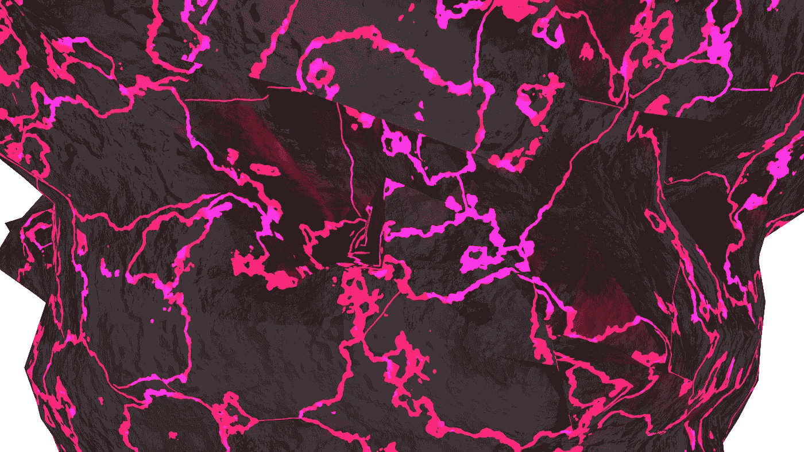
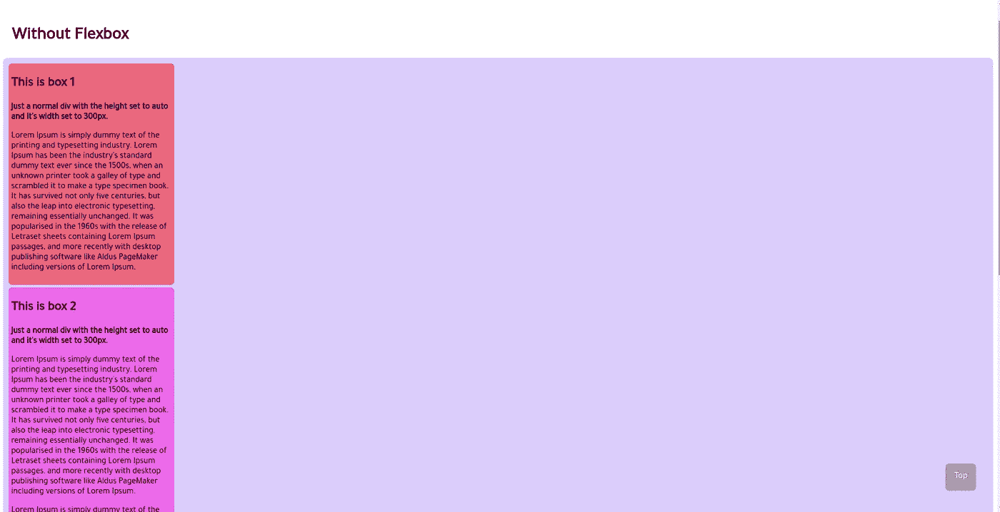
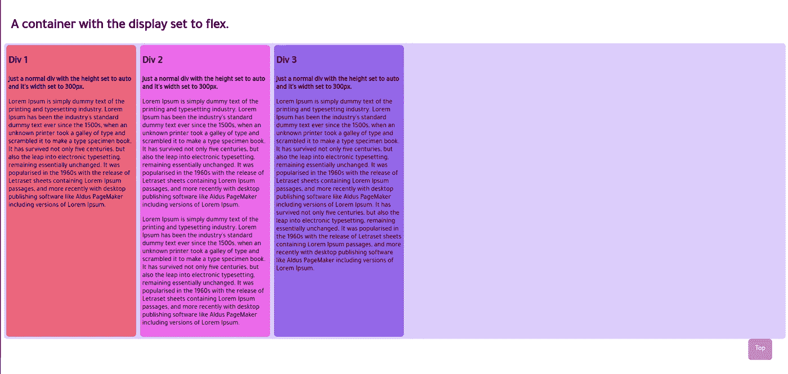
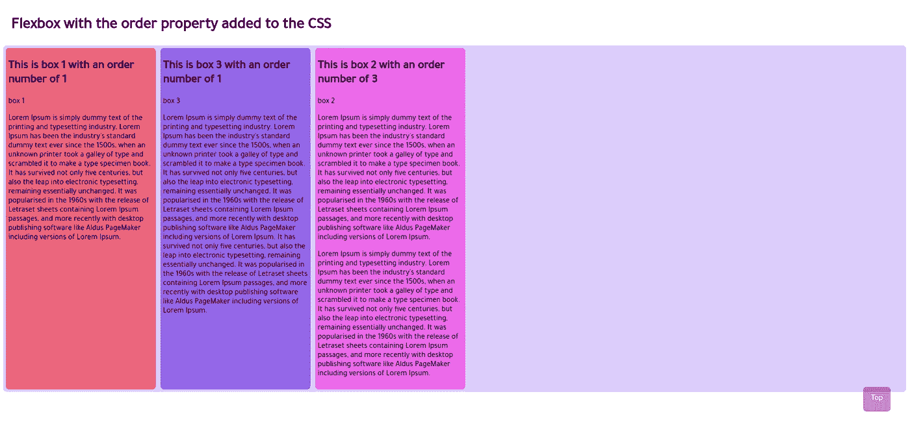
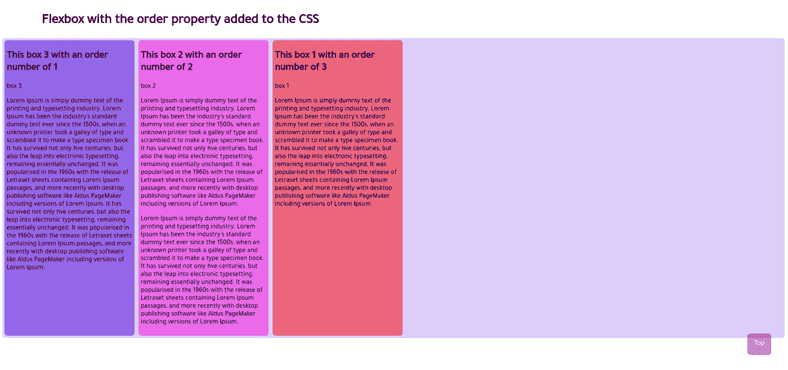
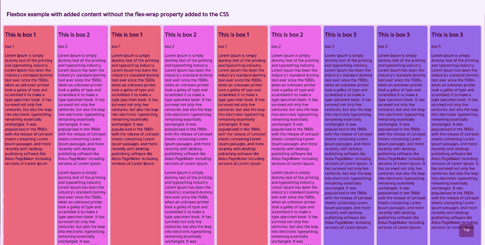
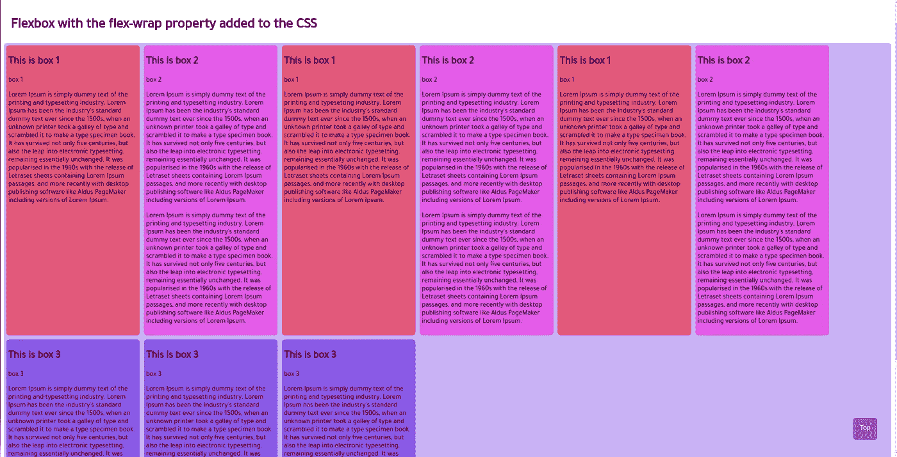
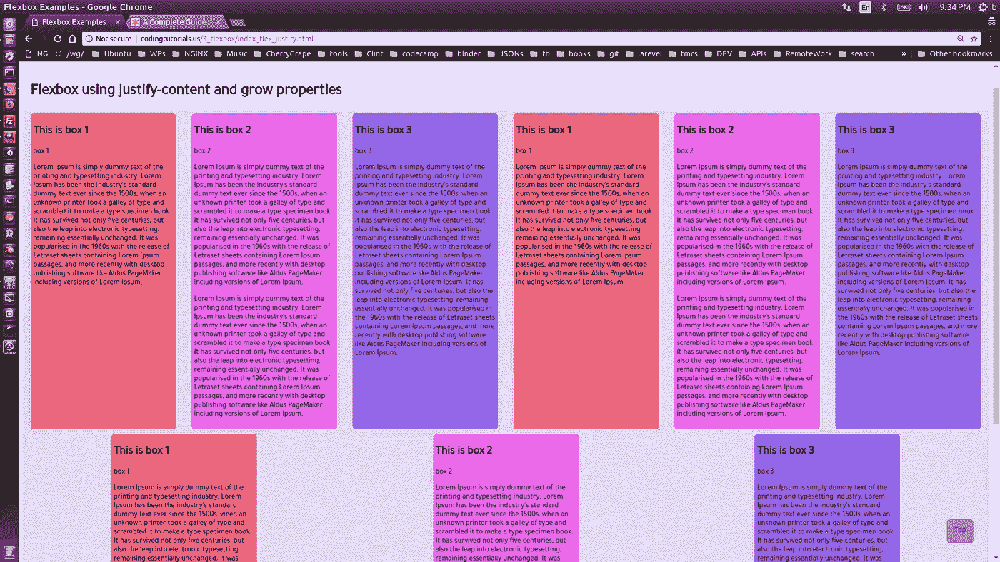
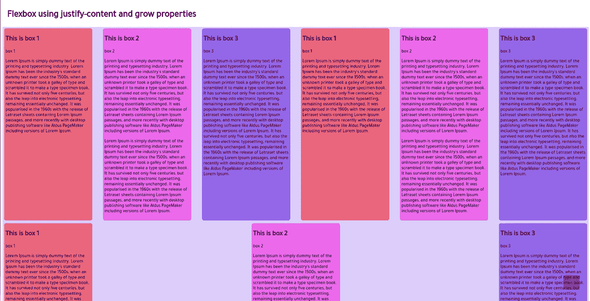
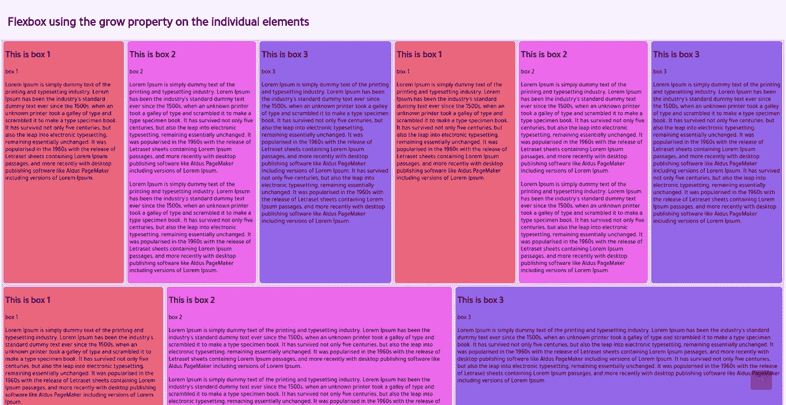

# 如何使用 Flex CSS 属性

> 原文：<https://medium.datadriveninvestor.com/how-to-use-the-flex-css-property-c413b6ddaec7?source=collection_archive---------7----------------------->

CSS flex 属性是为 HTML 元素实现响应式布局的最简单方法。Bootstrap 的行和列设计在简单性和设计方面是一个势均力敌的竞争对手，但使用一个单独的库或更常见的内容交付网络，而 flex 内置于客户端浏览器中。在这里，我们将回顾使用 flex 时需要了解的基础知识。



首先，让我们从一个不使用 flex 的例子开始。看这里！我们将从一个类为“container”的 div 开始。在这个 div 中，我们将有三个 div，分别是类“box_1”、“box_2”和“box_3”。为了更好地演示，还添加了一些内容:

```
<div class="container">
  <div class="box_1">
    <h2>This is box 1</h2>
    <p>
      Lorem Ipsum is simply dummy text of the printing 
    </p> </div>
   <div class="box_2">
    <h2>This is box 2</h2>
    <p>
      Lorem Ipsum is simply dummy text of the printing 
    </p>
    <p>
      Lorem Ipsum is simply dummy text of the printing 
    </p>
  </div>
  <div class="box_3">
    <h2>This is box 3</h2>
    <p>
      Lorem Ipsum is simply dummy text of the printing 
    </p>
  </div>
</div>
```

让我们给这些 div 添加一点风格。不同的背景色有助于突出每个部分。在一个单独的样式表中，为每个 div 添加一些填充、边距和背景色:

```
.container{
  background: rgba(0, 0, 220, 0.2);
  border-radius: 7px;
  padding: 5px;
}
.box_1{
  background-color: rgba(255, 40, 0, 0.5);
  height: auto;
  width: 300px;
  margin: 5px;
  padding: 5px;
  padding-bottom: 5px;
  border-radius: 7px;
}
.box_2{
  background-color: rgba(255, 0, 220, 0.5);
  height: auto;
  width: 300px;
  margin: 5px;
  padding: 5px;
  padding-bottom: 5px;
  border-radius: 7px;
}
.box_3{
  background-color: rgba(0, 0, 220, 0.5);
  height: auto;
  width: 300px;
  margin: 5px;
  padding: 5px;
  padding-bottom: 5px;
  border-radius: 7px;
}
```

看一个活生生的例子[这里](http://codingtutorials.us/1_BasicWebsiteLayoutandStyling/3_flexbox/index_no_flex.html)！



现在添加 flex 属性。在容器定义中，只需将 display 设置为 flex:

```
.container{
  display: flex;
  background: rgba(0, 0, 220, 0.2);
  border-radius: 7px;
}
```

保存 CSS 文件并刷新浏览器。容器内的 div 现在将彼此水平对齐。



看现场演示[这里](http://codingtutorials.us/1_BasicWebsiteLayoutandStyling/3_flexbox/index_flex.html)！

当父元素上的 display 设置为 flex 时，可以使用属性 flex-direction 来更改元素的对齐方式。伸缩方向的选项有:行、行反转、列和列反转。

当 flex 属性用于父 div 时，将为子元素打开新的 CSS 属性。其中一个属性是“项目顺序”。

当添加到 flex 容器中的项目时，项目显示的顺序将对应于“项目顺序”属性设置的数值。从 1 开始的数字越小，优先级越高，它将首先显示。让我们试一试。

在 CSS 文件中创建三个新的类定义，item_1、item_2 和 item_3。在每个定义中，将 item_order 设置为从 1 到 3 的不同数字。

```
.item_1 {
  order: 1; /* default is 0 */
}
.item_2 {
  order: 3; 
}
.item_3 {
  order: 1;
}
```

将这些类中的一个添加到我们的三个 div 中:

```
<div class="box_1 item_1">
      <h2>This is box 1 with an order number of 1</h2>
      <p>box 1</p>
      <p>
        Lorem Ipsum is simply dummy text of the printing 
      </p>
</div>
<div class="box_2 item_2">
      <h2>This is box 2 with an order number of 3</h2>
      <p>box 2</p>
      <p>
        Lorem Ipsum is simply dummy text of the printing
</div>
<div class="box_3 item_3">
      <h2>This is box 3 with an order number of 1</h2>
      <p>box 3</p>
      <p>
        Lorem Ipsum is simply dummy text of the printing
</div>
```

保存文件并刷新浏览器。div 的顺序将发生变化，以与项目顺序值相对应。



我们现在可以只更改订单号来获得 div 的不同订单:



现在，让我们探索一个伟大的属性，当显示设置为伸缩，该属性是伸缩包裹工作。

[这里的](http://codingtutorials.us/3_flexbox/index_flex_without_wrap.html)是一个包含大量内容的 flex 容器的实例，但是没有启动 flex wrap:[实例](http://codingtutorials.us/3_flexbox/index_flex_without_wrap.html)



flex container without flex wrap

现在，如果我们在容器中添加 flex wrap，我们会看到事情变得更有条理。

```
.container{
  display: flex;
  flex-wrap: wrap;
  background: rgba(0, 0, 220, 0.3);
  border-radius: 7px;
}
```

保存 CSS 文件后刷新浏览器，页面应该看起来像[这个](http://codingtutorials.us/1_BasicWebsiteLayoutandStyling/3_flexbox/index_flex_wrap.html)！



flex container with the flex wrap property defined

您也可以将换行作为 flex-wrap 的另一个选项，它会反转元素的顺序。

现在，我们已经以响应的方式将元素移动到另一行，让我们通过向父容器添加 justify-content 属性，在元素之间添加一些直观的间距。

```
.container{
  display: flex;
  flex-wrap: wrap;
  justify-content: space-around;
  background: rgba(0, 0, 220, 0.2);
}
```

“内容对齐”选项包括“弹性起点”、“弹性终点”、“居中”、“间距”、“环绕间距”和“均匀间距”。你可以在这里看到一个空格的例子！



space-around justify property



space-between justify property

justify 属性极大地简化了元素的间距，非常适合画廊的情况。另一个用作间距解决方案的重要属性是 grow 属性。与 justify 属性不同，grow 属性应用于子元素。我喜欢将它添加到我们创建的 item_order 类中:

```
.item_1 {
  order: 1; /* default is 0 */
  flex-grow: 1;
}
.item_2 {
  order: 1; /* default is 0 */
  flex-grow: 4;}
.item_3 {
  order: 1; /* default is 0 */
  flex-grow: 5;
}
```

保存并重新加载您的页面。活生生的例子[这里](http://codingtutorials.us/1_BasicWebsiteLayoutandStyling/3_flexbox/index_flex_grow.html)！



与元素相关联的数字将决定它将占用多少空间。注意底部的凹痕。它们各自具有不同增长值。方框 3 的增长值最大，而方框 1 的增长值最小。

Flex 是对现代浏览器的一个很好的补充，应该用来代替其他更复杂的技术。还有几个与 flex 一起使用的属性我没有在这里赘述，但是你可以在这里查看它们。