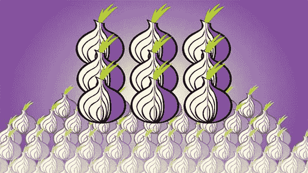

# 如何使用“Tor Over VPN”实现终极隐私

> 原文：<https://medium.datadriveninvestor.com/how-to-use-tor-over-vpn-for-ultimate-privacy-361414be7c36?source=collection_archive---------11----------------------->

Tor 浏览器彻底改变了我们在隐私泄露、广告垃圾、大规模监控和数据货币化时代的浏览方式。它为许多浏览互联网的人提供了急需的内心平静。

这些年来，Tor 已经暴露了好几次。这款浏览器仍然很安全，但不像有些人希望的那样防泄漏。这篇文章旨在剖析什么是 Tor 浏览器，以及为什么你应该使用它。最重要的是，我将谈到如何通过使用 VPN 来增强浏览器的安全性和隐私性。

# Tor 是什么？

Tor 浏览器的正式名称是洋葱路由器，其特点是有许多不同的节点/服务器。当数据通过浏览器传输时，它会经过所有不同的节点，这样就无法追踪来源。

同样，任何可能跟踪此类互联网数据的人都会迷失方向，不知道这些数据来自哪里，去往哪里。

这种运作模式给许多人带来了很多希望。持不同政见者、活动家和记者已经能够使用浏览器进行在线交流，而不必担心被发现。

它也允许用户匿名浏览黑暗网络，允许在不暴露任何个人身份的情况下购物。

虽然许多人可能认为浏览器是互联网空间的负面补充，但它实际上可以做更多的好事。

它所提供的隐私赋予了那些原本没有发言权的人权利。它允许在世界各地管理和实施变革。更不用说对许多用户的保护形式了。

# Tor 如何保护匿名

Tor 采用了一种随机的数据传输方法，在不同的服务器之间随意移动你的互联网数据。从您通过浏览器连接到您到达目标网站/平台，这一过程就会发生。

浏览器附带的所有节点分为三大类:

*   **入口节点**:顾名思义，它是用户通过 Tor 浏览器连接到互联网的点。请注意，该区域将您的实际 IP 地址存储在其安全服务器上。
*   **中间节点**:通过一系列的曲折移动，你的数据在中间节点的不同服务器上结束。这有效地将您的 IP 地址与您的物理目的地分开，混淆了您的互联网流量的来源
*   **出口节点**:出口节点获取您通过浏览器发送的信息，并将其转发到目标网站。在这里，出口节点和目标网站/平台都不知道你的互联网流量来自哪里。

# 为什么在 VPN 上使用 Tor

从上面看 Tor 的提供，几乎是自给自足。我们说“几乎”是因为:

*   Tor 习惯于将您的 IP 地址存储在入口节点，这本身会带来安全问题，
*   这款浏览器因速度慢而臭名昭著
*   众所周知，过去有一些漏洞会破坏浏览器的隐私模式，还有一些类似的原因。

不过，这并不是世界末日。[使用 Tor 和 VPN](https://www.expressvpn.com/how-to-use-vpn/tor-vpn) ，你可以摆脱大部分这些问题。一个好的 VPN 会在你连接到 Tor 浏览器之前隐藏你的 IP 地址。这意味着 Tor 上的入口节点仍然记录着一个 IP 地址，但那不会是你的真实位置。

再加上你现在可以在世界上不支持 Tor 的地区使用它，我们就有了赢家。

在这里阅读更多内容，不要忘记订阅我的教练博客网站获得免费的教练报告:[https://www . coaching-blog . com/how-to-use-tor-over-VPN-for-ultimate-privacy/](https://www.coaching-blog.com/how-to-use-tor-over-vpn-for-ultimate-privacy/)

请访问我们的网站，订阅免费的教练杂志:[http://www.international-coaching-news.net/](https://vk.com/away.php?to=http://www.international-coaching-news.net/&cc_key=)