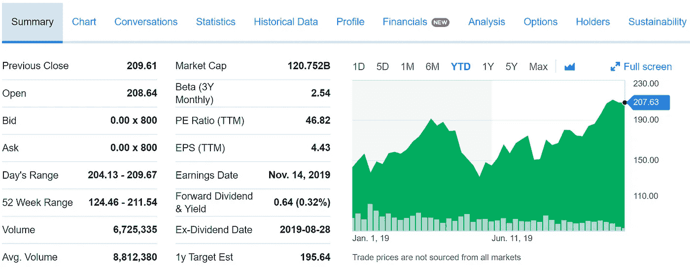

# 如何对一家上市公司进行估值，并找到合适的股价

> 原文：<https://medium.datadriveninvestor.com/how-to-value-a-public-company-and-find-the-right-price-to-pay-for-its-shares-7ac6756aa85f?source=collection_archive---------3----------------------->

这篇文章中的观点是从菲尔·敦和沃伦·巴菲特关于价值投资的资料中汇总的，并不是我个人的观点。这不是投资建议。

Photo by [Alex Guillaume](https://unsplash.com/@alx2bgx?utm_source=medium&utm_medium=referral) on [Unsplash](https://unsplash.com?utm_source=medium&utm_medium=referral)

1973 年，普林斯顿大学教授伯顿·马尔基尔在他的畅销书《漫步华尔街》中提出理论，“一只被蒙住眼睛的猴子向报纸的金融版面投掷飞镖，可以选择一个与专家精心选择的投资组合一样好的投资组合”[1]。1984 年，沃伦·巴菲特在哥伦比亚商学院对学生发表演讲，解释了他如何通过连续 20 年成功击败标准普尔 500 的回报，成为一只成功的猴子:通过寻找企业的*价值*和市场上的*价格***【2】。**

**这就是价值投资的秘密。选择一个具有内在特征的企业，这些特征赋予它持久的竞争优势。然后根据它的历史表现，确定它的*值*是多少。最后，只有当股票在市场上的*价格*明显低于这个价值时，才买入股票。**

** [## 算法交易的机器学习|数据驱动的投资者

### 当你的一个朋友在脸书上传你的新海滩照，平台建议给你的脸加上标签，这是…

www.datadriveninvestor.com](https://www.datadriveninvestor.com/2019/01/30/machine-learning-for-stock-market-investing/)** 

# **如何找到合适的价格**

**选择一家具有内在特征的公司，使其具有持久的竞争优势，这使价值投资者能够在经历沧桑和市场波动时高枕无忧，而不用担心公司不断变化的价格；投资者对企业的内在价值及其长期持续增长的能力充满信心。理论上，由于这种信念，投资者可以在几年内保留公司的股份。选择合适的公司并确定赋予其“经济护城河”的相关特征是另一个话题。**

**Phil Town 在他的书“规则# 1”[3]和播客“投资”[4]中，将寻找合适价格购买股票的过程分为四个步骤。这个想法是根据公司现在和过去的业绩来确定公司 10 年后的价格，并推导出在这 10 年中，为了获得最低可接受的回报率(MARR ),今天每股应该支付多少钱。**

****第一步。收集一些数字****

**选择一家有持久竞争优势的公司。例如，让我们选择 NVIDIA(股票代码 NVDA)。它的竞争优势是用于加速 AI 和计算机图形学的 GPU。2019 年 5 月，在所有配备专用加速器的云计算实例中，超过 95%使用了英伟达硬件[5]。**

**使用诸如 Yahoo！财务找到 3 个数字:**

1.  **过去 12 个月的每股收益(TTM 每股收益):**【4.43 美元****
2.  **分析师预测的未来 5 年盈利增长率: **12.5%****
3.  **平均历史市盈率: **24.93****

****

**Yahoo! Finance analysis on NVDA on October 7, 2019**

***一些高级注释:选择一家在账面价值、每股收益、销售额和经营现金流等指标上至少有 5-10 年持续增长的公司，以定量地确保该公司确实具有持久的竞争优势。这些数字可以从该公司提交给美国证券交易委员会的 10K 报告中确定，并提供了该公司除每股收益以外的整体健康状况。如果分析师预测的收益增长率高于这四个指标在 5-10 年期间的平均值，则使用这些历史增长率的平均值作为本分析中的预测增长率，以获得更保守的估值。请注意，在股票市场的历史上，标准普尔 500 指数公司的历史平均收益增长率为 7%至 7.5%，这些公司的历史平均市盈率为 13 至 15(是历史平均收益增长率的 2 倍)[6]。因此，如果所选公司增长率的平均市盈率高于预测盈利增长率的 2 倍，则将预测增长率乘以 2，并使用该较低值作为市盈率值，再次进行更保守的估值。***

****第二步。求 10 年后的 EPS****

**用未来价值公式估算 10 年后的每股收益。也可以用 Excel)，代入预测盈利增长率为*率*，10 为 *nper* ，0 为 *pmt* ，TTM EPS 为负数为*【PV】*。因此，英伟达 10 年后的每股收益是 14.39 美元。**

****

****第三步:求 10 年后的值****

**现在，可以估算公司 10 年后的股票价值。由于平均市盈率(英伟达为 24.93)是投资者平均愿意支付的历史收益的倍数，只需将这个市盈率乘以第二步中确定的每股收益的未来值(14.39 美元)。这得出了 10 年后英伟达每股股票的价值(粗略估计)为 358.74 美元(T21)。**

**因此，根据公司最近一年的收益、公司的历史平均市盈率和公司的预测收益增长率，可以推断出 10 年后一股的价格。现值公式现在可以用来确定一股股票*的现值应该是多少。再一次，使用 Excel (PV)并插入美国平均通货膨胀率(3.15%)的*比率*，10 的 *nper* ，0 的 *pmt* ，以及 10 年内该公司股票价格的负值*【Fv】***，今天一股 NVIDIA 股票的价值应该大致为 263.08 美元。*****

**有趣的是，该公司今天的计算价格可以乘以其发行在外的股票数量(英伟达为 6.16 亿股)。这产生了 1620 亿美元，即根据我们的分析，NVIDIA 今天的*价值*。**

****第四步:找到一个合理的支付价格****

**在撰写本文的当天(2019 年 10 月 7 日)，英伟达的交易价格为 207.63 美元。这个乘以 6.16 亿得出 1270 亿美元，也就是英伟达的市值，也就是它在市场上的*价格*。太好了！根据我们的分析，其市场价格(207.63 美元)低于其内在价值(263.08 美元)。那么价值投资者应该买吗？**

**不。投资者期望的投资回报必须被考虑在内，以准确地计算出什么价格对购买股票是有利的。鉴于标准普尔 500 指数的平均年回报率为 7.96%[8]，至少 15%的最低回报率(MARR)就不错了。相比之下，沃伦·巴菲特通过伯克希尔·哈撒韦公司的平均年回报率为 21% [9]。相比之下，Phil Town 是一个私人投资者(像我们一样),可以根据需要快速重新分配资本，平均年回报率为 40% [4]。**

**要找到这个“正确”的价格，请重新考虑步骤 3 中的值。10 年后，假设发行在外的股票数量不变，英伟达的每股股票价值将为 358.74 美元；按今天的美元计算，这是 263.08 美元。这意味着今天必须以远低于 263.08 美元的价格购买股票，以便在 10 年后(假设)出售时达到期望的 MARR。**

**Excel 或公式可直接用于计算投资者应支付的一股股票的现值，以实现 15%的 MARR。或者，72 的规则可以用于快速和(非常棒的)估计。请注意，72/15% = 5 是本金以 15%的速度增长一倍所需的年数；因此，10 年后，它将翻一番，也就是说，增长 4 倍。因此，简单地将一股英伟达股票在 10 年内的价值除以 4，就可以确定今天应该支付什么价格才能在 10 年内实现 15%的 MARR:**$ 89.69**。**

**为了获得额外的安全边际，将该值减半，以充分抵御市场的各种变化。也许对该公司内在特征的评估是有缺陷的，或者也许需要采取主动行动来应对迫在眉睫的事件，如贸易战或量子计算的出现，以推翻英伟达的统治地位。因此，44.85 美元是价值投资者应该为英伟达股票支付的最高价格，以产生至少 15%的 MARR 和足够的安全边际。**

**这种确定上市公司价值的方法，加上智能 MARR 和安全边际，实现了巴菲特 1984 年向哥伦比亚大学学生描述的理念:寻找一家企业的*价值*和其在市场上的*价格*之间的差异。由于价值投资者已经根据经验确定了所选择的公司具有内在的特征，这些特征使其具有持久的竞争优势，因此她对本文中计算的公司内在价值充满信心。一旦她发现它以这个安全边际价格出售，她可以肯定，随着时间的推移，它无疑会增长。菲尔·汤称之为“用 5 美元买 10 美元钞票”的艺术。**

***在撰写本文之日(2019 年 11 月 7 日)，英伟达的股价为每股 207.63 美元。***

# **参考**

**[1][https://www . Amazon . ca/Random-Walk-Down-Wall-Street/DP/0393330338](https://www.amazon.ca/Random-Walk-Down-Wall-Street/dp/0393330338)**

**[2][https://www 8 . gsb . Columbia . edu/articles/Columbia-business/super investors](https://www8.gsb.columbia.edu/articles/columbia-business/superinvestors)**

**[3][https://www . Amazon . ca/Rule-Strategy-Successful-Investing-Minutes/DP/0307336840](https://www.amazon.ca/Rule-Strategy-Successful-Investing-Minutes/dp/0307336840)**

**[https://www.ruleoneinvesting.com/podcast/](https://www.ruleoneinvesting.com/podcast/)**

**[5][https://www . Forbes . com/sites/paulteich/2019/06/17/NVIDIA-dominates-the-market-for-cloud-ai-accelerators-more-than-you-think/# 672 ca 5985 EDB](https://www.forbes.com/sites/paulteich/2019/06/17/nvidia-dominates-the-market-for-cloud-ai-accelerators-more-than-you-think/#672ca5985edb)**

**[6][https://www . investopedia . com/investing/use-PE-ratio-and-peg-to-tell-stocks-future/](https://www.investopedia.com/investing/use-pe-ratio-and-peg-to-tell-stocks-future/)**

**[7][https://www . Forbes . com/sites/great speculations/2019/10/10/how-does-nvidias-evaluation-compare-to-its-peers/# 47c2f 09535 c 0](https://www.forbes.com/sites/greatspeculations/2019/10/10/how-does-nvidias-valuation-compare-to-its-peers/#47c2f09535c0)**

**【8】[https://www . investopedia . com/ask/answers/042415/what-average-annual-return-sp-500 . ASP](https://www.investopedia.com/ask/answers/042415/what-average-annual-return-sp-500.asp)**

**[9][https://www . USA today . com/story/money/markets/2018/03/06/a-fool-take-Warren-Buffett-has-crushed-the-market 长达半个多世纪/110859108/](https://www.usatoday.com/story/money/markets/2018/03/06/a-foolish-take-warren-buffett-has-crushed-the-market-for-more-than-half-a-century/110859108/)**