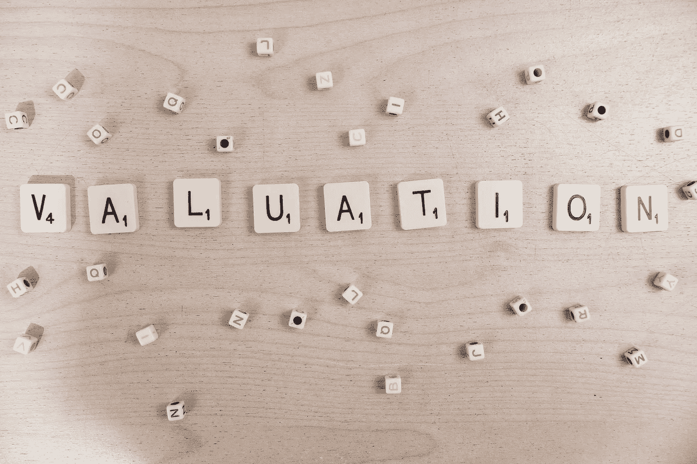

# 如何给自己的创业公司估值？

> 原文：<https://medium.datadriveninvestor.com/how-to-value-your-startup-a805e5007f51?source=collection_archive---------23----------------------->

任何企业家都有一个老生常谈的问题——我的初创公司到底值多少钱？以下是需要记住的 6 个要点。

**1)经验法则**

在 A 系列中，你通常会被稀释 20-30%，在 B 系列中被稀释 15-25%，在 C 系列中被稀释 10-20%，在 D 系列中被稀释接近 10%。在那之后，只有很少的创业公司可以设定一个模式，以至于它最终更多的是一个基于公开 comps 和贴现现金流(DCF)混合的个人分析。至少在美国，你还会通过 409A 进行外部评估，定期验证你的估值。就像在任何谈判中一样，你通过稀缺性或寻求投标(投资)的投标人(风投)数量获得的权力越大，你就能获得更高的估值。

**2)敞篷车又名推迟提问**

可转换债券是一种无需设定具体估值就能获得资金的方式，你只需就债务在未来转换为股权的条款达成一致。这通常发生在早期阶段，尤其是种子阶段，因为证据太少。或者它会发生在两轮之间，当你不想将自己与上一轮的估值挂钩，或者你想用更有利的未来权益回报投资者当前的风险。要深入讨论可兑换债券，请查看[可兑换债券——4 个实用原则](https://www.linkedin.com/pulse/convertible-notes-4-practical-principles-amit-garg/)和[可兑换还是定价？](https://www.linkedin.com/pulse/convertible-priced-amit-garg/)。

**3)保险箱**

未来股权的简单协议是由 Y-Combinator 推广的，其核心是在未来一轮定价中购买股票的权证。外管局没有利率或到期日，只要你筹集到任何股权投资，外管局就会进行转换，这与可转换债券不同，可转换债券在“合格交易发生”时会有门槛。国家外汇管理局本质上更有利于企业家，而不是投资者，在硅谷这样的密集生态系统中很受欢迎，但在外部还没有那么受欢迎。

**4)条款清单又称让市场说话**

你可以提供指导，在极少数情况下，当你的进展处于标准差的边缘时，甚至可以强制执行特定的评估。但就像有人愿意为某样东西支付多少钱，它就值多少钱一样，你的初创公司的真实估值是市场说话的结果。风投通常会做比较分析，考察初创公司和企业的组合，将它们的关注点和进展联系起来，进行三角评估。在后期阶段，特别是 DCF 将发挥作用，因为有了收入和 EBITDA，你实际上可以分配一个 NPV。在这种情况下，企业家和风投可以无休止地争论收入、ARR 或 EBITDA 倍数是否合理，这在很大程度上取决于你所在的企业类型。

人们确实对估值着迷，这并不完全是出于原因，因为它是许多事情的组合:你进行了多少稀释，你给了投资者多少所有权，你认为你的公司有多强，以及你想在市场上发出什么信号，尤其是如果你公开披露的话。任何优秀的企业家都会说，他们的最终目标是创造价值——但管理估值也确实很重要。

这些是专注于实践见解的短文(我称之为 GL；dr —良好的长度；确实读过)。如果它们能让人们对某个话题产生足够的兴趣，从而进行更深入的探索，我会感到非常兴奋。我在三星的创新部门 [*NEXT*](http://samsungnext.com/) *工作，专注于深度科技领域软件和服务的早期风险投资，这里表达的所有观点都是我自己的。*