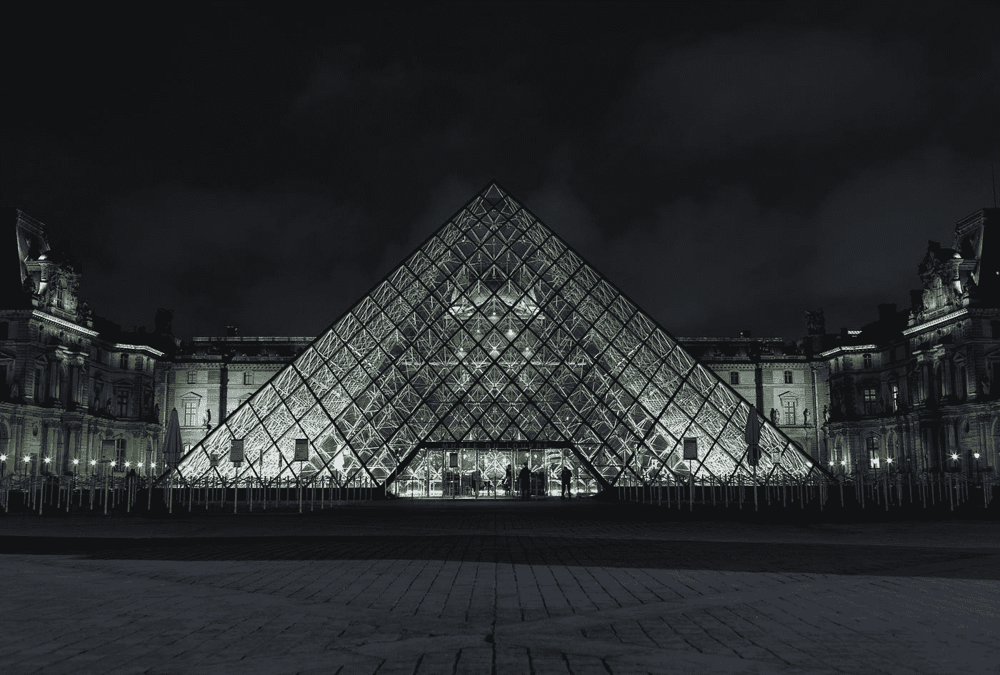

# 如何像达芬奇一样给自己的作品估价

> 原文：<https://medium.datadriveninvestor.com/how-to-value-your-work-like-leonardo-da-vinci-3fe2a783e7a9?source=collection_archive---------13----------------------->

Photo by [anthony mcgee](https://unsplash.com/@tmg?utm_source=medium&utm_medium=referral) on [Unsplash](https://unsplash.com?utm_source=medium&utm_medium=referral)

最近我去看了蒙娜丽莎。

我在巴黎度周末，以前从未在“现实生活”中见过它，我决定借此机会参观这幅世界名画。

官方认为它是世界上最著名的画，严格地说，它是无价之宝。也就是说，它当然有一个“理论”价值……截至 2018 年，这个价值是 8.3 亿美元。

 [## 跑步摆脱疯狂:健身如何提高你的生产力|数据驱动的投资者

### 没有比锻炼更好的方式来开始一天的工作了。我试着一周至少做四天，在…

www.datadriveninvestor.com](https://www.datadriveninvestor.com/2018/10/23/running-to-get-rid-of-the-crazy-how-working-out-increases-your-productivity/) 

8.3 亿美元！！

为了一幅画…哇。

当亲自看到它时，它小得奇怪。老实说，这并不令人兴奋。只是一个女人的小画像，带着微微耐人寻味的笑容。

然而，不可否认的是，它确实令人印象深刻。这就是为什么，我想，数百万人蜂拥而至去看它……也是它“理论上”价值 8 . 3 亿美元的原因之一。

然而，撇开这幅画是达芬奇所画这一事实不谈，我可以相当自信地说，这幅画不会被收藏在卢浮宫……它远没有那么有名(如果有的话？)…而且肯定不会值 8.3 亿美元。

这是值得的，因为这是阿达·芬奇的作品。即使那样……这也是值得的，因为达芬奇所做的一切。

是的，这是他最著名的画。所以它有“额外”的特别之处。但即便如此…价值并不仅仅在于这幅画本身…而是他所画的其他所有的画。

因为达芬奇的整个职业生涯，它值那么多钱。

你还知道别的吗？如果达芬奇自己定价，我敢说他也不会把它估价为 8.3 亿美元。

他可能会给它估价，仅仅是它实际价值的一小部分……它的*真实价值的一小部分。*

意味着他低估了自己。

事实上，目前在伦敦有一个新的展览，展示了随着他事业的发展，他对自己工作越来越不满意。他是自己最大的批评家，看不到其他人在他的作品中看到的价值……500 年后，仍然如此。

他看不到自己作品中的技巧和才华，而几个世纪以来，世界其他地方都一致认同这一点。

然而，这并不是一件不寻常的事情…

判断自己的价值总是很难，很多人都深受这个问题的困扰…

“我没有他们想象的那么好。”

“我的作品不值那个价钱。”

“其他人比我强多了。”

“我没理由收那么多钱！”

你可以称之为冒名顶替综合症。不相信自己，尽管有证据表明你的技能…你的天赋…

当然，列奥纳多·达·芬奇是一个独特的例子，但是……他的《蒙娜丽莎》的价值——市场对它的估价，以及毫无疑问他自己对它的较低估价——也许我们可以把同样的原则应用到我们的商业中？

也许，当我们担心定价时，我们只需要少关注我们认为我们的工作值多少钱……也许，相反，我们会更好地帮助自己，关注我们能力的证据，我们如何用它来帮助我们的客户，以及他们认为它值多少钱？

关于我们报价的真实价值…？

而这个价值来自于“今天”之前的所有岁月。所有的时间，所有的岁月，我们已经花费在学习，练习和提高…

这些年来，在我们的整个职业生涯中，我们走到了这一步。

在这种情况下……也许我们做某项工作所花费的时间，并不是我们的客户所能支付的。也许他们真的是在为他们的问题的解决方案付费…由于在之前*的所有时间，我们可以提供这些解决方案。*

同样，蒙娜丽莎的价值与达芬奇的名字、名誉以及*的整个*事业联系在一起…

你为客户提供的服务…你能够为他们解决的问题，以及你在这方面的经验…具有特定的市场价值…这就是你可以收取的费用。

所以，也许，你认为自己的价值根本不重要……很可能，它会比你真正的价值低很多？

点击阅读更多关于如何评估你的出价的见解[。](https://strategicmentors.co.uk/category/strategy/)