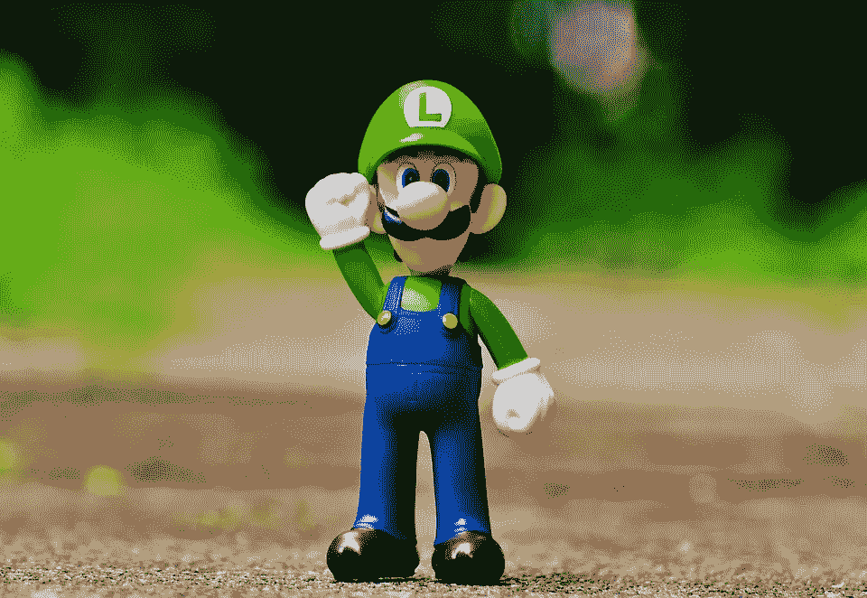
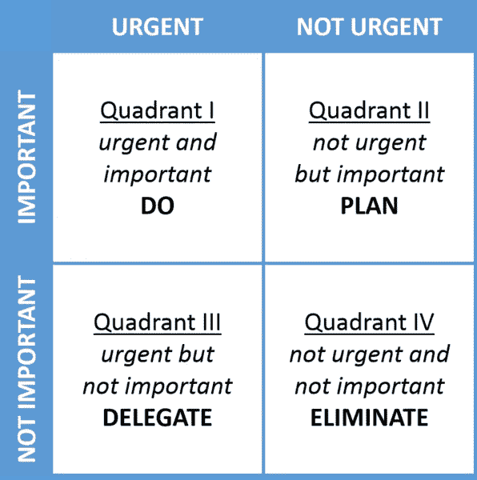

# 如何什么都不做就赢

> 原文：<https://medium.datadriveninvestor.com/how-to-win-by-doing-absolutely-nothing-a5832fd5bcf8?source=collection_archive---------10----------------------->

Photo by [Simon Migaj](https://unsplash.com/@simonmigaj?utm_source=medium&utm_medium=referral) on [Unsplash](https://unsplash.com?utm_source=medium&utm_medium=referral)

> “打架不如无所事事。”马蒂·鲁宾

如果你看了我链接到下图的 Youtube 视频；你会看到路易吉什么都不做就赢了。Luigi 通过站在电脑玩家击败他们自己的周围，赢得了任天堂系列马里奥派对中不同的迷你游戏。

看了这个视频让我思考。我们都知道当我们拖延时的糟糕感觉，以及完成一件事的感觉有多好。然而，什么都不做却能赢不是很好吗？

## 什么都不做有可能赢吗？

回到 08 年，我 18 岁，金融市场崩溃了。我觉得这是投资的好时机。我卖掉了一些我小时候就有天赋的金子；是的，在瑞士你会给孩子们礼物，不，这在那里并不奇怪。

 [## 跑步摆脱疯狂:锻炼如何提高你的生产力|数据驱动的投资者

### 没有比锻炼更好的方式来开始一天的工作了。我试着一周至少做四天，在…

www.datadriveninvestor.com](https://www.datadriveninvestor.com/2018/10/23/running-to-get-rid-of-the-crazy-how-working-out-increases-your-productivity/) 

我用这次出售得到的钱，购买了诺华、科莱恩和瑞银的股票。在接下来的十年里，前两者被证明是非常有利可图的。我什么都没做就赚了钱。甚至对瑞银股票来说，什么都不做，等待，似乎也是一个不错的建议。这种沃伦巴菲特式的投资并不新鲜，也有许多成功的追随者。

> “如果你不愿意在十年内持有一支股票，那就别想在十分钟内持有它。”—沃伦·巴菲特

如果我们可以在生活的不同领域采用这种心态，我们都可以像 Luigi 一样开始赢——什么都不用做。

但是，少做或什么都不做并不像听起来那么容易，尤其是在一个崇尚忙碌的社会。让我解释一下我的意思。

## 忙碌陷阱

忙碌不是什么新鲜事；甚至罗马斯多葛派哲学家塞内卡也思考过人们是如何被不必要的忙碌所影响的。

> “这并不是说我们的生命很短，而是我们浪费了很多时间。生命够长了，如果投资得当，我们已经获得了足够多的成就。但是，当它被浪费在轻率的奢侈中，被花费在无益的活动上时，我们最终被死亡的最终约束所迫使，意识到它在我们知道它正在逝去之前就已经逝去了。事实就是这样:我们不是被赋予短暂的生命，而是我们让它变得短暂；我们不是供应不足，而是浪费生命。正如当大量的、高贵的财富落到一个坏的主人手里时，它会在一瞬间被挥霍掉，但财富无论多么微薄，如果委托给一个好的保管人，会随着使用而增加，所以如果你管理得当，我们的寿命会延长。”
> —塞内卡

这听起来类似于我们许多人在工作一整天后问自己的问题。如果最终我们因为工作而错过了人生的大部分时间，那我们工作是为了什么？

如果你看看网上的空间，许多家伙都在宣扬一种磨人的心态。为这样一个想法而战:除非你每天工作 12 个小时，否则你根本就不要试图成功。

你听说过西西弗斯吗？一个古代的国王被神罚将一块大石头推到山上。当他到达山顶时，却看到石头滚了下来。然而，西西弗斯注定要永远推着巨石上山。

我会把西西弗斯描述成一个相当忙碌的人。然而，如果你什么也没做，那么你的忙碌又有什么意义呢？

对，为了忙而忙是疯狂的。

相反，让我们看看如何决定做什么，以获得真正的结果。

## 如何决定做什么

我们百分之八十的结果源于百分之二十的行动。第一个让我认识到这种思维方式的人是蒂姆·费里斯，他在《每周 4 小时工作》一书中写道。这个原则被称为 80/20 法则或帕累托原则。以意大利经济学家维尔弗雷多·帕累托命名，他指出意大利大约 80%的土地由 20%的人口占有。

一旦你采取了这种心态，你开始意识到忙于错误的事情不会带来想要的结果。现在的挑战是识别那些高价值的活动。

By [Davidjcmorris](https://commons.wikimedia.org/w/index.php?title=User:Davidjcmorris&action=edit&redlink=1)

艾森豪威尔矩阵以美国第 34 任总统德怀特·戴维·艾森豪威尔的名字命名，它可以帮助决定和优先处理任务。立即做重要的任务，安排重要的，但不那么紧急的事情。

紧急但不太重要的事情可以委托，紧急和重要的事项都不能忽略。

现在你知道如何区分工作的优先顺序了。这样你就不会陷入忙于错误事情的陷阱。

但是，路易吉还是赢了你！为什么？他什么都没做！

## 什么都不做的魔力

在网飞系列 I*I side Bills Brian，*比尔·盖茨带观众去他的湖边小屋，在那里他每年两次闭关进入为期一周的*思考周*。他甚至在经营微软的时候就这么做了。那几周不是假期，而是与世隔绝、无所事事的时期。

当你什么都不做的时候，你允许你的大脑变得有创造力。创造力是一个近乎神奇的过程，当我们的大脑突然之间将之前没有联系的事物联系起来。像用蒸汽为机器提供动力，或者用你在丛林中找到的豆子制作美味的巧克力，这些想法都需要极大的创造力。只有当我们什么都不做的时候，创造性的见解才会来到我们身边。

## 如何什么都不做

我知道你在想什么。*无所事事，能有多难？* 你是对的；一点也不难。但这可能会让人不舒服。仅仅因为没有以 *N* 开头的东西，并不自动意味着网飞。看电视，滚动社交媒体，甚至睡觉都不是我说的无所事事。

一开始，你会感到无聊，不要屈服于分散注意力的诱惑。在我最近的一篇文章中，我写道，你可以将无聊视为一个创造的机会，而不是你不惜一切代价试图避免的事情。

我在生活中融入虚无的方式是双重的。每天，我直到下午 1 点才打开手机。从更大的范围来说，我每年至少有一周不做任何有意义的事情。我不会去进行一次无声的静修，尽管这很棒。但是我会去山里拜访我女朋友的祖母，享受自然和没有科技的生活。

## 外卖

有时候就像退一步，什么都不做一样简单。这将让你专注于那些推动你前进的事情，并提升你的创造性思维。

像 Luigi 一样，放松，从远处看疯狂，然后回来赢——什么也不做。

# **准备好变得无限吗？**

如果你想变得无限并大大加快你的学习速度，看看我的小抄:

[点击此处立即获取备忘单！](https://roadtolimitless.com/cheatsheet/)