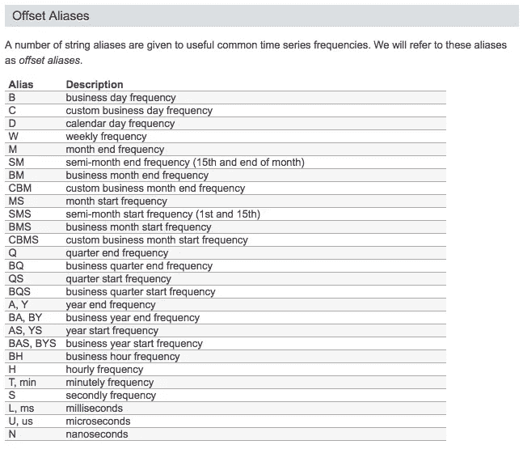
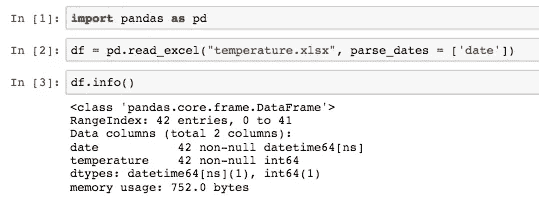
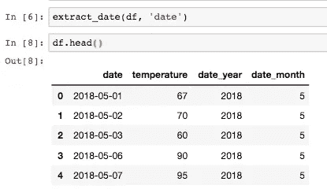
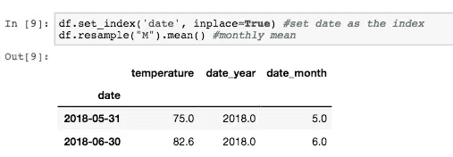
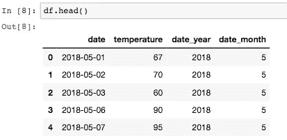
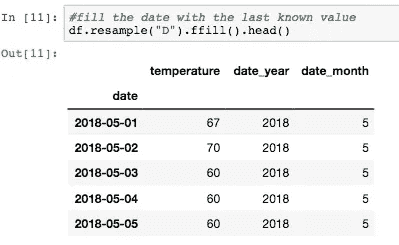
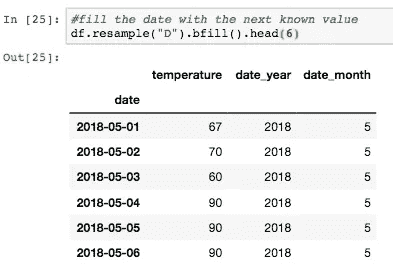
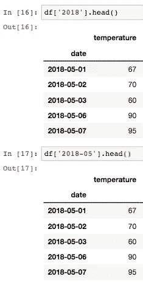
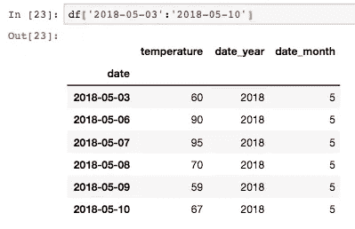

# 像专家一样处理熊猫的日期

> 原文：<https://medium.datadriveninvestor.com/how-to-work-with-dates-in-pandas-like-a-pro-a84055a4819d?source=collection_archive---------2----------------------->


“black New Orleans framed analog clock” by [Jason Blackeye](https://unsplash.com/@jeisblack?utm_source=medium&utm_medium=referral) on [Unsplash](https://unsplash.com?utm_source=medium&utm_medium=referral)

在 Python 中使用 datetime 列可能是一个相当大的挑战。幸运的是，pandas 非常擅长处理时间序列数据。本文概述了如何处理时间序列。我们将探讨如何导入日期时间数据、提取日期、转换频率和索引日期。

# 偏移别名

首先，下面是处理时间序列频率时使用的别名的有用指南。在整篇文章中，您将会看到其中一些别名。



Image courtesy of [http://pandas.pydata.org/pandas-docs/stable/timeseries.html#offset-aliases](http://pandas.pydata.org/pandas-docs/stable/timeseries.html#offset-aliases)

# 将日期时间导入 Pandas

如果您将数据集导入 Pandas，默认情况下，日期可能会以字符串形式出现，我们将很难处理它。为了确保我们将列作为时间戳导入，我们添加了`parse_dates`参数。确保将日期时间列作为列表传递给`parse_dates`，否则将会出现错误。



注意，列类型应该显示 datetime，如上面的代码片段所示。

# 日期提取

`datetime`模块允许我们操作日期和时间。我们可以提取诸如年和月之类的属性用于我们的分析。这些属性通常是时间序列数据的重要预测指标。有关功能的更多信息，请参见日期时间[文档](https://docs.python.org/2/library/datetime.html)。


使用上面的函数，我们可以在数据框架中创建年和月列。



# 时间序列聚合

时间序列数据的一个常见且有用的操作是使用`resample()`方法以一定的频率聚集数据。例如，我们可以使用重采样将每日数据转换为每月数据。该操作将要求索引是日期时间索引，否则，我们将得到下面的错误。

```
TypeError: Only valid with DatetimeIndex, TimedeltaIndex or PeriodIndex, but got an instance of 'RangeIndex' and the count by month works.
```

在下面的代码中，我将日期设置为索引，并为我们的数据计算月平均温度。



**填写缺失数据**

当数据中缺少一些日期时会发生什么？请注意
我们遗漏了 2018 年 5 月 4 日和 2018 年 5 月 5 日的温度。



有两种方法可以处理这个问题，一种是用最后一个已知值填充日期(“ffil”或前向填充)，另一种是通过调用如下所示的`resample()`方法用下一个已知值填充日期(后向填充)。



Forward filling data



Back filling data

# 日期索引

使用 DateTimeIndex，我们可以方便地将年份或年份和月份作为索引字符串传递。



或者，我们可以传递日期范围作为索引依据。



感谢你的阅读，如果你喜欢这篇文章，尽你所能点击鼓掌图标！