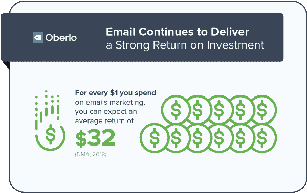
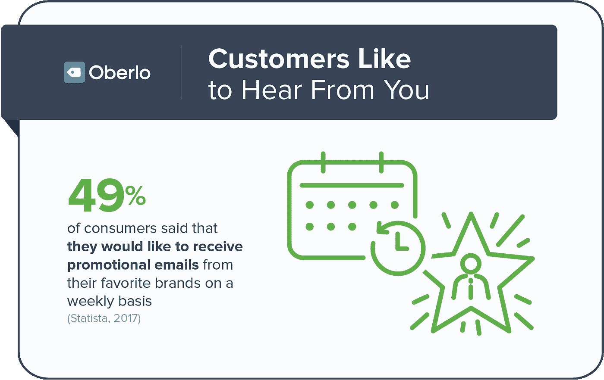
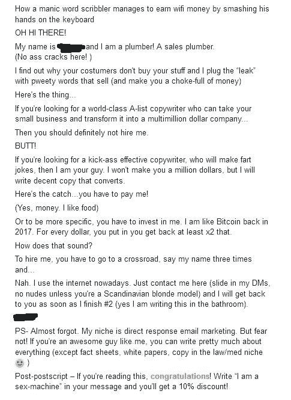
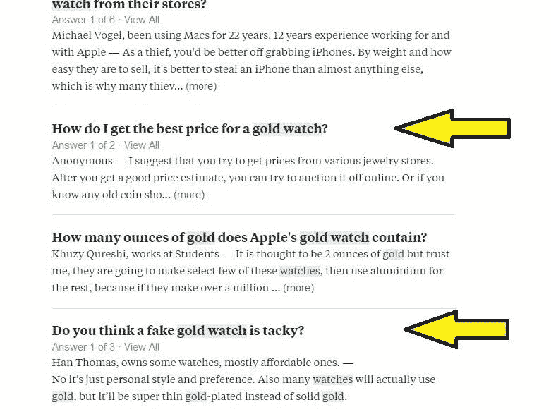
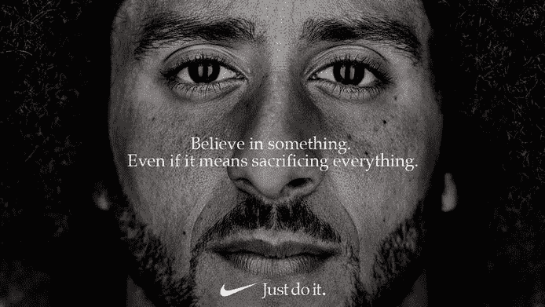
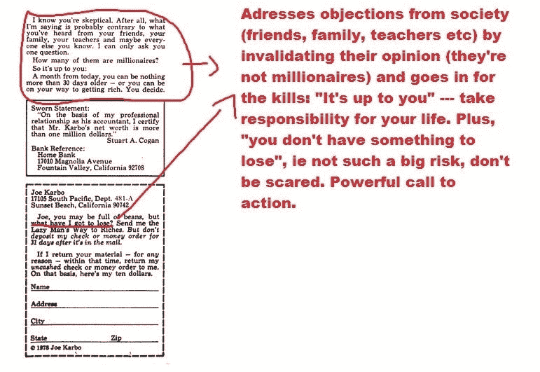

# 如何写电子邮件以获得乐趣和利润

> 原文：<https://medium.datadriveninvestor.com/how-to-write-emails-for-fun-and-profit-aab298226a28?source=collection_archive---------12----------------------->

## 5 个简单的步骤

你在网上与人交流的第一方式是什么？

朋友，家人，顾客，客户？

视频聊天？音频？莫尔斯电码？

是文字。你在发送和接收文字，信息，博客文章，文章和…

**邮件！**

**这个小家伙是创造销售、增加参与度和建立持久联系的发电站。但是社交媒体巨头，如脸书和推特，会让你相信电子邮件营销已经死了。**

但是是吗？

[2018 年的报告](https://www.oberlo.com/blog/email-marketing-statistics)显示，电子邮件营销是一个(尚未开发的)金矿，可以增加你的收入，并确保你的品牌保持相关性。

你可以看到，你每投入 1 美元，就会得到 32 美元。

这是 3100%的投资回报率。

再读一遍。

你 12%的股票回报率能和这个相比吗？

如果你认为人们认为来自公司的邮件是垃圾邮件，请再想一想

在这一点上，很明显，如果你没有为你的业务(自由职业者、个人品牌、电子商务等)使用至少一个基本的电子邮件策略，你就是在浪费钱。

所以，你创建了你的自动回复，你的欢迎序列，和废弃的购物车电子邮件，你点击发送和…

零投入。零点击。没人在乎你的邮件。没有人点击你发出的链接。

**不能简单的潦草几句，拍一张照片就收工。要发送有效的邮件，你需要对人类心理和基本的文案原则有深刻的理解。**

1967 年，温德尔曼称之为“直接营销”,奥美用他著名的销售信:

…让直复文案成为广告公司不可或缺的一部分。

所有的优惠券、广告位置、“现在就打电话”和带有购买意图的语言。所有这些都是直接反应营销。你觉得现在情况变了吗？

当然了。媒介已经改变了。你不用邮购目录，而是发送电子邮件。尽管如此，基本原则还是一样的。

但是你怎样才能学会有效地写作，让人们真正打开你的邮件，读到最后，购买你的产品，你的服务，完成你的调查，打电话？

别担心，我口渴的读者，我会把“果汁”送人的。

# 5 个脑残的简单方法来写有效的电子邮件

**1。忘掉高中作文的规则、严格的语法和枯燥的技术写作。你需要有娱乐性。**

许多文案，包括电子邮件营销的黑暗王子 Ben Settle，称之为“信息娱乐”。你需要提供价值和娱乐读者。

想想看…为什么有人要打开你的无聊的屁股邮件，阅读它并点击你的链接？

> 如果只包含事实，任何句子都不会有效。它还必须包含情感、形象、逻辑和 promie。

*——尤金·施瓦茨*

你的电子邮件不应该纯粹是信息性的。我收到的大部分邮件就像是在读一个政客的留言。这并不意味着你应该讲笑话，听起来像一个高中醉酒的孩子。

但是你应该直接，有趣，并且有个人风格，这样才能有效。毕竟,《伟大的文案》只是两个朋友之间用纸写的对话。

(有趣/机智但有效的文案/提案示例:

它流畅，不枯燥，而且你可能读完了所有的内容！)

**2。你的头条是便便**

标题是邮件中最重要的部分之一。80%的人不会阅读它，这意味着无论你的文案有多好，如果没有人阅读它，那还有什么意义呢？

*   像煮土豆一样陈腐的标题:“出售漂亮的手表”(缺乏个性和
*   “实现梦想的 7 种方法”这种标题让我畏缩(这不是 2008 年的《花花公子》)
*   使用与你的定位不一致的语言和语气。“检查这个 bitchen 听诊器”(你需要适当的市场调查)
*   缺乏个人语气，无法传达权威:“我们是世界上最好的公司”lol
*   机智有创意！=有效

让你的标题“bitchen”的秘密是暗示一个好处。

就拿这个帖子的标题来说吧。这是一个著名的标题，使用了“如何”的格式。它之所以有效，是因为(1)它暗示你可以赚钱，(2)它表明你学会了如何赚钱，(3)它吸引了你(“等等，我不知道写电子邮件很有趣，但它也是有利可图的？哇啊！”)

让我们再举一个例子，让它生动起来:

H1:我如何每月挣 1 万美元

H2:我如何穿着内衣每月挣 1 万美元

H3:学习一下这个来自希腊的孩子如何通过写好字每天赚 400 美元

最后一个标题有效(实际上已经过测试),因为它有(1)对比(一个孩子怎么能赚这么多钱？)、(2)它暗示你也能做到(3)它吸引了你(wtf 是“销售的话？”).

我确信如果我们坚持下去，我们可以想出一个更好的，但这就是电子邮件的美妙之处。你可以测试尽可能多的东西，一旦你发现了有用的东西，你就不会停止使用它。你不必每次都重新发明轮子。

*(热门提示:如何为你的特定领域找到标题。假设你在卖金表。你在 Twitter、Reddit、Quora 上搜索“金表”:*

*您可以使用这两个标题)*

**3。被极化**

如果你没有两极分化，你就没有资格。大多数人害怕在邮件中表达自己的观点，因为他们担心会失去客户。

通过两极分化，那些已经打算买的人，买更多的人，那些讨厌你的人离开，还有那些持观望态度的人，做出决定。

*“你可以买蓝表[照片 1]，银表[照片 2]或者黑表[照片 3]。立即购买。*

呀。

**VS**

*“皮珠镯鸣平庸。这就是你想要交流的吗？*

*给自己买一块[公司名称]手表，不要再当乞丐了"*

高能量，两极分化和交流权威。

这是一个“淡化听觉”的好方法。

以耐克与凯珀尼克最新的争议广告为例:

耐克非常清楚他们在做什么。他们选择了一方，故意冒犯其他人。

即使你不喜欢这条信息，它仍然有效。请记住，耐克是一个大品牌，在上市前已经测试了 100 次。他们有所有的数据来预测整体趋势和品牌损害对收入的比率。

另一方面，你不能故意冒犯别人。两极分化应该很自然的来自于你的沟通方式和你的价值观。一点点优势不会伤害任何人。

**4。AIDA，AICPBSAWN 和文案公式。**

如果你曾经尝试过写副本，那么我敢肯定你遇到过著名的阿依达(不是威尔第的歌剧)。

它代表 **A** 注意 **I** 兴趣**D**e**A**行动。这是 70 年代和 80 年代使用的一个著名的文案公式(已故的 Gary Halbert 很喜欢)，现在仍然有效…差不多。

你看，公式提供了一个有用的框架和结构，但是对于写出好的文案来说，它们并不是必须的。有 20 多个不同的公式([你可以在这里找到大多数](https://copyhackers.com/2015/10/copywriting-formula/))，你当然可以研究它们。但是不要忘记…

文案里有“写”。如果你不能写作来拯救你的生命，那么很自然的，你可以开始把它看作一个有“完美”解的数学方程。但更多的是艺术而不是科学。

无论如何…

让我们来看看为什么 AIDA 在过去有效，然后我会告诉你为什么它不是今天使用的最佳公式(以及应该怎么做):

**著名的广告词“懒人致富之路”**

我想让你注意到，广告用推荐语让你窒息，试图让你的注意力保持到最后。

这则广告的目的是充分吸引您的注意力，从而引导您走向终点，并提供一个强大的 CTA:

**填好表格，订好书！**

别误会我的意思。阿依达还在工作。一切都可以在上下文中工作。但问题是，你现在消费信息的方式与过去大不相同。

在 1979 年，有人会买一份报纸，并且会阅读大部分内容。一旦他完成了，销售也就结束了。这就是为什么像上面这样的长篇广告被使用。他们必须在一两页内解决读者的每一个异议。

如今，你的大多数读者打开一封电子邮件，浏览一遍，试图找到他们感兴趣的内容。

*(快速突破。到目前为止，你是否阅读了这篇文章中的所有内容，或者只是阅读了粗体文本或图片下方的文本？)*

所以在你的邮件中强调最重要的点是有意义的:痛点。

**介绍 PAS 公式**

**P** ain 一个吉泰特。解决。

你(通过市场调查)发现你的受众的主要问题，你把它作为你的邮件的要点，你把你的产品作为解决方案。

听起来很简单。的确如此。谁说文案复杂了？

让我们来看看我为一个信息营销“goo-roo”写的电子邮件:

# 你能发现问题吗？

我打赌你们很多人不能，虽然它就在那里。这就是美妙之处。其实被陷害过很多次。

不，这不是“无聊”的部分…这是他们做出错误选择的可能性，他们选择了他们不擅长的东西。无聊是表面问题，这也是我要解决的，而实际上，我解决的是他们更深层次的痛点。

最后，“大多数营销人员都是这样，因为他们从不创造”这句话让读者想到“所以如果我开始创造，我就能成为一名优秀的营销人员，并验证我的选择？”。

我知道这听起来像是我在操纵读者……而事实上所有这些都是市场调查的产物。组装好的副本。

*   我确定了市场
*   我去了他们常去的地方
*   我问了一些问题，想知道他们想要什么
*   我拿着答案，把它们撒在整个复印件上

你看的是我收集的零碎答案！

说实话，这封邮件低于平均水平。这是我为客户写的第一封邮件，但是你猜怎么着？它成功了，它赚钱了。了解你的市场的痛点是战斗的 80%。

这就是我想让你从 PAS 那里得到的。不要只是把它当作一个公式，而是作为一个提醒，提醒你想用你的邮件完成什么:解决某人的问题。

5.**一封邮件，一份工作机会**

简约主义。你不需要把事情复杂化。Triware 优惠、漏斗堆栈、追加销售等，可以等等。在你从一封邮件和一个报价中赚钱之前，你没有权利尝试实施先进的技术。

(等一下。我来说说这些“高级技术”。它们大多是用来吓跑外来者的营销噱头。以“漏斗”为例。漏斗是销售线索在点击“立即购买”按钮之前采取的步骤。

*推文- >博客文章链接- >销售信函链接- >购买*

哇，你刚刚为你的报价创建了 3 个漏斗！)

电子邮件营销的美妙之处在于它直接，不在乎其他的废话。你正在和你的客户一对一地交谈，他唯一要做的就是点击链接，拿起他的钱包，把钱给你。

很简单的交换。你所要做的就是让他相信你的产品比他的钱更值钱。

这里有一个条件……**只有当这个提议非常好的时候，它才会起作用。**

你不能卖垃圾。没有人能够把所有东西卖给所有人。

但是如果你有:

*   可靠的提议
*   饥饿的观众
*   像样的副本

从字面上看，不赚钱是不可能的。其他人都专注于为他们的公司设计完美的标志，提出奇怪的管理任务，比如每天开会。你应该把重点放在**你的报价和文案**上。

你应该让你的业务变得简单，每天发一封邮件就足够了。

一封邮件。每封邮件提供一次机会。就是这样。

**从 A 到 b。**

**—————**

好，让我们看看目前为止我们有什么:

1.  在提供信息的同时，用有趣的方式写作
2.  你的标题应该从人们的收件箱中脱颖而出
3.  你的拷贝应该是私人的。不要害怕得罪那些已经讨厌你的人
4.  了解你的受众。知道是什么让他们夜不能寐吗
5.  1 报价。1 封电子邮件

就是这样！

当然，这并不是写有效邮件的全部。例如，我没有提到:

*   每日电子邮件
*   使用紧急
*   “你”永远比“我们”好
*   ….

嘿，我不会告诉你我所有的秘密。这 5 个步骤足以让你从一个天真的电子邮件作者变成一个熟练的乍得作家。

(注意，我写的几乎所有东西都不局限于电子邮件营销；) )

-G.K

*顺便说一句——趁我还没忘记……如果你想学习更多关于电子邮件营销的知识，你绝对应该加入* [*文案写作邪教*](http://eepurl.com/dF5Alr) *。免费的:)*