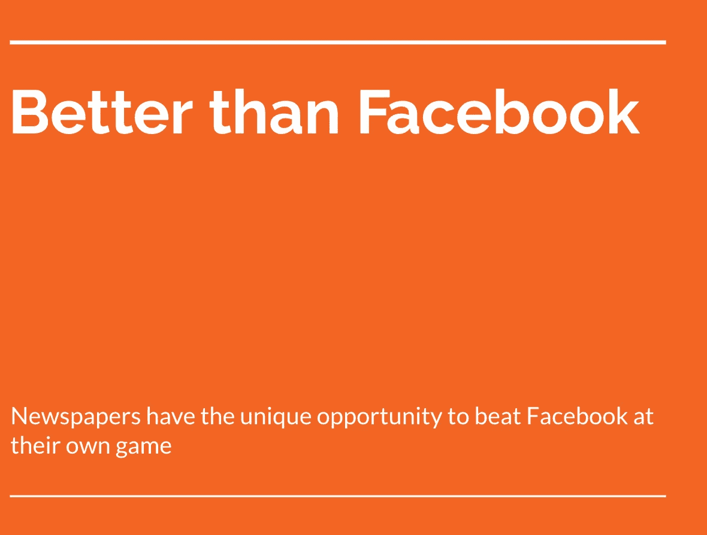

# 传统媒体如何打败脸书

> 原文：<https://medium.datadriveninvestor.com/how-traditional-media-could-beat-facebook-55b7e5874640?source=collection_archive---------2----------------------->

我个人曾在一家破产的报纸工作过，还记得那种感觉。我们不得不削减成本，内容质量下降，人们害怕被解雇，每个人都在寻找兼职。

另一方面，脸书继续发展，继续赚更多的钱，继续给实习生支付更多的工资，等等。这两个世界之间的矛盾令人震惊:两者都在销售广告，都在向用户提供内容，但一个正在蓬勃发展，而另一个正在消亡。

 [## 我们屏蔽了社交媒体，这引起了公愤。-数据驱动型投资者

### 上瘾，我们看不出来。在最近的一项研究中，基于以前的研究成果，我们想…

www.datadriveninvestor.com](https://www.datadriveninvestor.com/2018/12/01/we-blocked-access-to-social-media-it-caused-an-outrage/) 

# 媒体错过了数字浪潮

报纸已经过了黄金时代，变得过于自信。他们失去了适应能力，这是当今世界的一大杀手。当智能手机出现时，他们认为他们通过创建电子纸应用程序，通过建立显示今天文章的应用程序或网站来驾驭数字浪潮，但他们错过了更大的画面。

## 我们消费内容的方式已经改变

如果我们看看当今最成功的面向消费者的应用，有一个明显的趋势:新闻提要。不是一般的新闻。

用户想要他们想要的。现在。他们想要一个适合他们兴趣的新闻源，向他们展示他们想要的东西。这是传统媒体似乎忽略的根本转变。报纸保持分类，并根据编辑决定的今天的“热门”来展示文章。

但是现在，通过使用数据，我们可以做得更好，脸书做得非常成功。

# 如何打败脸书

尽管脸书仍然遥遥领先，但有几件事是脸书永远无法像报纸那样做的:

## 策划内容

报纸拥有优秀的记者，他们能够写出比猫狗图片更好的内容。对于脸书来说，这是一个根本性的问题:由于他们不生产自己的内容，他们只能希望他们的用户会生产有趣的内容。

## 标签内容

鉴于脸书需要处理的内容数量，他们不可能高效地对其进行标记。如何知道一个帖子是关于什么的，这张图片在说什么，…另一方面，报纸，鉴于它们产生了一小部分内容，可以很容易地非常准确地标记内容。

## 精准而有价值的广告

我自己在脸书做过广告，理论上，它看起来很棒。你可以根据这么多不同的标准来锁定目标人群！失望随后而来:瞄准根本不起作用。

我研究了脸书认为我感兴趣的东西，结果令人震惊:显然，我喜欢图像、阅读和摄影。当然，没有一个是准确或有用的。

他们无法精确定位用户是因为我前面提到的问题:他们无法正确标记内容。

鉴于他们有如此多的广告客户，脸书无法控制广告的质量，这导致用户的广告体验很差。

报纸可以做得更好！他们可以更准确地瞄准人们的兴趣，并为他们提供令人敬畏和精心策划的广告。

# 媒体的未来看起来很光明

我在一家应用程序开发机构工作，我们非常高兴能与多家报纸合作，帮助他们开发必要的软件，从脸书手中夺回市场份额！如果我们能帮到你，请联系我们！