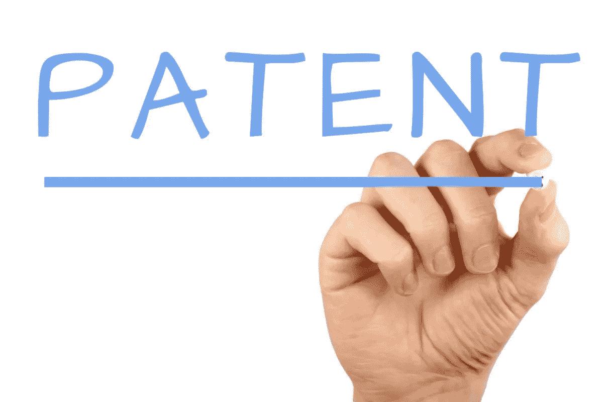
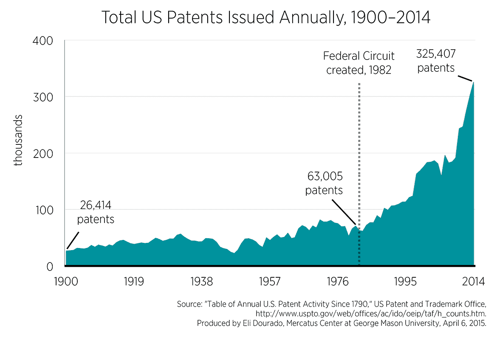

# 专利到底有多有用？

> 原文：<https://medium.datadriveninvestor.com/how-useful-really-are-patents-ccdc288a6103?source=collection_archive---------3----------------------->

我的简短回答是——不多。这里有四个实际的考虑因素:

**1)如果你正在考虑一项专利，你就在一个拥挤的公司里**

自上世纪 80 年代初以来，美国的专利数量出现了爆炸式增长，这在很大程度上是因为监管的变化。

关于这实际上是保护还是抑制创新还有很多争论，国会正在进行一些改革，比如 T2 创新法案。如果你想更深入地探索，这里有一个关于趋势的好讨论[。](http://www.acclaimip.com/2015-us-patenting-statistics/)

**2)技术差异化**

大量的专利是一项成就，尤其是已经获得授权的专利比正在申请的专利更是如此。但是企业家和风险投资都应该谨慎对待这个指标的权重——这取决于专利覆盖的范围，但同时，他们更多的是一种防御而不是进攻。如果有人可能侵犯或实际上侵犯了你的专利，你可以让他们尊重，但这更多是出于他们的道德/声誉或商业考虑，而不是既定事实。如果到了诉讼阶段，请注意，费用可能会非常昂贵，尤其是面对资金更雄厚的竞争对手或可能会让初创公司陷入困境的公司。所以要小心使用法律威胁。

**3)巨魔**

专利最方便的地方可以说是在巨魔身上。有几个个人和实体建立了完整的商业模式，开发或购买可能与公司冲突的专利，然后起诉他们。任何诉讼都需要向现有或潜在的投资者披露，这意味着，相对于正在考虑融资的初创公司，trolls 通常会获得心理优势。与巨魔和解是痛苦的，但这可能是重返公司建设的最快途径。这就是为什么申请专利来保护你自己是个好主意。

**4)国际**

当你进入国际司法管辖区时，专利就派不上用场了。如果你的产品或技术被抄袭，你当然可以在国际法庭上提起诉讼，但你的诉讼可能会拖上数年，甚至在许多司法管辖区，惩罚措施也无法很好地执行。我们如何建立一个更强大的全球专利标准超出了本文的范围，但与此同时，公司的执行力是唯一真正的防御。

这些是专注于实践见解的短文(我称之为 GL；dr —良好的长度；确实读过)。如果它们能让人们对某个话题产生足够的兴趣，从而进行更深入的探索，我会感到非常兴奋。我在三星的创新部门 [*NEXT*](http://samsungnext.com/) *工作，专注于深度科技领域软件和服务的早期风险投资，这里表达的所有观点都是我自己的。*