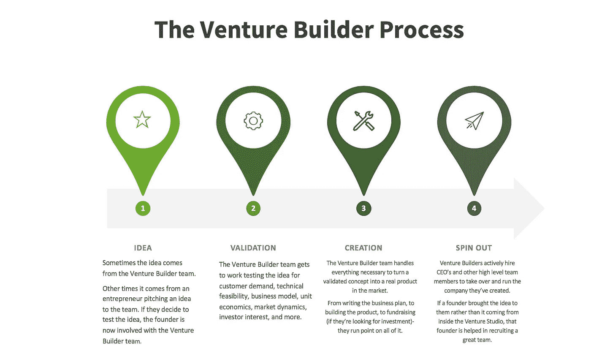
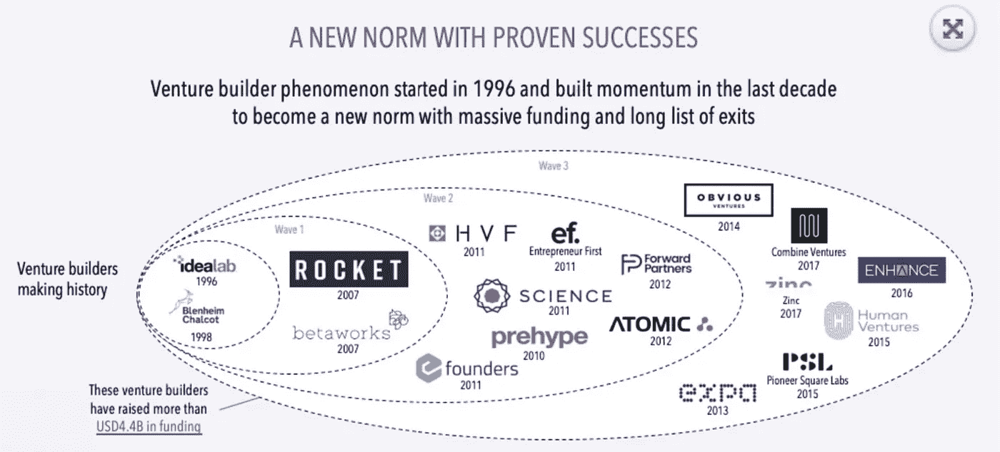

# 风险工作室如何重新定义创业的样子。

> 原文：<https://medium.datadriveninvestor.com/how-venture-studios-are-redefining-what-startup-creation-looks-like-dd33fe497b92?source=collection_archive---------1----------------------->

如果你从未听说过风险投资家，不要担心，你并不孤单。

这些实体相对较新，第一个版本在 1996 年才出现，由于某种原因，它们没有被媒体谈论太多。

 [## 动荡迫使暴风雨中的平静|数据驱动的投资者

### 自然界中很少有东西是直线行进的，尤其是经济。当投资者和消费者希望平静时…

www.datadriveninvestor.com](https://www.datadriveninvestor.com/2019/03/25/volatility-compels-calm-amid-the-storm/) 

与创业加速器不同，创业家不会和一群已经有想法的创业者一起运行项目。相反，创业家会在内部为他们的创业公司想出点子，然后和他们的全职团队一起执行。

这并不是说创业家从不接受外来的想法，他们会接受，关键是他们会很快将想法带入他们的领域，并与他们内部的专家团队一起工作。他们尽可能快地在市场上测试它，或者验证或者“杀死它”。如果这个想法是他们的，他们就杀了它，没有葬礼。如果这个想法来自外部的创始人，那么这个想法会和所有关于为什么应该被扼杀的数据一起返回给他们。

Information pulled from [PSL’s Venture Builder Model](https://www.psl.com/studio) breakdown + others.

如果一个想法是好的，有这个想法的创始人会与风险投资团队紧密合作，尝试启动业务。据一位著名的风险投资家先锋广场实验室(Pioneer Square Labs)称，内部团队负责几乎所有的公司建设业务。

*   市场调查
*   概念验证
*   工程和 UX 设计
*   走向市场战略
*   营销
*   招聘
*   筹款
*   金融
*   操作
*   法律和人力资源

## 风险创业者从何而来？

正如我前面提到的，第一家风投公司成立于 1996 年。它过去(现在仍然)被称为[创意实验室](https://idealabstudio.com/index.php#main_top_anchor)，由[比尔·格罗斯](https://en.wikipedia.org/wiki/Bill_T._Gross)创建，他是一个偶像，有很多原因，但他的奉献精神和远见在任何人对创业公司感兴趣之前创造了创业公司的未来，这让他在创业社区内外获得了超级明星的地位。

多亏了另一位叫做 [Enhance](https://medium.com/u/340c7edf39aa?source=post_page-----dd33fe497b92--------------------------------) 的风险投资家的辛勤工作，我们有了风险投资家生态系统的完整地图和时间表。

Excerpt from Enhance’s fantastic white published in May of 2019 by Alper Celen & Ritesh Tilani

如你所见， [Idea Lab](https://www.idealab.com/) 是 1996 年在美国成立的第一家风险企业。大约在同一时间，在伦敦，另一家风险投资公司正在生根发芽。[布伦海姆·查尔特](https://www.blenheimchalcot.com/about/)是一家知名且受人尊敬的风险企业，在这一新模式生态系统中有着深厚的根基。

大多数企业家都熟悉 [Betaworks](https://betaworks-studios.com/) ，它是早期风险投资公司的现代版，但有所不同。Betaworks 为这个难题引入了加速器。企业家现在有了选择。他们可以将自己的想法带给风险投资家，并与内部团队合作将想法推向市场，以换取交出公司的大部分股份(股权)，或者他们可以将自己的想法作为加速器计划的一部分带到 Beta Works，并放弃公司的一小部分股份，但获得的“实际操作”帮助要少得多。

随着风险企业家开始成长(我用这个词并不恰当，因为就市场饱和/扩张而言，他们在早期并没有增长多少)，他们开始专业化。

例如，Rocket 是一家风险投资公司，成立于 2007 年，与 Betaworks 齐名，但现在被称为“Rocket Internet”他们解释说，他们的使命是“孵化和投资全球互联网和科技公司。我们为创业者提供深度运营支持，帮助他们建立市场领先的公司。”他们也给传统模式增加了一点新意。他们不仅从零开始建立公司，还像风险投资公司一样投资非常早期的初创公司。

## 创业创业者是如何分类的？

我们知道风险投资公司是如何分类的，因为它们都非常清楚自己投资的阶段(种子期、A 轮、B+轮)和投资的领域(人工智能、消费零售、医疗保健等)。)这些分类使得整个行业的细分变得非常容易。

由于这种差异，你能够找出哪些风投公司适合你，哪些不适合。举例来说，如果你想为早期教育技术风险投资筹集资金，你不应该寻求像旗舰风险投资这样的公司的投资，它专注于医疗技术和可持续发展垂直领域。

**但是，风险企业家是如何划分的呢？**

Venture Builder 创始人 Alper Celen 在最近的[小组讨论](https://youtu.be/sXrmPR4If3g)中分享了他对这个话题的一些见解。

*“我们试图对他们进行分类的一种方法是，根据你拥有多少风险控制(意味着股权)和支持，这是一项正在进行的工作。一些工作室有更多，像我们(在 Enhance Ventures)是超级重的，我们建立东西。我们不只是说 3-6 个月后，这里有一些钱去建立自己的团队。”*

他接着讨论了风险投资者生态系统中存在的其他模式。

*“还有其他一些风险投资会迅速剥离他们的初创公司。就像* [*鹿角*](https://www.antler.co/) *一样，他们神奇地成为了一个风险发电机。他们非常专注于早期阶段，寻找正确的想法和正确的团队来启动它，但在 6 个月内，他们很快就出局了。”*

阿尔珀说的是，一些风险企业家真的把他们建立的初创公司当成自己的，从开始到启动，一直到退出(无论是 IPO、合并还是收购)，而其他人则更关注这个想法，建立公司，让它启动，然后交给外部的企业家团队来运营和扩大规模。

阿尔珀自己的风险投资创建者 [Enhance Ventures](https://www.enhance.online/) 出现在上图的外围，因为他的组织成立得比最初的组织晚得多。2016 年，在 Idea Lab 成立整整 20 年后，Alper 和他的同事 Ritesh Tilani 决定将 Venture Builder 模式扩展到整个中东，并专门专注于建立在线市场初创公司。他们在试图界定风险投资者的一些模糊之处方面做得非常出色，并在帮助该行业变得更容易进入方面取得了长足进步。

> 风险企业家的目的是找到最优秀的人才，为他们匹配一个颠覆性的想法，并给予他们启动创业的资源。

内部专家团队提供指导，现场工程师提供原型制作帮助，但创始人才是决定成败的真正因素。

根据我的观察，“进入”这些创业家并不像申请加速器或创业孵化器那么容易。我担心，这一过程的秘密性和对非核心创业者的排斥，将为风险创业者制造进入壁垒，这些壁垒不仅不需要存在，而且实际上会损害风险创业者获得成功的机会。

然而，行业内的趋势是充满希望的。随着像 [Human Ventures](https://humanventures.co/join-us/) 和[Entrepreneurs First Ventures](https://www.joinef.com/the-programme/)这样的风险企业在他们的网站上明确呼吁“加入我们的团队”行动，我相信我们会看到这个令人兴奋的创新生态系统变得更加透明。

