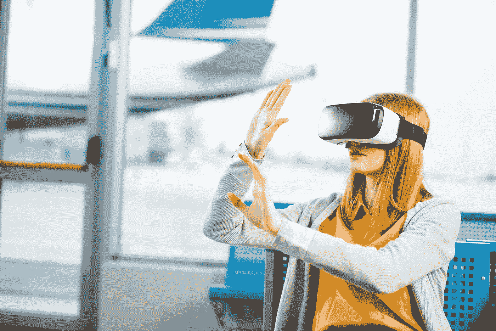

# 虚拟现实如何帮助旅游业发展

> 原文：<https://medium.datadriveninvestor.com/how-virtual-reality-is-helping-the-travel-industry-evolve-463924eaa10b?source=collection_archive---------2----------------------->

虚拟现实(VR)目前正在消费者的想象中迅速崛起。在学术界和技术实验领域度过了 90 年代和 2000 年代的第一个十年后，近年来已经看到几个层次的虚拟现实技术变得对公众可用。

这些最初的家用耳机产品主要面向视频游戏应用。然而，为该社区服务所取得的进展为商业应用开辟了许多新的可能性。

 [## 人工智能和虚拟现实的融合-你能期待什么|数据驱动的投资者

### 在技术领域，融合是合乎逻辑的一步。就在几十年前，你可能需要一个专门的…

www.datadriveninvestor.com](https://www.datadriveninvestor.com/2018/08/30/the-convergence-of-ai-rv-what-you-can-expect/) 

令游戏开发者惊讶的是，许多最受欢迎的 VR 应用程序都具有社交倾向，而不是传统的视频游戏。这一发现导致了虚拟现实的发展，并很快被证明是旅游业的一大福音。

# 虚拟现实如何改变消费者的旅行

消费级 VR 有几种形式:

*   移动虚拟现实，用户将手机插入其中的低成本耳机。手机呈现两幅图像，因此通过耳机看到的结果呈现出 3D 效果。它使用手机本身的内部硬件来跟踪运动。
*   独立的 VR，有自己的内部硬件，不需要外部跟踪硬件的耳机。
*   PC VR，它需要一台高端 PC 来完成繁重的工作。这些与房间范围内的跟踪硬件和手持运动控制器协同工作。虽然主要用于游戏，但额外的交互性层已被证明对许多企业应用程序非常有用。

旅游应用可以利用所有这些类型的虚拟现实。许多最受欢迎的应用程序针对更容易访问的形式，如移动 VR 护目镜。

# 虚拟旅游使选择目的地更加容易

比起简单地看静态图片，虚拟现实是一个获得更好的目的地“感觉”的好机会。

现有针对旅游热点的虚拟现实游览，例如:

*   珠穆朗玛峰，让我明白了从山顶往下看真的是必须亲身经历的事情。
*   大峡谷，这有助于旅行者决定一个好的季节去游览这个地区，因为根据他们游览的时间，生态环境有很大的不同。
*   香港的维多利亚港，自然美景和现代建筑的惊人碰撞，在身临其境的虚拟现实中显得更加突出。

虚拟现实体验为旅行者在决定最终目的地之前提供了一个全新的体验维度。

# 可从远处获得的目的地信息

当虚拟现实与平视显示器(HUD)图形设计一起使用时，旅行者可以在脑海中形成问题之前一眼就获得关键信息。

攀登珠穆朗玛峰需要多长时间？信息已经在屏幕上了。这个地区的顶级酒店在哪里？定制的虚拟现实旅行应用程序可以在旅行的背景中突出显示这一点。

# 抵达前的航行规划

一个城市的虚拟现实之旅可以提供有趣的目的地在哪里，该地区有哪些餐馆等信息，所有这些都一目了然。

亲身体验的虚拟现实之旅让游客更好地了解他们想预先看到的东西。然后，利用像谷歌地球虚拟现实这样的软件，人们可以搜索其他兴趣点并锁定它们，以便创建一个独特的旅行计划——所有这些都不需要离开应用程序。

# 在参观虚拟博物馆之前先了解一下它的范围

许多著名的博物馆已经提供了虚拟现实体验，远程游客可以使用它来更好地了解博物馆内的景点:

*   伦敦的辛慈音乐厅提供了几个最著名展品的 360 度扫描。这使得博物馆令人惊叹的建筑以 2D 图片所没有的方式闪耀。
*   伊拉克国家博物馆提供完整的 3D 游览，这对于这个特殊的博物馆来说尤其重要，原因有二:它是一些已知最古老的人类文物的宿主，并且它位于许多人不愿参观的位置。虽然这是一个极端的例子，但这是一个关键的方式来显示虚拟现实作为导航空间的媒介是多么重要。
*   纽约市的大都会艺术博物馆提供了完整的虚拟现实体验，这是鼓励游客参观这座城市的一个好方法。它允许用户从空间本身不可能的角度浏览博物馆。

# 旅游业如何从虚拟现实中受益

上述面向消费者的应用程序非常适合寻找新方法来决定游览地点的旅行者，这对旅游业已经很有帮助。

虚拟现实在旅游业中也有一些特殊的用途，可以在幕后提供帮助。

# 视觉信息创造线索

上面的例子是从消费者的角度来看的。对于旅游行业，虚拟现实中呈现的上下文弹出窗口和其他信息可用于鼓励用户关注合作目的地、酒店、餐馆等。

例如，目的地附近的虚拟旅游可以使用信息弹出窗口来突出显示与完整旅行套餐相关的服务和旅游景点。

# 虚拟现实培训应用

对旅游业来说，一项主要的、耗时的支出一直是旅行社和其他直接与顾客打交道的雇员的教育费用。

旅行者希望该领域的专业人士对每个目的地都有第一手的了解，而不仅仅是简单的要点列表。虚拟旅游是完美的沉浸式培训工具，可以在不超支的情况下解决这个问题。

# 利用虚拟现实进行促销

在未来的某个时刻，虚拟现实体验将会像今天的电影一样正常化。但是我们离那个时候还很远！在促销期间提供虚拟现实旅游作为鼓励客流量的一种方式是吸引新客户的有效方式。

这在目的地的旅行社和企业之间创造了独特的机会。当一家餐馆或酒店知道你有能力为你的顾客突出他们的服务时，他们通常会提供特别的优惠来帮助你促销。

# 向顾客展示他们的酒店

世界各地的主要酒店已经提供了广泛的、身临其境的酒店虚拟现实之旅:

*   迪拜的 Palm 提供了他们豪华酒店的虚拟现实之旅，以及在酒店周围的水肺潜水体验，这给旅行者决定住在哪里留下了很少的想象空间。
*   坎昆的 Grand Oasis 酒店提供了一个虚拟现实之旅，有一个可视的向导解释建筑，便利设施和更多的东西。
*   阿德莱德快捷假日酒店证明，豪华酒店的最高端并不是唯一从实施虚拟旅游中受益的地方。这是对未来的展望:潜在的游客可能很快就会期望每家酒店在决定住在哪里之前都提供某种交互式虚拟现实旅游体验。

由 [***瓦西里*** 瓦西里](https://blog.dataart.com/author/vasily-malinov/)
VP，出行&招待在 [DataArt](https://www.dataart.com/)

*原载于 2019 年 7 月 17 日*[*https://blog.dataart.com*](https://blog.dataart.com/how-virtual-reality-is-helping-the-travel-industry-evolve/)*。*