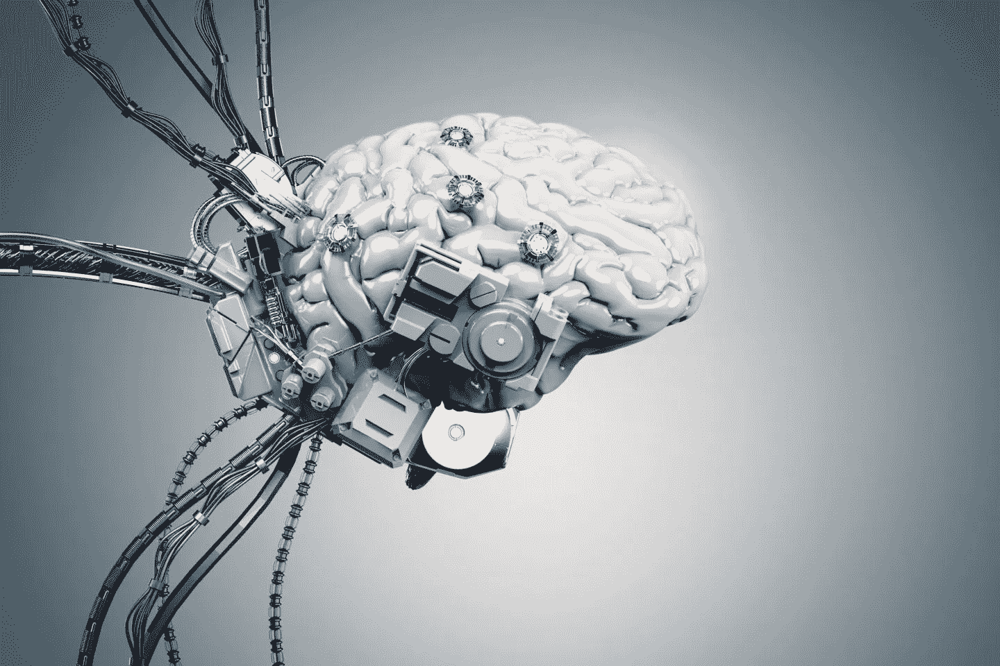
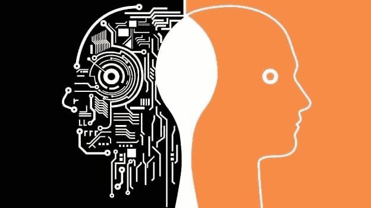

# 我们如何学习——以及机器如何学习

> 原文：<https://medium.datadriveninvestor.com/how-we-learn-and-how-machines-do-it-too-55f257f2e666?source=collection_archive---------29----------------------->

当你出生时，你什么都不知道。

你不知道你在哪里。你不会数数也不会说话。你不知道字母表。你甚至不知道你叫什么名字。然后你睁开眼睛，一切都变了。

你的学习之旅开始了。

你开始**明白了。**

当然，它是模糊的，一切都是黑白的。你只能看到清晰的斑点和形状在移动。尽管如此，用你新发现的视野，你开始感知这个世界。最终，你记住了面孔和你最喜欢的玩具的样子。你也可以**听到**声音和**闻到**你周围的气味。你用你的五种感官收集信息并了解你周围的环境。

9 个月左右的时候，你决定踏上冒险之旅；你迈出了第一步。你吃了一两片，然后就倒下了。也许你又试了一次，又跌跌撞撞。你还需要几个月才能走得好。你练习了无数次才完全掌握走路。

你做了几百甚至几千道加减法题才成为第二天性。学习基本的数学运算需要练习，直到它在你的记忆中根深蒂固。学习和掌握技能需要**练习**。

你是个非常好奇的孩子。一切都让你惊讶，你会触摸到眼前的一切。还记得你摸炉子的时候吗？它看起来太迷人了！你忍不住伸出手，却痛得叫出声来。从经验中，你学会了永远不要再碰炉子。

在学校里，当你对着全班同学说话而不举手时，你会被老师训斥。学会说话时举手需要经历。从错误中学习需要经验。

作为一个婴儿，你可能尝试过几十个谜题，比你曾经数过的还要多。一开始，你只是试着把所有的碎片拼在一起。但是它们很少合身！你必须尝试各种不同的组合才能把它做好。你使用试错法来学习解谜并找到适合你的策略。

当你开始学代数的时候，你盯着方程 5+x=7 和 6-y=2。你只是猜测每个变量不同的可能值，最终得到 x=2，y=4。人们花了反复试验的时间来弄清楚代数是如何工作的，并发展出系统地寻找解决方案的方法。需要**试错**来学习和发展解决问题的策略。

这是你学习的方式。这就是你如何想出如何做每一件事。你对世界的了解有助于你充实地过好每天的生活。但这不仅仅是你。甚至不是每个人都能学会的。这些策略是所有东西(甚至是机器)用来学习的。

进入机器学习。

机器学习是一个正在接管世界的巨大领域。简单来说，它告诉机器去执行一项任务，而不是由**明确编程**去做。换句话说，机器**学会了**自己做一些事情，而不需要为每一个进程编写代码。就像你和我一样。

首先，我们将数据输入到机器学习算法中。数据就像我们从感官获得的信息一样。没有数据，机器就是刚出生的婴儿；它什么都不知道。程序使用**试错**找到最符合数据的模型(把模型想象成大脑，它接收数据并产生一个结果)。它尝试不同的值，并使用一种策略来创建最佳模型。为了很好地训练模型，我们给它很多数据，就像我们人类必须**练习**很多次才能掌握一样。在训练过程中，机器可能会出错。它将其生成的答案与数据中给出的答案进行比较，并相应地改变其模型，通过**经验**进行学习。

这是一种称为**监督学习**的特定机器学习类型如何工作的过程。如你所见，机器可以自主学习(只要给它们数据，有机器学习算法)，就像我们一样！有些类型的机器学习甚至不需要数据！这就是为什么我们说机器可以有**人工智能**或者 **AI** 。

当然，我们只是触及了表面。这只是监督机器学习如何工作的简化版本。它可以实现不同的算法，如梯度下降或正常方程，以解决线性或逻辑回归问题，并使监督学习问题的成本函数最小化。还有其他类型的机器学习，如无监督和强化的机器学习。我们将在以后的文章中谈到这一点。

这里关键的一点是**人类**和**机器**可以用同样的方式学习！不同的是，机器可以更快、更有效地学习**。**他们能够以比人类拥有经验或练习学习技能的速度更快的数量级运行和分析他们的数据。机器永远不会疲劳或分心，可以不断学习，不像人类。

如你所见，机器学习真的是未来！它可以帮助我们改善生活，让世界变得更有效率。不幸的是，机器学习也可能被用于恶意伤害他人。手里有了这样一个**强大的工具**，我们将如何使用人工智能？这由你来决定。

感谢阅读！如果你想了解更多关于机器学习和人工智能的知识，请务必关注我！:)