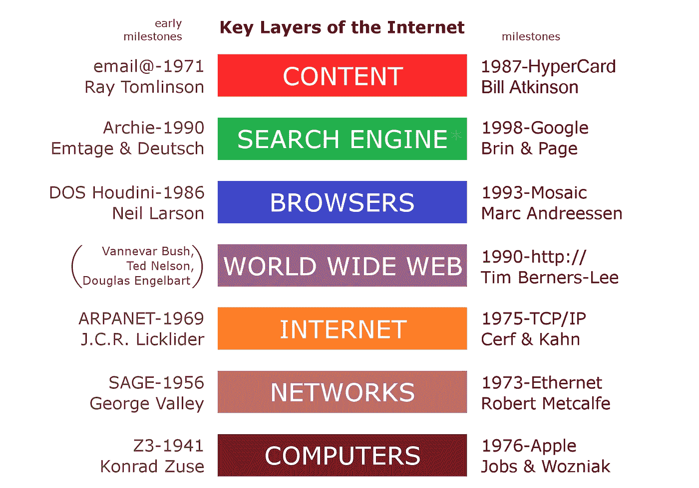
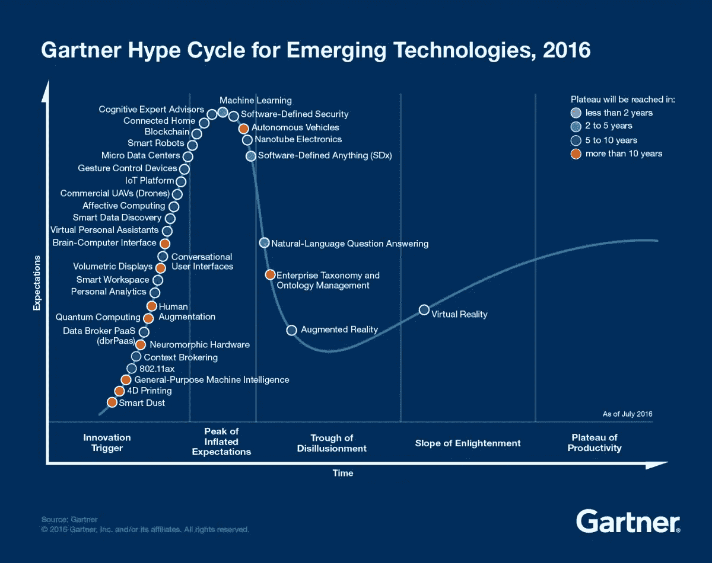

# 今天我们应该如何看待区块链

> 原文：<https://medium.datadriveninvestor.com/how-we-should-think-about-blockchain-today-c8e09967fc6c?source=collection_archive---------4----------------------->

我最近偶然发现了瑞安·沃尔什的以下[推文](https://twitter.com/localbyproxy/status/897291454959058944):

> “最好的区块链公司是让客户震惊的公司，永远不需要告诉他们这是区块链。”

认识到区块链仅仅是创造客户价值的*使能器*，它本身并不创造任何价值，这概括了区块链技术现状的本质。当我们考虑未来可能的广泛采用时，许多批评者仍然暗示区块链的复杂性。参考《哈佛商业评论》*中的[文章](https://hbr.org/2017/01/the-truth-about-blockchain)“区块链的真相”*，具有高度新颖性和复杂性的技术通常具有最长的采用期——但最终将为我们的经济、社会和政治系统带来彻底的变革。区块链当然属于这一范畴。尽管新奇和复杂使得区块链难以掌握，并阻碍了它的传染性，但它不应该让我们对该技术的未来潜力不那么乐观。为什么？

在 1985 年接受《花花公子》采访时，几个月前刚刚推出苹果麦金塔电脑的史蒂夫·乔布斯生动地描述了技术采用的机制。看一看:

> Playboy:什么会改变？
> 
> 乔布斯:对大多数人来说，购买家用电脑的最有说服力的理由是将它连接到一个全国性的通信网络。对大多数人来说，这将是一个真正了不起的突破，就像电话一样了不起。
> 
> Playboy:具体来说，你说的是什么样的突破？
> 
> 乔布斯:我只能开始推测。我们在我们的行业中看到很多:你不知道会有什么结果，但你知道这是非常大和非常好的事情。
> 
> Playboy:那么现在，你不是要求家用电脑购买者投资 3000 美元在本质上是一种信仰行为吗？
> 
> 乔布斯:在未来，这将不再是一种信仰行为。我们现在面临的困难是，人们问你一些细节，而你不能告诉他们。一百年前，如果有人问亚历山大·格雷厄姆·贝尔，“你能用电话做什么？”他不可能告诉他电话会对世界产生怎样的影响。他不知道人们会用电话打电话询问那天晚上上映什么电影，或者订购一些食品杂货，或者给地球另一端的亲戚打电话。但是请记住，第一部公共电报是在 1844 年问世的。这是通信领域的一个惊人突破。你实际上可以在一个下午把信息从纽约发送到旧金山。人们谈论在美国的每张桌子上都放一部电报来提高生产率。但这不会成功的。它要求人们学会这一整套奇怪的咒语、莫尔斯电码、点和破折号，才能使用电报。学了大概 40 个小时。大多数人永远不会学会如何使用它。幸运的是，在 19 世纪 70 年代，贝尔申请了电话专利。它的功能与电报基本相同，但人们已经知道如何使用它。此外，它最棒的一点是，除了允许你用语言交流之外，它还允许你唱歌。

Steve Jobs during his interview with Playboy in 1985 (Source: [Longform](http://reprints.longform.org/playboy-interview-steve-jobs))

这里有两点需要注意:首先，对互联网未来可能性的预期与今天对区块链的预期一样模糊。第二，今天很大一部分互联网用户(在 20 世纪 90 年代，当互联网开始出现并在技术领域受到欢迎时，可能有更多的人)仍然无法解释互联网是如何工作的——或者意识到万维网和互联网之间的区别。

Key layers of the Internet (Source: [Wikipedia](https://en.wikipedia.org/wiki/World_Wide_Web#/media/File:Internet_Key_Layers.png)).

但事实是:他们不需要这么做！在过去 25 年的过程中，许多公司创造了令人惊叹的新产品和服务，给人留下了深刻的用户体验，所有这些都为客户和企业创造了巨大的价值(我们都知道它们，所以我不打算在这里重复)。新技术和生态系统出现在互联网之上，如云、物联网、联网家庭、智能制造、人工智能等等(关于概述，我推荐克劳斯·施瓦布的书《第四次工业革命》)。因此，互联网是 T2 的推动者。

与此同时，互联网本身成为了第二天性。我记得在 20 世纪 90 年代末，“冲浪”本身仍然是一种行为。我的父亲会走进一个单独的“机房”，等待 10 分钟的连接，忍受一些刻意偷窥的声音(听听它[这里](https://www.youtube.com/watch?v=gsNaR6FRuO0)为了一些怀旧！)，直到他能够连接到万维网并在“Google”或“Yahoo！搜索”。虽然昨天这项技术还处于前台，但今天,“谷歌”这个词已经成为牛津词典和我们文化中的[部分。哦，顺便说一下，它在万维网上运行。而且体验很神奇。](https://en.oxforddictionaries.com/definition/google)

因此，随着我们的发展，我相信区块链技术本身将成为第二天性，并进入后台(目前，它仍处于[加内特炒作周期](https://www.gartner.com/smarterwithgartner/3-trends-appear-in-the-gartner-hype-cycle-for-emerging-technologies-2016/)的第一阶段)。

The Gartner’s Hype Cycle of 2016 (Source: [Gartner](https://www.gartner.com/smarterwithgartner/3-trends-appear-in-the-gartner-hype-cycle-for-emerging-technologies-2016/)).

虽然许多人似乎还不了解这项技术的细节，但他们可能永远也不会了解，因为它最终会潜入我们的生活，改变一切。公司将基于区块链技术创造具有突破性客户体验的产品和服务——就像他们在互联网上所做的那样。

对于商科学生和未来的商业领袖或企业家来说，他们曾经可能创造由区块链驱动的产品和服务，这种认识将特别相关。从商业角度评估技术的当前和未来潜力也很重要。还记得乔布斯[说的](https://www.newyorker.com/news/news-desk/steve-jobs-technology-alone-is-not-enough)吗？“[……]光有技术是不够的——只有技术与人文艺术相结合，与人文学科相结合，才能给我们带来让我们的心歌唱的结果。”

让我们把区块链和文科结合起来。

本文是由两部分组成的系列文章的一部分。虽然这篇文章涵盖了我们今天应该如何思考区块链*，*第二篇文章将关注如何思考未来的区块链*并回答这个问题:我们如何才能用区块链为未来发展一个成功的叙事？*

*原载于 2017 年 10 月 22 日*[*www . marcb . ch*](https://www.marcb.ch/publications/2017/10/22/how-we-should-think-about-blockchain)*。*