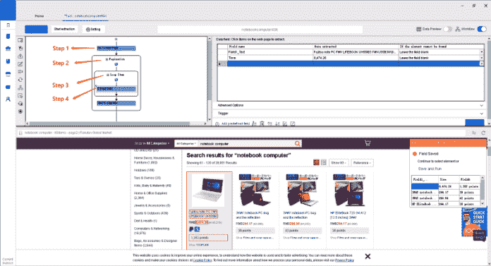
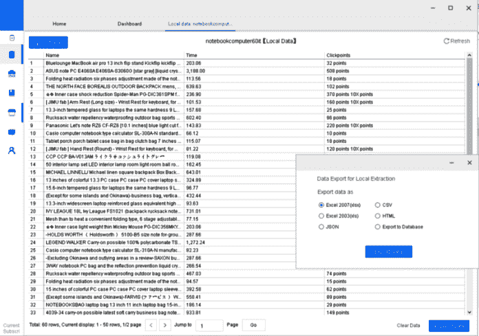
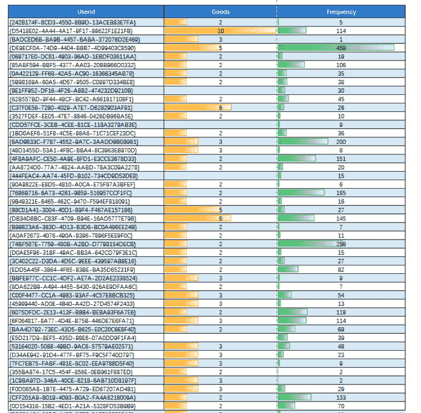
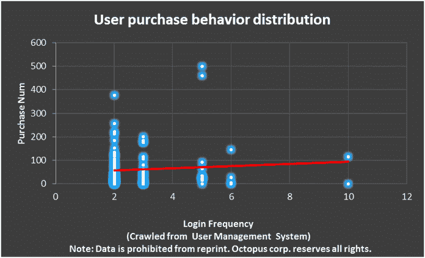
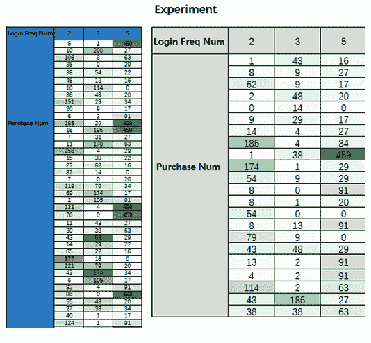
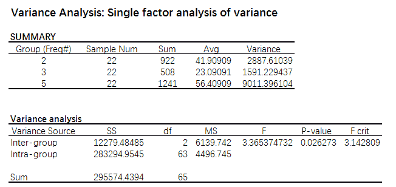

# 网络抓取和数据分析如何帮助你发展业务？

> 原文：<https://medium.datadriveninvestor.com/how-web-scraping-and-data-analysis-can-help-to-grow-your-business-a725cc20fdf2?source=collection_archive---------3----------------------->

Y 你可能听说过数据分析如何影响我们的生活。对于商业和企业来说，掌握有价值的数据可以更容易地分析他们的客户行为和市场需求。

为了与亚马逊竞争，沃尔玛推出了一款基于统计分析和语义分析的搜索引擎“北极星”。北极星可以从社交媒体脸书向它发送关于寻找/喜欢/保存产品的信息。受其数据驱动策略的启发，我分析了用户在我的业务上的登录频率(频率)和购买数量(商品)之间可能的相关性。

下面，我将分享一些关于如何使用 [Octoparse](http://www.octoparse.com) 收集用户数据记录以及如何分析数据的说明。

# 第 1 部分，收集用户数据记录

您的在线用户管理系统中可能有大量用户记录数据。但是，我们需要将它导出为一个更结构化的数据集，并将其存储到本地以供进一步分析。对于大多数商业和企业来说，通过编程从网站抓取数据的成本可能很高。在这里，我可以和你分享我是如何从我的在线管理系统中抓取数据的。通常，我使用 [**Octoparse**](http://www.octoparse.com/) ，这是一个为非程序员设计的自动网络抓取器/爬虫。我们可以通过简单的拖拽&点击来轻松收集目标数据。在关注隐私的同时，我不能直接向你展示如何抓取我自己的用户管理站点。但是，我将以 Rakuten.com 为例，向您展示如何使用这个免费的网络抓取工具来抓取目标数据。操作界面如下。

**抓取数据:**

**步骤 1** ，输入目标网址。等待网页在内置浏览器中完全加载。

**步骤 2，**设置分页循环。Octoparse 会自动翻到下一页，给你一套完整的数据。

**第三步**，建立一个循环列表，将所有包含目标数据字段的块包含进来，就像上面的红框一样。

**步骤 4** ，开始捕捉数据字段，如本例中的名称、价格、点击频率。在这种情况下，我需要登录频率、购买的商品编号和用户 id。

**第五步**。按照说明点击下一步，选择“本地提取”。然后，您可以在短时间内在数据提取面板中看到数据是如何提取的。

章鱼使我们能够提取各种格式的数据，包括但不限于 Excel、CSV、HTML 等。您可以根据需要选择导出方式。

# 第 2 部分，数据分析

## 第一步，假设

回到我的实验案例，我将我的全部数据导出到 excel 中。现在，我探究这两个因素(登录频率、商品编号)是否真的相互交织在一起。收集的数据经过重新组织，显示在下表中(注意:该表仅显示了部分已爬网的数据)。

有了这些抓取的数据，我们可以绘制一个散点图来观察这些假定的坐标点(**登录频率，购买数量**)的分布是有规律的。最终散点图如下图所示。从购买数量分布来看，我们可以看出大多数分散的点都聚集在 2 到 5 个左右，我们可以将这些人定义为高质量的用户。

这假设了一个场景，即登录频率在 2 到 5 之间的人可能表现出更高的购买倾向。此外，通过观察红色趋势线，我们可以推测，在此范围内，登录频率越高，客户愿意购买的产品就越多。不过，这只是主观猜测。我们现在需要进一步检验我们的假设。

## 第二步，统计假设检验分析(P 值法)

现在，让我们假设用户的登录频率和他们的购买数量之间可能存在潜在的相关性。

**首先，**我假设登录频率数在[2，5]以内。

**接下来，**通过筛选出 2、3、5 这三个特征登录频率数，我可以进行统计假设检验分析。

**从**开始，我从整个数据集进行随机抽样，选择 22 个样本数据记录进行实验，如下表所示。

**然后，**你可以使用 Matlab 或者其他任何可用的数据分析工具做单因素方差分析。请注意，我们将显著性水平α(犯 I 型错误的概率)设置为 0.05。

最终结果如下。从方差分析中，我们可以看到这三组在 Avg 上的不同表现，从而我们可以确定一个假设--样本组的差异是由实验抽样误差引起的。

将 P 值与α值进行比较，我们可以看到 P 值小于α值，因此我们可以拒绝零假设，而支持另一个假设，即这三组之间存在差异。此外，我们还可以验证用户购买数量是否会受到其登录频率的影响。

通过以上分析，我可以更加关注那些具有特定登录频率的目标用户，集中我的目标和预算计划，也可以更好地为那些高质量的用户服务。

如果你喜欢这篇文章，请访问我们的[网站，了解更多关于网络抓取的信息](http://www.octoparse.com)。别忘了为我鼓掌，分享你的爱！