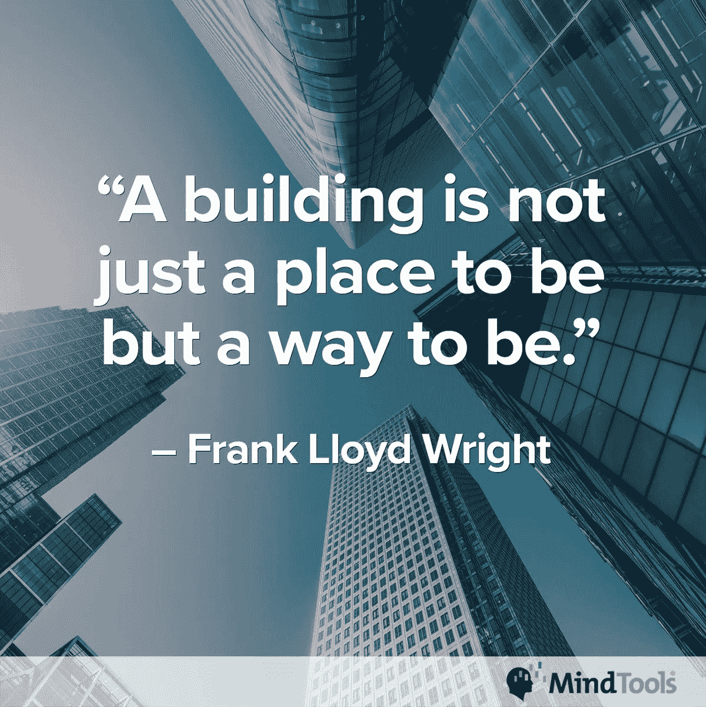
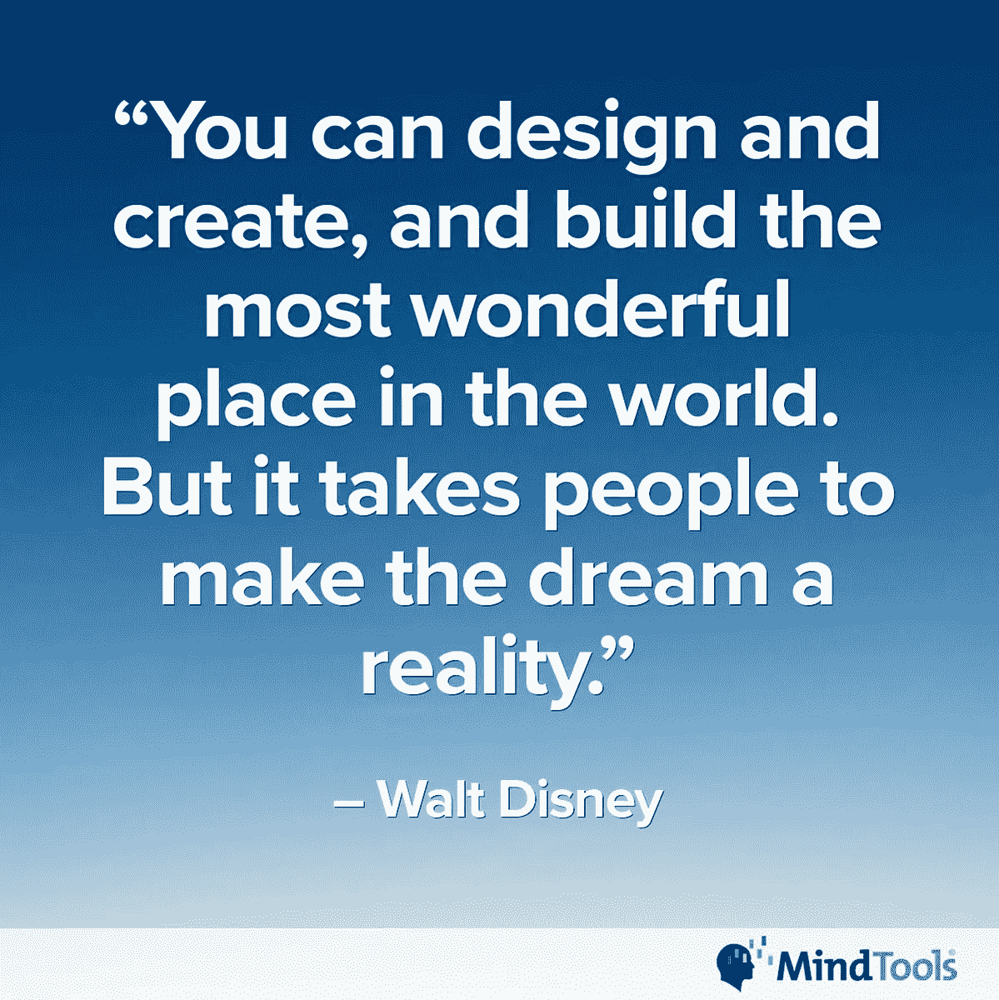
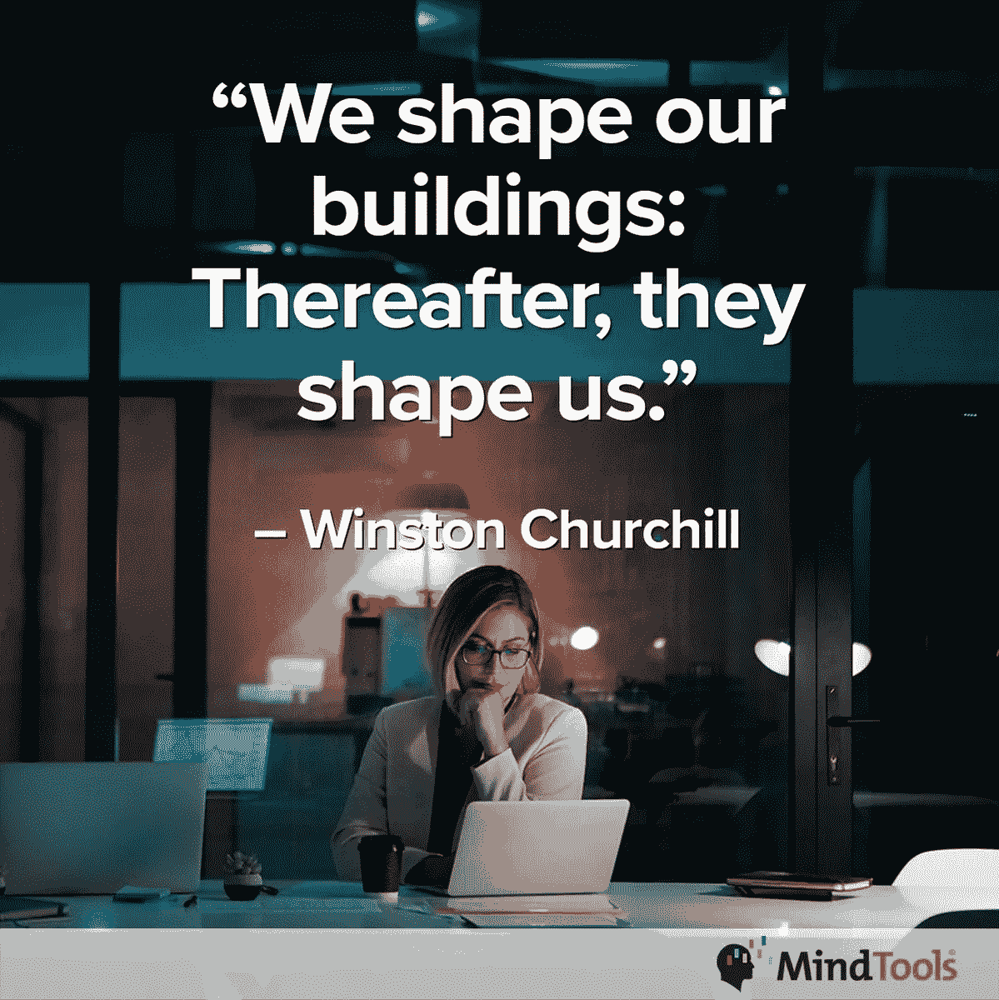
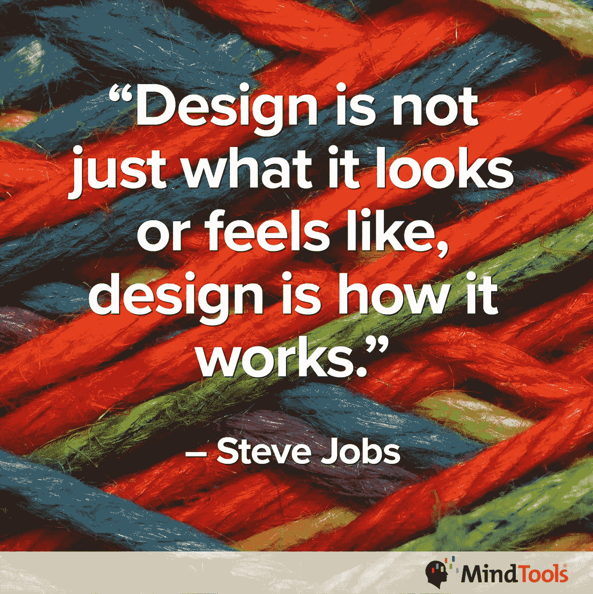
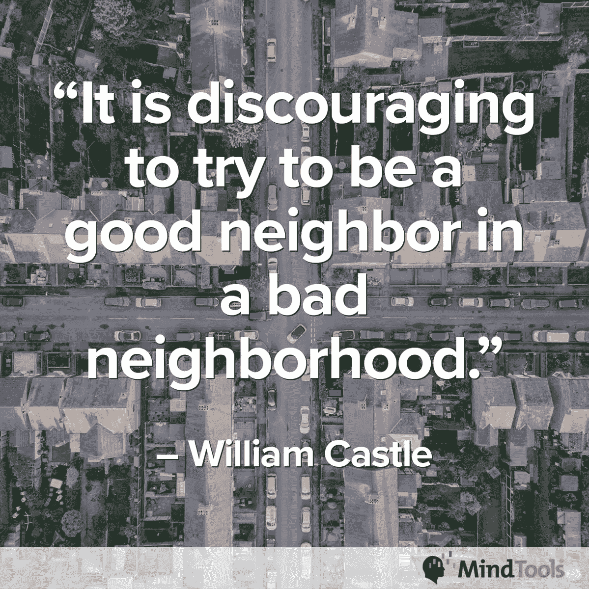

# 你的设计工作有多好？

> 原文：<https://medium.datadriveninvestor.com/how-well-do-you-work-by-design-68455fc542ef?source=collection_archive---------2----------------------->

## 愉快的工作环境会带来快乐、高效的员工

办公室设计是情绪的制造者或破坏者。工作场所的安排决定了员工是快乐的、高效的，还是受压抑的、低效的。

[MindTools](https://www.mindtools.com/AboutMindTools.htm) 对这个主题有所设计。该公司是世界上最受欢迎的按需职业和管理学习解决方案之一。

[约兰德·康拉迪](https://twitter.com/Yolande_MT)谈到办公空间如何衡量并影响员工。她领导着 Mind Tools 社区参与团队。

“让自然光进入办公室的窗户很棒，”康拉迪说。“它能提高警觉性和工作效率。

“在思维工具办公室有一个放松区，有一个小图书馆，一些游戏和一个乒乓球台，”她说。"这个区域“告诉”人们你需要平衡工作和放松."

个人风格也增加了气氛。

“我喜欢我桌子上的植物，”康拉迪说。“它们都是我丈夫送的礼物。除了加绿，他们还时时刻刻让我想起他。

“我的办公室是我的空间，”她说。“我可以随心所欲地发挥创造力——让它变得凌乱不堪，又让它变得井然有序。”

有些人不喜欢开放式办公室。他们努力保持专注，不喜欢没有隐私。

康拉迪说:“如果你不喜欢办公室的颜色，这可能会影响你的工作幸福感，因为颜色对我们有很大的影响。”

“我不喜欢我听到的道路噪音和飞机噪音，”她说。“我对噪音非常敏感。有时我不喜欢有一个家庭办公室，因为我总是在工作。”

最好的办公室设计是你不会想到的。你认为这是理所当然的，让企业的业务成为你的关注点。

“虽然设计很重要，但它不是最重要的因素，”康拉迪说。“你人际关系的质量以及你觉得自己有多重要、有多有目的更重要。

她说:“你的个性和思维偏好会在办公室设计对你工作幸福感的影响中发挥作用。”“这可能对一些人至关重要，而对另一些人来说关系不大。”

“我办公室的外观和感觉对我的工作幸福感至关重要，”康拉迪说。“我不喜欢乏味的空间。

“我可以强迫自己在一个丑陋的空间工作，但如果我喜欢我的环境，那会更愉快，”她说。“然而，我在单调的空间里完成了一些伟大的作品。需要是发明之母。”

让空气流通的办公室设计有助于身体健康。明亮的环境通常对非德拉库拉人的精神健康最有利。

“设计不良的工作场所可能通风不良，”康拉迪说。“通风不好会对空气质量产生影响，进而影响人的健康。

“办公室设计影响着我们如何以及在哪里布置我们团队的桌子、椅子、电脑和其他工作配件，”她说。"正确设置它们将有助于把受伤的可能性降到最低。"

设计缺陷迟早会影响工人的身体。

康拉迪说:“如果办公室让你感到压抑，那肯定对你的健康没有好处。”“由于糟糕的设计而导致的不良坐姿会导致背部问题、头痛和其他慢性疼痛。不好。”

Mind Tools 发表了一篇博客，探讨健康的工作环境对个人、团队和组织的益处。

颜色偏好因人而异——有些差异很大，有些差异很小。你也可能没有颜色的选择，让你根据自己的喜好添加物品。

“缺乏色彩会让工作场所看起来单调乏味，”康拉迪说。“增加色彩可以使它振奋人心，激励人心。

“当你重新装修你的办公室时，不要低估颜色的力量，”她说。“我们都会对颜色产生情感反应。好好利用它。”

Mind Tools 有一篇博文《*商业中的色彩心理学》，来解决这个问题。*

*“颜色对我来说很重要，”康拉迪说。“有我不喜欢的颜色。我不喜欢一直被他们包围。我会找借口不在办公室。*

*“我喜欢带有绿色植物的柔和色彩，”她说。“这让我感觉很踏实。”*

**

*办公室设计可以让你振奋，也可以让你沮丧。这些都会影响你的快乐和效率。*

*根据 Mind Tools 团队的说法，工作场所变化管理顾问 Diane Stegmeier 的研究探索了物理空间对人类行为的影响。她发现，最具生产力的工作场所是那些灵活性、适应性和弹性是设计的关键驱动力的地方。*

*“办公空间设计如何影响生产力可能取决于个人的个性和思维偏好，”康拉迪说一个无趣的空间会让我不想呆在办公室里——这对工作效率非常不利。*

*“太多的噪音和干扰肯定会对我的工作效率产生负面影响，”她说。"我更喜欢独立工作。"*

*一个 Mind Tools 博客解释说，不管设计如何，[良好的办公室礼仪对于让工作场所成为一个令人愉快的地方是至关重要的。](https://www.mindtools.com/pages/article/newCDV_82.htm?utm_source=social&utm_medium=organic&utm_campaign=tweetchat)*

*在一些工作场所，人们强烈反对开放式设计。任何办公室设计都有利弊。大多数工人决定最终结果。改变劳动力将改变设计。*

*解决方法:让你的员工开心，降低流动率。*

*康拉迪说:“开放式办公室对一些人来说可能充满活力、时髦和创意，但对另一些人来说，它们缺乏人情味、令人沮丧或令人疲惫。”。“建议你的人用耳机听音乐或‘白噪音’来对抗噪音。就适用于所有人的行为准则达成一致。”*

*就个人而言，她并不喜欢开放空间。*

*康拉迪说:“我发现他们令人疲惫，除非每个人都考虑到别人。”“不过，我必须承认，我确实喜欢自己的空间。我是一个非常注重隐私的人。*

*“在一个开放的计划中，每个人都安静、守纪律、富有成效，这实际上帮助我变得更有成效，”她说。*

**

*越多的人占据或通过一个空间，通风就应该越好，这样空气才不会停滞和不健康。*

*“考虑使用明亮的颜色，如橙色、红色或黄色，作为走廊和会议室装饰方案的一部分，”康拉迪说。“这些颜色能提升能量和注意力。*

*“打开百叶窗和窗帘会让大量的自然光进来，”她说。“如果光线太暗，换成模拟自然光的灯泡。使用主题、颜色、照明、植物和声音来创造美丽而实用的空间。”*

*办公室家具和装饰受时尚的影响，就像家居装饰一样。然而，并不是所有的创新都像广告宣传的那样。*

*事实证明，立式办公桌并不是增进健康的不二选择。人们称赞它们有助于避免坐着时形成血栓等，但它们似乎会导致或加剧其他身体问题。*

*康拉迪说:“我们需要停止将整个办公室环境视为一个方盒子——设计师将它分成越来越小的独立空间。”*

*她说:“在办公室设计中包括空间公平、灵活性、健康性、舒适性、技术连接性、可靠性和场所感等元素。”*

**

*“我不喜欢刻板、呆板的设计和空间，”康拉迪说。“这让我觉得不受欢迎。*

*“我喜欢古典、温暖、优雅的设计，融入石头和木头等天然材料，”她说。“它必须看起来*和*感觉受欢迎。”*

*如果[在家工作](https://www.mindtools.com/pages/article/working-from-home.htm?utm_source=social&utm_medium=organic&utm_campaign=tweetchat)，Mind Tools 有关于如何设置你的工作空间的建议。*

**

*康拉迪说:“留出特定的空间，提供团队成员所需的工具和资源，帮助他们进行创造性思维。”“这种自由感对培养团队中的创造力大有帮助。”*

*她给出了自己办公室的三大改进:*

*   *引进更多的植物。*
*   *多拿一个书架。*
*   *在墙上放一个“创意板”。*

*总会有变化，因为正如康拉迪所说，“变化是我们唯一可以确定的事情。”*

***关于作者***

*吉姆·卡扎曼是[拉戈金融服务公司](http://largofinancialservices.com)的经理，曾在空军和联邦政府的公共事务部门工作。你可以在[推特](https://twitter.com/JKatzaman)、[脸书](https://www.facebook.com/jim.katzaman)和 [LinkedIn](https://www.linkedin.com/in/jim-katzaman-33641b21/) 上和他联系。*