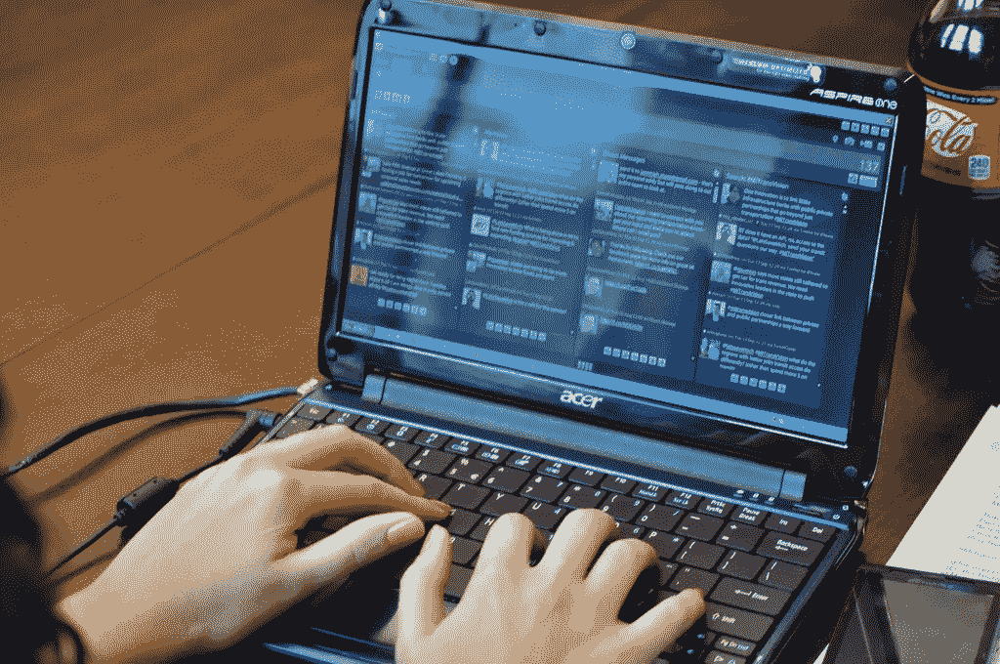
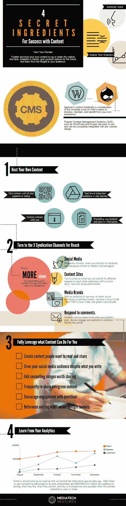

# 顶级初创公司首席执行官和风投是如何(为什么)有时间发这么多微博的

> 原文：<https://medium.datadriveninvestor.com/how-why-top-startup-ceos-and-vcs-find-time-to-tweet-so-much-bf3d3628c50d?source=collection_archive---------26----------------------->

阅读时间:8 分钟

我不禁想知道，公众对 Trump 和 Elon Musk 的推特的关注，是否与每个人都在问*这些在*的人如何*(或者真的为什么】大概是*忙碌而重要的角色，管理时间来打扰推特有关。

在我在奥斯汀的工作中，通过 [MediaTech Ventures](https://mediatech.ventures/) ，探索这样一个问题的时机再恰当不过了… [Founder Institute](https://medium.com/u/841eac17f77f?source=post_page-----bf3d3628c50d--------------------------------) [奥斯汀](https://fi.co/)正在开始它的第三个队列，在我们的课程中，培养有保障的创始人，了解首席执行官如何以及为什么投资在公共场合拥有发言权与我们下一堂课的开始相关。

# 顶尖的创业公司 CEO 和风投是怎么找到时间发这么多微博的？

信不信由你，因为这本质上是他们工作的一部分。

[一个公司的 3 个关键人物创造价值](https://seobrien.com/perfect-startup-founding-team-the-butcher-the-baker-and-the-candlestick-maker):

1.  首席执行官
2.  CMO
3.  首席技术官(或类似人员)

这并不是说其他角色不提供价值。其他角色的存在是因为企业已经创造了需要服务的价值。

***没有业务的地方不需要 CFO***

早期公司的这三个重点领域是最基本的。

经济学家彼得·德鲁克几十年前就指出，只有两件事在商业中创造价值:创新和营销。

创新是企业提供独特价值的一种方式，也是他们创造竞争优势的一种方式。

> 以可口可乐为例，你不仅仅是在想科技公司，它在创立时就是创新的——因为它是被期望的:商业！

营销是市场的工作。这不是广告和促销，大多数人误解了这一点。营销是了解客户、竞争对手、投资者等的工作。为了搞清楚**提供什么值**。

> 今天，可口可乐仍然价值连城，但不是因为创新；现在，它完全是一个有市场价值的产品。因此，在品牌和商业上投入巨资。

大多数公司没有做到这一点或另一点(或者两者都做不到)；这样的公司不可避免地会失败。大多数企业将营销视为事后想法(获得客户或线索)，而实际上它应该是深谋远虑的。它告诉企业该做什么。

想想看，没有市场的企业是不存在的。对吗？一个业务*不是*创新，但是有市场，*可以*获得巨大成功！

> (想想，房地产或杂货店)

但是价值创造的这两个方面的平衡实际上并没有反过来:没有市场的**创新**不是生意。这只是一个发明；发明无时无刻不在发生，却无处可去。这就是为什么/如何大学，特别是那些希望保留学生知识产权和/或商业化发明所有权的大学，往往不会以大公司的形式实际生产很多这些东西。没有市场=没有生意。

> (是的，很多大学的创新给世界带来了价值，当然！但是请注意，我们最有价值的公司并不是基于大学知识产权的……这种制度扼杀了市场发展。这扼杀了价值。)

但是我们已经偏离正轨了，不是吗？这跟 CEO 或者 VC 有什么关系？？

> 告诉企业该做什么不是 CEO 的工作吗？？
> 
> *绝对不会。对于一个企业来说，这将是最愚蠢的事情……把所有重要的决策**而不是**留给对这些事情有经验的领导，而是一个首席执行官？！？*

*[***CEO 们最重要的工作就是把资源***](https://seobrien.com/3-things-a-startup-ceo-should-do) ***拿来让其他人都做好自己的工作。****

*没有资源，没有生意。*

# *CMO 研究和开发商业市场的工作(营销)不是发微博。不管怎样，很少有人愿意追随 CMO。*

*营销的工作是告诉企业该做什么。CMO 会告诉企业如何以及为什么发微博。*

*对于首席执行官带来资源的职责来说，发微博很有意义。博客也是如此。写书。做电视采访。在活动中发言。等等。*

*想想我们所说的资源是什么…首席执行官最重要的应该是确保公司的每个人都拥有:*

*   *资本*
*   *有经验的人力资源*
*   *熟练人力资源*
*   *充满激情的人力资源*
*   *视力*
*   *路标*
*   *注意(公众注意)*
*   *伙伴*
*   *客户*

*不同意？*

*“首席执行官”通常是最有能力将这些带到公司的人。*

> *但是等等，保罗……可口可乐的首席执行官不会真的发微博，对吧？？？(其实我也没什么想法；因为，谁在乎呢？).可口可乐成立了，所以产品现在处于后期阶段:市场驱动的业务。我们不在乎首席执行官怎么想，我们想要一杯可乐，人们想在那里工作。*

*因此，营销部门已经决定并告诉可口可乐，不值得做*(首席执行官发推文)；做*其他*事情，比如赞助奥运会，确保麦当劳有更大尺寸的杯子和吸管——让可口可乐成为首选，让消费者参与消费更多。**

**正如首席执行官不应该做市场营销一样，你也不应该指望他们领导财务、编码或处理供应链方面的工作，因为有经验和技能的人更有能力做这些事情。**

****你看，发微博不是营销。推文是推广、参与和可及性。****

**公众想要什么？投资者想要什么？媒体想要什么？是什么造就了一家人们愿意去工作的公司？**

**发推特是对 CEO 时间的一种有价值的利用，因为它完成了这些事情甚至更多。**

> ***顺便说一下，既然这是提议的话题，风投们实际上更像首席执行官。* [*他们不是天使投资人*](https://www.quora.com/What-is-the-difference-between-private-equity-angel-investors-and-venture-capitalists/answer/Paul-OBrien-1) *，他们管理别人的钱。所以他们的工作是把同样的资源(资本)带到他们的公司(基金)，这样他们就可以用这些资源工作。作为首席执行官，他们必须做出一些最重大的决策，比如评估一个价值 1000 万美元的商业机会。***
> 
> ***另见:* [*私募股权、天使投资人、风险投资人有什么区别？*](https://www.quora.com/What-is-the-difference-between-private-equity-angel-investors-and-venture-capitalists/answer/Paul-OBrien-1)**

**如果你不理解或者不同意，和你的团队坐下来，重新审视一下你的创业中哪些地方做得不好。首席执行官做的工作是有经验的人应该做的吗？？在各自的领域，首席执行官是否更适合、更有经验，甚至更聪明地向领导者发号施令，告诉他们应该做什么？？你是否认为 twitter、facebook、博客或在活动中发言是营销专家应该做的事情，或者你是否意识到人们想要联系的人是创始人和高管？**

****

**Trump Tweeting — via Babylon Bee**

**美国的总司令(无论你支持奥巴马还是特朗普)，就是这方面的证据……你真的认为他们花时间发微博是因为渴望得到关注吗？？或者这个问题的本质是，“T21 的顶级初创公司 CEO 和风投们怎么会有时间发这么多微博？”问题中没有答案的证据…他们在顶级公司，因为他们明白他们的工作是吸引注意力。**

> **你真的认为埃隆·马斯克发这么多推特只是为了引起证交会的注意吗？？**

# **现在，他们如何找到时间？**

**当你意识到营销不是广告，社交媒体不仅仅是发布信息时，你可以开始接受这样一个事实，即有一些最佳实践、流程、工具和平台是专门为让人们更容易跟上而构建的。我自己的同行经常问我是如何如此频繁地掌握最新的创业新闻的——答案绝对不是我坐在脸书和推特上，而是我有提醒和工具让我及时了解进展。**

****一个简单的步骤:** [**设置推特列表**](https://seobrien.com/10-twitter-lists-you-need-to-set-up)**

**在你的 twitter 个人资料列表中加入你认为重要的内容。早上或一整天快速浏览这些列表，你会得到这些领域热门话题的简要介绍。我已经建立了与…相关的列表**

****

1.  ****朋友** —私人朋友，他们会无话不谈，你会在意，因为你真的在意… *在意***
2.  ****家庭** —当然，你的妈妈可能还不会发微博，但是你的堂兄妹、兄弟姐妹和孩子会发。保持联系。**
3.  **同事——朋友和家人的混合体(老实说，你和谁在一起的时间更多？)你的同事是你的战友。互相帮助，注意他们在哪里吃午饭。**
4.  ****合作伙伴** —这是一个“朋友更亲密，敌人更亲密”的小局面，也是一个协同合作的机会。当你的伴侣挠你的背时，确保你也挠回去。**
5.  ****业内同行**——你是从事金融科技、商业地产、[媒体科技](https://mediatech.wiki/)还是农业？谁是让你保持警觉的有影响力的人和专家？**
6.  **竞争对手——承认吧，我们都知道你在监视谁(想隐藏你在监视谁？你可以将你的 Twitter 列表设置为*私人*。**
7.  ****地方新闻** —平面和电视新闻，真的死了吗？一点也不。你当地的新闻站和记者的 Twitter 列表有助于你密切关注你所在地区发生的事情。*此时此刻*。**
8.  ****兴趣领域** —运动、针织、星球大战、*舞王*。你比我更了解你自己，所以我无法帮你确定你喜欢什么。祝你好运。**
9.  ****行业新闻** —我将这份名单与*行业同行*分开；关注迈克尔·阿灵顿不同于关注 TechCrunch。作为一个易贝或 Shopify 平台，你关注[玛莎·科利尔](http://twitter.com/MarshaCollier)和[@易趣粉丝](http://twitter.com/ebayfans) **，因为**你他们在这个行业。**
10.  ****乔布斯**——只是一个建议。世事难料。关注你所在行业的求职公告板和招聘人员，他们会在你的推特上散布大量信息，让你以为衰退已经结束了。不是说你在看，而是我们都知道当公司官僚让你生气时你会做什么…你可以浏览求职公告板，或者调出你的推特列表，坐下来看看你能做些什么。**

**请注意，这些都与企业监听社交数据平台、Hootsuite 或其他有价值的复杂工具无关。这些对你的营销团队很有价值。你所需要的只是 Twitter 应用程序和一些列表和提醒。**

****第二个考虑因素:有效的内容策略，从基金会开始，将内容整合到其他渠道****

**作为一家公司，你不只是发微博。更重要的是，在那里，你不应该仅仅使用社交媒体来建立受众和创造参与度。与你的公关部团队合作，开发[你的公司](https://mediatech.ventures/content-creation-affects-funding)和你自己开发的内容。你要从参与中学习，推动流量，建立市场份额，而不仅仅是销售。**

> **有很多方法可以发展这种策略，但是一个很好的起点是认识到“写博客”不是为了获得客户。我记不清有多少次听到企业主、高管和初创公司提到他们“尝试过写博客，但没有任何收获。”**

**博客，网站上的内容(你的公司网站或者你自己的网站)是一个基础。作为一名高管，这是你创建内容的许多可能基础之一，但正是在这个基础上，你才考虑如何、在哪里、何时以及在哪里重新利用、分享和整合*内容。***

**明白这有多重要吗？…一篇博文可以被重新用作推文。大概 10 条微博。更重要的是，它可以被修改以回答 Quora 上的问题，作为 LinkedIn 上的个人观点，整合到媒体上，发布在十几个脸书小组上，在 Instagram 上作为图片分享，转化为白皮书供你下载，作为一本书进行阐述，或者作为你在会议上的演讲提案(和谈话要点)的草稿。**

**这就是为什么，以及如何，我们在社交媒体上如此丰富。不要发推文期望人们会简单地关注你，因为你在分享公司新闻。相反，感激你有一个扩音器，可以免费获得，可以到达全球——使用它吧！**

***原载于 2018 年 10 月 17 日*[*【seobrien.com】*](https://seobrien.com/how-top-startup-ceos-and-vcs-find-time-to-tweet-so-much)*。***