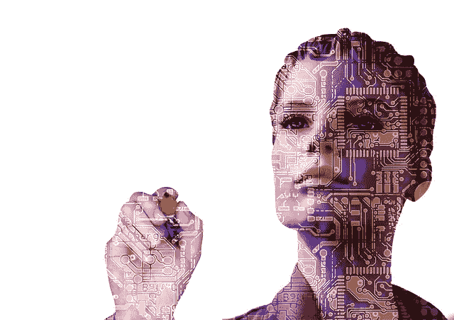
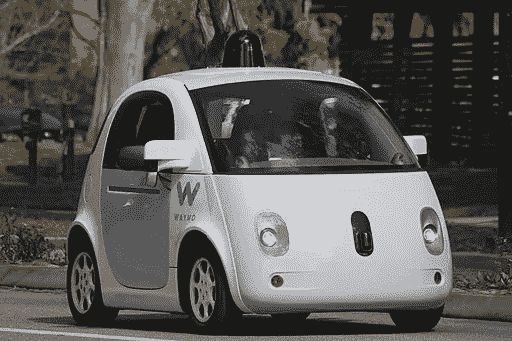

# 人工智能将如何影响千禧一代的工作？

> 原文：<https://medium.datadriveninvestor.com/how-will-ai-affect-the-millennials-work-4a439685956a?source=collection_archive---------8----------------------->

我们正处于下一次技术革命的早期阶段，由快速改进的人工智能(AI)推动。虽然这些进步为先进的知识和财富提供了无限的可能性，但仍有一个问题悬而未决。这些变化将如何影响工作场所？特别是，人工智能的进步将如何影响千禧一代的工作机会？

预测未来总是很难的。每一次新的革命都迫使工作场所发生变化。由于技术进步，以前被认为是必不可少的工作突然消失了。一个世纪前一家主要报纸的排字工人能想象到他们会成为一个灭绝的物种吗？那些愉快地接听你的电话并帮你接通任何你想通话的人的电话接线员呢？或者是在数字传输出现之前放映所有大片的熟练放映员。

我当了 26 年的中学老师。我在 1986 年接受了教师培训，唯一的必修课是技术研究。它教会了我们在教学生涯中会用到的设备。我记得在那里有人教我如何使用电影放映机，如何在黑板上写字，如何使用手巾，如何录制和播放录像机，以及如何操作幻灯机。这些现在都是被遗忘的技能了。事实上，当我走进教室的时候，电影放映机已经开始从学校消失了，我从来没有用过。

# 关于人工智能将如何影响就业的复杂想法

关于人工智能将如何影响工作场所，有两个学派。

一方面，有一种“恐怖故事”的观点——人工智能将取代大多数人的工作，使除了高技能人才之外的所有人都成为多余。

更积极的观点是，人工智能只会改变人们的工作类型。在许多方面，这反映了前几代人所发生的事情。虽然电影放映员、印刷工人等被裁掉了，但许多人还是设法接受了再培训，学习了工作所需的技能。有个人赢家和输家。不过，总的来说，劳动力数量保持在大致相同的水平。现在人们只是做不同的工作。

想想看，现在人们从事的工作有多少是 50 年前不存在的。我自己的博客工作甚至在 15 年前都是闻所未闻的。在 EdSurge 的一次采访中，一位 LinkedIn 高管预测，一个典型的千禧一代在他们的职业生涯中会换 15 次职位。LinkedIn 的一位经济学家发现，千禧一代在大学毕业后的第一个十年里会换四次工作。

By Grendelkhan [CC BY-SA 4.0 ([https://creativecommons.org/licenses/by-sa/4.0](https://creativecommons.org/licenses/by-sa/4.0))], from Wikimedia Commons

然而，不可否认的是。人工智能将对工作场所产生巨大的变化。随着自动化和无人驾驶汽车变得越来越普遍，我们甚至会看到人工智能对公共汽车司机、出租车司机和卡车司机等服务工作的影响。开发商正在进一步发展这一阶段，并朝着自动驾驶拖拉机、割草机和挖掘设备的方向发展。

然而，必须记住，人工智能和机器人的整个目的之一是取代无聊、重复、平凡的工作。剩下的工作将会更加令人兴奋和发人深省。

一如既往，最困难的部分是为那些传统上从事低技能体力工作的人找到工作。他们可能会发现为创造新的工作岗位进行再培训更加困难。我们已经看到机器人取代了装配线和工厂工人。许多被取代的人努力重新接受培训以获得更好的职位。

# 千禧一代有一个劣势

在某些方面，千禧一代的处境最糟糕。婴儿潮一代正在离开工作岗位，即使是最年轻的一代也将在十年内退休。X 一代和 Y 一代正在获得负责任的职位，使他们不太可能被取代(主要是因为他们要么处于资历较高的职位，要么往往是引入人工智能的人，不太可能让自己成为多余的人)。

尚未出生的一代也有一个优势——他们将永远只知道人工智能时代。所以他们永远不会获得人工智能将取代的技能。

千禧一代可能是脆弱的一代，被困在中间。是他们这一代人将会担任 AI 将要取代的初级低薪工作。因此，千禧一代现在有必要进行战略性思考。他们需要确保将培训的重点放在可能会持续一段时间的工作上。

当然，他们是受过最好教育的一代，他们或许可以利用这一点。他们需要灵活、适应性强，并随时准备随着周围技术的发展而变化。随着时间的推移，千禧一代将成为最高级的职位，并将为后代发展世界。

# 预测未来

那么我们未来人工智能增强的世界会是什么样子呢？事实上，大多数员工可能会很感激，因为他们不用去做他们父母和祖父母做过的单调乏味的工作。事实上，下一代的作品可能会与今天的作品大相径庭。如果你把某人带回 20 世纪 50 年代，他们会对我们今天的工作类型(以及工作场所社会模式的更广泛变化)感到震惊。

下一代企业人工智能系统可能会加速业务发展，并越来越多地影响组织的运营方式。 [WorkFusion 举办了一场有趣的网络研讨会](http://info.workfusion.com/forecasting-the-future-of-enterprise-ai-workfusion-tech-radar-webinar?utm_source=other&utm_medium=medium&utm_name=andrew-loader&utm_term=how-will-ai-affect-the-millennials'-work),讨论这些趋势技术将如何解决当今许多阻碍自动化的常见障碍和问题。它描绘了人工智能的进步，以及它们将如何有利于你的智能自动化