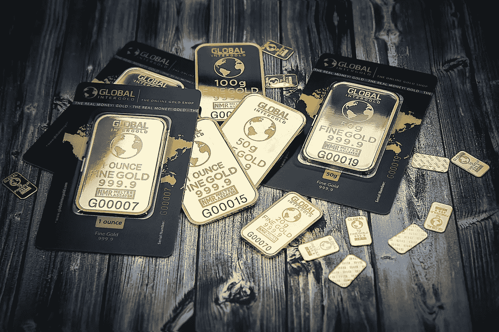

# 比特币会对金价产生怎样的影响？

> 原文：<https://medium.datadriveninvestor.com/how-will-bitcoin-impact-the-price-of-gold-c3a2ca443f88?source=collection_archive---------17----------------------->

Source: pexels.com

比特币通常被称为“数字黄金”。尽管这是一个新兴的、快速发展的投资市场，但黄金和 BTC 之间的相关性很小。这篇文章将探讨这两种投资选择之间的区别，以及为什么比特币还没有？)冲击金价。

**投资类型**

黄金和比特币是**本质上不同的**投资类型。人们投资黄金是因为它相对抗通胀。一个简单的例子很好地说明了这一点，这个例子在谈论黄金时经常用到:

*想象一下，1970 年你有 39 美元，可以买一套漂亮的衣服或一盎司黄金。你可以决定是购买黄金还是等待并保留现金。如果你决定买黄金，然后今天卖掉黄金，你就有足够的现金去买一套漂亮的衣服。如果你决定留着现金，你可能可以在快餐店吃一顿三人晚餐。黄金保护你的现金价值不受通货膨胀的影响。*

然而，与比特币相比，黄金的增长相当稳定，波动性更小。人们投资比特币是因为对快速增长的愿景，因为它更明显地受到市场需求的驱动。由于背后的技术和避开中间人，这更加快速和实时。比特币可以被视为一种更具活力的投资形式。黄金一直是常规的安全选择。这是根据人们的风险规避水平来划分市场的。

**市场规模**

另一个值得注意的点是，比特币要影响黄金价格，需要从黄金需求到比特币需求的巨大转变。尽管区块链和加密货币产品正在蓬勃发展，但与黄金相比，它们仍然是一个非常小的市场。

比特币和黄金的**市场动态**不同，因此它们很难比较，也很难相互影响。

Photo by [Thought Catalog](https://unsplash.com/photos/Xeo_7HSwYsA?utm_source=unsplash&utm_medium=referral&utm_content=creditCopyText) on [Unsplash](https://unsplash.com/search/photos/bitcoin?utm_source=unsplash&utm_medium=referral&utm_content=creditCopyText)

展望未来

虽然目前黄金市场规模更大、更成熟，但比特币(以及整体数字货币)市场正在快速崛起。随着市场的增长，我们可能会看到秘密价格以黄金无法跟上的速度增长。然而，**波动性**也将在未来几年高于黄金。

值得关注这两者及其相关性。比特币仍在确立自己的地位，只是处于大规模采用的初级阶段。一旦发生这种情况，我们才会看到它在投资和价值储存领域的定位。