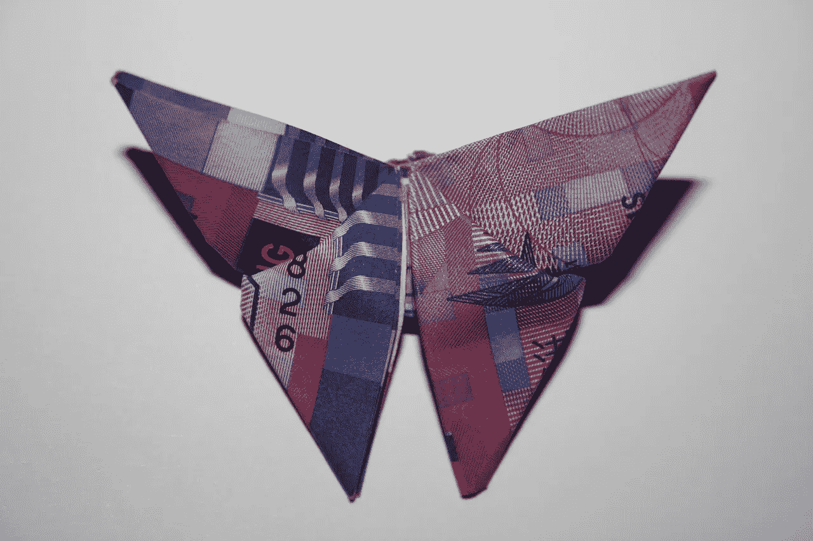

# 当如此少的人拥有信用卡时，电子商务将如何在亚洲发展？

> 原文：<https://medium.datadriveninvestor.com/how-will-ecommerce-grow-in-asia-when-so-few-have-credit-cards-20f91d99fc1f?source=collection_archive---------5----------------------->

东南亚金融科技和电子商务面临的主要挑战之一是，该地区的信用卡普及率如此之低。

全世界大约有 20 亿人没有使用正规的金融服务，仍然“没有银行账户”

在使用信用卡方面，东盟地区落后于世界其他地区。三个人口众多的国家——中国、印度和印度尼西亚——占世界上没有银行账户的成年人口的近一半。目前，东盟只有 50%的成年人在金融机构有账户。

虽然泰国、新加坡和马来西亚等一些国家已经普遍采用信用卡，但东盟地区的其他国家在这方面还远远落后。很难相信，但是只有 31%的 T2 成年人有银行账户。在这 31%的人中，只有 20.5%的人有借记卡。

没有银行账户到底意味着什么？没有银行账户的人如何理财？

首先，他们大多以现金支付——这对雇主和工人来说都是有风险的。他们把积蓄藏在床垫下，或者向短期贷款收取高额利息的“高利贷者”借钱。说到付款，他们大多依靠货到付款。没有任何东西被跟踪或记录。

由于这些没有银行账户的个人没有在金融机构存钱，也没有任何信用卡或借记卡，他们没有办法建立自己的信用记录，以便获得抵押贷款、教育贷款、保险产品和消费信贷等服务。

这些没有银行账户的公民发现自己有点进退两难。尽管他们有稳定的收入，如果可以的话，他们使用信贷也没有问题——但他们无法获得信贷，因为他们没有正式的信用记录。然而——他们不能开始建立一个正式的信用记录，直到他们得到一些信用。

长期以来，这一直被视为亚洲电子商务和金融科技的主要障碍。在这么少人拥有信用卡的情况下，这个行业如何进步？然而，一些聪明的创新让这个行业得以发展——尽管没有银行账户的个人比例很高。

# 为什么金融科技创新正在改变游戏

东南亚的许多创新金融科技初创公司正在改变我们处理银行和信贷的方式，因此找到了创造性的解决方案，以应对该地区很大一部分人仍然没有银行账户的事实。

这些创造性的解决方案让电子商务在亚洲蓬勃发展——尽管该地区很少有人有银行账户或信用记录。

比如我们来看看 [LenddoEFL](https://www.lenddo.com/) 。

他们通过使用社交媒体和其他数据来确定没有银行账户的人的信用度，从而避开了“没有信用记录”的难题。

作为一家总部位于菲律宾的软件即服务公司，他们使用智能手机记录、社交媒体账户和其他非传统数据来确定任何给定个人的财务稳定性。LenddoEFL 提供的信息随后被贷款人用来确定谁是借款人以及是否应该向他们提供贷款。

这使得新兴的中产阶级即使没有正式的信用历史也可以使用信贷——这样他们就可以与金融工具联系起来，用它们来建设自己的未来。

东南亚没有信用卡或银行账户的个人面临的另一个挑战是向他人汇款。

一些金融科技初创公司也涌现出来解决这个问题，其中最成功的是 [Toast](https://toastme.com/hk#/) 。这是一款点对点转账应用，允许用户直接从智能手机向他人转账，无需正式的银行账户。

对于许多在香港等地工作的菲律宾工人来说，这是一个理想的解决方案，他们希望能够快速方便地将收入汇回国内。

然后是“超级应用” [Go-Jek](https://www.gojek.io/) ，这是一家总部位于印度尼西亚雅加达的初创公司，截至 2018 年 2 月估值为[50 亿美元。它始于 2010 年，当时是一款摩托车打车电话应用，但它已经发展成为一个复杂的移动平台，提供一系列服务，包括移动支付、交通、物流、食品配送等。](https://jakartaglobe.id/business/go-jek-raises-1-5b-as-ride-hailing-market-heats-up-sources/)

该应用的支付功能 Go-Pay 让日常交易变得异常便捷。它允许用户在 Go-Pay 用户之间转账，并在当地的小型市场用现金充值，或者将现金交给 Go-Jek 司机。

不需要信用卡或银行账户来验证账户——只需要一张自己拿着身份证的自拍。换句话说，这对于一个基本上没有银行账户的国家来说是完美的(这正是它如此成功的原因。)

# 未来会带来什么？

随着数字消费者行为的改变，支持他们的技术和服务也在改变。这些发展将改变未来做生意的方式。

移动支付和数字钱包正在取代信用卡等传统支付系统，为用户提供更快捷的方式来完成日常交易。

当企业采用创造性的方式向没有银行账户的人提供支付服务和信贷时，电子商务将在亚洲发展。有了这些解决方案，电子商务将能够在该地区发展——尽管缺少信用卡持有者。

PS。为了更深入地了解正在改变电子商务场景的金融科技公司，请查看我最近发表的另一篇文章[东南亚的金融科技公司，密切关注](https://medium.com/datadriveninvestor/fintech-firms-in-southeast-asia-to-keep-an-eye-on-d21ef7daf0c7)。

***如果你喜欢这篇文章，感谢点击“鼓掌”按钮。这就告诉我要多写！***

*继续游牧，*
*蒂姆*

*我是菲律宾一家融资公司*[*TendoPay*](http://tendopay.ph/)*的联合创始人，也是北美领先的展示顾问*[*Candy Banners*](http://www.candybanners.com)*数字广告工作室*[*Stinson Design*](http://www.stinsondesign.com)*的联合创始人。他曾是社交游戏 Predico 的创始人，也是广告技术公司 Viewor 的董事会成员。
在 Instagram @timgrassin 上关注我的冒险*