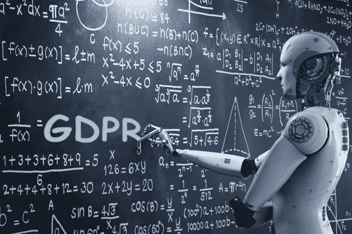

# GDPR 将如何影响人工智能？

> 原文：<https://medium.datadriveninvestor.com/how-will-gdpr-affect-ai-3f10ed25e4c4?source=collection_archive---------6----------------------->

人工智能(AI)的使用正在飙升；不仅仅是在美国，随着越来越多的行业设计使用大数据和机器学习，世界各地都是如此。到 2021 年，全球人工智能支出预计将达到 576 亿美元，其中一半以上来自离散和加工制造业、[医疗保健业、银行业和零售业。无论你走到哪里，公司和企业都在通过采用大数据收集和分析将输入转化为可量化的陈述和可操作的计划来吸引人工智能。但是今年早些时候，随着欧盟 GDPR 的发布，人工智能的实施和部署遇到了第一个障碍。](https://www.atlantic.net/hipaa-compliant-hosting/the-future-of-machine-learning-and-ai-in-healthcare-security/)

# 什么是 GDPR？

早在 2016 年 4 月，欧盟批准了《一般数据保护条例(GDPR)法》，这是主要政治机构的第一部此类法律。它的使命是将个人的数据权归还给他们，特别是关于这些数据在欧盟之外是如何使用的。为了给公司时间适应新的要求， [GDPR](https://www.atlantic.net/hipaa-compliant-hosting/blockchain-security-compliance-is-this-the-future/) 直到 2018 年 5 月 25 日才上线。

GDPR 的主要接触点包括:

*   IT 和培训:所有公司员工都必须接受数据保护和个人隐私方面的强制性培训。
*   透明度:关于如何保护数据和如何处理客户数据的政策必须能够被任何相关方访问。
*   访问控制:企业必须能够证明他们拥有适当的安全工具和流程来限制查看客户的私人数据。
*   个人隐私:每一个至少 16 岁的个人客户都有权规定公司可以从他或她那里收集什么数据，以及有权要求在使用这些数据后将其删除。

此外，任何 16 岁以下的人的数据都由父母或法定监护人控制。从本质上讲，这些因素加在一起，使公司最大限度地减少了他们收集和保留的数据量。这类似于环境法规要求公司在自然界留下更小的“足迹”。公司不仅必须事先说明他们将把个人数据用于什么目的，而且也不能把它用于其他任何目的。如果正在收集的数据随后被人工智能用于对人做出自动化决策，那么该公司必须能够解释决策过程。

# 大数据与数据保护

大数据之所以被称为大数据，是因为它包含大量的信息。这就像是世界上最大的火车头不停地绕着世界行驶，它的引擎不断地被注入煤。能消耗的数据越多，AI 就越好。更大的样本量让人工智能变得更聪明，听起来更像人类，更准确地预测未来的决策。GDPR 的蓝图采取了相反的立场。它没有将数据视为一个巨大的容器，可以倒进人工智能的肚子里去消费，而是将其视为一种珍贵的商品，可以有节制地使用，而且只能用于客户和公司的利益。

自 GDPR 上线的第一天起，谷歌和脸书等大型数据收集公司就感受到了刺痛。两家公司[都受到了一个名为“不关你的事”( NOYB)的非营利组织](http://fortune.com/2018/05/25/google-facebook-gdpr-forced-consent/)的质疑，质疑他们将如何改变与 GDPR 有关的数据收集方法。

AI 无法独自适应 GDPR 的强制措施。保持合规性的唯一方法是由人类程序员改变信息收集的方式以及如何将其输入机器学习。与欧盟公民相关的下一阶段发展将不得不涉及正在构建的人工智能系统，以将同意行动集成到他们的流程中。

在数据达到这一水平之前，组织必须改变其流程，以确定数据是从哪里和从谁那里收集的，并确保它符合 GDPR 标准。有多少客户会拒绝同意？没人知道。但是组织也必须准备好应对更大可能的错误分析。如果一家公司只有 75%的客户同意使用他们的数据，那么公司必须解释为什么缺少 25%的客户，以及他们缺乏信息将如何导致未来的分析不够完美。

新的法律应该让组织把他们的顾客看得更像人，而不是统计数字。成为客户的信息来源，并解释数据收集的原因和方式，将是建立信任的第一大步。当客户信任提出要求的公司时，他们更有可能同意使用他们的数据。

# 结论

从人工智能行业向外看，GDPR 带来的挑战可以被视为未来发展的障碍，这一举措将需要改变目前与欧盟客户合作的每个人工智能设计。然而，这个临时路障正试图规范一些比计算机吸入和组织数据的速度更理想、更重要的东西。随着世界变得越来越受数据驱动，退一步认识到隐私和个人权利的价值是朝着正确方向迈出的一步。